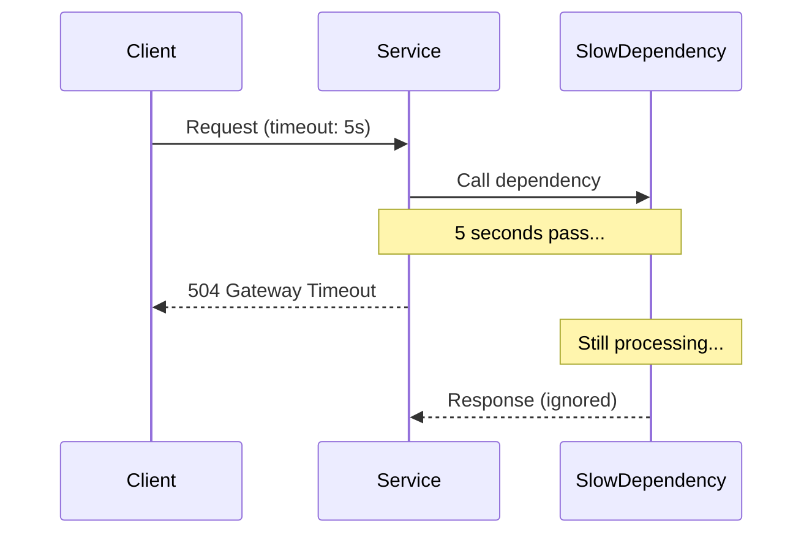
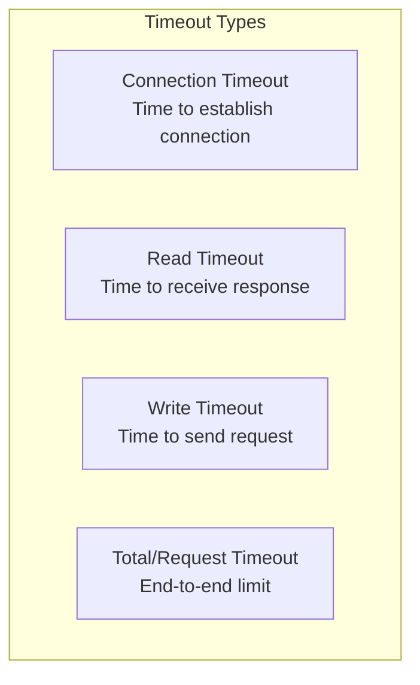

# Timeout Pattern

## Overview

The **Timeout Pattern** sets a maximum time limit for operations to complete. If an operation doesn't complete within the limit, it's aborted and an error is returned. This prevents threads and connections from being blocked indefinitely by slow or hung operations.



---

## Why Use It

### Problems It Solves

1. **Hung connections**: Waiting forever for unresponsive services
2. **Resource exhaustion**: Threads blocked on slow operations
3. **Poor UX**: Users waiting indefinitely
4. **Cascading delays**: Slow dependency slowing entire system
5. **Connection pool starvation**: Connections never returned

### Key Benefits

- **Predictable latency** - Known maximum wait time
- **Resource protection** - Threads freed after timeout
- **Fail fast** - Quick feedback on slow operations
- **User experience** - Responsive error handling

---

## Types of Timeouts



| Type | Typical Value | Purpose |
|------|---------------|---------|
| Connection | 1-5 seconds | Establish TCP connection |
| Read | 5-30 seconds | Wait for response data |
| Write | 5-30 seconds | Send request data |
| Total | 10-60 seconds | Complete operation |

---

## When to Use

### Ideal Scenarios

| Use Case | Timeout Strategy |
|----------|------------------|
| HTTP API calls | Connect: 2s, Read: 10s |
| Database queries | 5s for OLTP, 60s for reports |
| External APIs | 3-5s with retry |
| Microservice calls | 1-3s |
| Message processing | Match SLA requirements |

---

## Pros and Cons

### Pros

| Advantage | Description |
|-----------|-------------|
| **Predictability** | Known maximum wait time |
| **Resource protection** | No indefinite blocking |
| **Fail fast** | Quick error feedback |
| **Composability** | Nested timeouts with budgets |

### Cons

| Disadvantage | Mitigation |
|--------------|------------|
| **False failures** | Tune based on P99 latency |
| **Orphaned work** | Cancellation tokens |
| **Complexity** | Timeout budgets for chains |

---

## Implementation Example

### Python (Context-based Timeouts)

```python
import asyncio
from contextlib import asynccontextmanager
import httpx
from typing import Optional
import time

class TimeoutBudget:
    """Propagate timeout budget through call chain."""

    def __init__(self, total_seconds: float):
        self.deadline = time.monotonic() + total_seconds

    @property
    def remaining(self) -> float:
        return max(0, self.deadline - time.monotonic())

    @property
    def expired(self) -> bool:
        return self.remaining <= 0

@asynccontextmanager
async def timeout_context(seconds: float, budget: Optional[TimeoutBudget] = None):
    """Context manager with timeout, respecting budget if provided."""
    if budget:
        seconds = min(seconds, budget.remaining)

    if seconds <= 0:
        raise TimeoutError("Timeout budget exhausted")

    try:
        async with asyncio.timeout(seconds):
            yield
    except asyncio.TimeoutError:
        raise TimeoutError(f"Operation timed out after {seconds}s")

# HTTP client with timeouts
class TimeoutHTTPClient:
    def __init__(
        self,
        connect_timeout: float = 2.0,
        read_timeout: float = 10.0,
        total_timeout: float = 30.0
    ):
        self.client = httpx.AsyncClient(
            timeout=httpx.Timeout(
                connect=connect_timeout,
                read=read_timeout,
                write=10.0,
                pool=5.0
            )
        )
        self.total_timeout = total_timeout

    async def get(self, url: str, budget: Optional[TimeoutBudget] = None) -> dict:
        timeout = min(self.total_timeout, budget.remaining if budget else float('inf'))

        try:
            async with asyncio.timeout(timeout):
                response = await self.client.get(url)
                response.raise_for_status()
                return response.json()
        except asyncio.TimeoutError:
            raise TimeoutError(f"Request to {url} timed out")

# Service with timeout budget propagation
class OrderService:
    def __init__(self):
        self.http = TimeoutHTTPClient()

    async def process_order(self, order_id: str, timeout: float = 10.0) -> dict:
        budget = TimeoutBudget(timeout)

        # Each step uses remaining budget
        user = await self.get_user(order_id, budget)
        if budget.expired:
            return {"status": "timeout", "step": "user"}

        inventory = await self.check_inventory(order_id, budget)
        if budget.expired:
            return {"status": "timeout", "step": "inventory"}

        payment = await self.process_payment(order_id, budget)

        return {"status": "success", "user": user, "payment": payment}

    async def get_user(self, order_id: str, budget: TimeoutBudget) -> dict:
        async with timeout_context(2.0, budget):
            return await self.http.get(f"http://user-service/users/{order_id}", budget)

    async def check_inventory(self, order_id: str, budget: TimeoutBudget) -> dict:
        async with timeout_context(1.0, budget):
            return await self.http.get(f"http://inventory-service/check/{order_id}", budget)

    async def process_payment(self, order_id: str, budget: TimeoutBudget) -> dict:
        async with timeout_context(5.0, budget):
            return await self.http.get(f"http://payment-service/process/{order_id}", budget)
```

### Go (Context Timeouts)

```go
package main

import (
    "context"
    "fmt"
    "net/http"
    "time"
)

type OrderService struct {
    client *http.Client
}

func NewOrderService() *OrderService {
    return &OrderService{
        client: &http.Client{
            Timeout: 30 * time.Second,
            Transport: &http.Transport{
                DialContext: (&net.Dialer{
                    Timeout: 2 * time.Second,  // Connection timeout
                }).DialContext,
                ResponseHeaderTimeout: 10 * time.Second, // Read timeout
            },
        },
    }
}

func (s *OrderService) ProcessOrder(ctx context.Context, orderID string) (map[string]interface{}, error) {
    // Create timeout context
    ctx, cancel := context.WithTimeout(ctx, 10*time.Second)
    defer cancel()

    result := make(map[string]interface{})

    // Each step respects parent context deadline
    user, err := s.getUser(ctx, orderID)
    if err != nil {
        if ctx.Err() == context.DeadlineExceeded {
            return nil, fmt.Errorf("timeout getting user")
        }
        return nil, err
    }
    result["user"] = user

    payment, err := s.processPayment(ctx, orderID)
    if err != nil {
        return nil, err
    }
    result["payment"] = payment

    return result, nil
}

func (s *OrderService) getUser(ctx context.Context, orderID string) (map[string]string, error) {
    // Child context with shorter timeout
    ctx, cancel := context.WithTimeout(ctx, 2*time.Second)
    defer cancel()

    req, _ := http.NewRequestWithContext(ctx, "GET",
        fmt.Sprintf("http://user-service/users/%s", orderID), nil)

    resp, err := s.client.Do(req)
    if err != nil {
        return nil, err
    }
    defer resp.Body.Close()

    return map[string]string{"id": orderID}, nil
}

func (s *OrderService) processPayment(ctx context.Context, orderID string) (map[string]string, error) {
    ctx, cancel := context.WithTimeout(ctx, 5*time.Second)
    defer cancel()

    req, _ := http.NewRequestWithContext(ctx, "POST",
        fmt.Sprintf("http://payment-service/process/%s", orderID), nil)

    resp, err := s.client.Do(req)
    if err != nil {
        return nil, err
    }
    defer resp.Body.Close()

    return map[string]string{"status": "paid"}, nil
}
```

---

## Timeout Budgets

When services call other services, use timeout budgets to prevent cascading delays:


---

## Real-World Examples

| Company | Timeout Strategy |
|---------|------------------|
| **Google** | Deadline propagation via gRPC |
| **Netflix** | Hystrix command timeouts |
| **Amazon** | Request deadlines across services |

---

## Related Patterns

- [Circuit Breaker](./circuit-breaker.md) - Timeouts trigger circuit breaker
- [Retry](./retry-with-backoff.md) - Retry after timeout
- [Bulkhead](./bulkhead.md) - Prevent timeout from blocking others

---

## Further Reading

- [gRPC Deadlines](https://grpc.io/docs/guides/deadlines/)
- [Context Package (Go)](https://pkg.go.dev/context)
- [asyncio Timeout (Python)](https://docs.python.org/3/library/asyncio-task.html)
