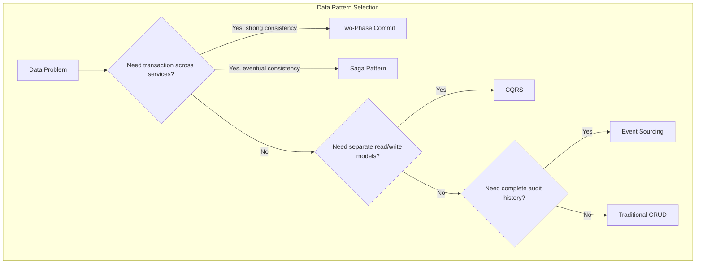
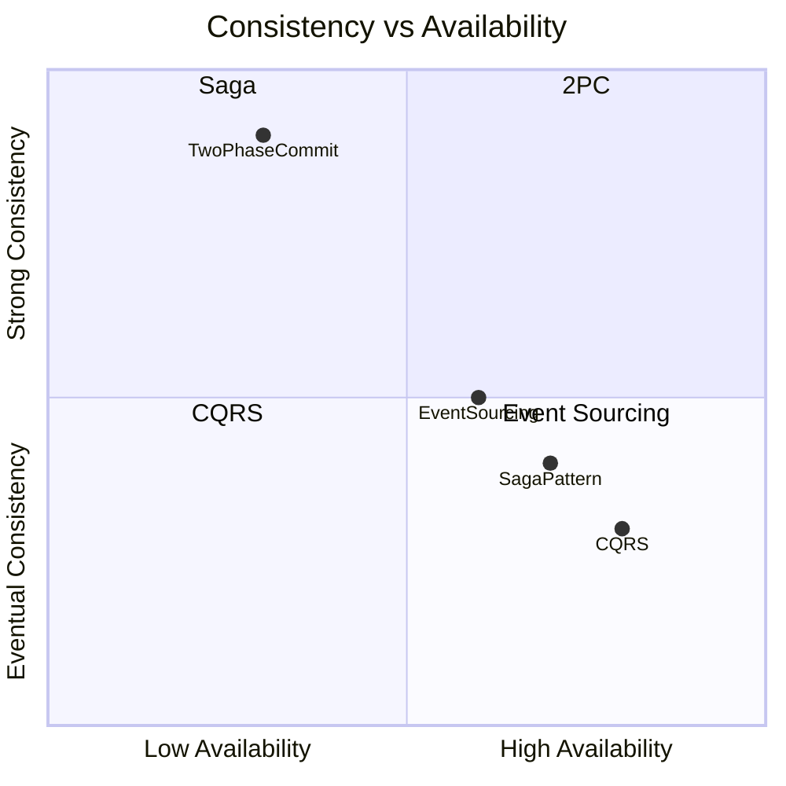
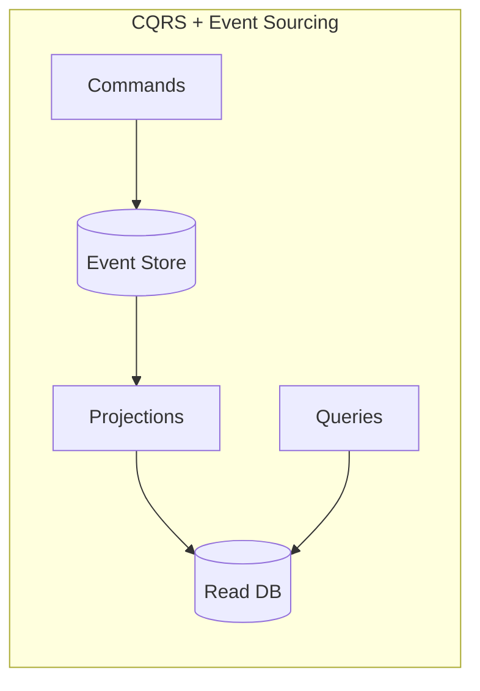

# Data Patterns

This section covers patterns for managing data consistency, state, and transactions in distributed systems. These patterns help solve the fundamental challenges of maintaining data integrity across multiple services.

## Overview

## Patterns in This Category

| Pattern | Document | Best For |
|---------|----------|----------|
| CQRS | [cqrs.md](./cqrs.md) | Separate read/write scaling and optimization |
| Event Sourcing | [event-sourcing.md](./event-sourcing.md) | Complete audit trails, temporal queries |
| Saga | [saga-pattern.md](./saga-pattern.md) | Distributed transactions with eventual consistency |
| Two-Phase Commit | [two-phase-commit.md](./two-phase-commit.md) | Strong consistency across services |
| Outbox | [outbox-pattern.md](./outbox-pattern.md) | Reliable event publishing, dual-write problem |

## Comparison Matrix

| Aspect | CQRS | Event Sourcing | Saga | 2PC | Outbox |
|--------|------|----------------|------|-----|--------|
| **Consistency** | Eventually | Eventually | Eventually | Strong | Eventually |
| **Complexity** | Medium | High | High | Medium | Low |
| **Performance** | High (reads) | Replay overhead | Good | Poor (blocking) | Good |
| **Audit Trail** | Optional | Complete | Partial | None | Partial |
| **Scalability** | Excellent | Good | Good | Poor | Excellent |
| **Use Case** | Read-heavy apps | Financial, legal | Long-running txns | ACID required | Reliable events |

## Decision Framework

### Consistency vs. Availability Trade-off

### When to Use Each Pattern

| Scenario | Recommended Pattern |
|----------|---------------------|
| E-commerce checkout | Saga (order → payment → inventory) |
| Banking transactions | 2PC or Saga with compensation |
| Reporting dashboard | CQRS (separate read model) |
| Financial audit | Event Sourcing |
| Inventory management | CQRS + Event Sourcing |
| Travel booking | Saga (flight → hotel → car) |
| Microservice events | Outbox (reliable publishing) |

## Pattern Combinations

These patterns often work together:

**Common Combinations:**
- **CQRS + Event Sourcing**: Events as the source of truth, optimized read models
- **Saga + Event Sourcing**: Event-driven saga orchestration
- **CQRS + Saga**: Complex workflows with optimized queries
- **Saga + Outbox**: Reliable saga step execution with guaranteed delivery
- **CQRS + Outbox**: Reliable sync of read models from write model

## The CAP Theorem Context

Understanding when to use each pattern requires understanding CAP trade-offs:

| Pattern | Favors | Trade-off |
|---------|--------|-----------|
| 2PC | Consistency | Reduces availability (blocking) |
| Saga | Availability | Eventual consistency |
| CQRS | Availability | Read model may be stale |
| Event Sourcing | Partition tolerance | Eventual consistency |

## Related Patterns

- [Pub/Sub](../05-messaging-patterns/pub-sub.md) - Event distribution for CQRS
- [Message Queue](../05-messaging-patterns/message-queue.md) - Reliable saga step execution
- [Circuit Breaker](../03-resilience-patterns/circuit-breaker.md) - Protect during saga failures
