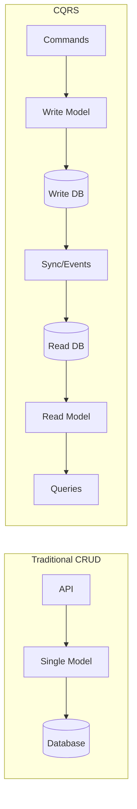
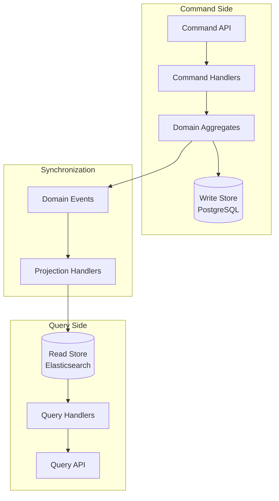

# CQRS (Command Query Responsibility Segregation)

## Overview

**CQRS** separates read and write operations into different models. Commands (writes) update the data, while Queries (reads) retrieve it. This allows each model to be optimized independently for its specific use case.



---

## Why Use It

### Problems It Solves

1. **Read/write contention**: Same model handles both, causing locks
2. **Optimization conflicts**: Can't optimize for both read and write
3. **Complex queries**: Joins on normalized data are expensive
4. **Scale mismatch**: Reads often 10-100x more than writes
5. **Domain complexity**: Single model becomes unwieldy

### Key Benefits

- **Independent scaling** - Scale reads and writes separately
- **Optimized models** - Denormalized reads, normalized writes
- **Better performance** - No read/write contention
- **Simpler queries** - Pre-computed read models
- **Flexibility** - Different storage for each model

---

## When to Use

| Use Case | Why CQRS Works Well |
|----------|---------------------|
| E-commerce catalog | Millions of reads, few updates |
| Social media feeds | Complex aggregations, heavy reads |
| Reporting dashboards | Pre-computed analytics |
| Search systems | Denormalized for fast queries |
| Real-time leaderboards | Frequent reads, batched updates |

---

## When NOT to Use

| Scenario | Why Not |
|----------|---------|
| Simple CRUD apps | Overkill, adds complexity |
| Strong consistency required | Sync lag causes issues |
| Low traffic | Optimization unnecessary |

---

## How It Works

### Architecture



---

## Pros and Cons

### Pros

| Advantage | Description |
|-----------|-------------|
| **Performance** | Optimized models for each operation |
| **Scalability** | Independent scaling |
| **Flexibility** | Different tech per model |
| **Maintainability** | Simpler, focused code |

### Cons

| Disadvantage | Mitigation |
|--------------|------------|
| **Eventual consistency** | Design for it, show stale data indicators |
| **Complexity** | Use only where needed |
| **Data sync** | Event-driven sync, monitoring |

---

## Implementation Example

### Python

```python
from dataclasses import dataclass
from typing import List, Optional
from datetime import datetime
import asyncio

# Commands
@dataclass
class CreateOrder:
    order_id: str
    customer_id: str
    items: List[dict]

@dataclass
class AddItemToOrder:
    order_id: str
    product_id: str
    quantity: int

# Write Model (Domain)
class Order:
    def __init__(self, order_id: str, customer_id: str):
        self.order_id = order_id
        self.customer_id = customer_id
        self.items = []
        self.status = "pending"
        self._events = []

    def add_item(self, product_id: str, quantity: int, price: float):
        self.items.append({
            "product_id": product_id,
            "quantity": quantity,
            "price": price
        })
        self._events.append(OrderItemAdded(
            self.order_id, product_id, quantity, price
        ))

    @property
    def total(self) -> float:
        return sum(i["price"] * i["quantity"] for i in self.items)

# Events for sync
@dataclass
class OrderCreated:
    order_id: str
    customer_id: str
    created_at: datetime

@dataclass
class OrderItemAdded:
    order_id: str
    product_id: str
    quantity: int
    price: float

# Command Handler
class OrderCommandHandler:
    def __init__(self, write_repo, event_bus):
        self.write_repo = write_repo
        self.event_bus = event_bus

    async def handle_create_order(self, cmd: CreateOrder):
        order = Order(cmd.order_id, cmd.customer_id)
        await self.write_repo.save(order)
        await self.event_bus.publish(OrderCreated(
            cmd.order_id, cmd.customer_id, datetime.utcnow()
        ))

# Read Model (Denormalized)
@dataclass
class OrderReadModel:
    order_id: str
    customer_name: str  # Denormalized from customer service
    items: List[dict]
    total: float
    status: str
    created_at: datetime

# Projection Handler (syncs write → read)
class OrderProjection:
    def __init__(self, read_repo, customer_service):
        self.read_repo = read_repo
        self.customer_service = customer_service

    async def handle_order_created(self, event: OrderCreated):
        customer = await self.customer_service.get(event.customer_id)
        read_model = OrderReadModel(
            order_id=event.order_id,
            customer_name=customer["name"],
            items=[],
            total=0.0,
            status="pending",
            created_at=event.created_at
        )
        await self.read_repo.save(read_model)

    async def handle_item_added(self, event: OrderItemAdded):
        model = await self.read_repo.get(event.order_id)
        model.items.append({
            "product_id": event.product_id,
            "quantity": event.quantity,
            "price": event.price
        })
        model.total += event.price * event.quantity
        await self.read_repo.save(model)

# Query Handler
class OrderQueryHandler:
    def __init__(self, read_repo):
        self.read_repo = read_repo

    async def get_order(self, order_id: str) -> Optional[OrderReadModel]:
        return await self.read_repo.get(order_id)

    async def get_customer_orders(self, customer_id: str) -> List[OrderReadModel]:
        return await self.read_repo.find_by_customer(customer_id)

    async def get_orders_by_status(self, status: str) -> List[OrderReadModel]:
        return await self.read_repo.find_by_status(status)
```

---

## Real-World Examples

| Company | Implementation |
|---------|----------------|
| **Netflix** | Separate read replicas for different query patterns |
| **Twitter** | Timeline read model, separate write path |
| **LinkedIn** | Feed generation with denormalized read stores |

---

## Related Patterns

- [Event Sourcing](./event-sourcing.md) - Often used together
- [Saga](./saga-pattern.md) - Command side orchestration
- [Pub/Sub](../05-messaging-patterns/pub-sub.md) - Sync read models

---

## Further Reading

- [CQRS - Martin Fowler](https://martinfowler.com/bliki/CQRS.html)
- [Microsoft CQRS Pattern](https://docs.microsoft.com/en-us/azure/architecture/patterns/cqrs)
