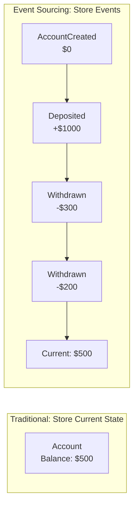
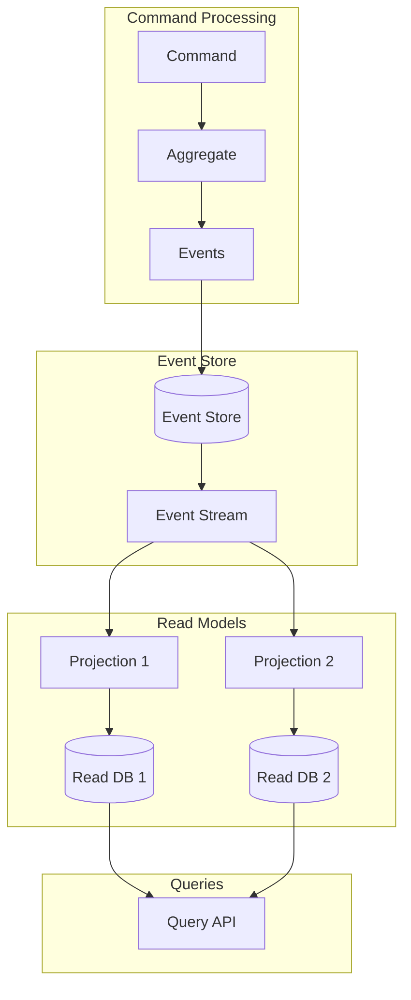

# Event Sourcing Pattern

## Overview

**Event Sourcing** stores the state of an application as a sequence of immutable events rather than storing just the current state. The current state is derived by replaying all events from the beginning. Every change to the application state is captured as an event object.



---

## Why Use It

### Problems It Solves

1. **Lost history**: Traditional CRUD overwrites previous state
2. **Audit requirements**: Need complete change history
3. **Debugging**: Hard to understand how state was reached
4. **Temporal queries**: "What was the state at time X?"
5. **Event replay**: Rebuild state or create new projections

### Key Benefits

- **Complete audit trail** - Every change recorded
- **Temporal queries** - Query state at any point in time
- **Event replay** - Rebuild state, fix bugs retroactively
- **Debugging** - Understand exactly what happened
- **Integration** - Events can drive other systems

---

## When to Use

| Use Case | Why Event Sourcing Works Well |
|----------|------------------------------|
| Financial systems | Regulatory audit requirements |
| Healthcare records | Complete patient history |
| Legal documents | Version history, compliance |
| Inventory tracking | Movement history |
| Gaming | Replay, anti-cheat |

---

## When NOT to Use

| Scenario | Why Not |
|----------|---------|
| Simple CRUD apps | Massive overkill |
| High-velocity updates | Event storage grows fast |
| No audit requirements | Added complexity without benefit |

---

## How It Works

### Architecture



### Event Stream Example

```
Stream: account-123
├── Event 1: AccountCreated { id: "123", owner: "John", timestamp: "2024-01-01" }
├── Event 2: MoneyDeposited { amount: 1000, timestamp: "2024-01-02" }
├── Event 3: MoneyWithdrawn { amount: 300, timestamp: "2024-01-03" }
├── Event 4: MoneyDeposited { amount: 500, timestamp: "2024-01-05" }
└── Event 5: MoneyWithdrawn { amount: 200, timestamp: "2024-01-10" }

Current State: { id: "123", owner: "John", balance: 1000 }
```

---

## Pros and Cons

### Pros

| Advantage | Description |
|-----------|-------------|
| **Complete history** | Every state change preserved |
| **Temporal queries** | Query any point in time |
| **Rebuild capability** | Replay to fix bugs |
| **Event-driven** | Natural integration with other systems |

### Cons

| Disadvantage | Mitigation |
|--------------|------------|
| **Storage growth** | Snapshots, archiving |
| **Complexity** | Start simple, grow gradually |
| **Event versioning** | Upcasters, schema evolution |
| **Query performance** | CQRS with read models |

---

## Implementation Example

### Python

```python
from dataclasses import dataclass, field
from typing import List, Optional
from datetime import datetime
from abc import ABC, abstractmethod
import json

# Base Event
@dataclass
class Event:
    event_id: str
    aggregate_id: str
    timestamp: datetime
    version: int

# Domain Events
@dataclass
class AccountCreated(Event):
    owner: str
    initial_balance: float = 0.0

@dataclass
class MoneyDeposited(Event):
    amount: float
    description: str = ""

@dataclass
class MoneyWithdrawn(Event):
    amount: float
    description: str = ""

# Aggregate (Domain Model)
class BankAccount:
    def __init__(self, account_id: str):
        self.account_id = account_id
        self.owner: Optional[str] = None
        self.balance: float = 0.0
        self.version: int = 0
        self._pending_events: List[Event] = []

    # Command handlers that produce events
    def create(self, owner: str, initial_balance: float = 0.0):
        if self.owner is not None:
            raise ValueError("Account already exists")

        event = AccountCreated(
            event_id=generate_id(),
            aggregate_id=self.account_id,
            timestamp=datetime.utcnow(),
            version=self.version + 1,
            owner=owner,
            initial_balance=initial_balance
        )
        self._apply(event)
        self._pending_events.append(event)

    def deposit(self, amount: float, description: str = ""):
        if amount <= 0:
            raise ValueError("Amount must be positive")

        event = MoneyDeposited(
            event_id=generate_id(),
            aggregate_id=self.account_id,
            timestamp=datetime.utcnow(),
            version=self.version + 1,
            amount=amount,
            description=description
        )
        self._apply(event)
        self._pending_events.append(event)

    def withdraw(self, amount: float, description: str = ""):
        if amount <= 0:
            raise ValueError("Amount must be positive")
        if amount > self.balance:
            raise ValueError("Insufficient funds")

        event = MoneyWithdrawn(
            event_id=generate_id(),
            aggregate_id=self.account_id,
            timestamp=datetime.utcnow(),
            version=self.version + 1,
            amount=amount,
            description=description
        )
        self._apply(event)
        self._pending_events.append(event)

    # Apply events to update state
    def _apply(self, event: Event):
        if isinstance(event, AccountCreated):
            self.owner = event.owner
            self.balance = event.initial_balance
        elif isinstance(event, MoneyDeposited):
            self.balance += event.amount
        elif isinstance(event, MoneyWithdrawn):
            self.balance -= event.amount

        self.version = event.version

    # Rebuild from event history
    @classmethod
    def from_events(cls, account_id: str, events: List[Event]) -> "BankAccount":
        account = cls(account_id)
        for event in events:
            account._apply(event)
        return account

# Event Store
class EventStore:
    def __init__(self):
        self._events: dict[str, List[Event]] = {}

    def save_events(self, aggregate_id: str, events: List[Event], expected_version: int):
        stream = self._events.setdefault(aggregate_id, [])

        # Optimistic concurrency check
        if stream and stream[-1].version != expected_version:
            raise ConcurrencyError("Aggregate modified by another process")

        stream.extend(events)

    def get_events(self, aggregate_id: str, from_version: int = 0) -> List[Event]:
        stream = self._events.get(aggregate_id, [])
        return [e for e in stream if e.version > from_version]

class ConcurrencyError(Exception):
    pass

# Repository
class BankAccountRepository:
    def __init__(self, event_store: EventStore):
        self.event_store = event_store

    def get(self, account_id: str) -> Optional[BankAccount]:
        events = self.event_store.get_events(account_id)
        if not events:
            return None
        return BankAccount.from_events(account_id, events)

    def save(self, account: BankAccount):
        if account._pending_events:
            self.event_store.save_events(
                account.account_id,
                account._pending_events,
                account.version - len(account._pending_events)
            )
            account._pending_events.clear()

# Usage
def generate_id():
    import uuid
    return str(uuid.uuid4())

store = EventStore()
repo = BankAccountRepository(store)

# Create account
account = BankAccount("acc-123")
account.create("John Doe", 100.0)
account.deposit(500.0, "Salary")
account.withdraw(200.0, "Rent")
repo.save(account)

# Reload from events
loaded = repo.get("acc-123")
print(f"Balance: ${loaded.balance}")  # Balance: $400.0

# Temporal query: state at version 2
events = store.get_events("acc-123")
historical = BankAccount.from_events("acc-123", events[:2])
print(f"After deposit: ${historical.balance}")  # $600.0
```

---

## Real-World Examples

| Company | Implementation |
|---------|----------------|
| **LMAX** | High-frequency trading, event sourced |
| **Walmart** | Inventory event sourcing |
| **Jet.com** | Order processing |

---

## Related Patterns

- [CQRS](./cqrs.md) - Often combined with Event Sourcing
- [Saga](./saga-pattern.md) - Event-driven saga orchestration
- [Pub/Sub](../05-messaging-patterns/pub-sub.md) - Event distribution

---

## Further Reading

- [Event Sourcing - Martin Fowler](https://martinfowler.com/eaaDev/EventSourcing.html)
- [EventStoreDB](https://www.eventstore.com/)
- [Axon Framework](https://axoniq.io/)
