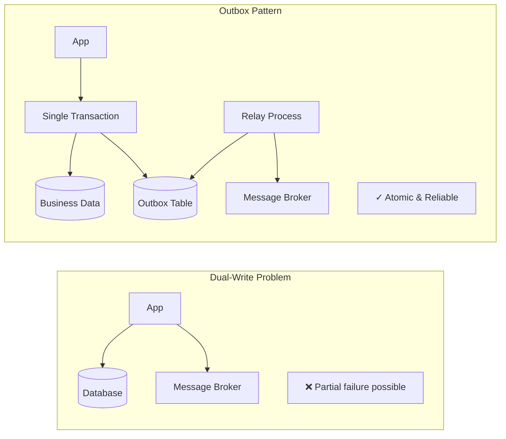
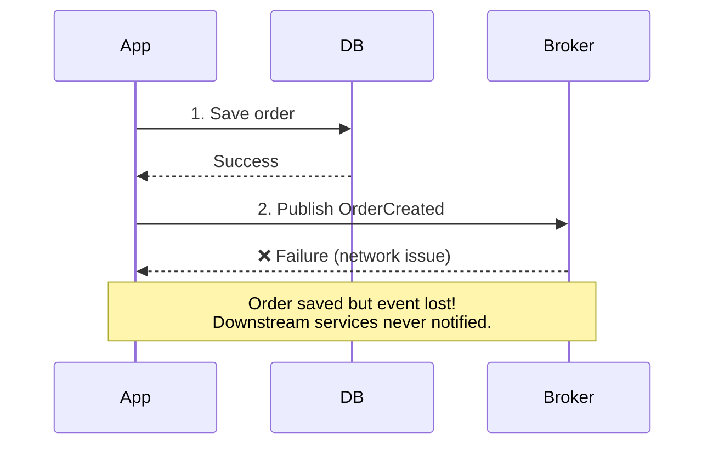
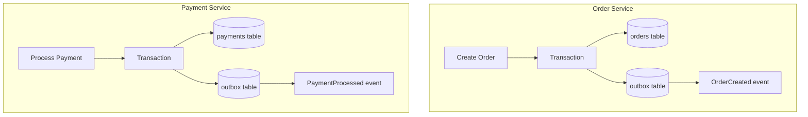
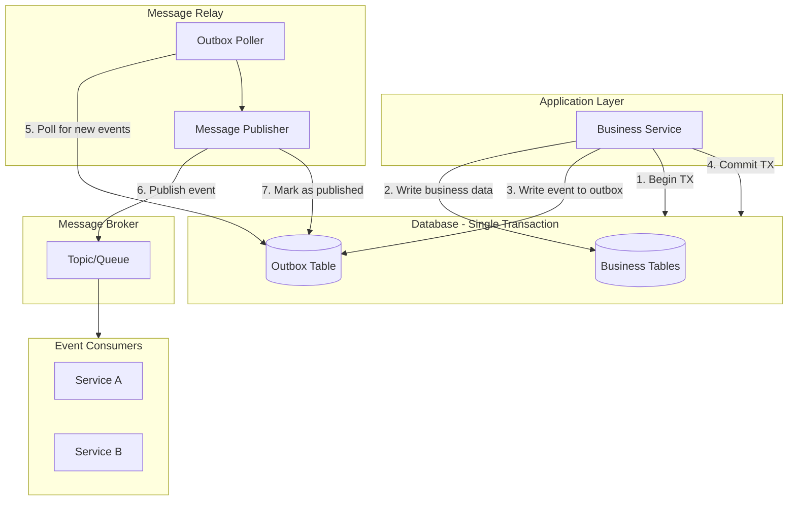
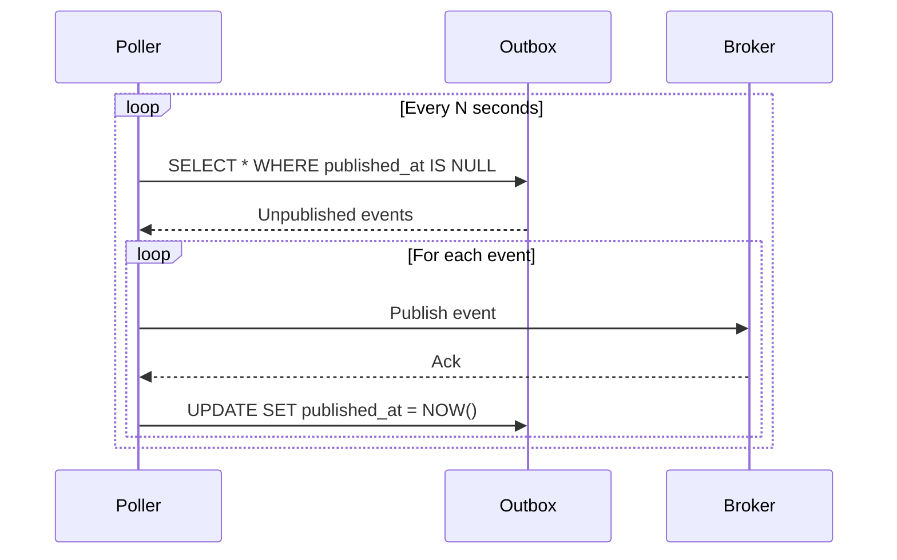
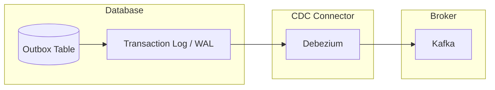

# Outbox Pattern

## Overview

The **Outbox Pattern** solves the dual-write problem in distributed systems by ensuring atomicity between database updates and message publishing. Instead of writing to both a database and a message broker (which can fail independently), you write to an "outbox" table within the same database transaction. A separate process then reliably publishes these messages to the broker.



---

## Why Use It

### The Dual-Write Problem



### Problems It Solves

1. **Dual-write failures**: Database and broker can fail independently
2. **Message loss**: Events lost when broker is unavailable
3. **Inconsistent state**: Data saved but events not published
4. **No distributed transactions**: 2PC across DB and broker impractical
5. **Ordering issues**: Events published out of order

### Key Benefits

- **Atomicity** - Data and event saved in single transaction
- **Reliability** - No message loss, at-least-once delivery
- **Ordering** - Events published in order (per aggregate)
- **Simplicity** - No distributed transactions needed
- **Recoverability** - Replay events from outbox if needed

---

## When to Use

| Use Case | Why Outbox Works Well |
|----------|----------------------|
| Event-driven microservices | Reliable event publishing |
| Saga orchestration | Saga commands reliably sent |
| CQRS sync | Read model updates never lost |
| Audit logging | Events always captured |
| Integration events | Reliable cross-service communication |

### Common Scenarios



---

## When NOT to Use

| Scenario | Alternative |
|----------|-------------|
| Single database, no events | Not needed |
| Event Sourcing already used | Events are the source of truth |
| Fire-and-forget acceptable | Direct publish |
| In-memory/cache updates | Not applicable |

---

## How It Works

### Architecture



### Outbox Table Schema

```sql
CREATE TABLE outbox (
    id              UUID PRIMARY KEY DEFAULT gen_random_uuid(),
    aggregate_type  VARCHAR(255) NOT NULL,      -- e.g., 'Order', 'Payment'
    aggregate_id    VARCHAR(255) NOT NULL,      -- e.g., order-123
    event_type      VARCHAR(255) NOT NULL,      -- e.g., 'OrderCreated'
    payload         JSONB NOT NULL,             -- Event data
    created_at      TIMESTAMP NOT NULL DEFAULT NOW(),
    published_at    TIMESTAMP NULL,             -- NULL = not yet published

    -- For ordering
    sequence_number BIGSERIAL,

    -- Indexes
    INDEX idx_outbox_unpublished (published_at) WHERE published_at IS NULL,
    INDEX idx_outbox_aggregate (aggregate_type, aggregate_id)
);
```

### Message Relay Strategies

#### 1. Polling Publisher



#### 2. Change Data Capture (CDC)



**CDC Advantages:**
- Near real-time (no polling delay)
- Lower database load
- Captures deletes and updates

---

## Pros and Cons

### Pros

| Advantage | Description |
|-----------|-------------|
| **Atomicity** | Event stored with business data |
| **Reliability** | No message loss |
| **Ordering** | Sequence preserved per aggregate |
| **Simplicity** | No distributed transactions |
| **Debuggability** | Events visible in database |
| **Replay** | Can republish from outbox |

### Cons

| Disadvantage | Mitigation |
|--------------|------------|
| **At-least-once delivery** | Consumers must be idempotent |
| **Latency** | Polling adds delay; use CDC for real-time |
| **Storage growth** | Cleanup old published events |
| **Relay complexity** | Use proven libraries (Debezium) |
| **Database coupling** | Events tied to source database |

---

## Implementation Example

### Python (SQLAlchemy + Background Worker)

```python
from sqlalchemy import Column, String, DateTime, Text, BigInteger, Index
from sqlalchemy.dialects.postgresql import UUID, JSONB
from sqlalchemy.ext.declarative import declarative_base
from sqlalchemy.orm import Session
from datetime import datetime
from typing import Optional, List
import uuid
import json
import threading
import time

Base = declarative_base()

# Outbox table model
class OutboxEvent(Base):
    __tablename__ = 'outbox'

    id = Column(UUID(as_uuid=True), primary_key=True, default=uuid.uuid4)
    aggregate_type = Column(String(255), nullable=False)
    aggregate_id = Column(String(255), nullable=False)
    event_type = Column(String(255), nullable=False)
    payload = Column(JSONB, nullable=False)
    created_at = Column(DateTime, default=datetime.utcnow, nullable=False)
    published_at = Column(DateTime, nullable=True)
    sequence_number = Column(BigInteger, autoincrement=True)

    __table_args__ = (
        Index('idx_outbox_unpublished', 'published_at',
              postgresql_where=(published_at.is_(None))),
    )

# Business entity
class Order(Base):
    __tablename__ = 'orders'

    id = Column(UUID(as_uuid=True), primary_key=True, default=uuid.uuid4)
    customer_id = Column(String(255), nullable=False)
    total = Column(String(50), nullable=False)
    status = Column(String(50), default='pending')
    created_at = Column(DateTime, default=datetime.utcnow)

# Repository with outbox support
class OrderRepository:
    def __init__(self, session: Session):
        self.session = session

    def create_order(self, customer_id: str, items: list, total: float) -> Order:
        """Create order and outbox event in single transaction."""
        order = Order(
            customer_id=customer_id,
            total=str(total),
            status='created'
        )
        self.session.add(order)

        # Add event to outbox in same transaction
        outbox_event = OutboxEvent(
            aggregate_type='Order',
            aggregate_id=str(order.id),
            event_type='OrderCreated',
            payload={
                'order_id': str(order.id),
                'customer_id': customer_id,
                'items': items,
                'total': total,
                'status': 'created',
                'created_at': datetime.utcnow().isoformat()
            }
        )
        self.session.add(outbox_event)

        # Both committed together
        self.session.commit()
        return order

    def update_order_status(self, order_id: str, new_status: str) -> Order:
        """Update order and publish status change event."""
        order = self.session.query(Order).filter(Order.id == order_id).first()
        if not order:
            raise ValueError(f"Order {order_id} not found")

        old_status = order.status
        order.status = new_status

        # Add status change event to outbox
        outbox_event = OutboxEvent(
            aggregate_type='Order',
            aggregate_id=str(order.id),
            event_type='OrderStatusChanged',
            payload={
                'order_id': str(order.id),
                'old_status': old_status,
                'new_status': new_status,
                'changed_at': datetime.utcnow().isoformat()
            }
        )
        self.session.add(outbox_event)
        self.session.commit()

        return order

# Outbox relay (publisher)
class OutboxRelay:
    def __init__(self, session_factory, message_publisher, batch_size: int = 100):
        self.session_factory = session_factory
        self.publisher = message_publisher
        self.batch_size = batch_size
        self._running = False

    def start(self, poll_interval: float = 1.0):
        """Start polling for unpublished events."""
        self._running = True

        def poll_loop():
            while self._running:
                try:
                    self._process_batch()
                except Exception as e:
                    print(f"Error processing outbox: {e}")
                time.sleep(poll_interval)

        thread = threading.Thread(target=poll_loop, daemon=True)
        thread.start()

    def stop(self):
        self._running = False

    def _process_batch(self):
        session = self.session_factory()
        try:
            # Get unpublished events
            events = (
                session.query(OutboxEvent)
                .filter(OutboxEvent.published_at.is_(None))
                .order_by(OutboxEvent.sequence_number)
                .limit(self.batch_size)
                .with_for_update(skip_locked=True)  # Prevent duplicate processing
                .all()
            )

            for event in events:
                try:
                    # Publish to message broker
                    self.publisher.publish(
                        topic=f"{event.aggregate_type.lower()}-events",
                        key=event.aggregate_id,
                        value={
                            'event_id': str(event.id),
                            'event_type': event.event_type,
                            'aggregate_type': event.aggregate_type,
                            'aggregate_id': event.aggregate_id,
                            'payload': event.payload,
                            'timestamp': event.created_at.isoformat()
                        }
                    )

                    # Mark as published
                    event.published_at = datetime.utcnow()
                    session.commit()

                except Exception as e:
                    print(f"Failed to publish event {event.id}: {e}")
                    session.rollback()

        finally:
            session.close()

# Message publisher interface
class KafkaMessagePublisher:
    def __init__(self, bootstrap_servers: str):
        from confluent_kafka import Producer
        self.producer = Producer({'bootstrap.servers': bootstrap_servers})

    def publish(self, topic: str, key: str, value: dict):
        self.producer.produce(
            topic=topic,
            key=key.encode(),
            value=json.dumps(value).encode(),
            callback=self._delivery_callback
        )
        self.producer.flush()

    def _delivery_callback(self, err, msg):
        if err:
            raise Exception(f"Delivery failed: {err}")

# Usage
from sqlalchemy import create_engine
from sqlalchemy.orm import sessionmaker

engine = create_engine('postgresql://localhost/mydb')
Session = sessionmaker(bind=engine)

# Create order (business logic)
session = Session()
repo = OrderRepository(session)
order = repo.create_order(
    customer_id='cust-123',
    items=[{'sku': 'ABC', 'qty': 2}],
    total=99.99
)
print(f"Order created: {order.id}")

# Start outbox relay (separate process in production)
publisher = KafkaMessagePublisher('localhost:9092')
relay = OutboxRelay(Session, publisher)
relay.start(poll_interval=1.0)
```

### Go (with PostgreSQL)

```go
package main

import (
    "context"
    "database/sql"
    "encoding/json"
    "time"

    "github.com/google/uuid"
    "github.com/lib/pq"
)

type OutboxEvent struct {
    ID            uuid.UUID
    AggregateType string
    AggregateID   string
    EventType     string
    Payload       json.RawMessage
    CreatedAt     time.Time
    PublishedAt   *time.Time
}

type OrderRepository struct {
    db *sql.DB
}

func (r *OrderRepository) CreateOrder(ctx context.Context, customerID string, total float64) (*Order, error) {
    tx, err := r.db.BeginTx(ctx, nil)
    if err != nil {
        return nil, err
    }
    defer tx.Rollback()

    // Insert order
    orderID := uuid.New()
    _, err = tx.ExecContext(ctx, `
        INSERT INTO orders (id, customer_id, total, status, created_at)
        VALUES ($1, $2, $3, 'created', NOW())
    `, orderID, customerID, total)
    if err != nil {
        return nil, err
    }

    // Insert outbox event in same transaction
    payload, _ := json.Marshal(map[string]interface{}{
        "order_id":    orderID.String(),
        "customer_id": customerID,
        "total":       total,
        "status":      "created",
    })

    _, err = tx.ExecContext(ctx, `
        INSERT INTO outbox (aggregate_type, aggregate_id, event_type, payload, created_at)
        VALUES ('Order', $1, 'OrderCreated', $2, NOW())
    `, orderID.String(), payload)
    if err != nil {
        return nil, err
    }

    // Commit both together
    if err = tx.Commit(); err != nil {
        return nil, err
    }

    return &Order{ID: orderID, CustomerID: customerID, Total: total}, nil
}

// Outbox relay
type OutboxRelay struct {
    db        *sql.DB
    publisher MessagePublisher
}

func (r *OutboxRelay) ProcessBatch(ctx context.Context) error {
    tx, err := r.db.BeginTx(ctx, nil)
    if err != nil {
        return err
    }
    defer tx.Rollback()

    // Select and lock unpublished events
    rows, err := tx.QueryContext(ctx, `
        SELECT id, aggregate_type, aggregate_id, event_type, payload, created_at
        FROM outbox
        WHERE published_at IS NULL
        ORDER BY sequence_number
        LIMIT 100
        FOR UPDATE SKIP LOCKED
    `)
    if err != nil {
        return err
    }
    defer rows.Close()

    var publishedIDs []uuid.UUID

    for rows.Next() {
        var event OutboxEvent
        if err := rows.Scan(
            &event.ID, &event.AggregateType, &event.AggregateID,
            &event.EventType, &event.Payload, &event.CreatedAt,
        ); err != nil {
            continue
        }

        // Publish to broker
        if err := r.publisher.Publish(ctx, event); err != nil {
            continue
        }

        publishedIDs = append(publishedIDs, event.ID)
    }

    // Mark as published
    if len(publishedIDs) > 0 {
        _, err = tx.ExecContext(ctx, `
            UPDATE outbox SET published_at = NOW()
            WHERE id = ANY($1)
        `, pq.Array(publishedIDs))
        if err != nil {
            return err
        }
    }

    return tx.Commit()
}
```

### Debezium CDC Configuration

```json
{
  "name": "outbox-connector",
  "config": {
    "connector.class": "io.debezium.connector.postgresql.PostgresConnector",
    "database.hostname": "postgres",
    "database.port": "5432",
    "database.user": "debezium",
    "database.password": "secret",
    "database.dbname": "orders",
    "database.server.name": "orders",
    "table.include.list": "public.outbox",
    "transforms": "outbox",
    "transforms.outbox.type": "io.debezium.transforms.outbox.EventRouter",
    "transforms.outbox.table.field.event.key": "aggregate_id",
    "transforms.outbox.table.field.event.type": "event_type",
    "transforms.outbox.table.field.event.payload": "payload",
    "transforms.outbox.route.topic.replacement": "${routedByValue}.events"
  }
}
```

---

## Idempotent Consumers

Since outbox provides at-least-once delivery, consumers must handle duplicates:

```python
class IdempotentEventHandler:
    def __init__(self, db_session):
        self.session = db_session

    def handle(self, event: dict):
        event_id = event['event_id']

        # Check if already processed
        if self._is_processed(event_id):
            return  # Skip duplicate

        # Process event
        self._process(event)

        # Mark as processed
        self._mark_processed(event_id)

    def _is_processed(self, event_id: str) -> bool:
        result = self.session.execute(
            "SELECT 1 FROM processed_events WHERE event_id = :id",
            {'id': event_id}
        )
        return result.fetchone() is not None

    def _mark_processed(self, event_id: str):
        self.session.execute(
            "INSERT INTO processed_events (event_id, processed_at) VALUES (:id, NOW())",
            {'id': event_id}
        )
        self.session.commit()
```

---

## Real-World Examples

| Company | Implementation |
|---------|----------------|
| **Shopify** | Outbox for order events |
| **Zalando** | Nakadi (event bus with outbox) |
| **Wix** | Greyhound with outbox pattern |
| **Debezium** | Popular CDC-based outbox tooling |

---

## Related Patterns

- [Saga](./saga-pattern.md) - Outbox enables reliable saga execution
- [Event Sourcing](./event-sourcing.md) - Alternative approach (events as source)
- [CQRS](./cqrs.md) - Outbox syncs read models
- [Event-Driven](../05-messaging-patterns/event-driven-architecture.md) - Outbox enables reliable events
- [Message Queue](../05-messaging-patterns/message-queue.md) - Outbox publishes to queues

---

## Further Reading

- [Transactional Outbox - microservices.io](https://microservices.io/patterns/data/transactional-outbox.html)
- [Debezium Outbox Event Router](https://debezium.io/documentation/reference/transformations/outbox-event-router.html)
- [Reliable Microservices Data Exchange With the Outbox Pattern](https://debezium.io/blog/2019/02/19/reliable-microservices-data-exchange-with-the-outbox-pattern/)
