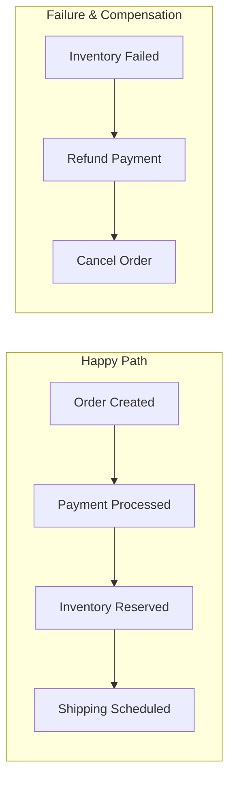
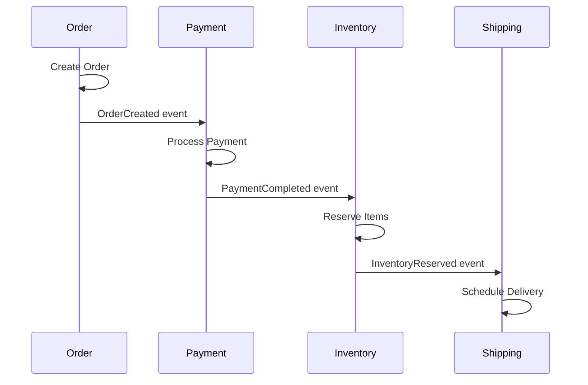
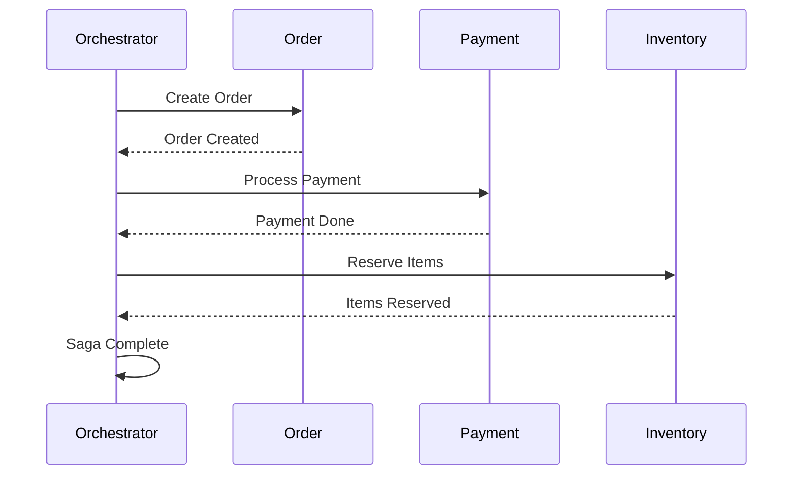

# Saga Pattern

## Overview

The **Saga Pattern** manages distributed transactions across multiple services by breaking them into a sequence of local transactions. Each local transaction updates its service and publishes events/messages to trigger the next step. If a step fails, compensating transactions are executed to undo previous changes.



---

## Why Use It

### Problems It Solves

1. **Distributed transactions**: No ACID across services
2. **Long-running operations**: 2PC blocks too long
3. **Service autonomy**: Each service owns its data
4. **Availability**: 2PC reduces availability
5. **Scalability**: 2PC doesn't scale

### Key Benefits

- **Eventual consistency** - Without distributed locks
- **Service autonomy** - Each service transacts locally
- **Availability** - No blocking coordination
- **Scalability** - Independent service scaling
- **Flexibility** - Compensation logic per business need

---

## Saga Types

### 1. Choreography (Event-driven)

Each service publishes events that trigger the next service.



**Pros**: Loose coupling, simple
**Cons**: Hard to track, scattered logic

### 2. Orchestration (Centralized)

A central orchestrator coordinates the saga steps.



**Pros**: Clear flow, easy to understand
**Cons**: Single point of failure, coupling

---

## When to Use

| Use Case | Why Saga Works Well |
|----------|---------------------|
| E-commerce checkout | Order → Payment → Inventory → Shipping |
| Travel booking | Flight → Hotel → Car rental |
| Money transfer | Debit → Credit across accounts |
| Order fulfillment | Multi-step processing |

---

## When NOT to Use

| Scenario | Better Alternative |
|----------|-------------------|
| Single service | Local transaction |
| Strong consistency required | 2PC |
| Simple operations | Direct calls |

---

## Compensation

When a step fails, compensating transactions undo previous steps:

| Action | Compensation |
|--------|--------------|
| Create Order | Cancel Order |
| Charge Payment | Refund Payment |
| Reserve Inventory | Release Inventory |
| Book Flight | Cancel Flight |

---

## Implementation Example

### Python (Orchestration)

```python
from enum import Enum
from dataclasses import dataclass
from typing import List, Optional, Callable
import asyncio

class SagaStatus(Enum):
    PENDING = "pending"
    RUNNING = "running"
    COMPLETED = "completed"
    COMPENSATING = "compensating"
    FAILED = "failed"

@dataclass
class SagaStep:
    name: str
    action: Callable
    compensation: Callable
    status: str = "pending"

class SagaOrchestrator:
    def __init__(self, saga_id: str):
        self.saga_id = saga_id
        self.steps: List[SagaStep] = []
        self.completed_steps: List[SagaStep] = []
        self.status = SagaStatus.PENDING

    def add_step(self, name: str, action: Callable, compensation: Callable):
        self.steps.append(SagaStep(name, action, compensation))

    async def execute(self, context: dict) -> dict:
        self.status = SagaStatus.RUNNING

        try:
            for step in self.steps:
                print(f"Executing: {step.name}")
                result = await step.action(context)
                context.update(result or {})
                step.status = "completed"
                self.completed_steps.append(step)

            self.status = SagaStatus.COMPLETED
            return {"status": "success", "context": context}

        except Exception as e:
            print(f"Step failed: {e}")
            self.status = SagaStatus.COMPENSATING
            await self._compensate(context)
            self.status = SagaStatus.FAILED
            return {"status": "failed", "error": str(e)}

    async def _compensate(self, context: dict):
        for step in reversed(self.completed_steps):
            try:
                print(f"Compensating: {step.name}")
                await step.compensation(context)
            except Exception as e:
                print(f"Compensation failed: {step.name} - {e}")

# Order Saga
class OrderSaga:
    def __init__(self, order_service, payment_service, inventory_service):
        self.order_service = order_service
        self.payment_service = payment_service
        self.inventory_service = inventory_service

    async def create_order_saga(self, order_data: dict) -> dict:
        saga = SagaOrchestrator(f"order-{order_data['order_id']}")

        # Define saga steps
        saga.add_step(
            "create_order",
            lambda ctx: self.order_service.create(ctx),
            lambda ctx: self.order_service.cancel(ctx)
        )

        saga.add_step(
            "process_payment",
            lambda ctx: self.payment_service.charge(ctx),
            lambda ctx: self.payment_service.refund(ctx)
        )

        saga.add_step(
            "reserve_inventory",
            lambda ctx: self.inventory_service.reserve(ctx),
            lambda ctx: self.inventory_service.release(ctx)
        )

        return await saga.execute(order_data)

# Service stubs
class OrderService:
    async def create(self, ctx):
        print(f"Creating order {ctx['order_id']}")
        return {"order_created": True}

    async def cancel(self, ctx):
        print(f"Cancelling order {ctx['order_id']}")

class PaymentService:
    async def charge(self, ctx):
        print(f"Charging ${ctx['amount']}")
        # Simulate failure
        if ctx.get("fail_payment"):
            raise Exception("Payment declined")
        return {"payment_id": "pay_123"}

    async def refund(self, ctx):
        print(f"Refunding payment {ctx.get('payment_id')}")

class InventoryService:
    async def reserve(self, ctx):
        print(f"Reserving inventory")
        return {"inventory_reserved": True}

    async def release(self, ctx):
        print(f"Releasing inventory")

# Usage
async def main():
    saga = OrderSaga(OrderService(), PaymentService(), InventoryService())

    # Successful order
    result = await saga.create_order_saga({
        "order_id": "order-123",
        "amount": 99.99,
        "items": [{"sku": "ABC", "qty": 2}]
    })
    print(f"Result: {result}")

    # Failed order (triggers compensation)
    result = await saga.create_order_saga({
        "order_id": "order-456",
        "amount": 199.99,
        "fail_payment": True
    })
    print(f"Result: {result}")

asyncio.run(main())
```

---

## Real-World Examples

| Company | Saga Implementation |
|---------|---------------------|
| **Uber** | Ride booking saga |
| **Netflix** | Content publishing workflow |
| **Amazon** | Order fulfillment |

---

## Related Patterns

- [Event Sourcing](./event-sourcing.md) - Track saga state as events
- [Message Queue](../05-messaging-patterns/message-queue.md) - Reliable step execution
- [Circuit Breaker](../03-resilience-patterns/circuit-breaker.md) - Handle step failures

---

## Further Reading

- [Saga Pattern - Chris Richardson](https://microservices.io/patterns/data/saga.html)
- [Sagas - Hector Garcia-Molina](https://www.cs.cornell.edu/andru/cs711/2002fa/reading/sagas.pdf)
