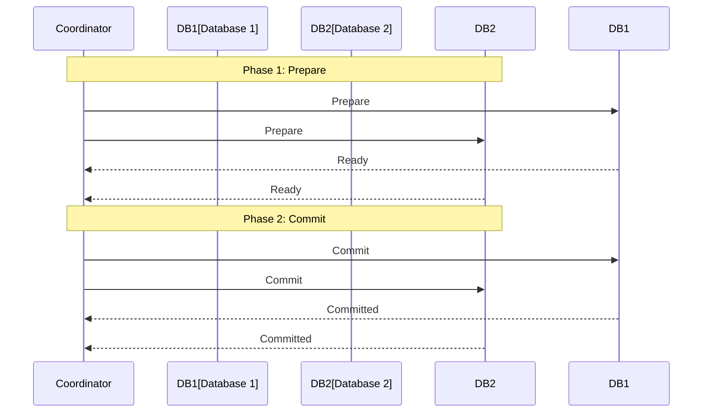
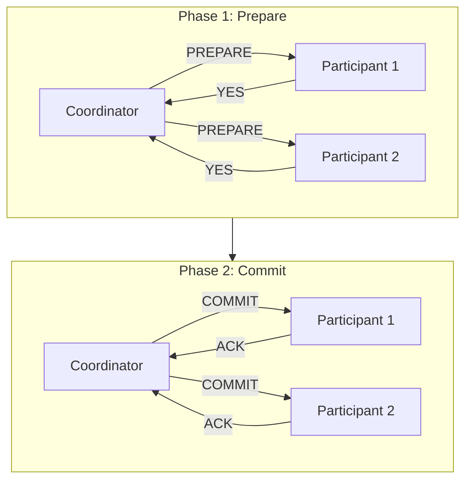
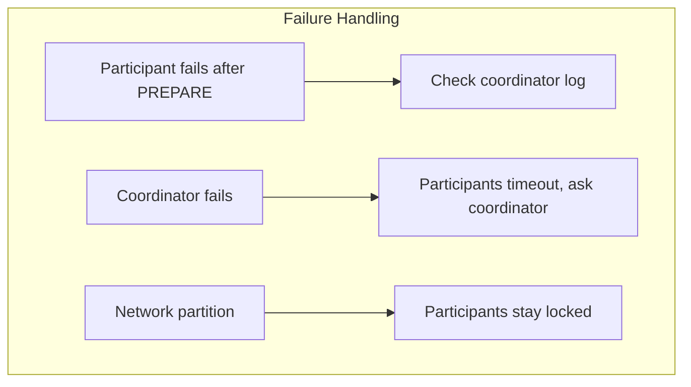

# Two-Phase Commit (2PC) Pattern

## Overview

**Two-Phase Commit (2PC)** is a distributed transaction protocol that ensures all participants in a transaction either commit or abort together, providing strong consistency (ACID) across multiple services or databases.



---

## Why Use It

### Problems It Solves

1. **Distributed consistency**: Ensure all-or-nothing across systems
2. **Data integrity**: Prevent partial updates
3. **ACID compliance**: Regulatory requirements

### Key Benefits

- **Strong consistency** - All participants agree
- **Atomicity** - All or nothing
- **Simple semantics** - Easy to reason about

---

## When to Use

| Use Case | Why 2PC Works |
|----------|---------------|
| Banking transfers | Must be atomic |
| Cross-database updates | ACID required |
| Legacy integration | Systems support XA |

---

## When NOT to Use

| Scenario | Why Not | Alternative |
|----------|---------|-------------|
| High availability needed | 2PC blocks | Saga |
| High throughput | Blocking reduces performance | Eventual consistency |
| Long-running operations | Lock timeout issues | Saga |
| Microservices | Anti-pattern | Saga, Event Sourcing |

---

## How It Works

### Phase 1: Prepare (Voting)

1. Coordinator sends PREPARE to all participants
2. Each participant prepares transaction (acquires locks)
3. Participants vote YES or NO

### Phase 2: Commit/Abort

- If all vote YES: Coordinator sends COMMIT
- If any votes NO: Coordinator sends ABORT



---

## Pros and Cons

### Pros

| Advantage | Description |
|-----------|-------------|
| **Strong consistency** | ACID guaranteed |
| **Atomicity** | All or nothing |
| **Widely supported** | XA standard |

### Cons

| Disadvantage | Description |
|--------------|-------------|
| **Blocking** | Participants locked during protocol |
| **Single point of failure** | Coordinator failure is problematic |
| **Poor availability** | Any participant failure blocks all |
| **Performance** | Multiple network round trips |
| **Scalability** | Doesn't scale well |

---

## Failure Scenarios



---

## Implementation Example

### Python (Simplified 2PC)

```python
from enum import Enum
from typing import List, Dict
import asyncio

class Vote(Enum):
    YES = "yes"
    NO = "no"

class TransactionState(Enum):
    INIT = "init"
    PREPARING = "preparing"
    PREPARED = "prepared"
    COMMITTING = "committing"
    COMMITTED = "committed"
    ABORTING = "aborting"
    ABORTED = "aborted"

class Participant:
    def __init__(self, name: str):
        self.name = name
        self.prepared = False

    async def prepare(self, tx_id: str, data: dict) -> Vote:
        """Acquire locks, validate, log prepare"""
        print(f"{self.name}: Preparing {tx_id}")
        # Simulate work and validation
        if data.get("force_fail") == self.name:
            return Vote.NO
        self.prepared = True
        return Vote.YES

    async def commit(self, tx_id: str):
        """Apply changes, release locks"""
        print(f"{self.name}: Committing {tx_id}")
        self.prepared = False

    async def abort(self, tx_id: str):
        """Rollback changes, release locks"""
        print(f"{self.name}: Aborting {tx_id}")
        self.prepared = False

class Coordinator:
    def __init__(self, participants: List[Participant]):
        self.participants = participants
        self.transactions: Dict[str, TransactionState] = {}

    async def execute_transaction(self, tx_id: str, data: dict) -> bool:
        self.transactions[tx_id] = TransactionState.INIT

        # Phase 1: Prepare
        print(f"\n--- Phase 1: Prepare ({tx_id}) ---")
        self.transactions[tx_id] = TransactionState.PREPARING

        votes = await asyncio.gather(*[
            p.prepare(tx_id, data) for p in self.participants
        ])

        all_yes = all(v == Vote.YES for v in votes)
        self.transactions[tx_id] = TransactionState.PREPARED

        # Phase 2: Commit or Abort
        if all_yes:
            print(f"\n--- Phase 2: Commit ({tx_id}) ---")
            self.transactions[tx_id] = TransactionState.COMMITTING
            await asyncio.gather(*[
                p.commit(tx_id) for p in self.participants
            ])
            self.transactions[tx_id] = TransactionState.COMMITTED
            print(f"Transaction {tx_id}: COMMITTED")
            return True
        else:
            print(f"\n--- Phase 2: Abort ({tx_id}) ---")
            self.transactions[tx_id] = TransactionState.ABORTING
            await asyncio.gather(*[
                p.abort(tx_id) for p in self.participants
            ])
            self.transactions[tx_id] = TransactionState.ABORTED
            print(f"Transaction {tx_id}: ABORTED")
            return False

# Usage
async def main():
    participants = [
        Participant("DB1"),
        Participant("DB2"),
        Participant("DB3")
    ]
    coordinator = Coordinator(participants)

    # Successful transaction
    success = await coordinator.execute_transaction(
        "tx-001",
        {"amount": 100}
    )

    # Failed transaction (DB2 votes NO)
    success = await coordinator.execute_transaction(
        "tx-002",
        {"amount": 200, "force_fail": "DB2"}
    )

asyncio.run(main())
```

---

## Alternatives

| Alternative | When to Use |
|-------------|-------------|
| **Saga** | Microservices, availability priority |
| **TCC (Try-Confirm-Cancel)** | Business-level compensation |
| **Eventual Consistency** | When strong consistency not required |

---

## Real-World Examples

| Technology | 2PC Usage |
|------------|-----------|
| **XA Transactions** | Java EE, cross-database |
| **Spanner** | Google's globally distributed DB |
| **CockroachDB** | Distributed SQL |

---

## Related Patterns

- [Saga](./saga-pattern.md) - Alternative for microservices
- [Event Sourcing](./event-sourcing.md) - Audit trail approach
- [CQRS](./cqrs.md) - Separate reads for better performance

---

## Further Reading

- [Two-Phase Commit - Wikipedia](https://en.wikipedia.org/wiki/Two-phase_commit_protocol)
- [Consensus Protocols](https://lamport.azurewebsites.net/pubs/paxos-simple.pdf)
- [XA Specification](https://pubs.opengroup.org/onlinepubs/009680699/toc.pdf)
