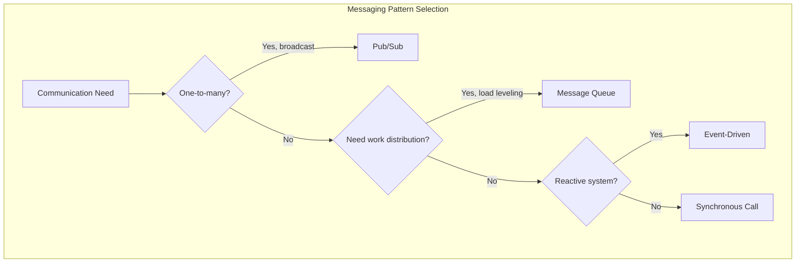
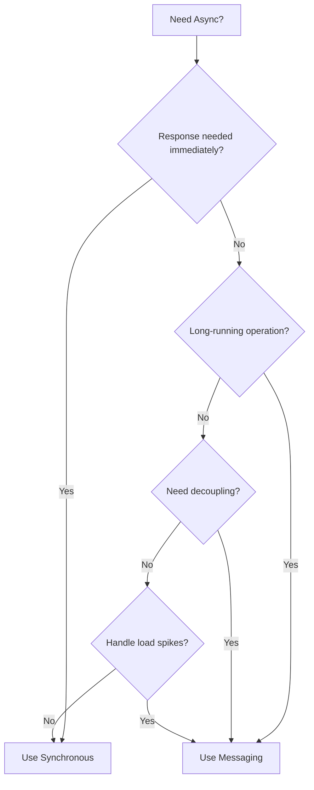
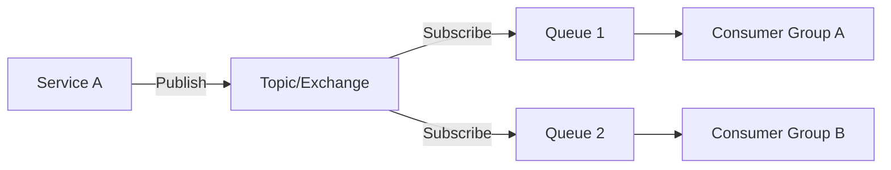

# Messaging Patterns

This section covers patterns for asynchronous communication between services. These patterns enable loose coupling, improve resilience, and allow systems to handle varying loads through temporal decoupling.

## Overview

## Patterns in This Category

| Pattern | Document | Best For |
|---------|----------|----------|
| Pub/Sub | [pub-sub.md](./pub-sub.md) | Fan-out notifications, event broadcasting |
| Message Queue | [message-queue.md](./message-queue.md) | Work distribution, load leveling |
| Event-Driven Architecture | [event-driven-architecture.md](./event-driven-architecture.md) | Loose coupling, reactive systems |

## Comparison Matrix

| Aspect | Pub/Sub | Message Queue | Event-Driven |
|--------|---------|---------------|--------------|
| **Delivery** | One-to-many | One-to-one (competing consumers) | One-to-many |
| **Coupling** | Very loose | Loose | Very loose |
| **Order Guarantee** | Partial | Per-queue | Eventual |
| **Retention** | Configurable | Until consumed | Long-term (event store) |
| **Use Case** | Notifications | Work distribution | System integration |

## When to Use Async Messaging

## Message Delivery Guarantees

| Guarantee | Description | Use Case |
|-----------|-------------|----------|
| **At-most-once** | Fire and forget | Metrics, logs |
| **At-least-once** | Retry until ack | Most business operations |
| **Exactly-once** | Deduplication | Financial transactions |

## Common Technologies

| Technology | Type | Best For |
|------------|------|----------|
| **Kafka** | Pub/Sub + Queue | High throughput, event streaming |
| **RabbitMQ** | Queue + Pub/Sub | Flexible routing, traditional messaging |
| **AWS SQS** | Queue | Managed, simple queue |
| **AWS SNS** | Pub/Sub | Managed, fan-out |
| **Redis Streams** | Both | Simple use cases, low latency |
| **Google Pub/Sub** | Pub/Sub | Managed, global |

## Pattern Combinations

These patterns often work together:

## Related Patterns

- [Event Sourcing](../04-data-patterns/event-sourcing.md) - Events as state
- [Saga](../04-data-patterns/saga-pattern.md) - Message-driven workflows
- [CQRS](../04-data-patterns/cqrs.md) - Events sync read models
- [Circuit Breaker](../03-resilience-patterns/circuit-breaker.md) - Handle message failures
