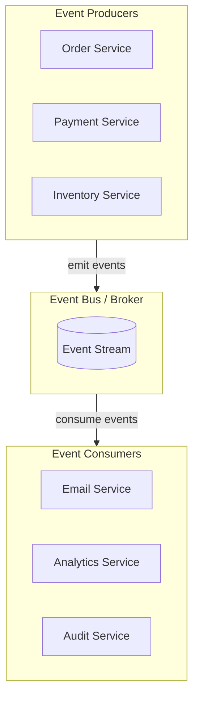
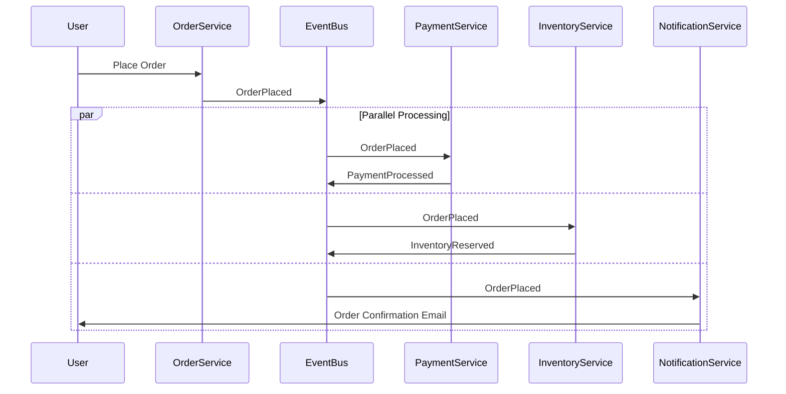

# Event-Driven Architecture (EDA)

## Overview

**Event-Driven Architecture** is an architectural style where the flow of the program is determined by events—significant changes in state. Services communicate by producing and consuming events, enabling loose coupling and reactive systems.



---

## Why Use It

### Problems It Solves

1. **Tight coupling**: Services directly calling each other
2. **Synchronous bottlenecks**: Blocking calls slow everything
3. **Scalability limits**: Can't scale components independently
4. **Complex workflows**: Hard to manage multi-step processes
5. **Integration challenges**: Adding new services is difficult

### Key Benefits

- **Loose coupling** - Services don't know about each other
- **Scalability** - Scale producers and consumers independently
- **Flexibility** - Add new consumers without changing producers
- **Resilience** - Failures are isolated
- **Real-time** - React to events as they happen

---

## Event Types

| Type | Description | Example |
|------|-------------|---------|
| **Domain Events** | Business state changes | OrderPlaced, PaymentReceived |
| **Integration Events** | Cross-service communication | UserCreated, InventoryUpdated |
| **Command Events** | Request for action | SendEmail, ProcessPayment |
| **Query Events** | Request for data | GetOrderStatus |

---

## When to Use

| Use Case | Why EDA Works Well |
|----------|-------------------|
| Microservices | Loose coupling between services |
| Real-time systems | Immediate reaction to changes |
| Complex workflows | Saga orchestration |
| Integration | Connect disparate systems |
| Analytics | Stream processing pipelines |

---

## When NOT to Use

| Scenario | Why Not |
|----------|---------|
| Simple CRUD | Overkill |
| Strong consistency required | Eventual consistency issues |
| Small monolith | Unnecessary complexity |
| Debugging critical | Event flow hard to trace |

---

## How It Works

### Event Flow



### Event Structure

```json
{
  "eventId": "evt-123",
  "eventType": "OrderPlaced",
  "aggregateId": "order-456",
  "timestamp": "2024-01-15T10:30:00Z",
  "version": 1,
  "data": {
    "orderId": "order-456",
    "customerId": "cust-789",
    "items": [{"sku": "ABC", "quantity": 2}],
    "total": 99.99
  },
  "metadata": {
    "correlationId": "req-001",
    "causationId": "evt-122"
  }
}
```

---

## Pros and Cons

### Pros

| Advantage | Description |
|-----------|-------------|
| **Loose coupling** | Services are independent |
| **Scalability** | Scale components separately |
| **Flexibility** | Easy to add new consumers |
| **Resilience** | Isolated failures |
| **Auditability** | Event log provides history |

### Cons

| Disadvantage | Mitigation |
|--------------|------------|
| **Eventual consistency** | Design for it, show pending states |
| **Debugging complexity** | Distributed tracing, correlation IDs |
| **Event ordering** | Partitioning, sequence numbers |
| **Duplicate events** | Idempotent handlers |

---

## Implementation Example

### Python

```python
from dataclasses import dataclass, field
from datetime import datetime
from typing import Dict, List, Callable, Any
from abc import ABC, abstractmethod
import uuid
import asyncio

# Event base
@dataclass
class Event:
    event_id: str = field(default_factory=lambda: str(uuid.uuid4()))
    timestamp: datetime = field(default_factory=datetime.utcnow)
    correlation_id: str = ""

@dataclass
class OrderPlaced(Event):
    order_id: str = ""
    customer_id: str = ""
    items: List[dict] = field(default_factory=list)
    total: float = 0.0

@dataclass
class PaymentProcessed(Event):
    order_id: str = ""
    payment_id: str = ""
    amount: float = 0.0

# Event Bus
class EventBus:
    def __init__(self):
        self._handlers: Dict[str, List[Callable]] = {}

    def subscribe(self, event_type: str, handler: Callable):
        if event_type not in self._handlers:
            self._handlers[event_type] = []
        self._handlers[event_type].append(handler)

    async def publish(self, event: Event):
        event_type = type(event).__name__
        handlers = self._handlers.get(event_type, [])

        # Execute handlers concurrently
        await asyncio.gather(*[
            handler(event) for handler in handlers
        ])

# Event Handlers
class PaymentService:
    def __init__(self, event_bus: EventBus):
        self.event_bus = event_bus
        event_bus.subscribe('OrderPlaced', self.handle_order_placed)

    async def handle_order_placed(self, event: OrderPlaced):
        print(f"Processing payment for order {event.order_id}")
        # Process payment...
        await self.event_bus.publish(PaymentProcessed(
            order_id=event.order_id,
            payment_id=f"pay-{uuid.uuid4()}",
            amount=event.total,
            correlation_id=event.correlation_id
        ))

class NotificationService:
    def __init__(self, event_bus: EventBus):
        event_bus.subscribe('OrderPlaced', self.handle_order_placed)
        event_bus.subscribe('PaymentProcessed', self.handle_payment_processed)

    async def handle_order_placed(self, event: OrderPlaced):
        print(f"Sending order confirmation for {event.order_id}")

    async def handle_payment_processed(self, event: PaymentProcessed):
        print(f"Sending payment receipt for {event.payment_id}")

class AnalyticsService:
    def __init__(self, event_bus: EventBus):
        event_bus.subscribe('OrderPlaced', self.handle_order_placed)

    async def handle_order_placed(self, event: OrderPlaced):
        print(f"Recording analytics for order {event.order_id}")

# Usage
async def main():
    event_bus = EventBus()

    # Initialize services (they subscribe to events)
    payment_service = PaymentService(event_bus)
    notification_service = NotificationService(event_bus)
    analytics_service = AnalyticsService(event_bus)

    # Publish event
    order_event = OrderPlaced(
        order_id="order-123",
        customer_id="cust-456",
        items=[{"sku": "ABC", "quantity": 2}],
        total=99.99,
        correlation_id="req-001"
    )

    await event_bus.publish(order_event)

asyncio.run(main())
```

---

## Patterns Within EDA

| Pattern | Description |
|---------|-------------|
| **Event Sourcing** | Store state as events |
| **CQRS** | Separate read/write models |
| **Saga** | Distributed transactions via events |
| **Event Notification** | Notify about changes, receiver fetches details |
| **Event-Carried State** | Include all data in event |

---

## Real-World Examples

| Company | Implementation |
|---------|----------------|
| **Netflix** | Kafka for microservices communication |
| **Uber** | Event-driven trip lifecycle |
| **LinkedIn** | Activity stream processing |
| **Amazon** | EventBridge for AWS services |

---

## Related Patterns

- [Pub/Sub](./pub-sub.md) - Core messaging for EDA
- [Event Sourcing](../04-data-patterns/event-sourcing.md) - Events as state
- [Saga](../04-data-patterns/saga-pattern.md) - Event-driven workflows
- [CQRS](../04-data-patterns/cqrs.md) - Sync via events

---

## Further Reading

- [Building Event-Driven Microservices](https://www.oreilly.com/library/view/building-event-driven-microservices/9781492057888/)
- [Martin Fowler - Event-Driven](https://martinfowler.com/articles/201701-event-driven.html)
- [AWS Event-Driven Architecture](https://aws.amazon.com/event-driven-architecture/)
