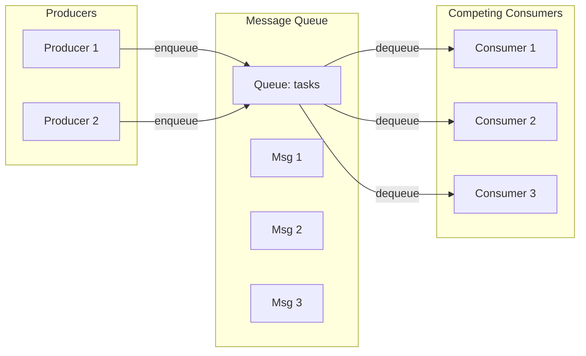
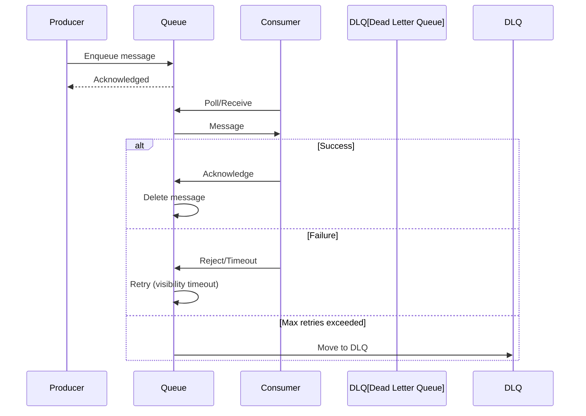

# Message Queue Pattern

## Overview

A **Message Queue** provides asynchronous point-to-point communication where messages are stored until a consumer processes them. Unlike Pub/Sub, each message is processed by exactly one consumer, making it ideal for work distribution and load leveling.



---

## Why Use It

### Problems It Solves

1. **Synchronous bottlenecks**: Caller waits for slow operations
2. **Load spikes**: Traffic bursts overwhelm systems
3. **Coupled availability**: Producer needs consumer to be up
4. **Work distribution**: Divide tasks among workers
5. **Retry handling**: Failed operations need retry

### Key Benefits

- **Load leveling** - Absorb traffic spikes
- **Decoupling** - Producer doesn't wait for consumer
- **Reliability** - Messages persist until processed
- **Scalability** - Add consumers as needed
- **Retry** - Failed messages can be reprocessed

---

## When to Use

| Use Case | Why Message Queue Works Well |
|----------|------------------------------|
| Background jobs | Email sending, report generation |
| Order processing | Decouple checkout from fulfillment |
| Image processing | Resize, compress in background |
| Data pipelines | ETL operations |
| Task scheduling | Delayed/scheduled tasks |

---

## When NOT to Use

| Scenario | Better Alternative |
|----------|-------------------|
| Need immediate response | Synchronous API |
| Fan-out to many | Pub/Sub |
| Simple fire-and-forget | In-memory queue |
| Very low latency required | Direct call |

---

## How It Works



### Delivery Guarantees

| Guarantee | Description | Implementation |
|-----------|-------------|----------------|
| **At-most-once** | May lose messages | No ack required |
| **At-least-once** | May duplicate | Ack after processing |
| **Exactly-once** | No loss or duplication | Idempotency + dedup |

---

## Pros and Cons

### Pros

| Advantage | Description |
|-----------|-------------|
| **Reliability** | Messages persist until processed |
| **Load leveling** | Handle traffic spikes |
| **Decoupling** | Async communication |
| **Scalability** | Add workers as needed |
| **Retry** | Automatic reprocessing |

### Cons

| Disadvantage | Mitigation |
|--------------|------------|
| **Added latency** | Accept for async operations |
| **Complexity** | Worth it for reliability |
| **Ordering** | Use FIFO queues or partitioning |
| **Duplicate processing** | Idempotent consumers |

---

## Implementation Example

### Python (with RabbitMQ)

```python
import pika
import json
from typing import Callable

class TaskQueue:
    def __init__(self, host: str = 'localhost'):
        self.connection = pika.BlockingConnection(
            pika.ConnectionParameters(host)
        )
        self.channel = self.connection.channel()

    def declare_queue(self, queue_name: str, durable: bool = True):
        self.channel.queue_declare(
            queue=queue_name,
            durable=durable,
            arguments={
                'x-dead-letter-exchange': '',
                'x-dead-letter-routing-key': f'{queue_name}_dlq'
            }
        )
        # Declare dead letter queue
        self.channel.queue_declare(queue=f'{queue_name}_dlq', durable=True)

    def publish(self, queue_name: str, message: dict):
        self.channel.basic_publish(
            exchange='',
            routing_key=queue_name,
            body=json.dumps(message),
            properties=pika.BasicProperties(
                delivery_mode=2,  # Persistent
                content_type='application/json'
            )
        )

    def consume(self, queue_name: str, handler: Callable, prefetch: int = 1):
        self.channel.basic_qos(prefetch_count=prefetch)

        def callback(ch, method, properties, body):
            try:
                message = json.loads(body)
                handler(message)
                ch.basic_ack(delivery_tag=method.delivery_tag)
            except Exception as e:
                print(f'Error processing: {e}')
                ch.basic_nack(
                    delivery_tag=method.delivery_tag,
                    requeue=False  # Send to DLQ
                )

        self.channel.basic_consume(
            queue=queue_name,
            on_message_callback=callback
        )
        self.channel.start_consuming()

# Producer
queue = TaskQueue()
queue.declare_queue('email_tasks')
queue.publish('email_tasks', {
    'to': 'user@example.com',
    'subject': 'Welcome!',
    'body': 'Thanks for signing up'
})

# Consumer (separate process)
def send_email(task: dict):
    print(f"Sending email to {task['to']}")
    # Actual email sending logic

consumer = TaskQueue()
consumer.consume('email_tasks', send_email)
```

### Go (with AWS SQS)

```go
package main

import (
    "context"
    "encoding/json"
    "fmt"
    "github.com/aws/aws-sdk-go-v2/service/sqs"
)

type MessageQueue struct {
    client   *sqs.Client
    queueURL string
}

func (q *MessageQueue) Send(ctx context.Context, message interface{}) error {
    body, _ := json.Marshal(message)
    _, err := q.client.SendMessage(ctx, &sqs.SendMessageInput{
        QueueUrl:    &q.queueURL,
        MessageBody: aws.String(string(body)),
    })
    return err
}

func (q *MessageQueue) Receive(ctx context.Context, handler func([]byte) error) {
    for {
        result, err := q.client.ReceiveMessage(ctx, &sqs.ReceiveMessageInput{
            QueueUrl:            &q.queueURL,
            MaxNumberOfMessages: 10,
            WaitTimeSeconds:     20, // Long polling
        })
        if err != nil {
            continue
        }

        for _, msg := range result.Messages {
            if err := handler([]byte(*msg.Body)); err == nil {
                q.client.DeleteMessage(ctx, &sqs.DeleteMessageInput{
                    QueueUrl:      &q.queueURL,
                    ReceiptHandle: msg.ReceiptHandle,
                })
            }
        }
    }
}
```

---

## Real-World Examples

| Company | Technology | Use Case |
|---------|------------|----------|
| **Amazon** | SQS | Order processing |
| **Uber** | Kafka + Cherami | Trip lifecycle |
| **Stripe** | RabbitMQ | Webhook delivery |
| **Slack** | Redis + custom | Message delivery |

---

## Related Patterns

- [Pub/Sub](./pub-sub.md) - One-to-many alternative
- [Saga](../04-data-patterns/saga-pattern.md) - Queue-driven workflows
- [Retry](../03-resilience-patterns/retry-with-backoff.md) - Queue-based retry

---

## Further Reading

- [RabbitMQ Tutorials](https://www.rabbitmq.com/getstarted.html)
- [AWS SQS Documentation](https://docs.aws.amazon.com/sqs/)
- [Apache Kafka](https://kafka.apache.org/)
