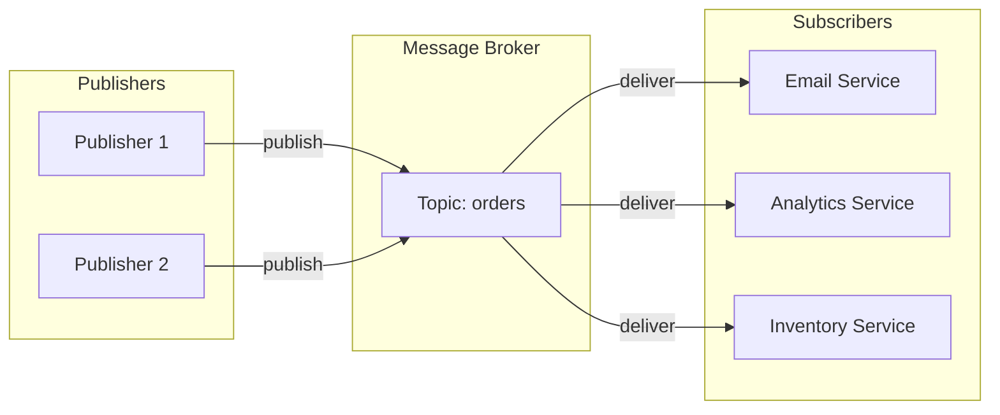
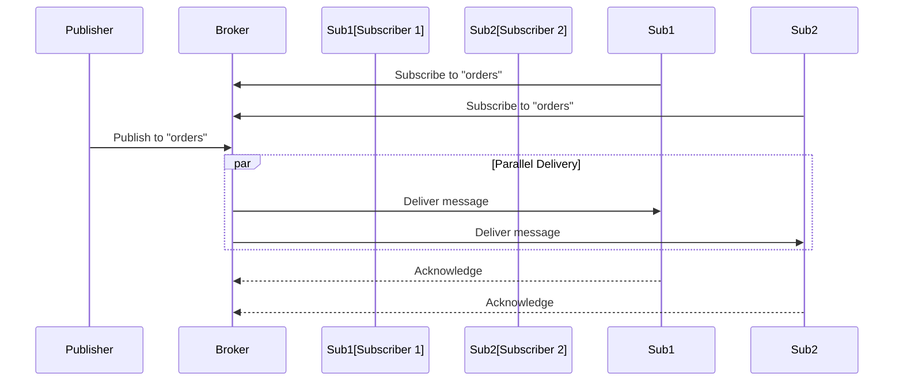

# Pub/Sub (Publish-Subscribe) Pattern

## Overview

**Pub/Sub** is a messaging pattern where publishers send messages to topics without knowledge of subscribers, and subscribers receive messages from topics they're interested in. This creates loose coupling between message producers and consumers.



---

## Why Use It

### Problems It Solves

1. **Tight coupling**: Publishers don't need to know about subscribers
2. **Scalability**: Add subscribers without changing publishers
3. **Fan-out**: One message reaches many consumers
4. **Temporal decoupling**: Publishers and subscribers don't need to be online simultaneously

### Key Benefits

- **Loose coupling** - Publishers and subscribers are independent
- **Scalability** - Easy to add new subscribers
- **Flexibility** - Dynamic subscription management
- **Resilience** - Broker handles delivery

---

## When to Use

| Use Case | Why Pub/Sub Works Well |
|----------|------------------------|
| Event notifications | Order placed → notify email, SMS, analytics |
| Log aggregation | Multiple services → central logging |
| Real-time updates | Price changes → all trading screens |
| Cache invalidation | Data change → invalidate all caches |
| Microservices events | Domain events across services |

---

## When NOT to Use

| Scenario | Better Alternative |
|----------|-------------------|
| Request-response needed | Synchronous API |
| Guaranteed ordering | Message Queue with partitions |
| Single consumer | Point-to-point queue |
| Complex routing | Message Queue with routing |

---

## How It Works



---

## Pros and Cons

### Pros

| Advantage | Description |
|-----------|-------------|
| **Decoupling** | Publishers don't know subscribers |
| **Scalability** | Add subscribers freely |
| **Fan-out** | One-to-many delivery |
| **Flexibility** | Dynamic subscriptions |

### Cons

| Disadvantage | Mitigation |
|--------------|------------|
| **Message ordering** | Use partitioning by key |
| **Delivery guarantees** | Use at-least-once with idempotency |
| **Debugging complexity** | Distributed tracing |
| **Message loss** | Persistent topics, acknowledgments |

---

## Implementation Example

### Python (with Kafka)

```python
from confluent_kafka import Producer, Consumer
import json

# Publisher
class OrderEventPublisher:
    def __init__(self, bootstrap_servers: str):
        self.producer = Producer({
            'bootstrap.servers': bootstrap_servers,
            'acks': 'all'
        })

    def publish_order_created(self, order: dict):
        self.producer.produce(
            topic='order-events',
            key=order['order_id'].encode(),
            value=json.dumps({
                'event_type': 'OrderCreated',
                'data': order
            }).encode(),
            callback=self._delivery_callback
        )
        self.producer.flush()

    def _delivery_callback(self, err, msg):
        if err:
            print(f'Delivery failed: {err}')
        else:
            print(f'Delivered to {msg.topic()}[{msg.partition()}]')

# Subscriber
class OrderEventSubscriber:
    def __init__(self, bootstrap_servers: str, group_id: str):
        self.consumer = Consumer({
            'bootstrap.servers': bootstrap_servers,
            'group.id': group_id,
            'auto.offset.reset': 'earliest',
            'enable.auto.commit': False
        })
        self.handlers = {}

    def subscribe(self, topics: list):
        self.consumer.subscribe(topics)

    def register_handler(self, event_type: str, handler):
        self.handlers[event_type] = handler

    def run(self):
        try:
            while True:
                msg = self.consumer.poll(1.0)
                if msg is None:
                    continue
                if msg.error():
                    print(f'Error: {msg.error()}')
                    continue

                event = json.loads(msg.value().decode())
                event_type = event.get('event_type')

                if event_type in self.handlers:
                    self.handlers[event_type](event['data'])

                self.consumer.commit(msg)
        finally:
            self.consumer.close()

# Usage
publisher = OrderEventPublisher('localhost:9092')
publisher.publish_order_created({'order_id': '123', 'total': 99.99})

# Email service subscriber
email_subscriber = OrderEventSubscriber('localhost:9092', 'email-service')
email_subscriber.subscribe(['order-events'])
email_subscriber.register_handler('OrderCreated', lambda data:
    print(f"Sending email for order {data['order_id']}"))
email_subscriber.run()
```

---

## Real-World Examples

| Company | Technology | Use Case |
|---------|------------|----------|
| **Netflix** | Kafka | Event streaming |
| **Uber** | Kafka | Real-time events |
| **LinkedIn** | Kafka | Activity feeds |
| **Google** | Cloud Pub/Sub | Global messaging |

---

## Related Patterns

- [Message Queue](./message-queue.md) - Point-to-point alternative
- [Event-Driven](./event-driven-architecture.md) - Architectural style using Pub/Sub
- [CQRS](../04-data-patterns/cqrs.md) - Sync read models via events

---

## Further Reading

- [Apache Kafka Documentation](https://kafka.apache.org/documentation/)
- [Google Cloud Pub/Sub](https://cloud.google.com/pubsub/docs)
- [AWS SNS](https://docs.aws.amazon.com/sns/)
