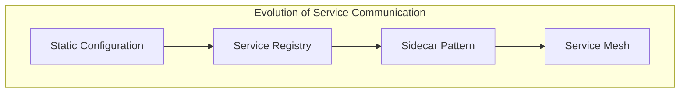
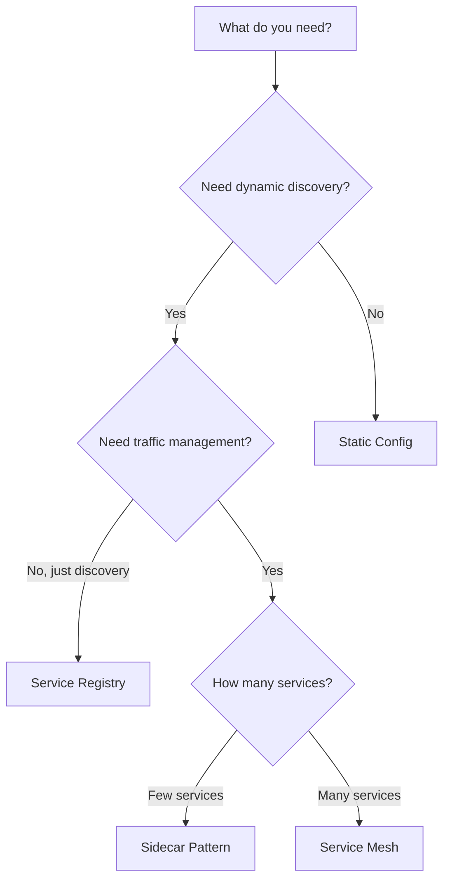

# Service Discovery and Mesh Patterns

This section covers patterns for managing service-to-service communication at scale. These patterns help services find each other, handle cross-cutting concerns, and provide observability in complex microservices environments.

## Overview

## Patterns in This Category

| Pattern | Document | Best For |
|---------|----------|----------|
| Service Registry | [service-registry.md](./service-registry.md) | Dynamic service discovery |
| Sidecar | [sidecar-pattern.md](./sidecar-pattern.md) | Cross-cutting concerns |
| Service Mesh | [service-mesh.md](./service-mesh.md) | Complex microservices observability |

## Comparison Matrix

| Aspect | Service Registry | Sidecar | Service Mesh |
|--------|------------------|---------|--------------|
| **Complexity** | Low | Medium | High |
| **Code Changes** | Minimal | None | None |
| **Observability** | Basic | Good | Excellent |
| **Traffic Control** | None | Per-service | Global |
| **Resource Overhead** | Low | Medium | High |
| **Use Case** | Discovery only | Single service | Full platform |

## Decision Guide

## Pattern Progression

Organizations typically evolve through these patterns:

| Stage | Pattern | When |
|-------|---------|------|
| 1 | Static configuration | Few services, stable IPs |
| 2 | Service Registry | Dynamic scaling, containerization |
| 3 | Sidecar | Need retries, circuit breakers per service |
| 4 | Service Mesh | Complex microservices, full observability |

## Cross-Cutting Concerns Handled

| Concern | Registry | Sidecar | Mesh |
|---------|----------|---------|------|
| Service Discovery | ✅ | ✅ | ✅ |
| Load Balancing | Basic | ✅ | ✅ |
| Circuit Breaking | ❌ | ✅ | ✅ |
| Retry/Timeout | ❌ | ✅ | ✅ |
| mTLS | ❌ | ✅ | ✅ |
| Distributed Tracing | ❌ | Partial | ✅ |
| Traffic Splitting | ❌ | ❌ | ✅ |

## Technology Options

| Pattern | Technologies |
|---------|--------------|
| **Service Registry** | Consul, Eureka, Zookeeper, etcd |
| **Sidecar** | Envoy, HAProxy, NGINX |
| **Service Mesh** | Istio, Linkerd, Consul Connect |

## Related Patterns

- [API Gateway](../02-api-gateway-patterns/api-gateway.md) - External traffic ingress
- [Circuit Breaker](../03-resilience-patterns/circuit-breaker.md) - Mesh-provided resilience
- [gRPC](../01-api-communication-styles/grpc.md) - Common mesh protocol
