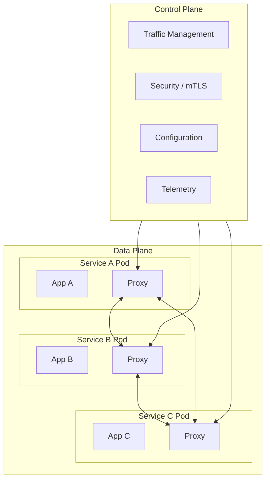
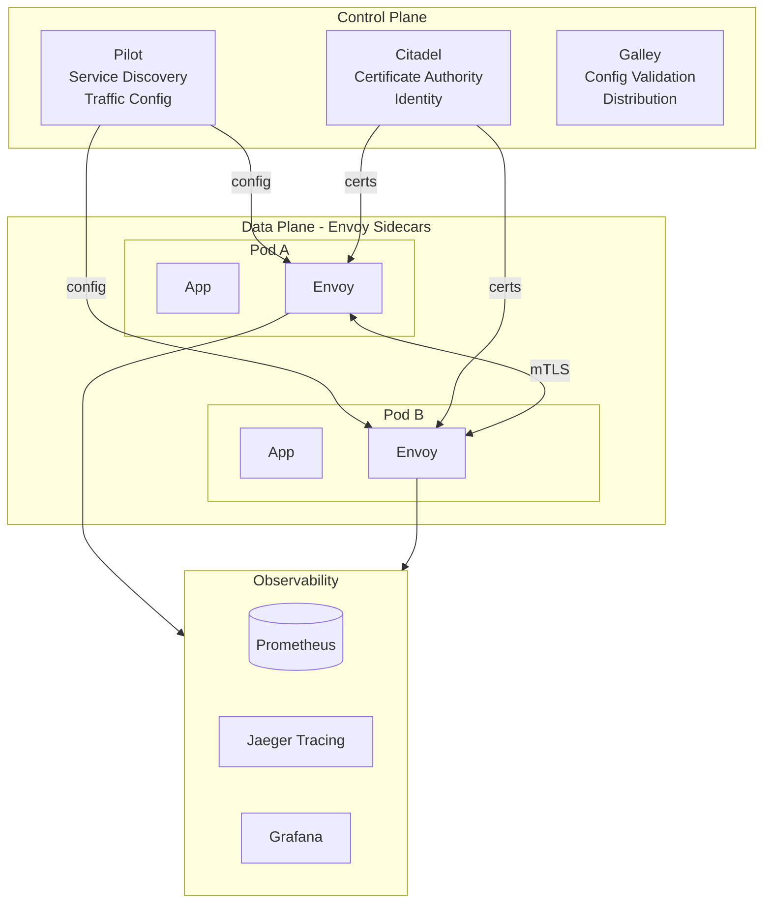

# Service Mesh Pattern

## Overview

A **Service Mesh** is a dedicated infrastructure layer that handles service-to-service communication. It provides a uniform way to connect, secure, and observe microservices through a fleet of intelligent proxies (sidecars) deployed alongside applications, managed by a central control plane.



---

## Why Use It

### Problems It Solves

1. **Observability gap**: Hard to see what's happening between services
2. **Security complexity**: mTLS between all services is hard
3. **Reliability challenges**: Retries, timeouts, circuit breakers everywhere
4. **Traffic management**: Canary, A/B testing, traffic splitting
5. **Polyglot complexity**: Same features needed in all languages

### Key Benefits

- **Zero-trust security** - mTLS between all services automatically
- **Observability** - Metrics, tracing, logging for all traffic
- **Traffic control** - Canary, blue-green, fault injection
- **Resilience** - Retries, timeouts, circuit breakers
- **No code changes** - All features without modifying apps

---

## Core Capabilities

| Capability | Description |
|------------|-------------|
| **mTLS** | Automatic encryption between all services |
| **Traffic Splitting** | Route % of traffic to different versions |
| **Canary Deployments** | Gradual rollout with monitoring |
| **Circuit Breaking** | Prevent cascade failures |
| **Rate Limiting** | Protect services from overload |
| **Observability** | Metrics, traces, access logs |
| **Fault Injection** | Chaos engineering testing |

---

## When to Use

| Scenario | Why Service Mesh Works Well |
|----------|----------------------------|
| 10+ microservices | Operational complexity warrants mesh |
| Security requirements | Zero-trust, mTLS mandatory |
| Compliance needs | Full audit trail required |
| Complex deployments | Canary, A/B, traffic mirroring |
| Polyglot environment | Consistent features across languages |

---

## When NOT to Use

| Scenario | Alternative |
|----------|-------------|
| Few services (< 5) | Library-based approach |
| Simple architecture | Direct service calls |
| Resource constrained | Shared proxies |
| Latency critical (< 1ms) | Direct communication |

---

## Architecture



---

## Pros and Cons

### Pros

| Advantage | Description |
|-----------|-------------|
| **Automatic mTLS** | Encryption without code changes |
| **Full observability** | See all service communication |
| **Traffic control** | Advanced deployment strategies |
| **Resilience** | Built-in retries, circuit breakers |
| **Consistent** | Same features for all services |

### Cons

| Disadvantage | Mitigation |
|--------------|------------|
| **Resource overhead** | ~50MB per sidecar |
| **Added latency** | ~1-3ms per hop |
| **Complexity** | Start simple, grow features |
| **Learning curve** | Invest in training |
| **Debugging** | Good tooling (Kiali, etc.) |

---

## Implementation Example

### Istio Configuration

```yaml
# VirtualService - Traffic routing
apiVersion: networking.istio.io/v1beta1
kind: VirtualService
metadata:
  name: order-service
spec:
  hosts:
  - order-service
  http:
  # Canary: 90% stable, 10% canary
  - match:
    - headers:
        x-canary:
          exact: "true"
    route:
    - destination:
        host: order-service
        subset: canary
  - route:
    - destination:
        host: order-service
        subset: stable
      weight: 90
    - destination:
        host: order-service
        subset: canary
      weight: 10
    # Retry configuration
    retries:
      attempts: 3
      perTryTimeout: 2s
      retryOn: "5xx,reset,connect-failure"
    # Timeout
    timeout: 10s

---
# DestinationRule - Traffic policies
apiVersion: networking.istio.io/v1beta1
kind: DestinationRule
metadata:
  name: order-service
spec:
  host: order-service
  trafficPolicy:
    connectionPool:
      tcp:
        maxConnections: 100
      http:
        h2UpgradePolicy: UPGRADE
        http1MaxPendingRequests: 100
        http2MaxRequests: 1000
    # Circuit breaker
    outlierDetection:
      consecutive5xxErrors: 5
      interval: 30s
      baseEjectionTime: 30s
      maxEjectionPercent: 50
    # mTLS
    tls:
      mode: ISTIO_MUTUAL
  subsets:
  - name: stable
    labels:
      version: v1
  - name: canary
    labels:
      version: v2

---
# PeerAuthentication - mTLS policy
apiVersion: security.istio.io/v1beta1
kind: PeerAuthentication
metadata:
  name: default
  namespace: production
spec:
  mtls:
    mode: STRICT

---
# AuthorizationPolicy - Access control
apiVersion: security.istio.io/v1beta1
kind: AuthorizationPolicy
metadata:
  name: order-service-policy
spec:
  selector:
    matchLabels:
      app: order-service
  rules:
  - from:
    - source:
        principals: ["cluster.local/ns/production/sa/payment-service"]
    to:
    - operation:
        methods: ["GET", "POST"]
        paths: ["/orders/*"]
```

### Linkerd Configuration (Simpler Alternative)

```yaml
# ServiceProfile - Per-route metrics and retries
apiVersion: linkerd.io/v1alpha2
kind: ServiceProfile
metadata:
  name: order-service.production.svc.cluster.local
  namespace: production
spec:
  routes:
  - name: GET /orders/{id}
    condition:
      method: GET
      pathRegex: /orders/[^/]+
    responseClasses:
    - condition:
        status:
          min: 500
          max: 599
      isFailure: true
    # Retry budget: max 20% extra requests
    retryBudget:
      retryRatio: 0.2
      minRetriesPerSecond: 10
      ttl: 10s
    timeout: 5s

---
# Traffic split for canary
apiVersion: split.smi-spec.io/v1alpha1
kind: TrafficSplit
metadata:
  name: order-service-split
spec:
  service: order-service
  backends:
  - service: order-service-stable
    weight: 900m  # 90%
  - service: order-service-canary
    weight: 100m  # 10%
```

---

## Mesh Comparison

| Feature | Istio | Linkerd | Consul Connect |
|---------|-------|---------|----------------|
| **Complexity** | High | Low | Medium |
| **Resource Usage** | Higher | Lower | Medium |
| **Features** | Most complete | Core features | Good |
| **Learning Curve** | Steep | Gentle | Moderate |
| **Performance** | Good | Excellent | Good |

---

## Real-World Examples

| Company | Mesh | Scale |
|---------|------|-------|
| **Google** | Istio | Created Istio |
| **Buoyant** | Linkerd | Created Linkerd |
| **Uber** | Custom mesh | 4000+ microservices |
| **Airbnb** | Envoy-based | Service-to-service |
| **Pinterest** | Envoy | Traffic management |

---

## Related Patterns

- [Sidecar](./sidecar-pattern.md) - Core building block
- [Service Registry](./service-registry.md) - Discovery component
- [Circuit Breaker](../03-resilience-patterns/circuit-breaker.md) - Mesh-provided
- [API Gateway](../02-api-gateway-patterns/api-gateway.md) - External traffic

---

## Further Reading

- [Istio Documentation](https://istio.io/docs/)
- [Linkerd Documentation](https://linkerd.io/docs/)
- [Consul Connect](https://www.consul.io/docs/connect)
- [Service Mesh Interface (SMI)](https://smi-spec.io/)
