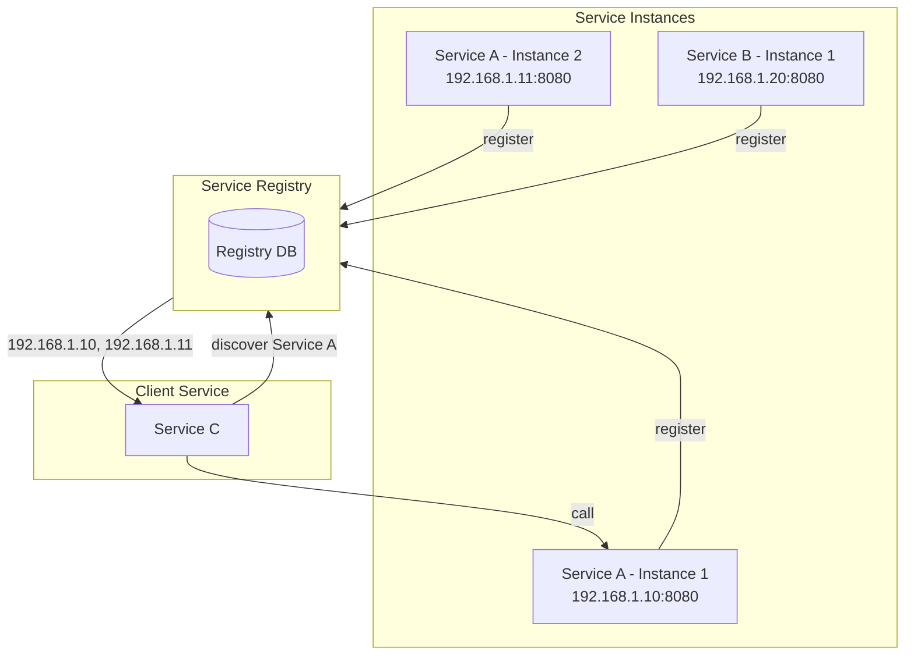
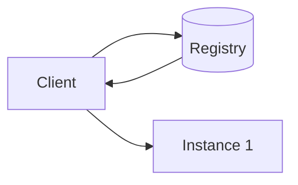
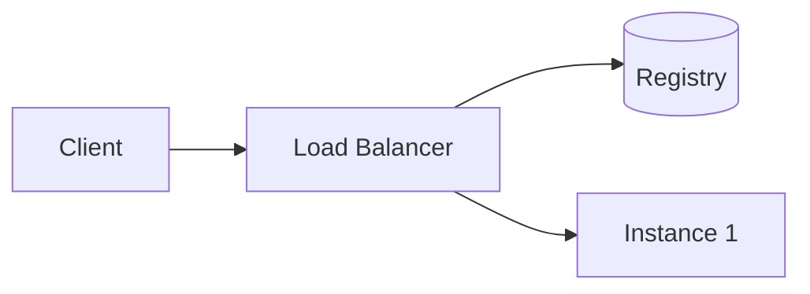
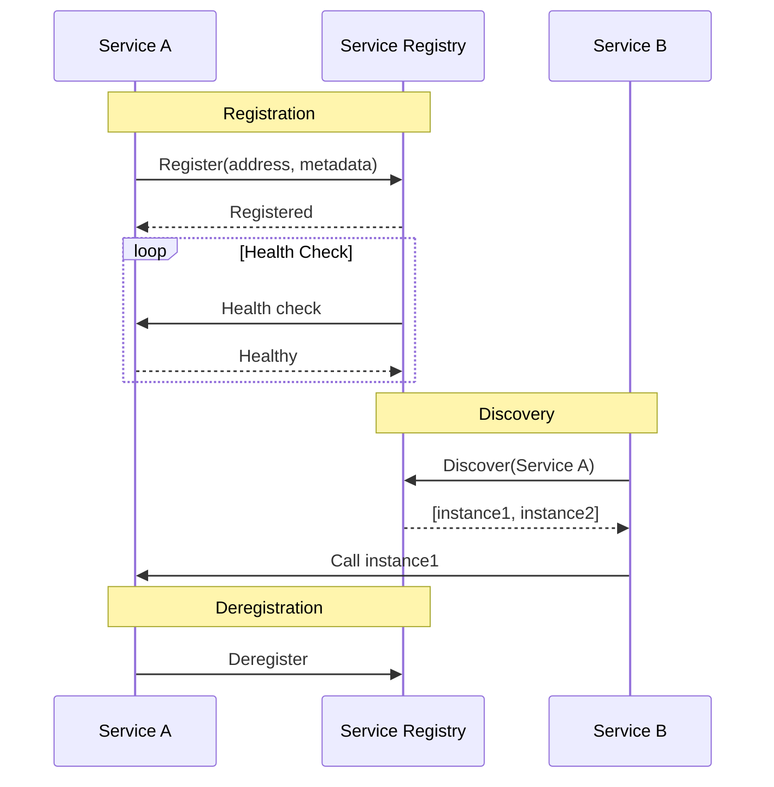

# Service Registry Pattern

## Overview

A **Service Registry** is a database of available service instances, their locations, and metadata. Services register themselves on startup and deregister on shutdown. Clients query the registry to discover available instances for communication.



---

## Why Use It

### Problems It Solves

1. **Static configuration**: Hardcoded IPs don't work with dynamic scaling
2. **Container orchestration**: Containers get new IPs on restart
3. **Load balancing**: Need to know all instances
4. **Health-based routing**: Route only to healthy instances
5. **Service versions**: Track multiple versions

### Key Benefits

- **Dynamic discovery** - Find services at runtime
- **Health tracking** - Only route to healthy instances
- **Metadata** - Version, environment, capabilities
- **Decoupling** - No hardcoded addresses
- **Scalability** - Add/remove instances dynamically

---

## When to Use

| Use Case | Why Registry Works Well |
|----------|------------------------|
| Microservices | Services scale dynamically |
| Container orchestration | IPs change frequently |
| Multi-environment | Different instances per env |
| A/B testing | Route by metadata/version |
| Blue-green deployments | Switch between versions |

---

## When NOT to Use

| Scenario | Alternative |
|----------|-------------|
| Static infrastructure | DNS or config files |
| Kubernetes native | Use Kubernetes Services |
| Very few services | Overkill |

---

## Discovery Patterns

### Client-Side Discovery

Client queries registry and selects an instance.



**Pros**: Client controls load balancing
**Cons**: Client needs discovery logic

### Server-Side Discovery

Load balancer queries registry, routes request.



**Pros**: Simple clients
**Cons**: Extra hop

---

## How It Works



---

## Pros and Cons

### Pros

| Advantage | Description |
|-----------|-------------|
| **Dynamic** | Handles scaling automatically |
| **Health-aware** | Routes to healthy instances |
| **Flexible** | Metadata for routing decisions |
| **Decoupled** | No hardcoded addresses |

### Cons

| Disadvantage | Mitigation |
|--------------|------------|
| **Single point of failure** | HA cluster, client-side caching |
| **Network overhead** | Cache results, TTL |
| **Complexity** | Use managed services |
| **Stale data** | Short TTLs, push updates |

---

## Implementation Example

### Python (with Consul)

```python
import consul
import socket
import uuid
from typing import List, Optional

class ServiceRegistry:
    def __init__(self, consul_host: str = 'localhost', consul_port: int = 8500):
        self.consul = consul.Consul(host=consul_host, port=consul_port)
        self.service_id = None

    def register(
        self,
        name: str,
        port: int,
        tags: List[str] = None,
        meta: dict = None,
        health_check_interval: str = "10s"
    ) -> str:
        """Register this service instance."""
        self.service_id = f"{name}-{uuid.uuid4()}"
        address = socket.gethostbyname(socket.gethostname())

        self.consul.agent.service.register(
            name=name,
            service_id=self.service_id,
            address=address,
            port=port,
            tags=tags or [],
            meta=meta or {},
            check=consul.Check.http(
                f"http://{address}:{port}/health",
                interval=health_check_interval,
                timeout="5s"
            )
        )
        return self.service_id

    def deregister(self):
        """Deregister this service instance."""
        if self.service_id:
            self.consul.agent.service.deregister(self.service_id)

    def discover(self, name: str, tag: str = None) -> List[dict]:
        """Discover healthy instances of a service."""
        _, services = self.consul.health.service(name, tag=tag, passing=True)

        return [
            {
                'id': svc['Service']['ID'],
                'address': svc['Service']['Address'],
                'port': svc['Service']['Port'],
                'tags': svc['Service']['Tags'],
                'meta': svc['Service']['Meta']
            }
            for svc in services
        ]

    def get_one(self, name: str, strategy: str = 'random') -> Optional[dict]:
        """Get one instance using load balancing strategy."""
        instances = self.discover(name)
        if not instances:
            return None

        if strategy == 'random':
            import random
            return random.choice(instances)
        elif strategy == 'round_robin':
            # Simplified - use proper round-robin in production
            return instances[0]

        return instances[0]

# Usage
registry = ServiceRegistry()

# Register on startup
service_id = registry.register(
    name='order-service',
    port=8080,
    tags=['v1', 'production'],
    meta={'version': '1.2.3'}
)

# Discover other services
payment_instances = registry.discover('payment-service')
for instance in payment_instances:
    print(f"Found: {instance['address']}:{instance['port']}")

# Get one instance for calling
payment = registry.get_one('payment-service')
if payment:
    url = f"http://{payment['address']}:{payment['port']}/process"

# Deregister on shutdown
registry.deregister()
```

### Go (with etcd)

```go
package main

import (
    "context"
    "encoding/json"
    "fmt"
    "time"

    clientv3 "go.etcd.io/etcd/client/v3"
)

type ServiceInstance struct {
    ID      string            `json:"id"`
    Name    string            `json:"name"`
    Address string            `json:"address"`
    Port    int               `json:"port"`
    Meta    map[string]string `json:"meta"`
}

type ServiceRegistry struct {
    client  *clientv3.Client
    leaseID clientv3.LeaseID
}

func NewRegistry(endpoints []string) (*ServiceRegistry, error) {
    client, err := clientv3.New(clientv3.Config{
        Endpoints:   endpoints,
        DialTimeout: 5 * time.Second,
    })
    if err != nil {
        return nil, err
    }
    return &ServiceRegistry{client: client}, nil
}

func (r *ServiceRegistry) Register(ctx context.Context, instance ServiceInstance, ttl int64) error {
    // Create lease
    lease, err := r.client.Grant(ctx, ttl)
    if err != nil {
        return err
    }
    r.leaseID = lease.ID

    // Register service
    key := fmt.Sprintf("/services/%s/%s", instance.Name, instance.ID)
    value, _ := json.Marshal(instance)

    _, err = r.client.Put(ctx, key, string(value), clientv3.WithLease(lease.ID))
    if err != nil {
        return err
    }

    // Keep alive
    ch, err := r.client.KeepAlive(ctx, lease.ID)
    if err != nil {
        return err
    }

    go func() {
        for range ch {
            // Keep lease alive
        }
    }()

    return nil
}

func (r *ServiceRegistry) Discover(ctx context.Context, name string) ([]ServiceInstance, error) {
    prefix := fmt.Sprintf("/services/%s/", name)
    resp, err := r.client.Get(ctx, prefix, clientv3.WithPrefix())
    if err != nil {
        return nil, err
    }

    var instances []ServiceInstance
    for _, kv := range resp.Kvs {
        var instance ServiceInstance
        if err := json.Unmarshal(kv.Value, &instance); err == nil {
            instances = append(instances, instance)
        }
    }
    return instances, nil
}
```

---

## Real-World Examples

| Company | Technology | Use Case |
|---------|------------|----------|
| **Netflix** | Eureka | Java microservices |
| **HashiCorp** | Consul | Multi-datacenter discovery |
| **Kubernetes** | etcd | Cluster state & services |
| **Uber** | Ringpop | Consistent hashing |

---

## Related Patterns

- [Sidecar](./sidecar-pattern.md) - Add discovery to existing apps
- [Service Mesh](./service-mesh.md) - Full-featured discovery
- [API Gateway](../02-api-gateway-patterns/api-gateway.md) - External routing

---

## Further Reading

- [Consul Documentation](https://www.consul.io/docs)
- [Netflix Eureka](https://github.com/Netflix/eureka)
- [etcd Documentation](https://etcd.io/docs/)
