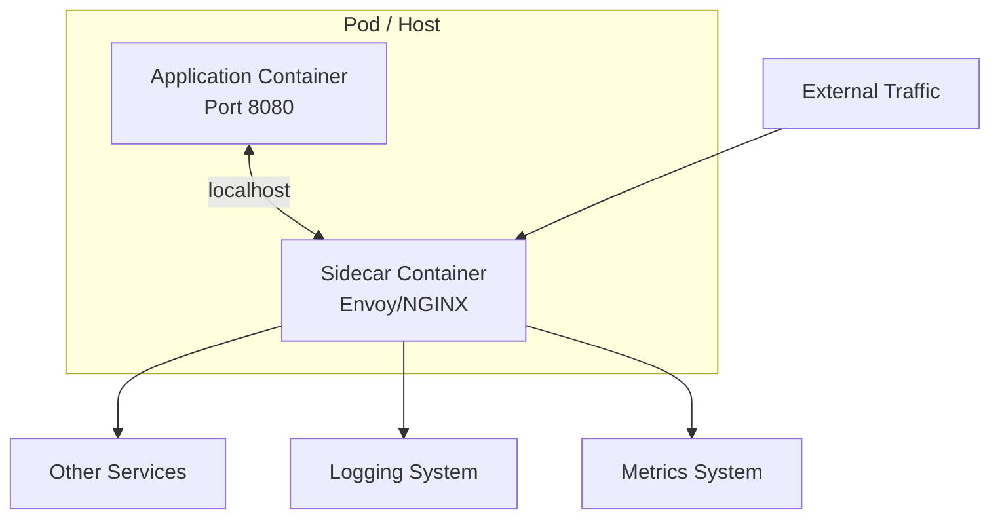
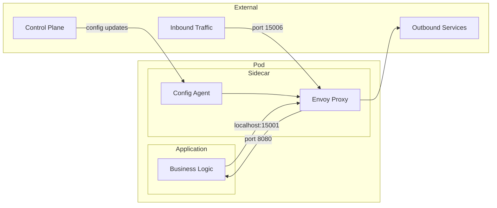
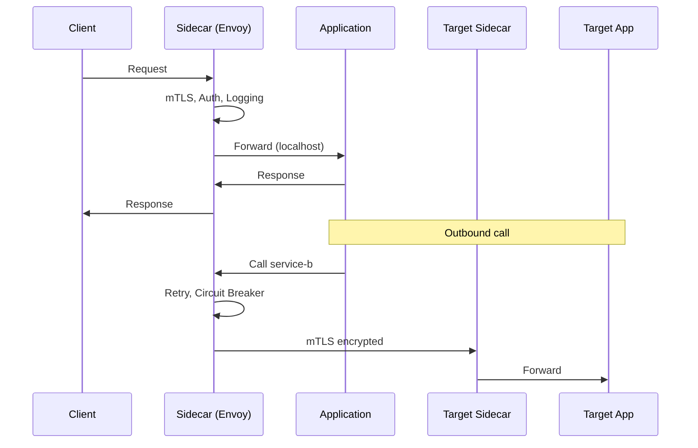

# Sidecar Pattern

## Overview

The **Sidecar Pattern** deploys a helper container alongside your application container to handle cross-cutting concerns. The sidecar runs in the same pod/host, shares the network namespace, and provides capabilities like logging, monitoring, service discovery, and traffic management without modifying the application.



---

## Why Use It

### Problems It Solves

1. **Cross-cutting concerns in app**: Logging, metrics, TLS in every service
2. **Polyglot environments**: Different languages need same features
3. **Legacy applications**: Can't modify source code
4. **Separation of concerns**: App developers focus on business logic
5. **Consistent behavior**: Same proxy config across services

### Key Benefits

- **Language agnostic** - Works with any application
- **No code changes** - Add features without modifying apps
- **Independent lifecycle** - Update sidecar separately
- **Separation of concerns** - Infra team manages sidecar
- **Consistent features** - Same capabilities everywhere

---

## Common Sidecar Uses

| Use Case | Sidecar Responsibility |
|----------|----------------------|
| **Service Mesh Proxy** | Traffic routing, mTLS, retries |
| **Logging** | Log collection and forwarding |
| **Monitoring** | Metrics collection |
| **Configuration** | Config updates from central store |
| **Secret Management** | Inject secrets as files |
| **Authentication** | OAuth/JWT validation |

---

## When to Use

| Scenario | Why Sidecar Works Well |
|----------|------------------------|
| Polyglot microservices | Same proxy features for all languages |
| Legacy modernization | Add capabilities without code changes |
| Security requirements | mTLS without app changes |
| Standardization | Consistent observability |
| Kubernetes environments | Native pod model support |

---

## When NOT to Use

| Scenario | Alternative |
|----------|-------------|
| Monolith | In-process library |
| Resource constrained | Shared proxy |
| Simple applications | Overkill |
| Latency critical | Direct calls |

---

## How It Works



### Traffic Flow



---

## Pros and Cons

### Pros

| Advantage | Description |
|-----------|-------------|
| **Language agnostic** | Works with any stack |
| **No code changes** | Transparent to application |
| **Independent updates** | Update proxy without app deploy |
| **Separation of concerns** | Clear responsibility boundaries |
| **Consistent behavior** | Same features across services |

### Cons

| Disadvantage | Mitigation |
|--------------|------------|
| **Resource overhead** | Right-size sidecar resources |
| **Added latency** | Minimal with localhost (< 1ms) |
| **Complexity** | Use service mesh for management |
| **Debugging** | Good logging, distributed tracing |

---

## Implementation Example

### Kubernetes Deployment

```yaml
apiVersion: apps/v1
kind: Deployment
metadata:
  name: order-service
spec:
  replicas: 3
  template:
    spec:
      containers:
      # Main application container
      - name: order-service
        image: myapp/order-service:v1.2
        ports:
        - containerPort: 8080
        resources:
          limits:
            memory: "512Mi"
            cpu: "500m"

      # Sidecar container (Envoy)
      - name: envoy-sidecar
        image: envoyproxy/envoy:v1.28.0
        ports:
        - containerPort: 15006  # Inbound
        - containerPort: 15001  # Outbound
        - containerPort: 9901   # Admin
        volumeMounts:
        - name: envoy-config
          mountPath: /etc/envoy
        resources:
          limits:
            memory: "128Mi"
            cpu: "100m"

      # Logging sidecar
      - name: fluentd-sidecar
        image: fluent/fluentd:v1.16
        volumeMounts:
        - name: logs
          mountPath: /var/log/app
        resources:
          limits:
            memory: "64Mi"
            cpu: "50m"

      volumes:
      - name: envoy-config
        configMap:
          name: envoy-config
      - name: logs
        emptyDir: {}
```

### Envoy Sidecar Configuration

```yaml
# envoy.yaml
static_resources:
  listeners:
  # Inbound listener
  - name: inbound
    address:
      socket_address:
        address: 0.0.0.0
        port_value: 15006
    filter_chains:
    - filters:
      - name: envoy.filters.network.http_connection_manager
        typed_config:
          "@type": type.googleapis.com/envoy.extensions.filters.network.http_connection_manager.v3.HttpConnectionManager
          stat_prefix: inbound
          route_config:
            virtual_hosts:
            - name: local_service
              domains: ["*"]
              routes:
              - match: { prefix: "/" }
                route: { cluster: local_app }
          http_filters:
          - name: envoy.filters.http.router

  # Outbound listener
  - name: outbound
    address:
      socket_address:
        address: 127.0.0.1
        port_value: 15001
    filter_chains:
    - filters:
      - name: envoy.filters.network.http_connection_manager
        typed_config:
          "@type": type.googleapis.com/envoy.extensions.filters.network.http_connection_manager.v3.HttpConnectionManager
          stat_prefix: outbound
          route_config:
            virtual_hosts:
            - name: external
              domains: ["*"]
              routes:
              - match: { prefix: "/" }
                route: { cluster: external_services }
          http_filters:
          - name: envoy.filters.http.router

  clusters:
  - name: local_app
    connect_timeout: 0.25s
    type: STATIC
    load_assignment:
      cluster_name: local_app
      endpoints:
      - lb_endpoints:
        - endpoint:
            address:
              socket_address:
                address: 127.0.0.1
                port_value: 8080
    # Circuit breaker
    circuit_breakers:
      thresholds:
      - max_connections: 1000
        max_pending_requests: 1000
        max_requests: 1000
```

### Python Application (Unchanged)

```python
# The application doesn't need to know about the sidecar
# It just makes normal HTTP calls
from flask import Flask
import requests

app = Flask(__name__)

@app.route('/orders/<order_id>')
def get_order(order_id):
    # Call through sidecar (configured via iptables or env vars)
    # The sidecar handles mTLS, retries, circuit breaking
    payment_response = requests.get(
        f'http://payment-service/payments/{order_id}'
    )
    return {'order_id': order_id, 'payment': payment_response.json()}

if __name__ == '__main__':
    app.run(host='0.0.0.0', port=8080)
```

---

## Real-World Examples

| Company | Sidecar | Purpose |
|---------|---------|---------|
| **Lyft** | Envoy | Created Envoy for this purpose |
| **Airbnb** | Envoy | Service mesh proxy |
| **Uber** | Custom | Rate limiting, auth |
| **Netflix** | Prana | JVM sidecar for non-JVM apps |

---

## Related Patterns

- [Service Mesh](./service-mesh.md) - Fleet of managed sidecars
- [Service Registry](./service-registry.md) - Sidecar discovers services
- [Circuit Breaker](../03-resilience-patterns/circuit-breaker.md) - Sidecar-provided

---

## Further Reading

- [Envoy Proxy](https://www.envoyproxy.io/)
- [Kubernetes Sidecar Containers](https://kubernetes.io/docs/concepts/workloads/pods/sidecar-containers/)
- [Lyft Envoy Blog](https://eng.lyft.com/envoy-7-months-later-41986c2fd443)
