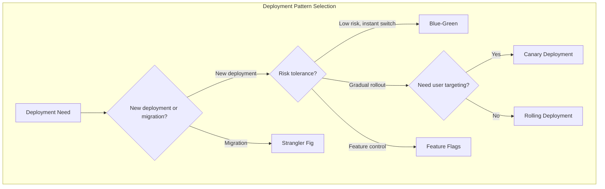
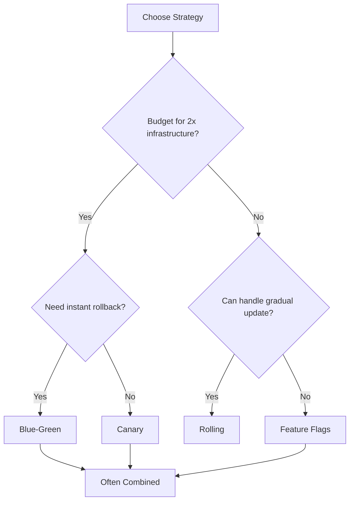
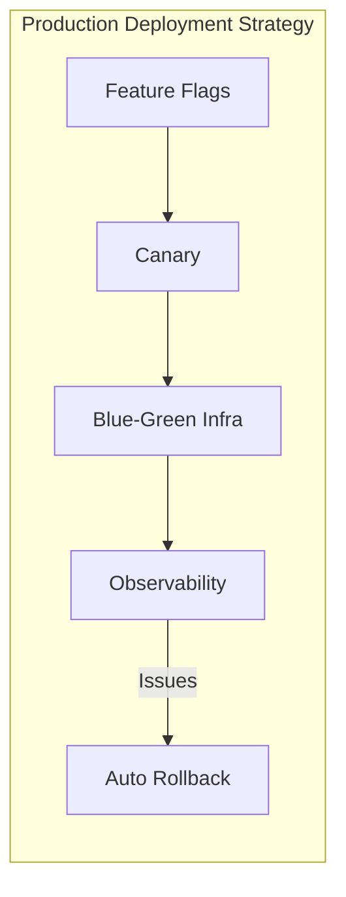
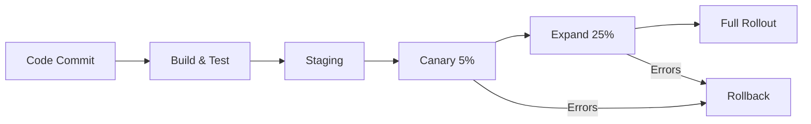

# Deployment & Infrastructure Patterns

This section covers patterns for deploying, migrating, and managing distributed systems in production. These patterns help achieve zero-downtime deployments, safe rollouts, and smooth system evolution.

## Overview

## Patterns in This Category

| Pattern | Document | Best For |
|---------|----------|----------|
| Blue-Green Deployment | [blue-green-deployment.md](./blue-green-deployment.md) | Zero-downtime releases, instant rollback |
| Canary Deployment | [canary-deployment.md](./canary-deployment.md) | Gradual rollouts, risk mitigation |
| Rolling Deployment | [rolling-deployment.md](./rolling-deployment.md) | Resource-efficient updates |
| Feature Flags | [feature-flags.md](./feature-flags.md) | Runtime feature control, A/B testing |
| Strangler Fig | [strangler-fig-pattern.md](./strangler-fig-pattern.md) | Legacy system migration |
| Database Per Service | [database-per-service.md](./database-per-service.md) | Microservices data isolation |

## Comparison Matrix

| Aspect | Blue-Green | Canary | Rolling | Feature Flags |
|--------|------------|--------|---------|---------------|
| **Rollback Speed** | Instant | Fast | Slow | Instant |
| **Resource Cost** | 2x infra | 1.1-1.5x | 1x | 1x |
| **Risk Level** | Low | Very Low | Medium | Very Low |
| **Complexity** | Medium | High | Low | Medium |
| **User Impact** | None | Minimal | Gradual | None |
| **Best For** | Critical apps | High-traffic | Cost-sensitive | Feature control |

## Deployment Strategy Selection

## Decision Framework

### When to Use Each Pattern

| Scenario | Recommended Pattern |
|----------|---------------------|
| Zero-downtime required | Blue-Green or Canary |
| Limited infrastructure budget | Rolling Deployment |
| High-risk changes | Canary with slow rollout |
| A/B testing features | Feature Flags |
| Migrating from monolith | Strangler Fig |
| Microservices architecture | Database Per Service |
| Quick feature iteration | Feature Flags |
| Regulatory compliance | Blue-Green (audit trail) |

## Pattern Combinations

These patterns often work together:

**Common Combinations:**
- **Blue-Green + Canary**: Blue-green infrastructure with canary traffic shifting
- **Feature Flags + Canary**: Flags control feature, canary controls rollout
- **Rolling + Feature Flags**: Deploy code everywhere, enable features gradually
- **Strangler Fig + Feature Flags**: Route traffic to new system via flags

## Deployment Pipeline

## Related Patterns

- [Circuit Breaker](../03-resilience-patterns/circuit-breaker.md) - Protect during deployments
- [Service Mesh](../06-service-discovery-mesh/service-mesh.md) - Traffic splitting for canary
- [API Gateway](../02-api-gateway-patterns/api-gateway.md) - Route to different versions
- [Service Registry](../06-service-discovery-mesh/service-registry.md) - Discover new deployments
