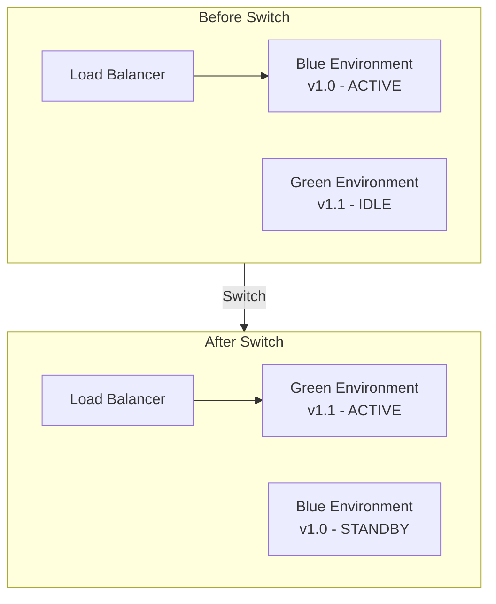
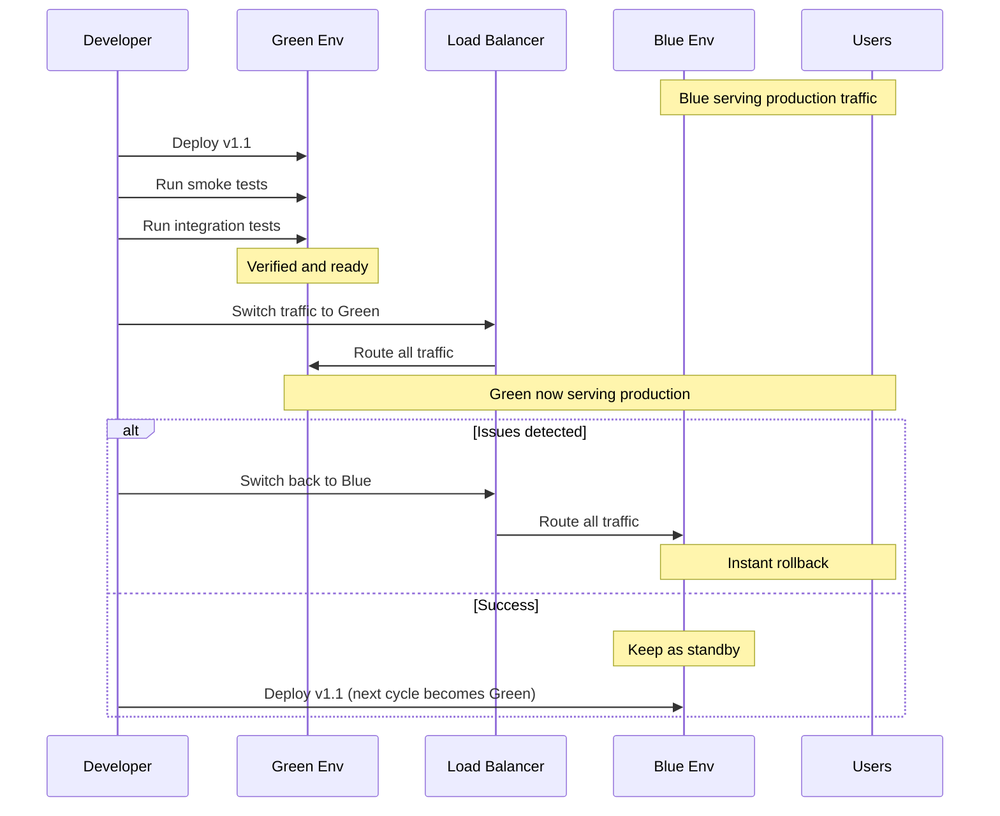
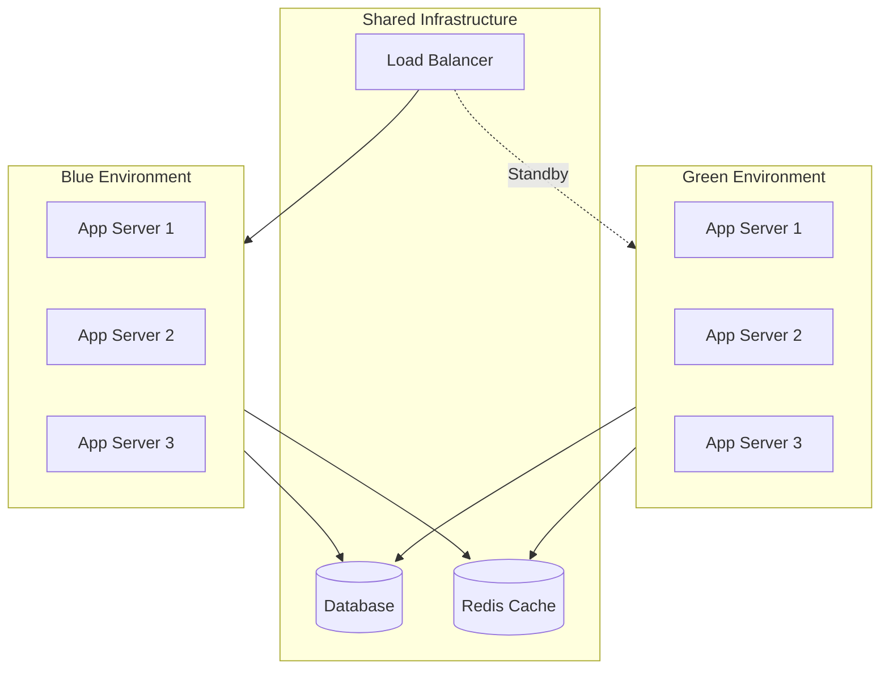
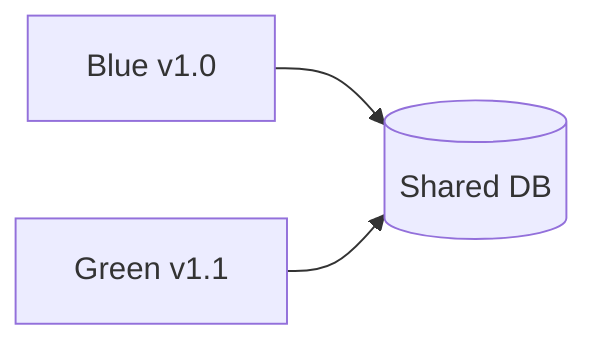
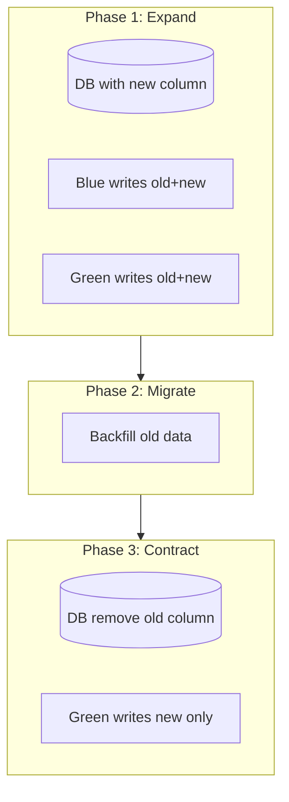

# Blue-Green Deployment Pattern

## Overview

**Blue-Green Deployment** maintains two identical production environments: Blue (current) and Green (new). Traffic is switched instantly from Blue to Green once the new version is verified, enabling zero-downtime deployments and instant rollbacks.



---

## Why Use It

### Problems It Solves

1. **Deployment downtime**: Traditional deployments require maintenance windows
2. **Risky rollbacks**: Rolling back requires redeployment
3. **Testing in production**: No way to verify before going live
4. **Inconsistent state**: Partial deployments cause issues

### Key Benefits

- **Zero downtime** - Instant traffic switch
- **Instant rollback** - Switch back to Blue immediately
- **Production testing** - Verify Green before switching
- **Reduced risk** - Full environment tested before live
- **Simple mental model** - Two environments, one active

---

## When to Use

| Use Case | Why Blue-Green Works Well |
|----------|--------------------------|
| Critical applications | Zero downtime required |
| Frequent releases | Quick, safe deployments |
| Compliance requirements | Audit trail of deployments |
| Database migrations | Test with production data copy |
| Major version changes | Full environment validation |

---

## When NOT to Use

| Scenario | Alternative |
|----------|-------------|
| Limited budget | Rolling deployment |
| Stateful applications | Requires careful session handling |
| Very large infrastructure | Canary (lower resource cost) |
| Database schema changes | Requires additional patterns |

---

## How It Works

### Deployment Flow



### Infrastructure Setup



---

## Pros and Cons

### Pros

| Advantage | Description |
|-----------|-------------|
| **Zero downtime** | Instant traffic switch |
| **Instant rollback** | Switch back in seconds |
| **Production testing** | Full verification before live |
| **Simple process** | Clear deployment model |
| **Audit trail** | Clear version history |

### Cons

| Disadvantage | Mitigation |
|--------------|------------|
| **2x infrastructure cost** | Use auto-scaling, spot instances |
| **Database compatibility** | Blue-green DB or backward compatible changes |
| **Session management** | Externalize sessions (Redis) |
| **Long-running transactions** | Drain connections before switch |

---

## Implementation Example

### Kubernetes (Using Services)

```yaml
# blue-deployment.yaml
apiVersion: apps/v1
kind: Deployment
metadata:
  name: myapp-blue
  labels:
    app: myapp
    version: blue
spec:
  replicas: 3
  selector:
    matchLabels:
      app: myapp
      version: blue
  template:
    metadata:
      labels:
        app: myapp
        version: blue
    spec:
      containers:
      - name: myapp
        image: myapp:v1.0.0
        ports:
        - containerPort: 8080
        readinessProbe:
          httpGet:
            path: /health
            port: 8080
          initialDelaySeconds: 10
          periodSeconds: 5
---
# green-deployment.yaml
apiVersion: apps/v1
kind: Deployment
metadata:
  name: myapp-green
  labels:
    app: myapp
    version: green
spec:
  replicas: 3
  selector:
    matchLabels:
      app: myapp
      version: green
  template:
    metadata:
      labels:
        app: myapp
        version: green
    spec:
      containers:
      - name: myapp
        image: myapp:v1.1.0
        ports:
        - containerPort: 8080
---
# service.yaml - Switch by changing selector
apiVersion: v1
kind: Service
metadata:
  name: myapp
spec:
  selector:
    app: myapp
    version: blue  # Change to 'green' to switch
  ports:
  - port: 80
    targetPort: 8080
```

### Switch Script

```bash
#!/bin/bash
# blue-green-switch.sh

CURRENT=$(kubectl get svc myapp -o jsonpath='{.spec.selector.version}')
echo "Current active: $CURRENT"

if [ "$CURRENT" == "blue" ]; then
    NEW="green"
else
    NEW="blue"
fi

echo "Switching to: $NEW"

# Verify new environment is healthy
kubectl rollout status deployment/myapp-$NEW

# Switch traffic
kubectl patch svc myapp -p "{\"spec\":{\"selector\":{\"version\":\"$NEW\"}}}"

echo "Traffic now routing to: $NEW"
```

### AWS with ALB

```python
import boto3

class BlueGreenDeployer:
    def __init__(self, target_group_blue_arn: str, target_group_green_arn: str,
                 listener_arn: str):
        self.elbv2 = boto3.client('elbv2')
        self.blue_arn = target_group_blue_arn
        self.green_arn = target_group_green_arn
        self.listener_arn = listener_arn

    def get_active_environment(self) -> str:
        response = self.elbv2.describe_rules(ListenerArn=self.listener_arn)
        for rule in response['Rules']:
            if rule['IsDefault']:
                target_arn = rule['Actions'][0]['TargetGroupArn']
                return 'blue' if target_arn == self.blue_arn else 'green'
        return 'unknown'

    def switch_traffic(self, to_environment: str):
        target_arn = self.blue_arn if to_environment == 'blue' else self.green_arn

        # Verify target group is healthy
        health = self.elbv2.describe_target_health(TargetGroupArn=target_arn)
        healthy_count = sum(1 for t in health['TargetHealthDescriptions']
                          if t['TargetHealth']['State'] == 'healthy')

        if healthy_count == 0:
            raise Exception(f"No healthy targets in {to_environment}")

        # Update listener default action
        self.elbv2.modify_listener(
            ListenerArn=self.listener_arn,
            DefaultActions=[{
                'Type': 'forward',
                'TargetGroupArn': target_arn
            }]
        )

        print(f"Traffic switched to {to_environment}")

    def rollback(self):
        current = self.get_active_environment()
        previous = 'blue' if current == 'green' else 'green'
        self.switch_traffic(previous)
        print(f"Rolled back to {previous}")

# Usage
deployer = BlueGreenDeployer(
    target_group_blue_arn='arn:aws:elasticloadbalancing:...:blue',
    target_group_green_arn='arn:aws:elasticloadbalancing:...:green',
    listener_arn='arn:aws:elasticloadbalancing:...:listener'
)

# Deploy new version to green, then switch
deployer.switch_traffic('green')

# If issues detected
deployer.rollback()
```

---

## Database Considerations

### Option 1: Shared Database (Backward Compatible Changes)



Requirements:
- Schema changes must be backward compatible
- Add columns, don't remove
- New code handles old data format

### Option 2: Database Migration Pattern



---

## Real-World Examples

| Company | Implementation |
|---------|----------------|
| **Amazon** | Uses blue-green for major deployments |
| **Netflix** | Red-Black deployment (same concept) |
| **Facebook** | Dark launches with traffic switching |
| **Etsy** | Feature flags + blue-green |

---

## Related Patterns

- [Canary Deployment](./canary-deployment.md) - Gradual alternative
- [Feature Flags](./feature-flags.md) - Feature-level control
- [Rolling Deployment](./rolling-deployment.md) - Resource-efficient alternative
- [Service Mesh](../06-service-discovery-mesh/service-mesh.md) - Traffic switching

---

## Further Reading

- [Blue-Green Deployments - Martin Fowler](https://martinfowler.com/bliki/BlueGreenDeployment.html)
- [AWS Blue-Green Deployments](https://docs.aws.amazon.com/whitepapers/latest/blue-green-deployments/welcome.html)
- [Kubernetes Blue-Green](https://kubernetes.io/blog/2018/04/30/zero-downtime-deployment-kubernetes-jenkins/)
