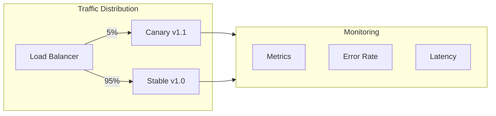
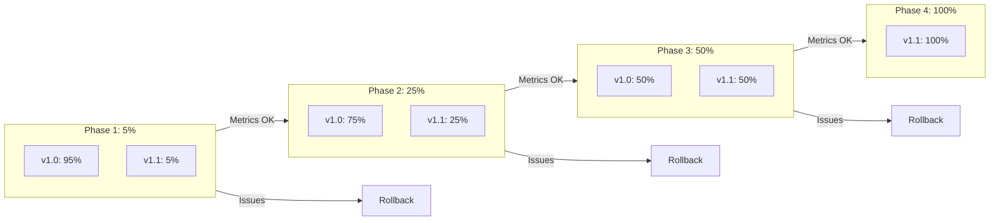
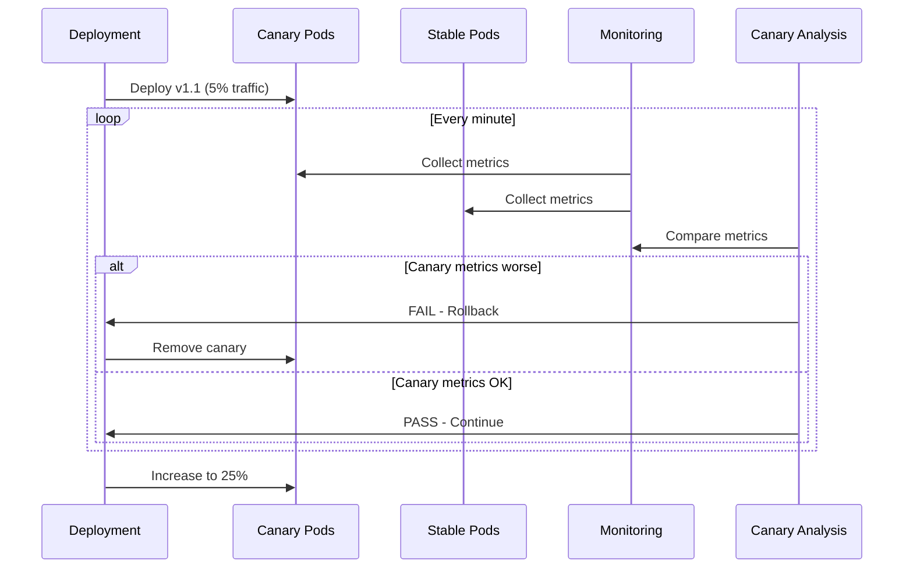

# Canary Deployment Pattern

## Overview

**Canary Deployment** gradually rolls out changes to a small subset of users before releasing to the entire infrastructure. Like a "canary in a coal mine," early users detect issues before they affect everyone. Traffic is progressively shifted from the old version to the new version while monitoring for problems.



---

## Why Use It

### Problems It Solves

1. **Big-bang risk**: All users affected by bugs immediately
2. **Hard to detect issues**: Problems only visible at scale
3. **Slow rollback**: Takes time to revert full deployment
4. **No gradual validation**: Can't test with real traffic incrementally

### Key Benefits

- **Risk mitigation** - Issues affect small % of users
- **Real traffic testing** - Validate with production load
- **Gradual rollout** - Increase confidence progressively
- **Quick rollback** - Just shift traffic back
- **Data-driven decisions** - Metrics guide rollout

---

## When to Use

| Use Case | Why Canary Works Well |
|----------|----------------------|
| High-traffic services | Can't afford full outage |
| User-facing changes | Validate user experience |
| Performance-sensitive | Detect latency regressions |
| New features | Gradual user exposure |
| Critical systems | Minimize blast radius |

---

## When NOT to Use

| Scenario | Alternative |
|----------|-------------|
| Database schema changes | Blue-green with migration |
| Breaking API changes | Feature flags + versioning |
| Small user base | A/B testing or blue-green |
| Stateful sessions | Requires sticky sessions |

---

## How It Works

### Progressive Rollout



### Canary Analysis



---

## Pros and Cons

### Pros

| Advantage | Description |
|-----------|-------------|
| **Low risk** | Issues affect small % |
| **Real validation** | Production traffic testing |
| **Quick rollback** | Just shift traffic |
| **Metrics-driven** | Data guides decisions |
| **Gradual confidence** | Build trust incrementally |

### Cons

| Disadvantage | Mitigation |
|--------------|------------|
| **Complexity** | Use service mesh or managed tools |
| **Monitoring overhead** | Invest in observability |
| **Session stickiness** | Externalize state |
| **Slower rollout** | Automate analysis |
| **A/B confusion** | Clear user segmentation |

---

## Implementation Example

### Kubernetes with Istio

```yaml
# Deployments for stable and canary
apiVersion: apps/v1
kind: Deployment
metadata:
  name: myapp-stable
spec:
  replicas: 9
  selector:
    matchLabels:
      app: myapp
      version: stable
  template:
    metadata:
      labels:
        app: myapp
        version: stable
    spec:
      containers:
      - name: myapp
        image: myapp:v1.0.0
---
apiVersion: apps/v1
kind: Deployment
metadata:
  name: myapp-canary
spec:
  replicas: 1
  selector:
    matchLabels:
      app: myapp
      version: canary
  template:
    metadata:
      labels:
        app: myapp
        version: canary
    spec:
      containers:
      - name: myapp
        image: myapp:v1.1.0
---
# Istio VirtualService for traffic splitting
apiVersion: networking.istio.io/v1beta1
kind: VirtualService
metadata:
  name: myapp
spec:
  hosts:
  - myapp
  http:
  - match:
    - headers:
        x-canary:
          exact: "true"
    route:
    - destination:
        host: myapp
        subset: canary
  - route:
    - destination:
        host: myapp
        subset: stable
      weight: 95
    - destination:
        host: myapp
        subset: canary
      weight: 5
---
apiVersion: networking.istio.io/v1beta1
kind: DestinationRule
metadata:
  name: myapp
spec:
  host: myapp
  subsets:
  - name: stable
    labels:
      version: stable
  - name: canary
    labels:
      version: canary
```

### Argo Rollouts (Automated Canary)

```yaml
apiVersion: argoproj.io/v1alpha1
kind: Rollout
metadata:
  name: myapp
spec:
  replicas: 10
  selector:
    matchLabels:
      app: myapp
  template:
    metadata:
      labels:
        app: myapp
    spec:
      containers:
      - name: myapp
        image: myapp:v1.1.0
  strategy:
    canary:
      steps:
      # Phase 1: 5% for 5 minutes
      - setWeight: 5
      - pause: {duration: 5m}

      # Phase 2: 25% with analysis
      - setWeight: 25
      - analysis:
          templates:
          - templateName: success-rate
          args:
          - name: service-name
            value: myapp

      # Phase 3: 50%
      - setWeight: 50
      - pause: {duration: 10m}

      # Phase 4: 100%
      - setWeight: 100

      # Canary service for metrics
      canaryService: myapp-canary
      stableService: myapp-stable

      # Traffic routing via Istio
      trafficRouting:
        istio:
          virtualService:
            name: myapp
---
# Analysis template
apiVersion: argoproj.io/v1alpha1
kind: AnalysisTemplate
metadata:
  name: success-rate
spec:
  args:
  - name: service-name
  metrics:
  - name: success-rate
    interval: 1m
    successCondition: result[0] >= 0.95
    provider:
      prometheus:
        address: http://prometheus:9090
        query: |
          sum(rate(http_requests_total{service="{{args.service-name}}",status=~"2.."}[5m]))
          /
          sum(rate(http_requests_total{service="{{args.service-name}}"}[5m]))
```

### Python Canary Controller

```python
from dataclasses import dataclass
from typing import Optional
import time

@dataclass
class CanaryConfig:
    initial_weight: int = 5
    increment: int = 10
    max_weight: int = 100
    analysis_interval: int = 60  # seconds
    error_threshold: float = 0.01  # 1% error rate
    latency_threshold_ms: float = 500

class CanaryDeployer:
    def __init__(self, traffic_manager, metrics_client, config: CanaryConfig):
        self.traffic = traffic_manager
        self.metrics = metrics_client
        self.config = config

    def deploy(self, new_version: str) -> bool:
        """Execute canary deployment with automated analysis."""
        weight = self.config.initial_weight

        # Deploy canary with initial weight
        self.traffic.set_canary_weight(weight)
        print(f"Canary deployed at {weight}%")

        while weight < self.config.max_weight:
            # Wait for analysis interval
            time.sleep(self.config.analysis_interval)

            # Analyze canary metrics
            if not self._analyze_canary():
                print("Canary analysis failed - rolling back")
                self._rollback()
                return False

            # Increase weight
            weight = min(weight + self.config.increment, self.config.max_weight)
            self.traffic.set_canary_weight(weight)
            print(f"Canary weight increased to {weight}%")

        print("Canary deployment successful - promoting to stable")
        self.traffic.promote_canary()
        return True

    def _analyze_canary(self) -> bool:
        """Compare canary metrics against stable."""
        canary_metrics = self.metrics.get_metrics('canary')
        stable_metrics = self.metrics.get_metrics('stable')

        # Check error rate
        if canary_metrics.error_rate > self.config.error_threshold:
            print(f"Error rate too high: {canary_metrics.error_rate:.2%}")
            return False

        # Check error rate compared to stable
        if canary_metrics.error_rate > stable_metrics.error_rate * 1.5:
            print("Error rate 50% higher than stable")
            return False

        # Check latency
        if canary_metrics.p99_latency > self.config.latency_threshold_ms:
            print(f"Latency too high: {canary_metrics.p99_latency}ms")
            return False

        # Check latency compared to stable
        if canary_metrics.p99_latency > stable_metrics.p99_latency * 1.2:
            print("Latency 20% higher than stable")
            return False

        print("Canary analysis passed")
        return True

    def _rollback(self):
        """Remove canary and restore 100% to stable."""
        self.traffic.set_canary_weight(0)
        print("Rolled back to stable")
```

---

## Canary Metrics to Monitor

| Metric | What to Compare |
|--------|-----------------|
| **Error rate** | Canary vs stable (< 1.5x) |
| **Latency (p50, p99)** | Canary vs stable (< 1.2x) |
| **Throughput** | Should be proportional to weight |
| **CPU/Memory** | No unexpected spikes |
| **Business metrics** | Conversion, engagement |

---

## Real-World Examples

| Company | Implementation |
|---------|----------------|
| **Google** | GKE canary with traffic splitting |
| **Netflix** | Automated canary analysis (Kayenta) |
| **LinkedIn** | LiX (experimentation platform) |
| **Uber** | Multi-stage canary with metrics |

---

## Related Patterns

- [Blue-Green](./blue-green-deployment.md) - Instant switch alternative
- [Feature Flags](./feature-flags.md) - Feature-level canary
- [Rolling Deployment](./rolling-deployment.md) - Simpler alternative
- [Service Mesh](../06-service-discovery-mesh/service-mesh.md) - Traffic splitting

---

## Further Reading

- [Canary Deployments - Martin Fowler](https://martinfowler.com/bliki/CanaryRelease.html)
- [Argo Rollouts](https://argoproj.github.io/argo-rollouts/)
- [Flagger (Progressive Delivery)](https://flagger.app/)
- [Netflix Kayenta](https://github.com/spinnaker/kayenta)
