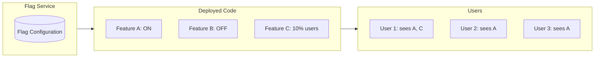
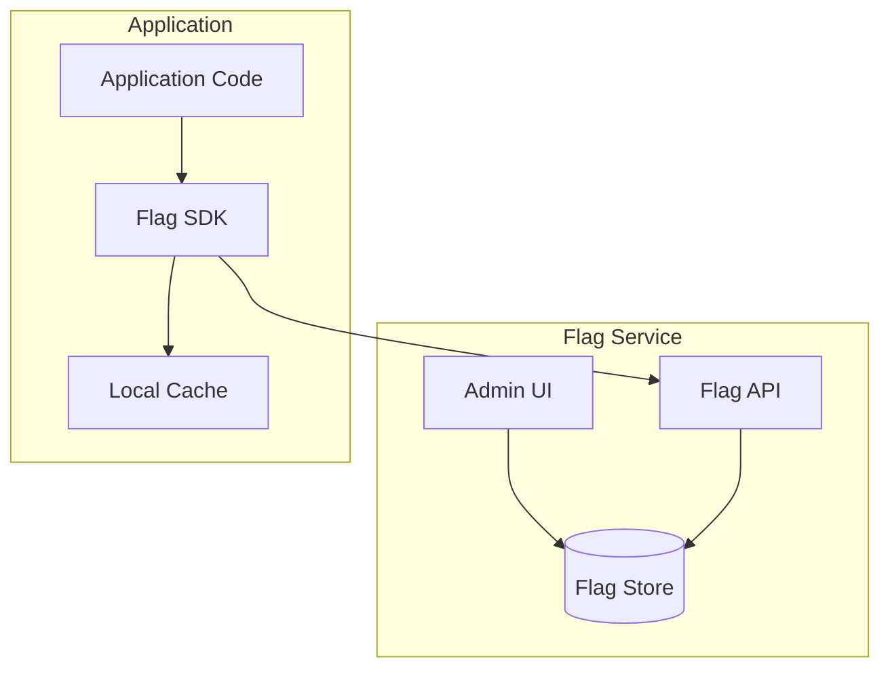
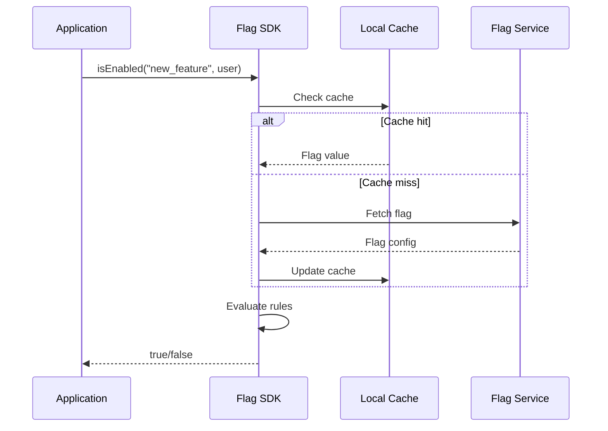
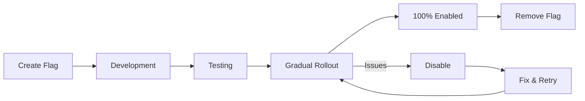

# Feature Flags Pattern

## Overview

**Feature Flags** (also called feature toggles) allow you to enable or disable features at runtime without deploying new code. This decouples deployment from release, enabling trunk-based development, A/B testing, gradual rollouts, and instant kill switches.



---

## Why Use It

### Problems It Solves

1. **Long-lived branches**: Feature branches cause merge conflicts
2. **Big-bang releases**: All features released together
3. **Risky rollouts**: No way to disable broken features
4. **No experimentation**: Can't A/B test features
5. **Environment differences**: Same code, different behavior

### Key Benefits

- **Decouple deploy from release** - Deploy anytime, release when ready
- **Instant rollback** - Disable feature without redeployment
- **Gradual rollout** - Enable for % of users
- **A/B testing** - Compare feature variants
- **Kill switch** - Emergency feature disable
- **Trunk-based development** - Merge incomplete features safely

---

## Flag Types

| Type | Purpose | Lifespan | Example |
|------|---------|----------|---------|
| **Release** | Hide incomplete features | Days-weeks | `new_checkout_flow` |
| **Experiment** | A/B testing | Days-weeks | `button_color_test` |
| **Ops** | Control operational behavior | Long-term | `enable_cache` |
| **Permission** | User entitlements | Long-term | `premium_features` |
| **Kill Switch** | Emergency disable | Long-term | `disable_payments` |

---

## When to Use

| Use Case | Why Feature Flags Work Well |
|----------|----------------------------|
| Trunk-based development | Merge incomplete code safely |
| Gradual rollouts | Enable for % of users |
| A/B testing | Compare variants |
| Kill switches | Emergency disable |
| Beta programs | Enable for specific users |
| Ops toggles | Control behavior in production |

---

## When NOT to Use

| Scenario | Why Not |
|----------|---------|
| Simple, low-risk changes | Overhead not justified |
| Permanent configurations | Use config files |
| Too many flags | Tech debt accumulates |

---

## How It Works

### Architecture



### Evaluation Flow



---

## Pros and Cons

### Pros

| Advantage | Description |
|-----------|-------------|
| **Decouple deploy/release** | Ship code, release later |
| **Instant rollback** | Toggle off, no redeploy |
| **Gradual rollout** | Percentage-based enabling |
| **A/B testing** | Built-in experimentation |
| **Kill switch** | Emergency disable |

### Cons

| Disadvantage | Mitigation |
|--------------|------------|
| **Tech debt** | Remove old flags aggressively |
| **Testing complexity** | Test all flag combinations |
| **Code complexity** | Keep flags simple |
| **Performance** | Cache flag evaluations |

---

## Implementation Example

### Python Feature Flag SDK

```python
from dataclasses import dataclass
from typing import Dict, Any, Optional, List
import hashlib
import json

@dataclass
class User:
    id: str
    email: str
    attributes: Dict[str, Any]

@dataclass
class FlagConfig:
    key: str
    enabled: bool
    percentage: Optional[int] = None  # 0-100
    user_ids: Optional[List[str]] = None
    rules: Optional[List[Dict]] = None

class FeatureFlagClient:
    def __init__(self, flags: Dict[str, FlagConfig]):
        self.flags = flags

    def is_enabled(self, flag_key: str, user: Optional[User] = None) -> bool:
        flag = self.flags.get(flag_key)
        if not flag:
            return False

        if not flag.enabled:
            return False

        # Check specific user IDs
        if flag.user_ids and user:
            if user.id in flag.user_ids:
                return True

        # Percentage rollout
        if flag.percentage is not None and user:
            bucket = self._get_bucket(flag_key, user.id)
            return bucket < flag.percentage

        # Rule-based evaluation
        if flag.rules and user:
            return self._evaluate_rules(flag.rules, user)

        return flag.enabled

    def _get_bucket(self, flag_key: str, user_id: str) -> int:
        """Consistent hashing for percentage rollout."""
        hash_input = f"{flag_key}:{user_id}"
        hash_value = hashlib.md5(hash_input.encode()).hexdigest()
        return int(hash_value[:8], 16) % 100

    def _evaluate_rules(self, rules: List[Dict], user: User) -> bool:
        for rule in rules:
            if self._matches_rule(rule, user):
                return rule.get('enabled', True)
        return False

    def _matches_rule(self, rule: Dict, user: User) -> bool:
        attribute = rule.get('attribute')
        operator = rule.get('operator')
        value = rule.get('value')

        user_value = user.attributes.get(attribute)

        if operator == 'equals':
            return user_value == value
        elif operator == 'contains':
            return value in (user_value or '')
        elif operator == 'in':
            return user_value in value

        return False

# Usage
flags = {
    'new_checkout': FlagConfig(
        key='new_checkout',
        enabled=True,
        percentage=10  # 10% of users
    ),
    'premium_features': FlagConfig(
        key='premium_features',
        enabled=True,
        rules=[
            {'attribute': 'plan', 'operator': 'equals', 'value': 'premium', 'enabled': True}
        ]
    ),
    'beta_feature': FlagConfig(
        key='beta_feature',
        enabled=True,
        user_ids=['user_123', 'user_456']
    )
}

client = FeatureFlagClient(flags)

user = User(
    id='user_789',
    email='test@example.com',
    attributes={'plan': 'premium', 'country': 'US'}
)

# Check flags
if client.is_enabled('new_checkout', user):
    # Show new checkout
    pass
else:
    # Show old checkout
    pass
```

### Application Integration

```python
from flask import Flask, g
from functools import wraps

app = Flask(__name__)
flag_client = FeatureFlagClient(flags)

def feature_flag(flag_key: str, fallback=None):
    """Decorator for feature-flagged endpoints."""
    def decorator(f):
        @wraps(f)
        def wrapper(*args, **kwargs):
            if flag_client.is_enabled(flag_key, g.current_user):
                return f(*args, **kwargs)
            elif fallback:
                return fallback(*args, **kwargs)
            else:
                return {'error': 'Feature not available'}, 404
        return wrapper
    return decorator

# Old checkout
@app.route('/checkout')
def old_checkout():
    return {'version': 'v1'}

# New checkout behind flag
@app.route('/checkout')
@feature_flag('new_checkout', fallback=old_checkout)
def new_checkout():
    return {'version': 'v2'}

# Inline usage
@app.route('/dashboard')
def dashboard():
    user = g.current_user

    data = {'user': user.id}

    if flag_client.is_enabled('show_recommendations', user):
        data['recommendations'] = get_recommendations(user)

    if flag_client.is_enabled('new_analytics', user):
        data['analytics'] = get_new_analytics(user)
    else:
        data['analytics'] = get_old_analytics(user)

    return data
```

### React Integration

```typescript
import { useFeatureFlag } from './feature-flags';

function CheckoutPage() {
  const showNewCheckout = useFeatureFlag('new_checkout');
  const showRecommendations = useFeatureFlag('show_recommendations');

  return (
    <div>
      {showNewCheckout ? (
        <NewCheckoutFlow />
      ) : (
        <OldCheckoutFlow />
      )}

      {showRecommendations && <Recommendations />}
    </div>
  );
}

// Hook implementation
function useFeatureFlag(flagKey: string): boolean {
  const { user } = useAuth();
  const { flags } = useFlags();

  return useMemo(() => {
    return evaluateFlag(flags[flagKey], user);
  }, [flags, flagKey, user]);
}
```

---

## Flag Lifecycle



**Best Practices:**
1. **Short-lived flags** - Remove after full rollout
2. **Flag naming** - Use descriptive names with dates
3. **Documentation** - Document flag purpose and owner
4. **Cleanup process** - Regular flag audits

---

## Real-World Examples

| Company | Tool | Scale |
|---------|------|-------|
| **Facebook** | Gatekeeper | Millions of flags |
| **Netflix** | Custom | A/B testing at scale |
| **GitHub** | Flipper | Feature rollouts |
| **LaunchDarkly** | SaaS | Enterprise feature flags |

---

## Related Patterns

- [Canary Deployment](./canary-deployment.md) - Combine with flags
- [Blue-Green](./blue-green-deployment.md) - Code vs feature rollout
- [A/B Testing](./canary-deployment.md) - Experimentation

---

## Further Reading

- [Feature Toggles - Martin Fowler](https://martinfowler.com/articles/feature-toggles.html)
- [LaunchDarkly](https://launchdarkly.com/)
- [Unleash](https://www.getunleash.io/)
- [Flipper (Ruby)](https://github.com/jnunemaker/flipper)
