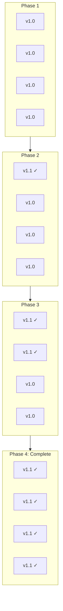
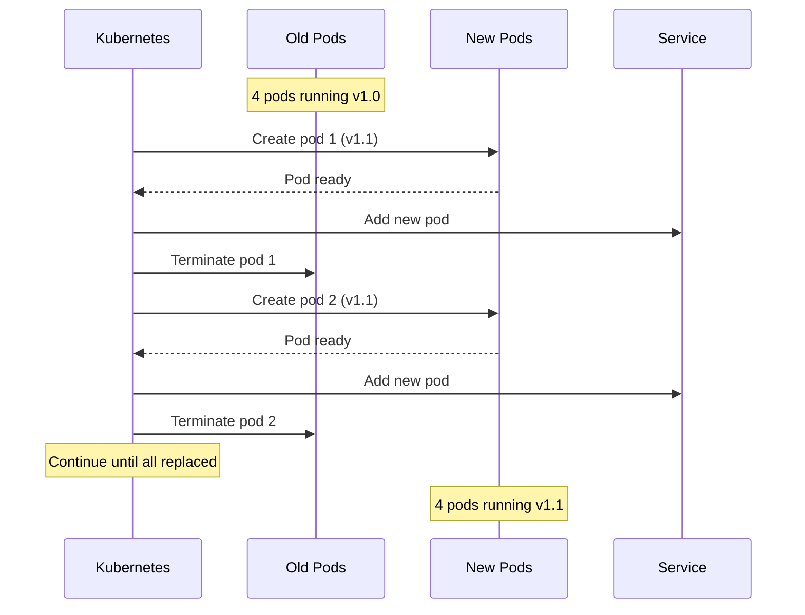

# Rolling Deployment Pattern

## Overview

**Rolling Deployment** gradually replaces instances of the old version with the new version, one (or a few) at a time. Unlike blue-green which requires double infrastructure, rolling updates reuse existing resources, making it cost-effective while still achieving zero-downtime deployments.



---

## Why Use It

### Problems It Solves

1. **Infrastructure cost**: Blue-green requires 2x resources
2. **Resource constraints**: Limited compute capacity
3. **Simple deployments**: Don't need complex traffic splitting
4. **Kubernetes native**: Default deployment strategy

### Key Benefits

- **Resource efficient** - No extra infrastructure needed
- **Zero downtime** - Gradual replacement maintains availability
- **Simple** - Built into most orchestrators
- **Automatic** - Orchestrator handles the process
- **Configurable** - Control update speed and batch size

---

## When to Use

| Use Case | Why Rolling Works Well |
|----------|------------------------|
| Resource-constrained environments | No extra infra needed |
| Simple stateless services | Easy to replace instances |
| Kubernetes workloads | Default, well-supported |
| Non-critical updates | Acceptable rollback time |
| Internal services | Less risk than user-facing |

---

## When NOT to Use

| Scenario | Alternative |
|----------|-------------|
| Need instant rollback | Blue-green |
| High-risk changes | Canary |
| Breaking changes | Blue-green with migration |
| Stateful services | Careful consideration needed |

---

## How It Works

### Kubernetes Rolling Update



---

## Pros and Cons

### Pros

| Advantage | Description |
|-----------|-------------|
| **Resource efficient** | No extra infrastructure |
| **Zero downtime** | Gradual replacement |
| **Simple** | Native to orchestrators |
| **Automatic** | Orchestrator manages process |

### Cons

| Disadvantage | Mitigation |
|--------------|------------|
| **Slow rollback** | Must redeploy previous version |
| **Mixed versions** | Ensure backward compatibility |
| **No instant switch** | Use blue-green if needed |
| **Longer deployment** | Tune maxSurge/maxUnavailable |

---

## Implementation Example

### Kubernetes Deployment

```yaml
apiVersion: apps/v1
kind: Deployment
metadata:
  name: myapp
spec:
  replicas: 4
  strategy:
    type: RollingUpdate
    rollingUpdate:
      maxSurge: 1        # Max pods above desired during update
      maxUnavailable: 0  # Always maintain desired capacity
  selector:
    matchLabels:
      app: myapp
  template:
    metadata:
      labels:
        app: myapp
    spec:
      containers:
      - name: myapp
        image: myapp:v1.1.0
        ports:
        - containerPort: 8080
        # Critical for rolling updates
        readinessProbe:
          httpGet:
            path: /health
            port: 8080
          initialDelaySeconds: 5
          periodSeconds: 5
        livenessProbe:
          httpGet:
            path: /health
            port: 8080
          initialDelaySeconds: 15
          periodSeconds: 10
        # Graceful shutdown
        lifecycle:
          preStop:
            exec:
              command: ["/bin/sh", "-c", "sleep 10"]
      terminationGracePeriodSeconds: 30
```

### Configuration Options

```yaml
# Fast rollout (higher risk)
strategy:
  rollingUpdate:
    maxSurge: 50%
    maxUnavailable: 50%

# Safe rollout (slower)
strategy:
  rollingUpdate:
    maxSurge: 1
    maxUnavailable: 0

# Balanced
strategy:
  rollingUpdate:
    maxSurge: 25%
    maxUnavailable: 25%
```

### Rollback Commands

```bash
# Check rollout status
kubectl rollout status deployment/myapp

# View rollout history
kubectl rollout history deployment/myapp

# Rollback to previous version
kubectl rollout undo deployment/myapp

# Rollback to specific revision
kubectl rollout undo deployment/myapp --to-revision=2

# Pause rollout (for manual verification)
kubectl rollout pause deployment/myapp

# Resume rollout
kubectl rollout resume deployment/myapp
```

---

## Real-World Examples

| Company | Implementation |
|---------|----------------|
| **Most K8s users** | Default deployment strategy |
| **AWS ECS** | Rolling update service deployments |
| **Docker Swarm** | Rolling updates built-in |

---

## Related Patterns

- [Blue-Green](./blue-green-deployment.md) - Instant switch alternative
- [Canary](./canary-deployment.md) - Traffic-based rollout
- [Feature Flags](./feature-flags.md) - Decouple deploy from release

---

## Further Reading

- [Kubernetes Deployments](https://kubernetes.io/docs/concepts/workloads/controllers/deployment/)
- [Rolling Updates Best Practices](https://kubernetes.io/docs/tutorials/kubernetes-basics/update/update-intro/)
