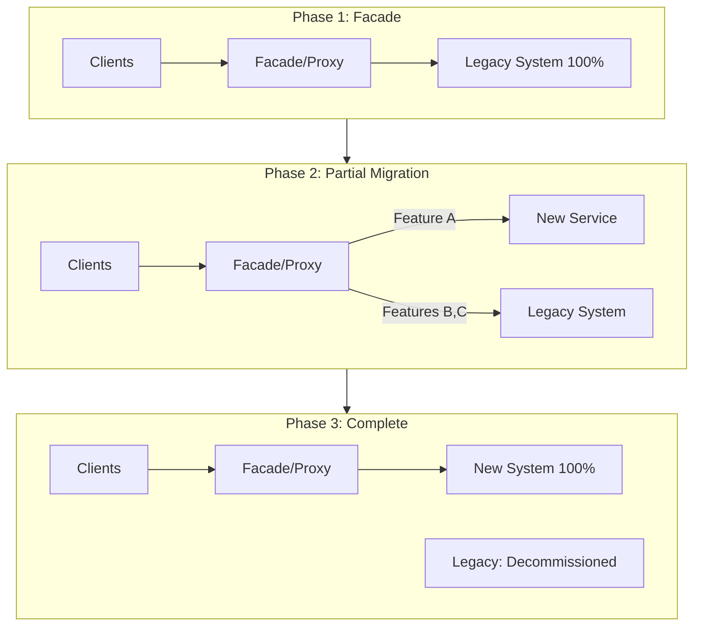
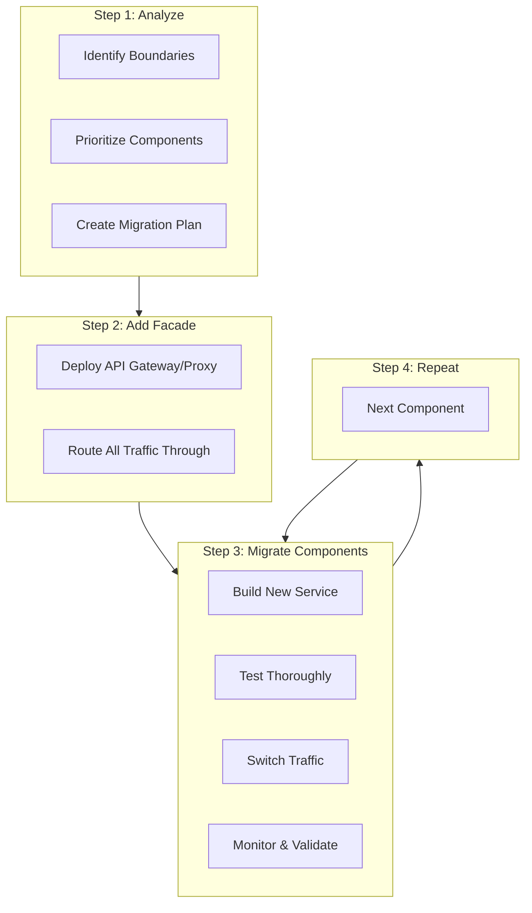
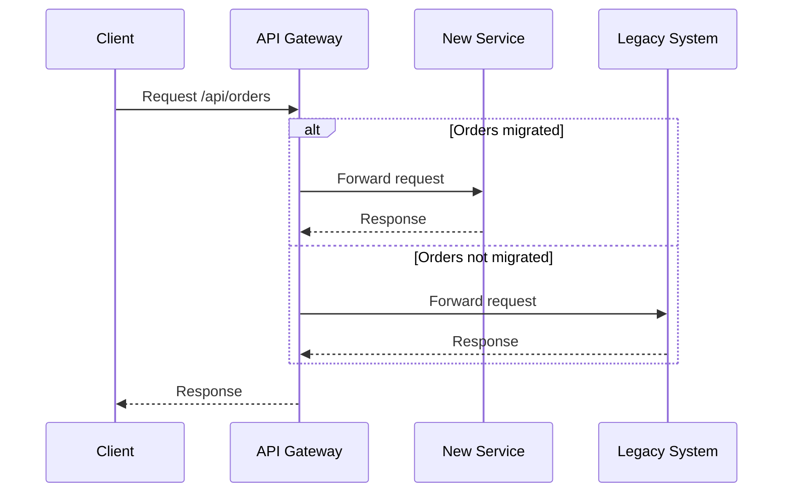
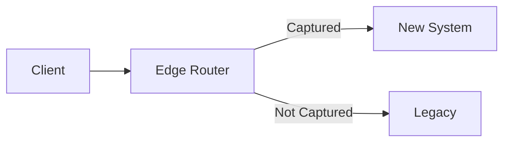
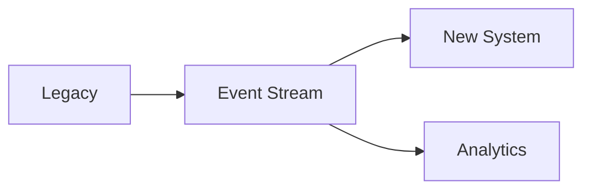

# Strangler Fig Pattern

## Overview

The **Strangler Fig Pattern** incrementally migrates a legacy system to a new architecture by gradually replacing specific pieces of functionality. Named after strangler fig trees that grow around host trees, the new system grows alongside the old one until it completely replaces it.



---

## Why Use It

### Problems It Solves

1. **Big-bang rewrites fail**: Complete rewrites are risky and often fail
2. **Can't stop the world**: Business must continue during migration
3. **Unknown unknowns**: Legacy systems have hidden complexity
4. **Resource constraints**: Can't rebuild everything at once
5. **Risk management**: Need to validate new system incrementally

### Key Benefits

- **Incremental migration** - Migrate piece by piece
- **Reduced risk** - Each piece is independently validated
- **Continuous delivery** - Keep delivering features
- **Rollback capability** - Revert specific components
- **Learning** - Understand legacy as you migrate

---

## When to Use

| Use Case | Why Strangler Works Well |
|----------|-------------------------|
| Monolith to microservices | Gradual decomposition |
| Legacy modernization | Reduce risk of rewrite |
| Technology migration | Replace tech stack incrementally |
| Platform migration | Move to cloud piece by piece |
| Vendor replacement | Replace third-party systems |

---

## When NOT to Use

| Scenario | Alternative |
|----------|-------------|
| Small, simple system | Direct rewrite may be faster |
| Complete replacement needed | Big-bang with parallel run |
| No clear boundaries | Refactor first |
| Legacy is truly legacy | May not be worth migrating |

---

## How It Works

### Migration Strategy



### Traffic Routing



---

## Pros and Cons

### Pros

| Advantage | Description |
|-----------|-------------|
| **Low risk** | Migrate incrementally |
| **Continuous operation** | No downtime |
| **Validate early** | Test new system with real traffic |
| **Rollback** | Revert individual components |
| **Learn as you go** | Understand legacy incrementally |

### Cons

| Disadvantage | Mitigation |
|--------------|------------|
| **Longer timeline** | Plan for extended migration |
| **Dual maintenance** | Minimize overlap period |
| **Integration complexity** | Clear contracts between systems |
| **Facade overhead** | Optimize routing layer |

---

## Implementation Example

### API Gateway Routing (Kong/NGINX)

```yaml
# Kong declarative config
services:
  # New order service (migrated)
  - name: orders-new
    url: http://orders-service:8080
    routes:
      - name: orders-api
        paths:
          - /api/v1/orders
        strip_path: false

  # Legacy system (not yet migrated)
  - name: legacy-monolith
    url: http://legacy-app:8080
    routes:
      - name: legacy-users
        paths:
          - /api/v1/users
      - name: legacy-products
        paths:
          - /api/v1/products
      - name: legacy-catch-all
        paths:
          - /api/v1
        strip_path: false
```

### Python Facade Service

```python
from fastapi import FastAPI, Request, HTTPException
import httpx
from typing import Dict

app = FastAPI(title="Strangler Facade")

# Migration configuration
ROUTE_CONFIG: Dict[str, str] = {
    # Migrated endpoints -> new services
    '/api/orders': 'http://orders-service:8080',
    '/api/inventory': 'http://inventory-service:8080',

    # Not yet migrated -> legacy
    '/api/users': 'http://legacy-monolith:8080',
    '/api/products': 'http://legacy-monolith:8080',
    '/api/reports': 'http://legacy-monolith:8080',
}

DEFAULT_BACKEND = 'http://legacy-monolith:8080'

def get_backend(path: str) -> str:
    """Determine which backend handles this path."""
    for prefix, backend in ROUTE_CONFIG.items():
        if path.startswith(prefix):
            return backend
    return DEFAULT_BACKEND

@app.api_route("/{path:path}", methods=["GET", "POST", "PUT", "DELETE", "PATCH"])
async def proxy(request: Request, path: str):
    backend = get_backend(f"/{path}")

    # Forward request
    async with httpx.AsyncClient() as client:
        url = f"{backend}/{path}"

        response = await client.request(
            method=request.method,
            url=url,
            headers=dict(request.headers),
            params=dict(request.query_params),
            content=await request.body()
        )

        return Response(
            content=response.content,
            status_code=response.status_code,
            headers=dict(response.headers)
        )

# Feature flag integration for gradual migration
from feature_flags import flag_client

@app.api_route("/api/orders/{order_id}", methods=["GET"])
async def get_order(request: Request, order_id: str):
    user_id = request.headers.get('X-User-ID')

    # Gradually migrate users to new service
    if flag_client.is_enabled('new_orders_service', user_id):
        backend = 'http://orders-service:8080'
    else:
        backend = 'http://legacy-monolith:8080'

    async with httpx.AsyncClient() as client:
        response = await client.get(f"{backend}/api/orders/{order_id}")
        return response.json()
```

### Data Synchronization

```python
# Sync data from legacy to new system during migration
class DataSynchronizer:
    def __init__(self, legacy_db, new_db, event_bus):
        self.legacy_db = legacy_db
        self.new_db = new_db
        self.event_bus = event_bus

    async def sync_order(self, order_id: str):
        """Sync order from legacy to new system."""
        # Read from legacy
        legacy_order = await self.legacy_db.get_order(order_id)

        # Transform to new schema
        new_order = self.transform_order(legacy_order)

        # Write to new system
        await self.new_db.upsert_order(new_order)

    def transform_order(self, legacy_order: dict) -> dict:
        """Transform legacy schema to new schema."""
        return {
            'id': legacy_order['ORDER_ID'],
            'customer_id': legacy_order['CUST_ID'],
            'items': self._parse_items(legacy_order['ITEMS_XML']),
            'total': float(legacy_order['TOTAL_AMT']),
            'status': self._map_status(legacy_order['STATUS_CODE']),
            'created_at': legacy_order['CREATE_DT'],
        }

    async def enable_dual_write(self):
        """Write to both systems during migration."""
        @self.event_bus.subscribe('order.created')
        async def on_order_created(event):
            # Write to legacy (source of truth)
            await self.legacy_db.create_order(event.data)

            # Also write to new system
            new_order = self.transform_order(event.data)
            await self.new_db.create_order(new_order)

# Migration phases
class MigrationPhase:
    LEGACY_ONLY = 1      # All reads/writes to legacy
    DUAL_WRITE = 2       # Write to both, read from legacy
    SHADOW_READ = 3      # Write to both, read from new (compare)
    NEW_PRIMARY = 4      # Write to both, read from new
    NEW_ONLY = 5         # Migrated - legacy decommissioned
```

### Migration Checklist

```python
@dataclass
class ComponentMigration:
    name: str
    status: str  # 'not_started', 'in_progress', 'completed'
    legacy_endpoint: str
    new_endpoint: str
    traffic_percentage: int
    rollback_plan: str

    def is_ready_for_traffic(self) -> bool:
        return all([
            self.new_endpoint_healthy(),
            self.data_synced(),
            self.integration_tests_pass(),
            self.performance_acceptable()
        ])

    def increase_traffic(self, increment: int = 10):
        if self.is_ready_for_traffic():
            self.traffic_percentage = min(100, self.traffic_percentage + increment)

    def rollback(self):
        self.traffic_percentage = 0
        # Execute rollback plan
```

---

## Migration Patterns

### Asset Capture

Intercept calls at the edge and route to new or old system.



### Event Interception

Capture events from legacy and replay to new system.



---

## Real-World Examples

| Company | Migration |
|---------|-----------|
| **Amazon** | Monolith to microservices over years |
| **Shopify** | Ruby monolith decomposition |
| **Spotify** | Backend modernization |
| **Netflix** | Data center to cloud |

---

## Related Patterns

- [Feature Flags](./feature-flags.md) - Control migration routing
- [API Gateway](../02-api-gateway-patterns/api-gateway.md) - Facade layer
- [Database Per Service](./database-per-service.md) - Data separation
- [Event-Driven](../05-messaging-patterns/event-driven-architecture.md) - Data sync

---

## Further Reading

- [Strangler Fig - Martin Fowler](https://martinfowler.com/bliki/StranglerFigApplication.html)
- [Monolith to Microservices - Sam Newman](https://samnewman.io/books/monolith-to-microservices/)
- [AWS Migration Strategies](https://aws.amazon.com/cloud-migration/)
