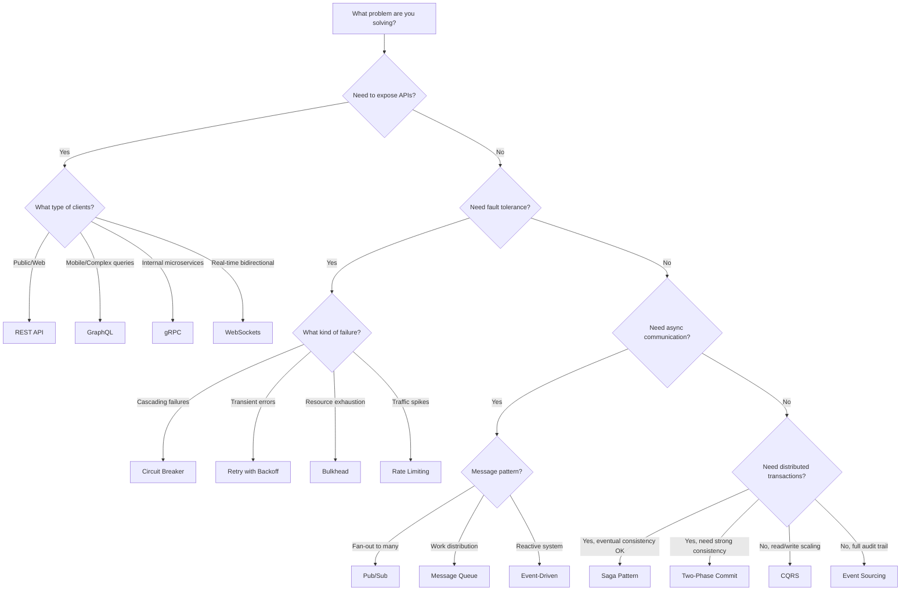
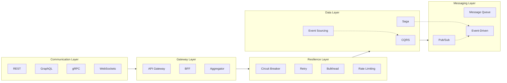

# Distributed System Architectural Patterns

A comprehensive reference guide for distributed system API architectural patterns, organized into 6 main categories with detailed documentation, diagrams, and decision frameworks.

## Quick Navigation

| Category | Patterns | Focus Area |
|----------|----------|------------|
| [API Communication Styles](./01-api-communication-styles/) | REST, GraphQL, gRPC, WebSockets | How services communicate |
| [API Gateway Patterns](./02-api-gateway-patterns/) | API Gateway, BFF, Aggregator | Entry points and routing |
| [Resilience Patterns](./03-resilience-patterns/) | Circuit Breaker, Retry, Bulkhead, Rate Limiting, Timeout | Fault tolerance |
| [Data Patterns](./04-data-patterns/) | CQRS, Event Sourcing, Saga, 2PC, Outbox | Data management and consistency |
| [Messaging Patterns](./05-messaging-patterns/) | Pub/Sub, Message Queue, Event-Driven | Asynchronous communication |
| [Service Discovery & Mesh](./06-service-discovery-mesh/) | Service Registry, Sidecar, Service Mesh | Service orchestration |

---

## Pattern Decision Flowchart

Use this flowchart to help select the right pattern for your use case:

---

## Pattern Categories Overview

### 1. API Communication Styles

Choose how your services will communicate with each other and with clients.

| Pattern | Best For | Key Trade-off |
|---------|----------|---------------|
| **REST** | CRUD operations, public APIs | Simplicity vs over/under-fetching |
| **GraphQL** | Complex data requirements, mobile apps | Flexibility vs caching complexity |
| **gRPC** | Internal microservices, high performance | Speed vs browser support |
| **WebSockets** | Real-time bidirectional communication | Low latency vs connection overhead |

### 2. API Gateway Patterns

Manage how clients access your microservices ecosystem.

| Pattern | Best For | Key Trade-off |
|---------|----------|---------------|
| **API Gateway** | Centralized entry point, cross-cutting concerns | Single entry vs single point of failure |
| **Backend for Frontend (BFF)** | Multi-platform clients (web, mobile, IoT) | Optimized UX vs code duplication |
| **Aggregator** | Composite responses from multiple services | Reduced round trips vs complexity |

### 3. Resilience Patterns

Build systems that gracefully handle failures.

| Pattern | Best For | Key Trade-off |
|---------|----------|---------------|
| **Circuit Breaker** | Preventing cascading failures | Fail-fast vs implementation complexity |
| **Retry with Backoff** | Handling transient failures | Improved reliability vs thundering herd |
| **Bulkhead** | Isolating resource pools | Fault isolation vs resource underutilization |
| **Rate Limiting** | Protecting against traffic spikes | System protection vs user experience |
| **Timeout** | Preventing hung connections | Responsiveness vs false positives |

### 4. Data Patterns

Handle data consistency and state management in distributed systems.

| Pattern | Best For | Key Trade-off |
|---------|----------|---------------|
| **CQRS** | Separate read/write scaling | Performance optimization vs complexity |
| **Event Sourcing** | Audit trails, temporal queries, replay | Complete history vs storage/complexity |
| **Saga** | Long-running distributed transactions | Eventual consistency vs coordination overhead |
| **Outbox** | Reliable event publishing | Guaranteed delivery vs at-least-once semantics |
| **Two-Phase Commit** | Strong consistency requirements | ACID guarantees vs availability |

### 5. Messaging Patterns

Enable asynchronous and decoupled communication.

| Pattern | Best For | Key Trade-off |
|---------|----------|---------------|
| **Pub/Sub** | Fan-out notifications, event broadcasting | Decoupling vs message ordering |
| **Message Queue** | Work distribution, load leveling | Reliability vs latency |
| **Event-Driven Architecture** | Reactive systems, loose coupling | Flexibility vs debugging complexity |

### 6. Service Discovery & Mesh

Manage service-to-service communication at scale.

| Pattern | Best For | Key Trade-off |
|---------|----------|---------------|
| **Service Registry** | Dynamic service discovery | Flexibility vs additional infrastructure |
| **Sidecar** | Cross-cutting concerns (logging, auth) | Separation of concerns vs resource overhead |
| **Service Mesh** | Complex microservices observability | Full observability vs operational complexity |

---

## How to Use This Guide

Each pattern document follows a consistent structure:

1. **Overview** - What the pattern is and the problem it solves
2. **Why Use It** - Motivation and benefits
3. **When to Use** - Ideal scenarios and use cases
4. **When NOT to Use** - Anti-patterns and bad fits
5. **How It Works** - Architecture diagram (Mermaid)
6. **Pros and Cons** - Detailed trade-off analysis
7. **Implementation Example** - Code snippets
8. **Real-World Examples** - Companies/systems using this pattern
9. **Related Patterns** - Links to complementary or alternative patterns

---

## Pattern Relationships

---

## Quick Reference: When to Use What

| Scenario | Recommended Pattern(s) |
|----------|----------------------|
| Building a public API | REST + API Gateway + Rate Limiting |
| Mobile app with complex data needs | GraphQL + BFF |
| High-performance internal services | gRPC + Service Mesh |
| Real-time features (chat, notifications) | WebSockets + Pub/Sub |
| E-commerce checkout | Saga + Event-Driven |
| Financial audit requirements | Event Sourcing + CQRS |
| Microservices resilience | Circuit Breaker + Retry + Bulkhead |
| Multi-tenant SaaS | Rate Limiting + Bulkhead |

---

## Contributing

When adding new patterns, ensure they follow the standard document structure and include:
- Mermaid diagrams for visual explanation
- Practical code examples
- Real-world use cases
- Clear pros/cons analysis

## License

This documentation is part of the system-design repository.
