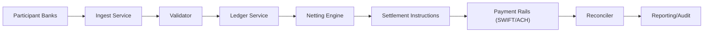

# Financial Clearing House

A complete implementation of an interbank clearing house system demonstrating:

1. **Pairwise Balance Calculation** - Calculate net balances between each pair of banks
2. **Multilateral Netting** - Minimize the number of actual money movements using graph-based optimization
3. **System Design** - Scalable architecture for handling billions of transactions

## Problem Statement

Given a collection of checks/transactions between banks:
- Calculate the credit/debit balances for each bank at the end of the day
- Find the minimum number of money movements necessary to settle all balances
- Design for scale, fault tolerance, and security

## Implementations

Both implementations produce identical results and demonstrate the same algorithms.

### Python Implementation

```bash
cd financial-clearing-house/src/python
python3 demo.py
```

**Files:**
- `models.py` - Domain models (Transaction, Bank, SettlementInstruction)
- `pairwise_calculator.py` - Part 1: Calculate pairwise balances between banks
- `netting_engine.py` - Part 2: Graph-based transaction optimization
- `clearing_house.py` - Main orchestrator combining both parts
- `demo.py` - Complete demonstration script

### Java Implementation

```bash
cd financial-clearing-house

# Compile
mkdir -p target
find src/java -name "*.java" | xargs javac -d target

# Run
java -cp target com.clearinghouse.SettlementApp
```

**Files:**
- `src/java/com/clearinghouse/model/` - Domain models
  - `Transaction.java` - Immutable transaction record
  - `Bank.java` - Participant bank
  - `SettlementInstruction.java` - Generated settlement instruction
  - `PairwiseKey.java` - Canonical bank pair key
- `src/java/com/clearinghouse/service/` - Business logic
  - `PairwiseBalanceCalculator.java` - Pairwise balance calculation
  - `NettingEngine.java` - Multilateral netting with greedy matching
  - `TransactionValidator.java` - Transaction validation
- `src/java/com/clearinghouse/SettlementApp.java` - Demo entry point

## Sample Output

```
Input Transactions (9 total):
  1. Chase → BoA: $132
  2. Chase → BoA: $827
  3. BoA → Wells Fargo: $751
  4. Chase → BoA: $585
  5. Wells Fargo → Chase: $877
  6. Chase → Wells Fargo: $157
  7. Chase → Wells Fargo: $904
  8. Wells Fargo → Chase: $548
  9. BoA → Chase: $976

Part 1 - Pairwise Balances:
  (BoA, Chase): -568      → Chase owes BoA $568
  (BoA, Wells Fargo): 751 → BoA owes Wells Fargo $751
  (Chase, Wells Fargo): -364 → Wells Fargo owes Chase $364

Part 2 - Optimized Settlements (2 transfers instead of 9):
  1. Chase pays Wells Fargo: $204
  2. BoA pays Wells Fargo: $183

Statistics:
  Gross Volume: $5,757
  Net Volume: $387
  Netting Efficiency: 93.3%
  Transfers Saved: 7
```

## Algorithm Details

### Part 1: Pairwise Balance Calculation

For each pair of banks (A, B) where A < B alphabetically:
- Process each transaction and update the balance
- Positive balance = A owes B
- Negative balance = B owes A

**Time Complexity:** O(T) where T = number of transactions

### Part 2: Multilateral Netting

Uses a greedy creditor-debtor matching algorithm:

1. Calculate net position per bank (sum of all inflows - outflows)
2. Partition banks into creditors (positive) and debtors (negative)
3. Use max-heaps to always match the largest creditor with largest debtor
4. Generate settlement instruction for min(credit, debt)
5. Repeat until all positions are zero

**Time Complexity:** O(T + N log N) where N = number of banks

**Optimality:** Produces exactly N-1 transfers for N banks with non-zero positions (optimal for fee-less transfers).

## Architecture

See [clearing-house-settlement-design.md](clearing-house-settlement-design.md) for detailed architecture covering:

- Domain model and data flows
- Multilateral netting algorithm
- System architecture (services, data stores)
- Batch vs real-time processing
- Failure handling (API downtime, late transactions, bounced checks)
- Exactly-once settlement guarantees
- Horizontal scaling strategy
- Security and compliance (AML, audit trails, encryption)
- Live balance queries

### High-Level System Flow



## Key Design Decisions

| Decision | Choice | Rationale |
|----------|--------|-----------|
| Amount representation | `Decimal`/`BigDecimal` | Avoid floating-point errors in financial calculations |
| Transaction model | Immutable | Audit trail, thread safety, idempotency |
| Netting algorithm | Greedy heap-based | O(N log N), optimal transfer count, deterministic |
| Pairwise key | Alphabetical order | Consistent direction, easy lookup |
| Settlement execution | Two-phase with saga | Exactly-once guarantees, resumable on failure |

## Extensions

Future enhancements could include:

1. **Multi-currency support** - Separate netting per currency
2. **Fee optimization** - Min-cost flow instead of greedy when rail fees differ
3. **Liquidity management** - Real-time position limits and alerts
4. **API gateway** - REST/gRPC endpoints for bank integration
5. **Streaming mode** - Micro-batch processing for near-real-time settlement

## License

MIT
