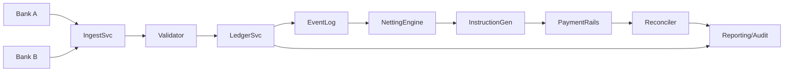

# Clearing House Settlement Design (Java-Oriented)

## 1) Domain model and I/O
- Bank: `bankId`, name, BIC/RTN, status.
- Transaction: immutable; `txnId`, `payerBankId`, `payeeBankId`, `amount` (minor units), `currency`, `valueDate`, `ingestTs`, `channel`, `signature`, `status` (ingested/validated/posted/rejected). Amount must be > 0.
- LedgerEntry (double-entry): debit to payer, credit to payee; links to `txnId`.
- SettlementBatch: collection for a cut-off (e.g., T+0 EOD); contains source transactions, per-bank net positions, generated settlement instructions, hashes, signatures.
- NetPosition: per bank, `netAmount` (credit +, debit -) for a currency/batch.
- SettlementInstruction: payer, payee, amount, currency, reference to batch; signed for downstream rails (RTGS/ACH/wire).
- Invariants: no self-pay; currency-consistent batch; all entries balanced; idempotent txn ingestion by `txnId`; batches are append-only (never mutate, only supersede via adjustments).
- I/O: Input = stream/batch of transactions; Output = minimal set of interbank payments (netted) + audit artifacts (hashes, reports, reconciliations).

## 2) Multilateral netting algorithm
Goal: compute minimal transfers to settle all banks for a cut-off.

Steps (per currency, per batch):
1) Validate & normalize transactions (schema, signatures, AML/KYC hooks, duplicate `txnId` drop).
2) Accumulate per-bank net: `net[bank] += amount` for payee, `net[bank] -= amount` for payer.
3) Partition into creditors (net > 0) and debtors (net < 0). Sum(creditors) = -Sum(debtors) by invariants.
4) Greedy settlement (minimizes transfer count to O(N)):
   - Sort creditors by descending net, debtors by ascending (most negative).
   - While both non-empty: match top creditor c and debtor d; `x = min(c.net, -d.net)`; emit instruction d -> c for x; decrease positions; pop any zeroed side.
   - Complexity: O(N log N) for sorting, O(N) matching; optimal for minimizing number of edges when no fees; for cost-aware rails, replace with min-cost flow on bipartite graph.
5) Produce `SettlementInstruction` list; persist batch hash over transactions + instructions; sign.
6) Optional: detect circularity reduction example: A owes B, B owes C; algorithm will directly net A -> C.

Correctness & safety:
- Idempotent recompute: deterministic given sorted input + tie-breaker.
- All balances zero after applying instructions.
- Supports re-run with same seed to ensure reproducibility.

## 3) System architecture (EOD batch, Java stack)
Services (logical):
- Ingest Service (REST/ISO 20022/CSV/queue) -> writes raw to append-only log (Kafka/Pulsar) and object store for audit.
- Validator/Normalizer -> schema, signatures, sanctions/AML hooks, dedupe on `txnId`, publishes validated stream.
- Ledger Service -> persists double-entry (e.g., PostgreSQL or Cassandra with strict schema; also mirrors to Kafka for replay).
- Netting Engine -> triggered by cut-off; reads validated transactions snapshot (by offset/txn window), runs algorithm, writes `SettlementBatch`.
- Instruction Generator -> formats rails-specific messages (SWIFT, RTP, ACH) and signs.
- Reconciler -> consumes bank confirmations, compares expected vs actual, raises adjustments.
- Reporting/Audit -> immutable exports, hash chains per batch.

Data stores:
- Transaction/ledger DB (ACID, strong constraints) + append-only log for replay.
- Object store for raw files and signed reports.

Mermaid (data flow):

Deployment/ops:
- Prefer containerized services with horizontal scaling: Ingest/Validator scale with partitions; Netting Engine runs as batch job with exclusive lock per currency/batch.
- Use scheduler (Airflow/Temporal) to orchestrate cut-off, retries, and compensations.

## 4) Scale, security, compliance, fault tolerance
- Scale: partition streams by `bankId` or `txnId` hash; batch windows keyed by cut-off timestamp; snapshot via log offsets; avoid cross-partition joins in hot path.
- Idempotency: use deterministic `txnId`; upsert with ON CONFLICT DO NOTHING; batch recompute keyed by `(currency, cutOffAt, attempt)` plus hash.
- Concurrency: lock batch key to prevent double-settlement; optimistic concurrency on ledger writes.
- Fault tolerance: retries with backoff; poison-queue quarantines; checkpoint offsets; periodic state snapshots.
- DR: multi-AZ primary DB with PITR; cross-region async replica; object store versioning; tested backup/restore.
- Security: TLS everywhere; mTLS between services; HSM/KMS for signing keys; encrypt at rest (DB TDE, object store SSE); RBAC + least privilege; PII minimization; secure secrets (Vault/KMS).
- Compliance hooks: AML/sanctions screening; KYC preconditions (participant registry); audit logs (who/what/when, immutable); data retention/TTL per jurisdiction; GDPR export/delete for non-ledger PII; segregation of duties (ops vs dev vs auditor).
- Observability: metrics (throughput, lag, netting efficiency, reconciliation delta), structured logs, traces; SLOs on settlement timeliness and reconciliation success.

## 5) Testing and reconciliation
- Unit tests: transaction validation, ledger balancing, netting edge cases (all creditors/debtors zero, many small amounts).
- Property-based: sums of instructions zero all nets; idempotent recompute equals original.
- Simulation/replay: feed historical day into staging, verify hash of outputs.
- Chaos/failover: kill/restart Netting Engine mid-run with checkpoints; DB failover drills.
- Reconciliation: compare expected vs bank confirmations; generate adjustment batch for deltas; daily trial balance and hash chain verification.

## System flow (mermaid)

```mermaid
flowchart LR
  Banks[ParticipantBanks] --> Ingest[IngestService]
  Ingest --> RawLog[RawEventLog/Kafka]
  RawLog --> Validator[ValidatorNormalizer]
  Validator --> ValidLog[ValidatedStream]
  ValidLog --> Ledger[LedgerService]
  Ledger --> LedgerDB[LedgerDB]
  Ledger --> EventLog[EventLog/Kafka]
  EventLog --> CutoffScheduler[CutoffScheduler]
  CutoffScheduler --> Netting[NettingEngine]
  Netting --> BatchStore[BatchStore/ObjectStore]
  Netting --> InstrGen[InstructionGenerator]
  InstrGen --> PaymentRails["PaymentRails (SWIFT/ACH/RTP)"]
  PaymentRails --> Confirmations[BankConfirmations]
  Confirmations --> Reconciler[Reconciler]
  Reconciler --> Adjustments[AdjustmentBatch]
  Reconciler --> Reports[Reporting/Audit]
  LedgerDB --> Reports
  BatchStore --> Reports
  Reports --> Observability[Metrics/Logs/Trace]
```

