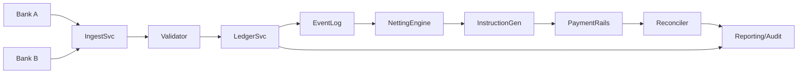
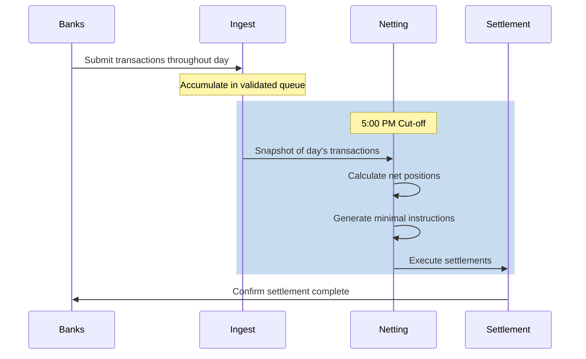
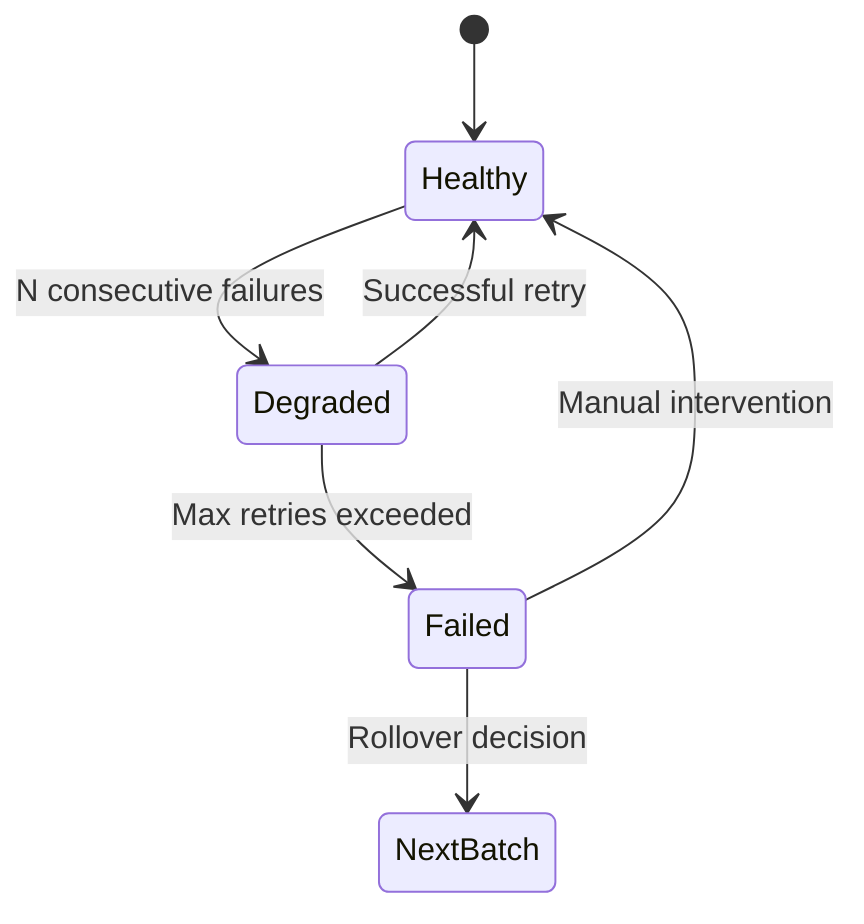
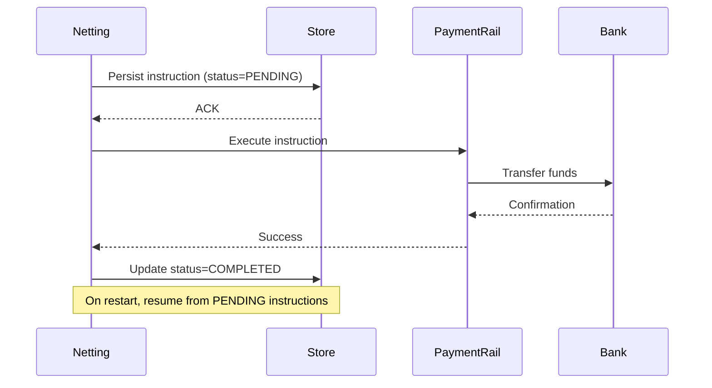
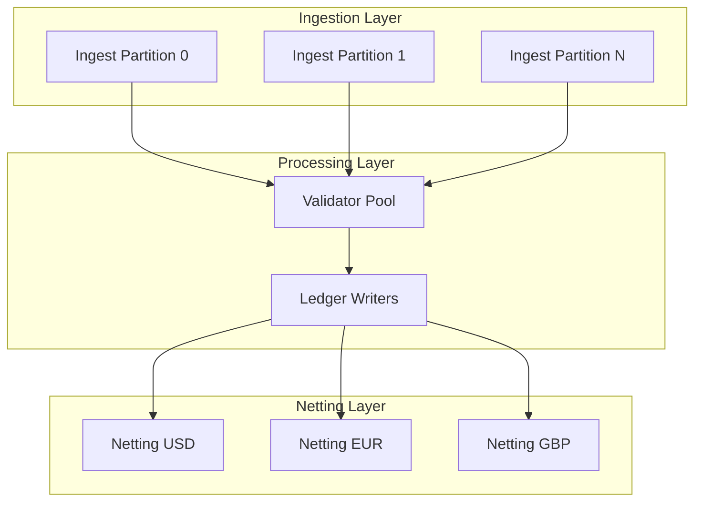

# Clearing House Settlement Design (Java-Oriented)

## 1) Domain model and I/O
- Bank: `bankId`, name, BIC/RTN, status.
- Transaction: immutable; `txnId`, `payerBankId`, `payeeBankId`, `amount` (minor units), `currency`, `valueDate`, `ingestTs`, `channel`, `signature`, `status` (ingested/validated/posted/rejected). Amount must be > 0.
- LedgerEntry (double-entry): debit to payer, credit to payee; links to `txnId`.
- SettlementBatch: collection for a cut-off (e.g., T+0 EOD); contains source transactions, per-bank net positions, generated settlement instructions, hashes, signatures.
- NetPosition: per bank, `netAmount` (credit +, debit -) for a currency/batch.
- SettlementInstruction: payer, payee, amount, currency, reference to batch; signed for downstream rails (RTGS/ACH/wire).
- Invariants: no self-pay; currency-consistent batch; all entries balanced; idempotent txn ingestion by `txnId`; batches are append-only (never mutate, only supersede via adjustments).
- I/O: Input = stream/batch of transactions; Output = minimal set of interbank payments (netted) + audit artifacts (hashes, reports, reconciliations).

## 2) Multilateral netting algorithm
Goal: compute minimal transfers to settle all banks for a cut-off.

Steps (per currency, per batch):
1) Validate & normalize transactions (schema, signatures, AML/KYC hooks, duplicate `txnId` drop).
2) Accumulate per-bank net: `net[bank] += amount` for payee, `net[bank] -= amount` for payer.
3) Partition into creditors (net > 0) and debtors (net < 0). Sum(creditors) = -Sum(debtors) by invariants.
4) Greedy settlement (minimizes transfer count to O(N)):
   - Sort creditors by descending net, debtors by ascending (most negative).
   - While both non-empty: match top creditor c and debtor d; `x = min(c.net, -d.net)`; emit instruction d -> c for x; decrease positions; pop any zeroed side.
   - Complexity: O(N log N) for sorting, O(N) matching; optimal for minimizing number of edges when no fees; for cost-aware rails, replace with min-cost flow on bipartite graph.
5) Produce `SettlementInstruction` list; persist batch hash over transactions + instructions; sign.
6) Optional: detect circularity reduction example: A owes B, B owes C; algorithm will directly net A -> C.

Correctness & safety:
- Idempotent recompute: deterministic given sorted input + tie-breaker.
- All balances zero after applying instructions.
- Supports re-run with same seed to ensure reproducibility.

## 3) System architecture (EOD batch, Java stack)
Services (logical):
- Ingest Service (REST/ISO 20022/CSV/queue) -> writes raw to append-only log (Kafka/Pulsar) and object store for audit.
- Validator/Normalizer -> schema, signatures, sanctions/AML hooks, dedupe on `txnId`, publishes validated stream.
- Ledger Service -> persists double-entry (e.g., PostgreSQL or Cassandra with strict schema; also mirrors to Kafka for replay).
- Netting Engine -> triggered by cut-off; reads validated transactions snapshot (by offset/txn window), runs algorithm, writes `SettlementBatch`.
- Instruction Generator -> formats rails-specific messages (SWIFT, RTP, ACH) and signs.
- Reconciler -> consumes bank confirmations, compares expected vs actual, raises adjustments.
- Reporting/Audit -> immutable exports, hash chains per batch.

Data stores:
- Transaction/ledger DB (ACID, strong constraints) + append-only log for replay.
- Object store for raw files and signed reports.

Mermaid (data flow):


Deployment/ops:
- Prefer containerized services with horizontal scaling: Ingest/Validator scale with partitions; Netting Engine runs as batch job with exclusive lock per currency/batch.
- Use scheduler (Airflow/Temporal) to orchestrate cut-off, retries, and compensations.

## 4) Scale, security, compliance, fault tolerance
- Scale: partition streams by `bankId` or `txnId` hash; batch windows keyed by cut-off timestamp; snapshot via log offsets; avoid cross-partition joins in hot path.
- Idempotency: use deterministic `txnId`; upsert with ON CONFLICT DO NOTHING; batch recompute keyed by `(currency, cutOffAt, attempt)` plus hash.
- Concurrency: lock batch key to prevent double-settlement; optimistic concurrency on ledger writes.
- Fault tolerance: retries with backoff; poison-queue quarantines; checkpoint offsets; periodic state snapshots.
- DR: multi-AZ primary DB with PITR; cross-region async replica; object store versioning; tested backup/restore.
- Security: TLS everywhere; mTLS between services; HSM/KMS for signing keys; encrypt at rest (DB TDE, object store SSE); RBAC + least privilege; PII minimization; secure secrets (Vault/KMS).
- Compliance hooks: AML/sanctions screening; KYC preconditions (participant registry); audit logs (who/what/when, immutable); data retention/TTL per jurisdiction; GDPR export/delete for non-ledger PII; segregation of duties (ops vs dev vs auditor).
- Observability: metrics (throughput, lag, netting efficiency, reconciliation delta), structured logs, traces; SLOs on settlement timeliness and reconciliation success.

## 5) Testing and reconciliation
- Unit tests: transaction validation, ledger balancing, netting edge cases (all creditors/debtors zero, many small amounts).
- Property-based: sums of instructions zero all nets; idempotent recompute equals original.
- Simulation/replay: feed historical day into staging, verify hash of outputs.
- Chaos/failover: kill/restart Netting Engine mid-run with checkpoints; DB failover drills.
- Reconciliation: compare expected vs bank confirmations; generate adjustment batch for deltas; daily trial balance and hash chain verification.

## System flow (mermaid)

```mermaid
flowchart LR
  Banks[ParticipantBanks] --> Ingest[IngestService]
  Ingest --> RawLog[RawEventLog/Kafka]
  RawLog --> Validator[ValidatorNormalizer]
  Validator --> ValidLog[ValidatedStream]
  ValidLog --> Ledger[LedgerService]
  Ledger --> LedgerDB[LedgerDB]
  Ledger --> EventLog[EventLog/Kafka]
  EventLog --> CutoffScheduler[CutoffScheduler]
  CutoffScheduler --> Netting[NettingEngine]
  Netting --> BatchStore[BatchStore/ObjectStore]
  Netting --> InstrGen[InstructionGenerator]
  InstrGen --> PaymentRails["PaymentRails (SWIFT/ACH/RTP)"]
  PaymentRails --> Confirmations[BankConfirmations]
  Confirmations --> Reconciler[Reconciler]
  Reconciler --> Adjustments[AdjustmentBatch]
  Reconciler --> Reports[Reporting/Audit]
  LedgerDB --> Reports
  BatchStore --> Reports
  Reports --> Observability[Metrics/Logs/Trace]
```


## 6) Batch vs Real-Time Processing

### End-of-Day (EOD) Batch Mode
Traditional clearing houses operate on EOD batch cycles:
- **Cut-off time**: Fixed deadline (e.g., 5:00 PM EST) after which no new transactions for the day are accepted.
- **Batch window**: Typically 1-4 hours for processing billions of transactions.
- **Benefits**: Simplifies reconciliation, maximizes netting efficiency, predictable resource usage.
- **Drawbacks**: Settlement delay (T+1 or T+0 EOD), liquidity locked until settlement.



### Real-Time / Streaming Mode
Modern systems can use micro-batching for near-real-time settlement:
- **Micro-batch windows**: Process every 15-60 seconds.
- **Streaming netting**: Maintain running net positions, emit delta instructions.
- **Benefits**: Faster settlement (seconds vs hours), reduced counterparty risk.
- **Complexity**: Requires handling late arrivals, out-of-order transactions, partial failures.

### Hybrid Approach
Recommended: Real-time position tracking with periodic settlement cycles.
- Track net positions in real-time for visibility and risk management.
- Execute actual settlements in configurable windows (hourly, per-shift, EOD).
- Support emergency intraday settlement for liquidity stress.

## 7) Failure Handling

### Bank API Downtime
When a bank's payment/withdrawal API is unavailable:

1. **Retry with exponential backoff**
   - Initial delay: 1 second
   - Max delay: 5 minutes
   - Max attempts: 10 over 30-minute window

2. **Circuit breaker pattern**
   - After N consecutive failures, mark bank as "degraded"
   - Queue settlement instructions for later retry
   - Alert operations team

3. **Fallback mechanisms**
   - Use backup payment rails (e.g., SWIFT if Fedwire down)
   - Manual intervention queue for critical settlements
   - Next-batch rollover for non-critical amounts



### Late Transactions
Transactions arriving after cut-off:

1. **Strict mode**: Reject with clear error, include in next batch.
2. **Grace period**: Allow 5-15 minute buffer for network delays.
3. **Amendment batch**: Process as separate mini-batch with reference to main batch.

### Check Bounces / NSF (Non-Sufficient Funds)
When a check bounces post-settlement:

1. **Detection**: Bank reports NSF via reconciliation feed.
2. **Reversal**: Generate reversal transaction in next batch.
3. **Adjustment**: Credit receiving bank, debit issuing bank.
4. **Audit trail**: Link reversal to original transaction ID.

### Network Failures and Lag
Handle network partitions and delayed messages:

1. **Idempotency keys**: Use `txnId` to deduplicate retransmissions.
2. **Timestamp windows**: Accept transactions within ±5 minute clock skew.
3. **Ordering guarantees**: Use sequence numbers per bank for ordering.
4. **Partition tolerance**: Each partition can process independently; merge at settlement.

## 8) Consistency Model

### Exactly-Once Settlement Guarantees
Critical: A settlement instruction must execute exactly once.

**Implementation:**
1. **Idempotency via instruction ID**
   - Each `SettlementInstruction` has unique `instructionId`
   - Payment rails deduplicate on this ID

2. **Two-phase execution**
   - Phase 1: Generate and persist instructions (durable)
   - Phase 2: Execute and confirm each instruction
   - Resumable from any failure point

3. **Saga pattern for multi-bank settlements**
   - Each settlement is a compensatable transaction
   - On failure, reverse completed instructions in order
   - Maintain saga state in durable storage



### Isolation Levels
- **Batch isolation**: Transactions in a batch are processed atomically.
- **Snapshot isolation**: Netting engine reads consistent snapshot of transactions.
- **Serializable settlement**: Only one settlement batch runs per currency at a time (distributed lock).

## 9) Horizontal Scaling Strategy

### Partitioning Scheme
Scale by partitioning on multiple dimensions:

1. **By Currency**: Independent netting per currency (USD, EUR, GBP).
2. **By Bank ID**: Shard transaction ingestion by `payerBankId % N`.
3. **By Time Window**: Parallel processing of different batches.



### Scaling Guidelines
| Component | Scaling Strategy | Target Throughput |
|-----------|-----------------|-------------------|
| Ingest API | Horizontal (stateless) | 100K TPS per node |
| Validator | Horizontal (stateless) | 50K TPS per node |
| Ledger DB | Vertical + read replicas | 1M writes/sec |
| Netting Engine | Vertical (single per currency) | 10M txns/batch |
| Event Log (Kafka) | Horizontal partitions | 1M events/sec |

### Processing Billions of Transactions
For 1B+ transactions/day:
1. **Streaming aggregation**: Maintain running net positions, don't re-scan all transactions.
2. **Incremental netting**: Process in chunks, merge results.
3. **Memory optimization**: Use primitive arrays vs objects for hot path.
4. **Pre-aggregation**: Banks submit hourly sub-totals alongside transaction details.

## 10) Security and Compliance Deep Dive

### Cryptographic Controls
1. **Transaction signing**: Banks sign each transaction with their private key (RSA-2048 or ECDSA P-256).
2. **Batch hashing**: SHA-256 hash chain of all transactions in batch for tamper detection.
3. **Settlement instruction signing**: HSM-backed signing for payment rail messages.
4. **Key management**: HSM/AWS CloudHSM for private keys; rotate annually.

### Access Control
```
┌────────────────────────────────────────────────────────────┐
│                     Access Control Matrix                  │
├─────────────────┬───────┬───────┬──────┬───────┬───────────┤
│ Resource        │ Admin │ Ops   │ Audit│ Bank  │ System    │
├─────────────────┼───────┼───────┼──────┼───────┼───────────┤
│ Submit Txn      │   -   │   -   │   -  │   W   │     W     │
│ View Positions  │   R   │   R   │   R  │ Own   │     R     │
│ Trigger Settle  │   -   │   X   │   -  │   -   │     X     │
│ View Audit Logs │   R   │   R   │   R  │   -   │     -     │
│ Modify Config   │   W   │   -   │   -  │   -   │     -     │
└─────────────────┴───────┴───────┴──────┴───────┴───────────┘
```

### Compliance Hooks
1. **AML/Sanctions Screening**
   - Screen all banks against OFAC, EU sanctions lists
   - Flag transactions above threshold for enhanced due diligence
   - Integrate with third-party AML providers (e.g., LexisNexis, Refinitiv)

2. **Regulatory Reporting**
   - Generate CFTC/SEC reports for derivatives clearing
   - SWIFT MT messages for cross-border settlements
   - Daily position reports to regulators

3. **Audit Trail Requirements**
   - Immutable log of all state changes
   - Who did what, when, from where (IP, user ID)
   - 7-year retention for financial records
   - Tamper-evident hash chains

### Data Residency
- Primary data in jurisdiction of operation
- Cross-border transactions may require dual storage
- GDPR compliance for EU bank data (right to erasure for non-ledger PII)

## 11) Live Balance Queries

### Real-Time Position API
Banks can query their current position at any time:

```
GET /api/v1/banks/{bankId}/position
Authorization: Bearer {token}

Response:
{
  "bankId": "BoA",
  "asOf": "2024-01-15T14:30:00Z",
  "positions": {
    "USD": {
      "pending": -183.00,      // Unsettled from current batch
      "settled": 0.00,         // Last settled amount
      "projected": -183.00     // Expected after next settlement
    }
  },
  "lastSettlementBatch": "batch-2024-01-14-eod",
  "nextSettlementAt": "2024-01-15T17:00:00Z"
}
```

### Historical Balance Query
```
GET /api/v1/banks/{bankId}/history?from=2024-01-01&to=2024-01-15

Response:
{
  "bankId": "BoA",
  "batches": [
    {
      "batchId": "batch-2024-01-14-eod",
      "settledAt": "2024-01-14T17:30:00Z",
      "netPosition": -450.00,
      "transactionCount": 127,
      "settlementInstructions": [...]
    }
  ]
}
```

### Implementation Notes
- Use materialized views or Redis cache for real-time queries
- Historical queries hit read replicas to avoid impacting write path
- Positions updated in real-time as transactions are validated
- WebSocket subscription available for live position updates

