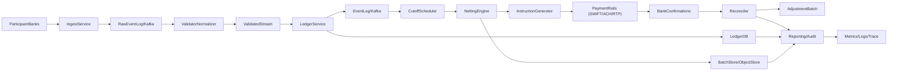

# Clearing House System Flow (Mermaid)

```mermaid
flowchart LR
  Banks[ParticipantBanks] --> Ingest[IngestService]
  Ingest --> RawLog[RawEventLog/Kafka]
  RawLog --> Validator[ValidatorNormalizer]
  Validator --> ValidLog[ValidatedStream]
  ValidLog --> Ledger[LedgerService]
  Ledger --> LedgerDB[LedgerDB]
  Ledger --> EventLog[EventLog/Kafka]
  EventLog --> CutoffScheduler[CutoffScheduler]
  CutoffScheduler --> Netting[NettingEngine]
  Netting --> BatchStore[BatchStore/ObjectStore]
  Netting --> InstrGen[InstructionGenerator]
  InstrGen --> PaymentRails["PaymentRails (SWIFT/ACH/RTP)"]
  PaymentRails --> Confirmations[BankConfirmations]
  Confirmations --> Reconciler[Reconciler]
  Reconciler --> Adjustments[AdjustmentBatch]
  Reconciler --> Reports[Reporting/Audit]
  LedgerDB --> Reports
  BatchStore --> Reports
  Reports --> Observability[Metrics/Logs/Trace]
```

