# Backend Engineering Productivity Metrics — Instant Grocery Delivery

**Context:** Blinkit-scale platform · 40 dark stores · 100k orders/day · 7 microservices
**Reference:** DORA State of DevOps · SPACE Framework (Forsgren et al.)

---

## The Four Layers of Productivity

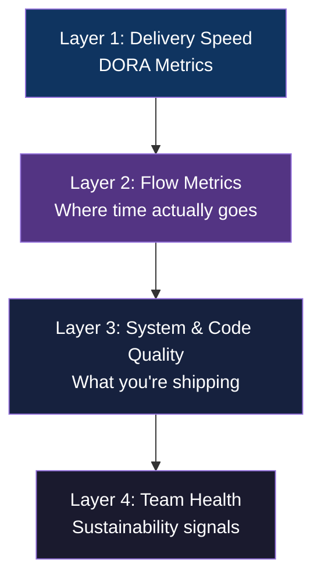

---

## Layer 1: DORA Metrics

The four metrics that predict both engineering performance and business outcomes.

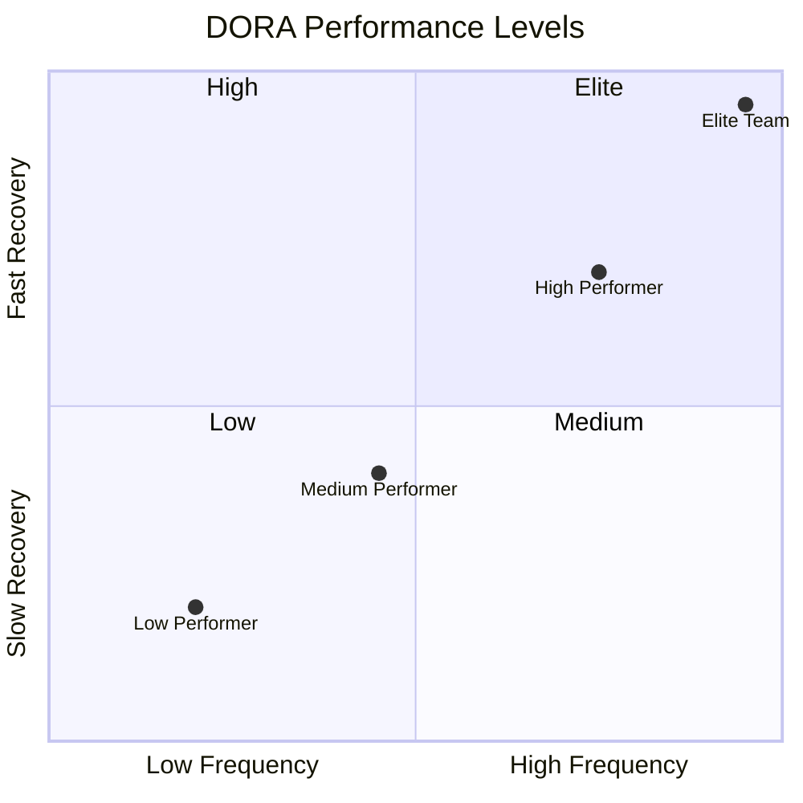

| Metric | What It Measures | Elite Benchmark | Red Flag |
|---|---|---|---|
| **Deployment Frequency** | How often each service ships to production | Multiple times/day per service | < once/month |
| **Lead Time for Changes** | Commit → production time | < 1 hour | > 1 month |
| **Change Failure Rate** | % of deploys causing incidents/rollbacks | < 5% | > 15% |
| **MTTR** | Time to restore service after failure | < 1 hour | > 1 week |

### Grocery Platform Context

At this scale, each of the 7 services should deploy independently:

| Service | Deploy Risk | Expected Frequency | Key Gate |
|---|---|---|---|
| Order Service | High — payment + inventory path | Daily with feature flags | All order placement tests green |
| Inventory Service | High — Redis + Kafka coupling | Daily | Lua script contract tests |
| Catalog Service | Low — read-heavy, cacheable | Multiple times/day | Search latency regression test |
| Dispatch Service | Medium — geospatial + Kafka | Daily | Rider assignment integration test |
| ETA Service | Low | Multiple times/day | ETA accuracy smoke test |
| Notification Service | Low — async, fire-and-forget | Multiple times/day | Delivery rate check |
| User Service | Low | Multiple times/day | Auth flow smoke test |

> Track DORA metrics **per service**, not fleet-wide. A slow Dispatch release cadence hidden behind a fast Catalog deploy is a risk signal.

---

## Layer 2: Flow Metrics — Where Work Gets Stuck

### PR Lifecycle Breakdown

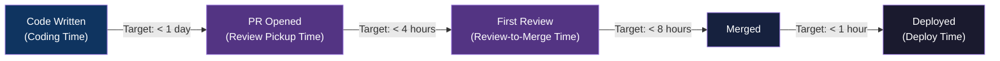

### Flow Metrics Reference

| Metric | Target | Red Flag | Notes |
|---|---|---|---|
| **Cycle Time** (PR open → deployed) | < 1 day | > 3 days | Measure per service |
| **PR Size** | < 400 lines | > 800 lines | Large PRs hide bugs in Kafka schema changes |
| **Review Pickup Time** | < 4 hours | > 24 hours | Blocks on-call rotation knowledge transfer |
| **Work In Progress per engineer** | ≤ 2 items | > 3 items | Microservice context switching is expensive |
| **Sprint Goal Attainment** | > 80% | < 60% two sprints in a row | Investigate unplanned work ratio |

### WIP vs Throughput

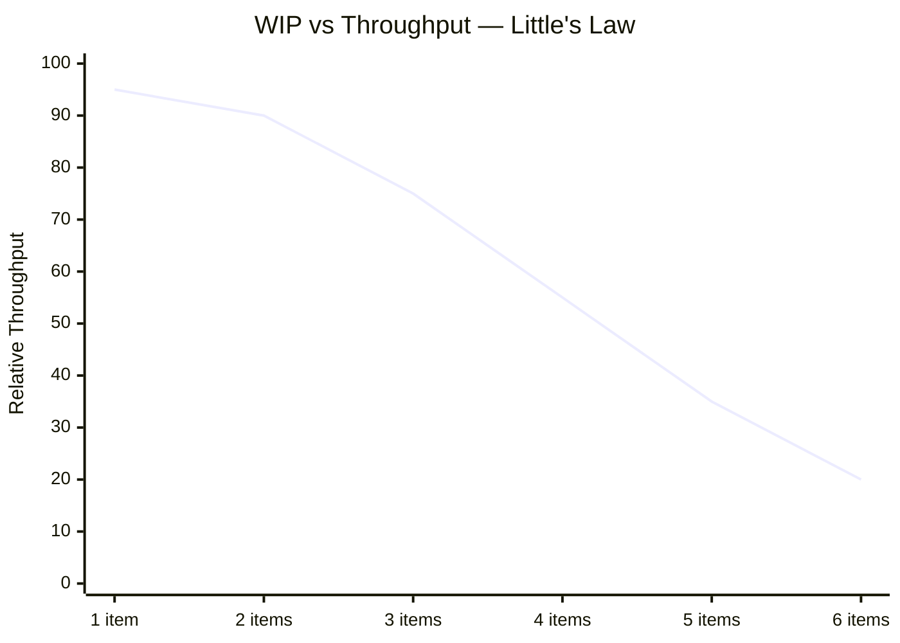

> Engineers switching between Order Service and Dispatch Service lose significant context. Prefer WIP=1 on high-risk services.

---

## Layer 3: System & Code Quality

### Pre-merge and Post-deploy Signals

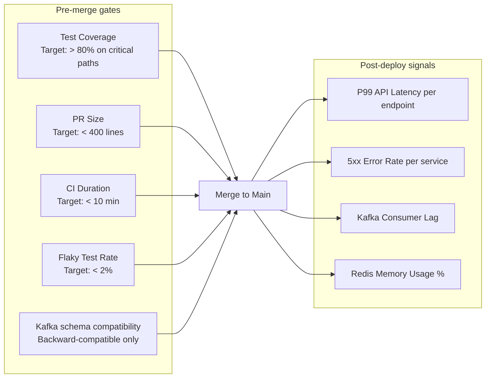

### Service-Specific SLA Targets

These come directly from the system design non-functional requirements. Any regression triggers a rollback.

| Service | Endpoint / Signal | SLA | Alert Threshold |
|---|---|---|---|
| Order Service | `POST /orders` p99 latency | < 500ms | > 800ms |
| Inventory Service | Reservation failure rate | < 1% | > 1% |
| Catalog Service | `GET /catalog/search` p99 latency | < 200ms | > 300ms |
| Catalog Service | `GET /catalog/autocomplete` p99 latency | < 10ms | > 25ms |
| Dispatch Service | Rider assignment p99 latency | < 2s | > 3s |
| Dispatch Service | Rider assignment success rate | > 95% | < 95% |
| ETA Service | Pre-checkout ETA p99 latency | < 100ms | > 150ms |
| All services | 5xx error rate | < 0.1% | > 0.5% |

### Kafka Consumer Health

Kafka lag is the most important operational signal after HTTP latency. Lag spikes directly degrade delivery SLA.

| Consumer Group | Topic | Lag Alert | Impact if breached |
|---|---|---|---|
| `dispatch-workers` | `order.placed` | > 500 msgs | Riders assigned late → SLA breach |
| `inventory-workers` | `order.delivered` | > 1,000 msgs | Stock counts drift from reality |
| `notification-workers` | `rider.assigned` | > 200 msgs | Customer not notified of rider |
| `analytics-pipeline` | `order.delivered` | > 10,000 msgs | Reporting lag — no operational impact |

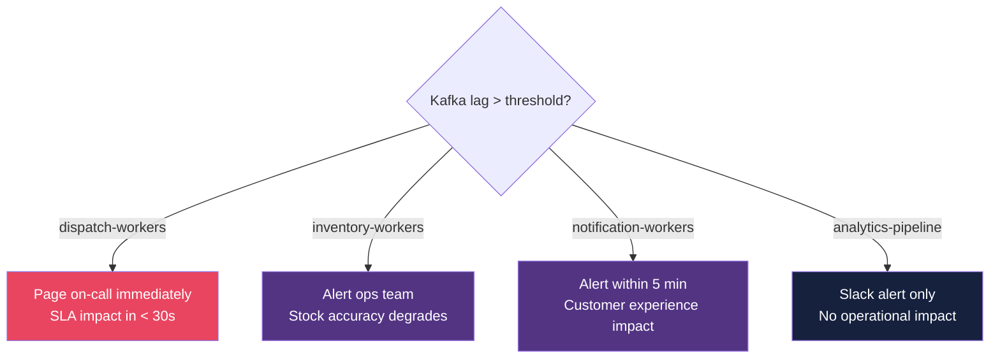

### Redis Health

| Signal | Alert Threshold | Action |
|---|---|---|
| `redis_memory_usage_pct` (Inventory) | > 80% | Scale Redis, audit key TTLs |
| `redis_memory_usage_pct` (ETA/GEO) | > 70% | Rider location data growing — check GPS update rate |
| Key eviction rate | > 0 evictions/min on Inventory Redis | **Page immediately** — oversell risk |
| Inventory Redis replication lag | > 1s | Check Sentinel, promote replica if needed |

> Set `maxmemory-policy noeviction` on the Inventory Redis instance. Silent key eviction = silent oversell.

---

## Layer 4: Team Health & Sustainability

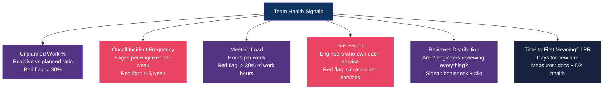

### Oncall Load by Team

At this scale, three teams share oncall responsibility:

| Team | Owns | Expected Incidents/Week | Red Flag |
|---|---|---|---|
| **Order Platform** | Order Service, Payment reconciliation | 2–4 | > 8/week |
| **Fulfillment** | Inventory Service, Dispatch Service, ETA | 3–6 | > 10/week |
| **Catalog & Search** | Catalog Service, Elasticsearch | 0–2 | > 5/week |

### Oncall Burnout Signal

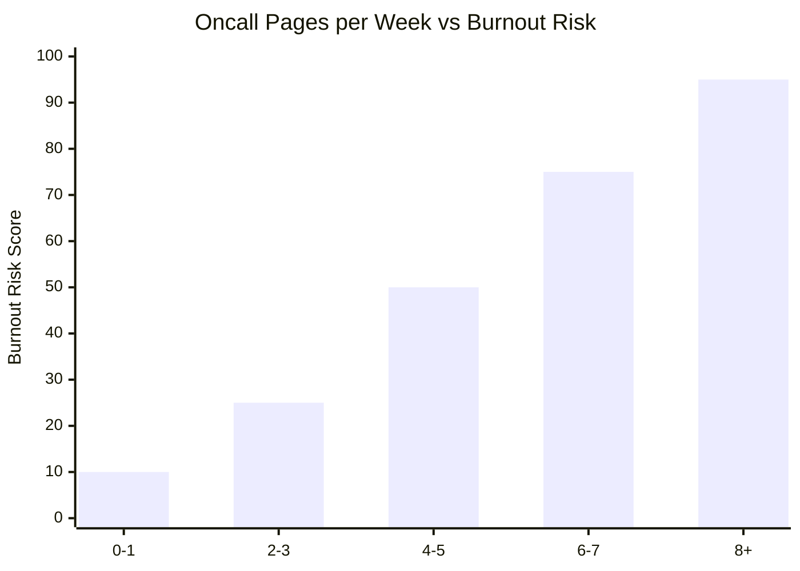

> Fulfillment team carries highest oncall burden. Protect them. If `orders_in_picking_gt_8min` > 5 becomes a weekly page, run a reliability sprint.

### Grocery Platform — Common Unplanned Work Sources

| Source | Typical % of sprint | Fix |
|---|---|---|
| Dark store network outages causing stuck orders | 5–10% | Offline-first tablet + ops auto-escalation |
| Rider GPS stale causing manual dispatch | 3–8% | Improve rider app reliability, STALE_GPS auto-recovery |
| Redis memory alerts during festive peaks | 2–5% | Pre-scale Redis before peak events |
| Elasticsearch index corruption (one store) | 1–3% | Blue/green alias pattern on index rebuild |
| Payment reconciliation job failures | 2–4% | Idempotent job + alerting at stuck PAYMENT_PENDING > 15 min |

---

## What NOT to Measure

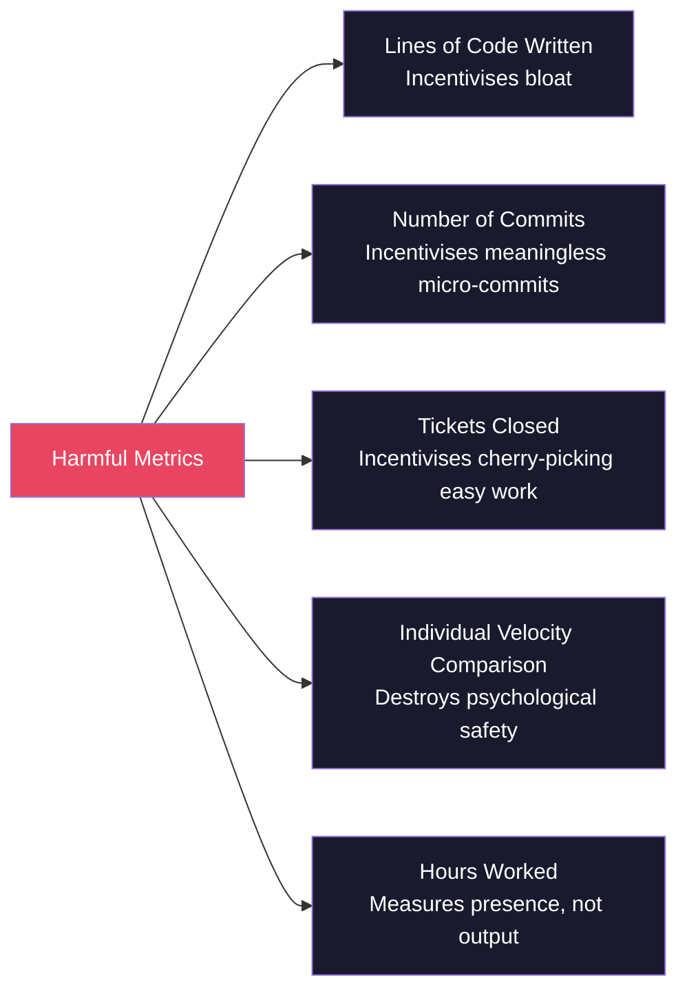

---

## The SPACE Framework Applied

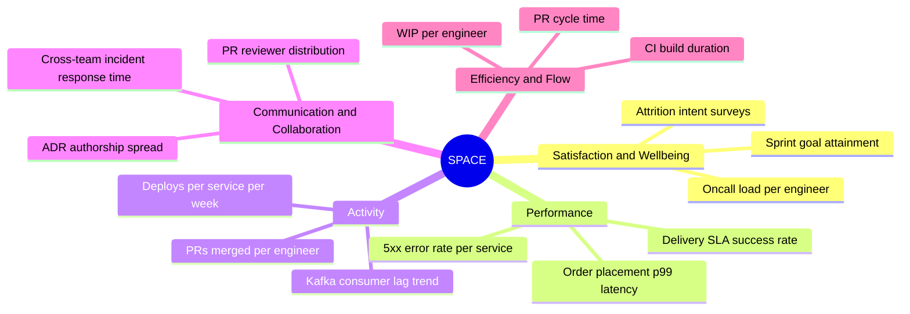

> No single metric captures productivity. For this platform, the most honest picture comes from: **DORA + SLA compliance + Kafka lag + oncall load**.

---

## Metrics Rollout Sequence

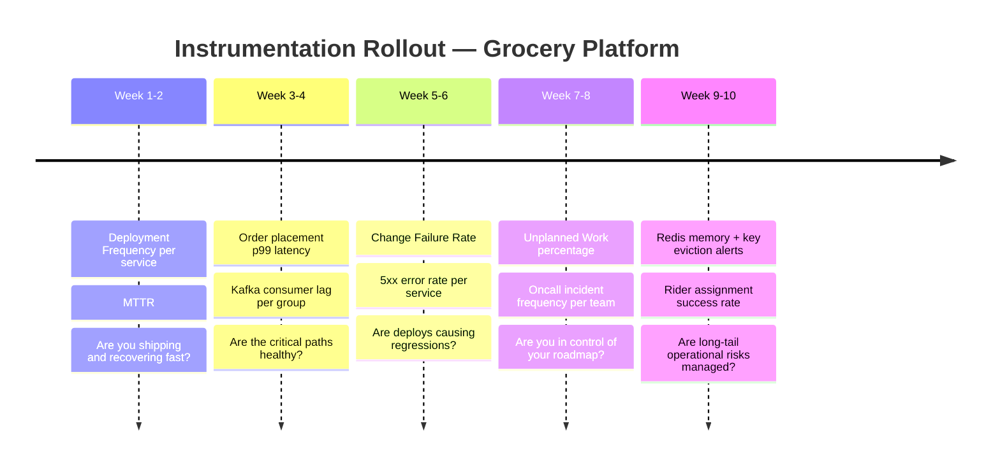

---

## Metric → Action Decision Tree

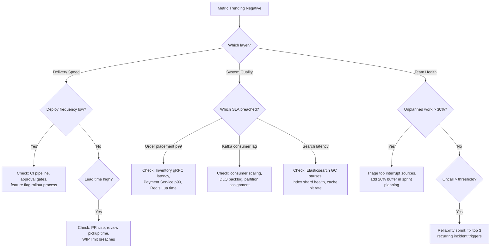

---

## Quick Reference Card

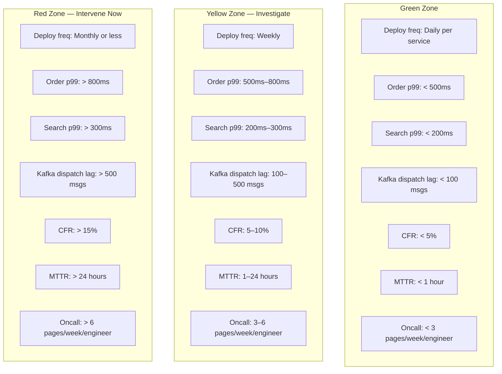

---

*Reference: DORA State of DevOps Report · SPACE Framework (Forsgren et al., 2021) · Flow Engineering · System design SLAs from `docs/plans/2026-02-22-instant-grocery-system-design.md`*
