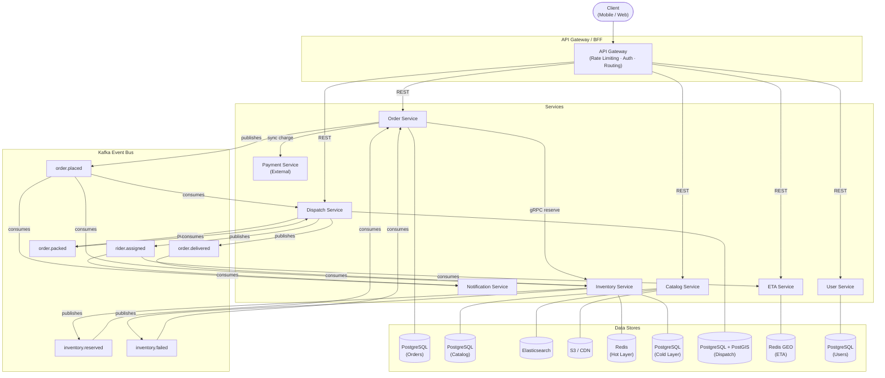
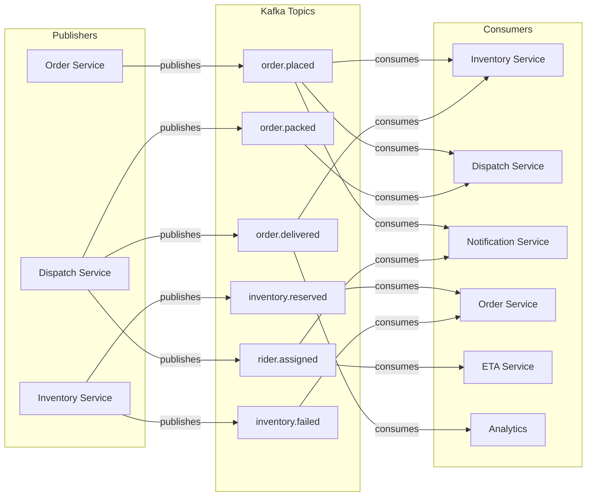
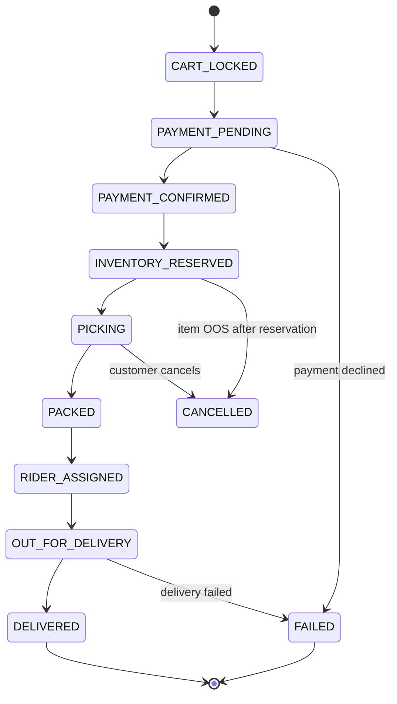
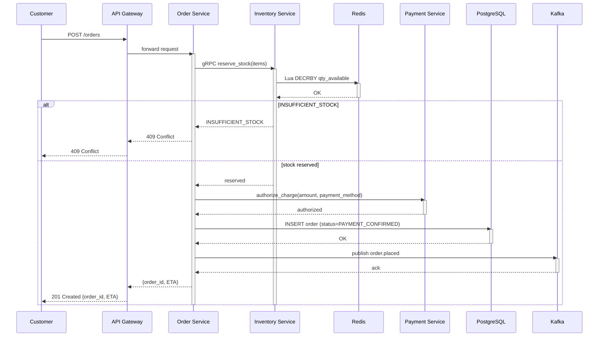
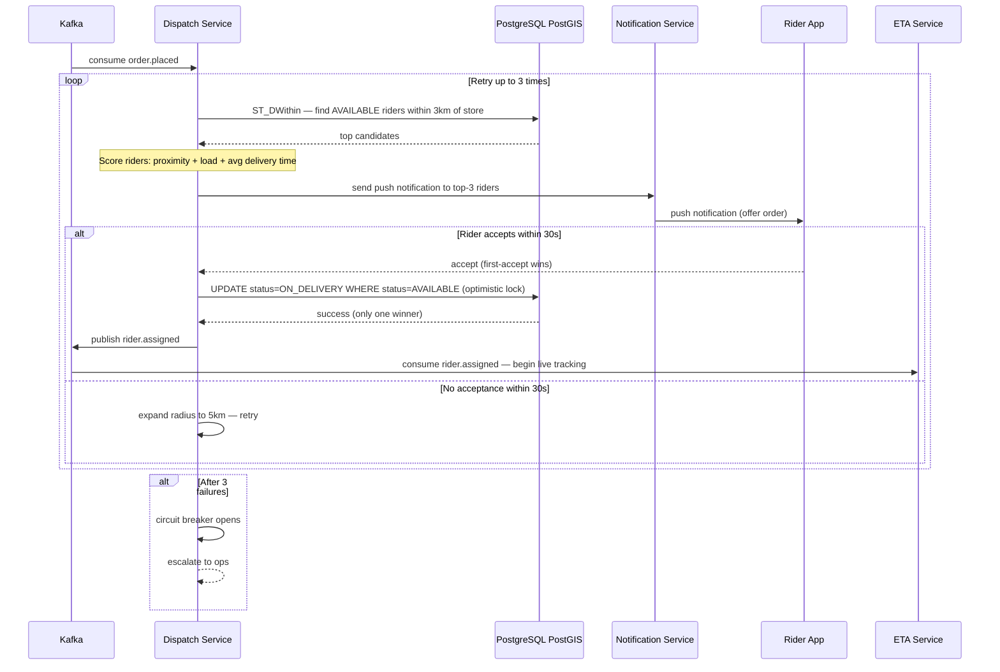
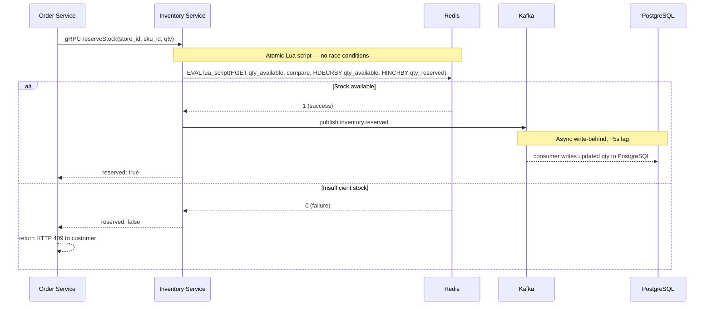
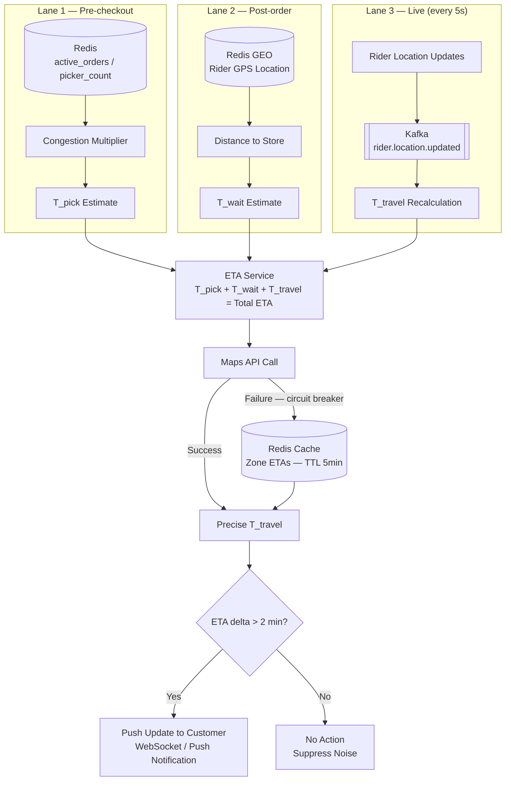
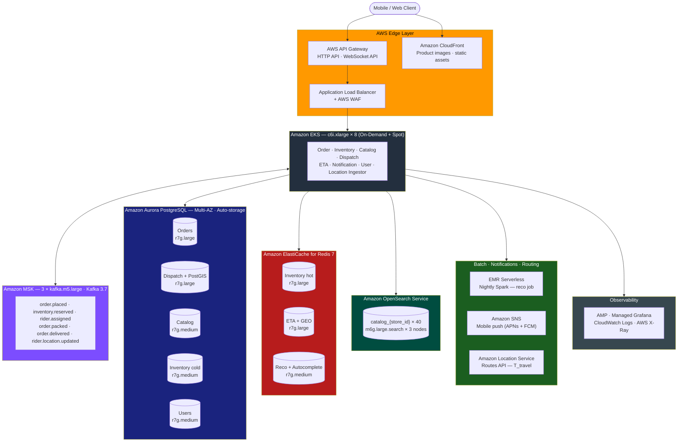
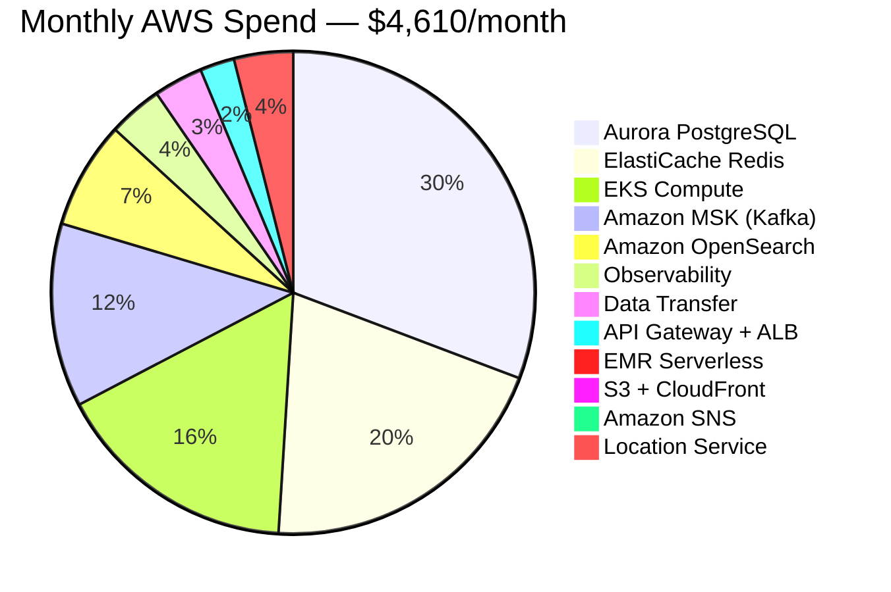

# Instant Grocery Delivery App — System Design

**Reference:** Blinkit/Zepto scale, single metro city (Pune / Bengaluru)
**Date:** 2026-02-22

---

## 1. Scale Assumptions & Requirements

### Functional Requirements

- **Customer:** browse catalog, search products, place order, real-time order tracking
- **Dark store ops:** manage stock, receive pick-list, mark items packed
- **Dispatch:** assign delivery agent, navigate store → customer
- **ETA:** promised delivery window before checkout, live updates during delivery

### Non-Functional Requirements

| Requirement | Target |
|---|---|
| Delivery SLA | 10–15 min from order placement |
| Order placement availability | 99.9% |
| Catalog browse availability | 99.5% |
| Inventory consistency | Strongly consistent (no oversell) |
| ETA consistency | Eventually consistent |
| Search latency | p99 < 200ms |
| Order placement latency | p99 < 500ms |
| Dispatch assignment | < 2s after order confirmed |

### Back-of-Envelope Numbers

| Metric | Value |
|---|---|
| Dark stores in city | 40 |
| Orders / day | 100,000 |
| Peak orders / min | 500 (≈ 5–6 per store) |
| Avg items per order | 8 |
| Catalog per store | ~5,000 SKUs |
| Concurrent riders | 10,000 |
| Rider location updates | Every 5s → **2,000 writes/sec** |
| Inventory writes (pick events) | ~800,000/day |

---

## 2. High-Level Architecture & Service Decomposition



### Service Responsibilities

| Service | Owns | DB Choice | Why |
|---|---|---|---|
| **Order Service** | Order lifecycle, payment orchestration | PostgreSQL (ACID) | Transactional, no oversell |
| **Catalog Service** | SKU master, pricing, images, categories | PostgreSQL + Elasticsearch | Search needs inverted index |
| **Inventory Service** | Per-store stock levels, reservations | Redis (hot) + PostgreSQL (durable) | Sub-ms stock checks at peak |
| **Dispatch Service** | Rider pool, order-rider assignment, routing | PostgreSQL + PostGIS | Consistent assignment, no double-assign |
| **ETA Service** | Delivery window prediction, live tracking | Redis (rider location) + ML model | High read, low write latency |
| **Notification Service** | Push, SMS, WhatsApp | Kafka consumer | Fire-and-forget, async |
| **User Service** | Auth, profile, addresses | PostgreSQL | Standard CRUD |

### Async Backbone — Kafka Topics

```
order.placed          → Inventory Service (reserve stock)
                      → Dispatch Service (start rider search)
                      → Notification Service (confirm to user)

inventory.reserved    → Order Service (mark payment capturable)
inventory.failed      → Order Service (cancel, refund)

rider.assigned        → ETA Service (start live tracking)
                      → Notification Service (rider name/photo to user)

order.packed          → Dispatch Service (rider can now pick up)

order.delivered       → Inventory Service (finalize deduction)
                      → Analytics pipeline
```



---

## 3. Order Lifecycle & Dispatch

### Order State Machine



### Critical Path — Order Placement (synchronous, < 500ms)

```
1. POST /orders
2. API Gateway → Order Service
3. Order Service calls Inventory Service (sync gRPC) — reserve stock
   └─ Inventory Service: Redis DECRBY per SKU per store_id (Lua script)
      If stock >= qty: reserve → enqueue Kafka (async PG write-behind)
      If stock < qty: return INSUFFICIENT_STOCK immediately
4. Order Service calls Payment Service (sync) — authorize charge
5. On success: write order row to PostgreSQL, publish order.placed to Kafka
6. Return order_id + ETA to customer
```



### Dispatch — Rider Assignment (async, < 2s after order.placed)

```
Dispatch Service consumes order.placed:
1. Query rider pool: AVAILABLE riders within 3km of dark store
   (PostGIS GEORADIUS on PostgreSQL, GiST index on rider location)
2. Score riders: proximity + current load + avg delivery time
3. Send push to top-3 riders (first-accept wins)
4. On acceptance: write rider_assignment, publish rider.assigned
5. No acceptance in 30s → expand radius to 5km, retry
6. 3 consecutive failures → circuit breaker opens → escalate to ops
```



### Preventing Double Assignment

Optimistic lock on assignment table:
```sql
UPDATE riders SET status='ON_DELIVERY'
WHERE rider_id = ? AND status = 'AVAILABLE'
RETURNING *;
```
Only one concurrent transaction succeeds; others get empty result and skip.

### Dark Store Pick-List Flow

```
order.placed → store ops tablet shows pick-list (WebSocket push)
Picker marks each item → inventory.picked event per item
All items picked → order.packed → Dispatch notified → rider dispatched
```

---

## 4. Inventory & Catalog

### Inventory — Two-Layer Model

```
Hot layer:  Redis Hash per store
  Key:    inv:{store_id}:{sku_id}
  Fields: qty_available, qty_reserved

Cold layer: PostgreSQL
  Table:  inventory(store_id, sku_id, qty, version)
  Updated via Kafka consumer (write-behind, ~5s lag)
```

### Atomic Reservation — Redis Lua Script

```lua
local qty = redis.call('HGET', key, 'qty_available')
if tonumber(qty) >= tonumber(requested) then
  redis.call('HDECRBY', key, 'qty_available', requested)
  redis.call('HINCRBY', key, 'qty_reserved', requested)
  return 1
else
  return 0
end
```
Lua scripts execute atomically — no WATCH/MULTI needed, no race conditions.



### Stock Update Flows

| Event | Flow |
|---|---|
| Inbound restock | Staff scans → Redis INCRBY + async PG write |
| Pick deduction | inventory.picked → Redis DECRBY qty_reserved → async PG |
| Spoilage / write-off | Staff marks → dual write (Redis + PG synchronous) |

### Catalog Architecture

```
PostgreSQL:      SKU master (sku_id, name, brand, category, price, weight)
Elasticsearch:   Per-store index — catalog_{store_id}
                 5,000 docs × 40 stores = 200k total (very manageable)
S3 + CDN:        Product images (served at edge, CDN cache invalidated on update)
```

**Why per-store Elasticsearch index:** Stock availability (`in_stock`) is store-specific.
A global index cannot filter cheaply at this latency. OOS update at store A touches
only `catalog_{store_A}` — no cross-store write fan-out.

### Search Flow (p99 < 200ms)

```
GET /search?q=amul+butter&store_id=42

1. Elasticsearch query on catalog_42:
   - fuzzy match (fuzziness: AUTO) on name^3, brand^2, tags^1
   - filter: in_stock = true
   - boost: sponsored, high-margin SKUs
2. Re-rank (lightweight in-process model):
   - boost: items this user purchased before
3. Price fetch from Redis (TTL 60s)
4. Return top 20 results

Latency budget:
  Elasticsearch: ~40ms | Re-rank: ~10ms | Redis: ~5ms | Net: ~20ms
  Total p50: ~75ms ✓
```

### Type-Ahead / Autocomplete

```
Redis Sorted Set per store: autocomplete:{store_id}
  ZRANGEBYLEX "amul b" → ["amul butter", "amul buttermilk", ...]
  Response < 10ms — no Elasticsearch involved
  Updated nightly from search logs
```

---

## 5. ETA & Slot Estimation

### Three ETA Phases

| Phase | Trigger | Latency | Accuracy |
|---|---|---|---|
| Pre-checkout | Cart page load | < 100ms | Approximate (store load based) |
| Post-order | After rider assigned | < 500ms | Precise (actual rider location) |
| Live ETA | Every 30s during delivery | < 50ms | Real-time (GPS + traffic) |

### ETA Formula

```
Total ETA = T_pick + T_wait_for_rider + T_travel

T_pick  = baseline (2 min + 0.5 min/item)
          × congestion multiplier (active_orders / picker_count)

T_wait  = distance(rider, store) / avg_rider_speed(time_of_day)

T_travel = OSRM / Google Maps Distance Matrix API result
           (cached per store→zone pair, TTL 5 min)
```

### Rider Location Tracking Pipeline

```
Rider app → GPS every 5s → POST /rider/location
→ Location Ingestor (stateless, horizontally scaled)
→ Redis GEO: GEOADD riders:{city} lng lat rider_id   (overwrites previous)
→ Kafka: rider.location.updated → ETA Service

ETA Service:
  if order is OUT_FOR_DELIVERY AND |new_ETA - shown_ETA| > 2min:
    push ETA update to customer (WebSocket / push notification)
```

**Why Redis GEO:** 10,000 riders × 5s updates = 2,000 writes/sec. Rider location
is ephemeral — durability not needed. GEODIST / GEORADIUS queries run in-memory.



### Dark Store Load Signal

```
Redis counters per store:
  store:{store_id}:active_orders   (INCR on order.placed, DECR on order.packed)
  store:{store_id}:picker_count    (updated by store ops app)

Congestion multiplier:
  active_orders / picker_count > 10  → T_pick × 1.5
  active_orders / picker_count > 20  → show "Slightly delayed" banner
```

### ETA Caching

| Data | Cache | TTL |
|---|---|---|
| Store→zone travel time | Redis | 5 min |
| Pre-checkout ETA per store | Redis | 30s |
| Rider live location | Redis GEO | Evicted on next update |
| Historical pick time model | In-memory | 1 hour |

---

## 6. Search & Recommendations

### Recommendations — Homepage Feed

```
Offline pipeline (nightly batch — Spark / Flink):
  Input:  order history, search clicks, category affinity per user
  Output: top-50 personalised SKU list per user_id
  Store:  Redis Hash  reco:{user_id} → [sku_id, ...]  TTL 24h

Online serving (no ML inference at request time):
  GET /feed?user_id=U&store_id=42
  → fetch reco:{U} from Redis
  → filter: only SKUs in_stock at store 42
  → return ranked, in-stock feed
  → cold start fallback: bestsellers at store 42 (updated hourly)
```

**Why offline pre-computation:** Grocery preferences change slowly.
24h staleness is acceptable. Real-time stock filtering keeps results actionable.
Avoids ML serving fleet cost at this scale.

### Substitution Logic (OOS During Picking)

```
Picker marks item OOS mid-pick → inventory.oos_during_pick event
→ Catalog Service finds substitutes:
    1. Same brand, same category, similar weight/price
    2. Fallback: different brand, same category
    (Elasticsearch query on catalog_{store_id}, filter in_stock=true)
→ Dispatch Service pauses rider assignment (if not yet assigned)
→ Customer notified: "We substituted X with Y — OK?"
→ Customer has 60s to reject; auto-accepts if no response
```

---

## 7. Resiliency & Failure Modes

### Circuit Breaker Placement

| Call | Fallback |
|---|---|
| Order → Inventory Service | Soft reservation (allow order, check at pick time) |
| Order → Payment Service | Async reconciliation job (runs every 5 min) |
| Catalog → Elasticsearch | PostgreSQL full-text search (slower, still functional) |
| ETA → Maps API | Cached zone-level ETAs (5 min TTL) |
| Any → Notification Service | Fire-and-forget, no circuit breaker needed |

### Key Failure Scenarios

**Inventory Redis down:**
Circuit breaker OPEN → soft reservation fallback. Orders continue.
True OOS caught at pick time → triggers substitution flow.

**Payment timeout:**
Order written as `PAYMENT_PENDING` before calling Payment Service (idempotency key = order_id).
Reconciliation job resolves within 10 min.

**Kafka consumer lag (Dispatch):**
Alert at lag > 500 msgs. Dispatch workers auto-scale horizontally (stateless, partition-per-worker).
Dead letter queue for 3x retry failures → ops review.

**Dark store network outage:**
Store tablet caches pick-lists offline (offline-first PWA).
Order stuck in PICKING > 8 min → ops alert.

**Rider GPS stale (> 60s no update):**
ETA Service marks rider STALE_GPS → show "Tracking unavailable" to customer.
Dispatch escalates if order not delivered within 20 min.

---

## 8. Observability

### Structured Logging (all services)

```json
{
  "timestamp": "2026-02-22T10:05:33Z",
  "service": "order-service",
  "trace_id": "abc-123",
  "span_id": "def-456",
  "level": "INFO",
  "event": "order.placed",
  "order_id": "ORD-789",
  "store_id": 42,
  "item_count": 8,
  "duration_ms": 312
}
```

`trace_id` propagated via HTTP headers and Kafka message headers for end-to-end tracing.

### Key Metrics (Prometheus + Grafana)

| Metric | Alert Threshold |
|---|---|
| `order_placement_latency_p99` | > 800ms |
| `inventory_reservation_failure_rate` | > 1% |
| `dispatch_assignment_latency_p99` | > 3s |
| `rider_assignment_success_rate` | < 95% |
| `kafka_consumer_lag{group=dispatch}` | > 500 msgs |
| `search_latency_p99` | > 300ms |
| `redis_memory_usage_pct` | > 80% |
| `orders_in_picking_gt_8min` | > 5 |

### Distributed Traces (OpenTelemetry → Jaeger)

```
Trace: order placement critical path
  span: api-gateway.route              2ms
  span: order-service.validate         5ms
  span: inventory-service.reserve     45ms
    span: redis.lua-script             3ms
    span: kafka.publish               12ms
  span: payment-service.authorize    180ms
  span: order-service.persist-pg     25ms
  span: kafka.publish(order.placed)  10ms
  ─────────────────────────────────────────
  Total:                             282ms
```

### Health Check Endpoints (all services)

```
GET /health/live   → 200 if process running    (K8s liveness probe)
GET /health/ready  → 200 if DB + Redis healthy  (K8s readiness probe)
```

---

## 9. Key Design Decisions & Trade-offs

### 1. Redis for inventory reservation (not PostgreSQL)

> At 4,000 stock ops/min, PostgreSQL row-level lock contention under concurrent
> orders would spike latency. Redis atomic Lua scripts handle this with sub-ms
> latency. **Trade-off:** write-behind means a Redis crash in a ~5s window could
> lose a reservation. Mitigated by Redis AOF persistence and soft-reservation
> circuit breaker fallback.

### 2. Per-store Elasticsearch index

> Coupling stock availability (`in_stock`) into a global index requires a
> store-scoped filter on every query and makes OOS updates fan out across all
> stores. Per-store indexes isolate writes. **Trade-off:** 40 indexes to manage
> vs 1. Accepted because 40 × 5k = 200k documents is operationally trivial.

### 3. Async Kafka backbone with synchronous critical path only

> Order placement is synchronous (inventory + payment) because the customer is
> waiting for a definitive answer. All downstream work (dispatch, notifications,
> analytics) is async. **Trade-off:** eventual consistency between order state
> and rider assignment. Bounded by 2s dispatch SLA alert.

### 4. Offline recommendation pre-computation

> Running ML inference at request time for 100k daily users at 500 orders/min
> peak requires a significant serving fleet. Grocery preferences change slowly.
> **Trade-off:** 24h staleness on personalisation. Mitigated by real-time
> in-stock filtering so stale recommendations don't show OOS items.

### 5. PostGIS for rider geospatial queries (not a dedicated geo service)

> PostGIS with a GiST index handles GEORADIUS-style queries well up to ~10k
> active riders. No dedicated geo-service needed at this scale. Redis GEO handles
> the write-heavy live location stream; PostGIS handles nearest-rider lookups
> (one query per order). **Trade-off:** at 100k+ concurrent riders city-wide,
> revisit with H3-based geo-sharding.

---

## 10. AWS Infrastructure Mapping

Every logical component maps to a managed AWS service. The principle: eliminate undifferentiated heavy lifting — no self-managed Kafka brokers, no patching Elasticsearch nodes, no idle EMR clusters.

### Component → AWS Service

| Design Component | AWS Service | Config / Tier | Reason for this choice |
|---|---|---|---|
| **API Gateway / BFF** | AWS API Gateway (HTTP API) | Regional endpoint, JWT authorizer | Pay-per-call; HTTP API is 70% cheaper than REST API for this traffic pattern |
| **WebSocket (order tracking)** | AWS API Gateway WebSocket API | Regional | Native WebSocket with connection state managed by API Gateway — no custom server |
| **Load Balancer** | Application Load Balancer (ALB) | 1 instance → EKS NodePort | Layer-7 routing; integrates with AWS WAF for DDoS protection |
| **CDN (product images)** | Amazon CloudFront | Price Class 200 (Americas + Asia) | Edge cache for S3-hosted SKU images, TTL 24h; ~95% cache hit rate on static assets |
| **Microservices (7 services + Location Ingestor)** | Amazon EKS | c6i.xlarge nodes: 4 On-Demand + 4 Spot | Kubernetes HPA for per-service scaling; Spot nodes for Notification + ETA (stateless, fault-tolerant) |
| **Orders DB** | Amazon Aurora PostgreSQL | db.r7g.large, Multi-AZ (writer + 1 reader) | ACID; automated failover < 30s (vs. 60–120s for standard RDS Multi-AZ); storage auto-scales to 128TB |
| **Dispatch DB (PostGIS)** | Amazon Aurora PostgreSQL | db.r7g.large, Multi-AZ | PostGIS extension supported on Aurora; GiST index for `ST_DWithin` rider lookups |
| **Catalog DB** | Amazon Aurora PostgreSQL | db.r7g.medium, Multi-AZ | Lower write volume; Aurora clones enable zero-copy read replicas for catalog exports |
| **Inventory cold layer** | Amazon Aurora PostgreSQL | db.r7g.medium, Multi-AZ | Write-behind from Kafka; Aurora Serverless v2 is a viable future switch if write cadence drops |
| **Users DB** | Amazon Aurora PostgreSQL | db.r7g.medium, Multi-AZ | Standard CRUD; small footprint |
| **Inventory hot layer** | Amazon ElastiCache for Redis 7 | cache.r7g.large, primary + 1 replica | Lua script atomicity; `maxmemory-policy noeviction` enforced; sub-ms HGET/HDECRBY |
| **ETA + Rider location (Redis GEO)** | Amazon ElastiCache for Redis 7 | cache.r7g.large, primary + 1 replica | GEOADD / GEORADIUS; headroom for 2,000 writes/sec on r7g.large (~200k ops/sec capacity) |
| **Recommendations + Autocomplete** | Amazon ElastiCache for Redis 7 | cache.r7g.medium, primary + 1 replica | `reco:{user_id}` hashes (≈40MB total); sorted sets for `ZRANGEBYLEX` autocomplete |
| **Kafka (event bus)** | Amazon MSK (Managed Streaming for Apache Kafka) | kafka.m5.large × 3 brokers, Kafka 3.7 | Managed Kafka; automatic storage expansion; MSK Connect available for future S3/Redshift sinks |
| **Search (Elasticsearch)** | Amazon OpenSearch Service | m6g.large.search × 3 nodes (HA) | Per-store index pattern, 200k docs; zero-downtime blue/green index alias upgrades |
| **Product images** | Amazon S3 | Standard storage class | Origin for CloudFront; S3 lifecycle rules move old SKU images to S3-IA after 90 days |
| **Recommendation batch job** | Amazon EMR Serverless | Spark 3.5, auto-sizing | Nightly 01:00 AM, ~2hr run; pay only for compute used — no idle cluster cost vs. a standing EMR cluster |
| **Push notifications** | Amazon SNS | Standard (mobile push) | Direct integration with APNs (iOS) + FCM (Android); no own push infrastructure |
| **SMS / WhatsApp notifications** | Third-party aggregator (Gupshup, ValueFirst, Twilio India) | — | AWS SNS SMS pricing in India (~$0.023/SMS) is 5–10× more expensive than regional aggregators; excluded from AWS bill |
| **Maps / Routing (T_travel)** | Amazon Location Service (Routes API) | Standard | $0.004/route after first 1M free — 1,875× cheaper than Google Maps Distance Matrix at 3M calls/month |
| **Distributed tracing** | AWS X-Ray | OpenTelemetry SDK → X-Ray OTLP endpoint | Drop-in replacement for Jaeger; deep EKS + ALB integration; no separate Jaeger cluster to operate |
| **Metrics** | Amazon Managed Service for Prometheus (AMP) | Default workspace | Prometheus-compatible; scraped from EKS via AWS Distro for OpenTelemetry (ADOT) Collector |
| **Dashboards** | Amazon Managed Grafana (AMG) | Standard tier, SSO via IAM Identity Center | Pre-built dashboards for MSK, ElastiCache, Aurora; connects directly to AMP + CloudWatch |
| **Logs** | Amazon CloudWatch Logs | Log groups per service, 30-day retention | Structured JSON ingest; CloudWatch Logs Insights for ad-hoc queries without a separate ELK stack |

### AWS Architecture



### Three Key AWS-Specific Choices

**Aurora over standard RDS PostgreSQL:** Aurora storage auto-scales without provisioning; the writer/reader endpoint split lets the Catalog Service fan reads across up to 15 read replicas with no application changes. Failover is < 30s vs. 60–120s for standard RDS Multi-AZ — directly relevant to the 99.9% order placement availability target.

**EMR Serverless over a standing EMR cluster:** The recommendation batch runs once nightly for ~2 hours. A standing 5-node m5.xlarge cluster would cost ~$1,600/month for 22 idle hours per day. EMR Serverless charges only for the active 2-hour window → ~$180/month.

**Amazon Location Service over Google Maps:** At 3M routing calls/month, Google Maps Distance Matrix API costs $5.00 per 1,000 elements = **$15,000/month**. Amazon Location Service costs $0.004/route × 2M billed calls = **$8/month** — a 1,875× cost difference. The trade-off is less real-time traffic accuracy; the 5-minute zone cache (§5) absorbs most of this.

---

## 11. Monthly Cost Estimate

### Assumptions

| Parameter | Value |
|---|---|
| AWS Region | `ap-south-1` (Mumbai) — closest to Pune / Bengaluru |
| Orders / day | 100,000 |
| Concurrent riders | 10,000 |
| Rider location writes | 2,000/sec |
| EKS node split | 4 On-Demand + 4 Spot c6i.xlarge |
| Pricing basis | AWS public list price, `ap-south-1`, February 2026 (no EDP/SPA discount) |
| SMS / WhatsApp | Excluded — handled by regional aggregator outside AWS |

### Cost Breakdown

| Category | AWS Service(s) | Qty / Config | $/month |
|---|---|---|---|
| **EKS Compute** | EKS control plane + 4× c6i.xlarge On-Demand + 4× c6i.xlarge Spot | $73 + $496 + $175 | **$744** |
| **Aurora PostgreSQL** | Orders (r7g.large ×2) + Dispatch (r7g.large ×2) + Catalog / Inventory / Users (r7g.medium ×2 each) + 500GB storage | 5 clusters | **$1,400** |
| **ElastiCache Redis** | Inventory (r7g.large ×2) + ETA/GEO (r7g.large ×2) + Reco/Autocomplete (r7g.medium ×2) | 3 clusters | **$920** |
| **Amazon MSK** | 3× kafka.m5.large brokers + 1TB storage (30-day retention) | 3 brokers | **$560** |
| **Amazon OpenSearch** | 3× m6g.large.search nodes + 50GB gp3 storage | 3-node HA cluster | **$327** |
| **API Gateway + ALB** | HTTP API (5M calls/mo) + WebSocket API + 1× ALB | — | **$105** |
| **S3 + CloudFront** | 50GB S3 Standard + 500GB CDN transfer/month (Asia-Pacific) | — | **$44** |
| **EMR Serverless** | Nightly Spark job ~2hr/night · 40 vCPUs · 160GB memory | 30 nights/month | **$180** |
| **Amazon SNS** | Mobile push notifications (~15M/month to APNs + FCM) | First 1M free, $0.50/M after | **$7** |
| **Location Service** | ~3M routing API calls/month | First 1M free, $0.004/route | **$8** |
| **Observability** | AMP (50M samples) + Managed Grafana (5 editors) + CloudWatch Logs (100GB) + X-Ray | — | **$165** |
| **Data Transfer** | NAT Gateway + internet egress (API responses to mobile) | — | **$150** |
| **Monthly Total** | | | **≈ $4,610** |

> **Annual run rate: ≈ $55,320** at steady-state public pricing.

### Cost by Category



Database and cache together account for 50% of the bill — typical for a read/write-heavy transactional system. Compute is deliberately small relative to data tier because the design offloads state into managed services rather than in-process memory.

### Cost Optimization Levers

| Lever | Applies To | Estimated Saving |
|---|---|---|
| **1-year Reserved Instances (no upfront)** | Aurora + ElastiCache (predictable baseline) | −30% on $2,320 = **−$696/month** |
| **Compute Savings Plans (1-year)** | EKS On-Demand nodes | −20% on $496 = **−$99/month** |
| **MSK Tiered Storage** | `order.delivered`, `rider.location.updated` (high volume, read rarely) | Move cold messages to S3 at $0.023/GB vs $0.10/GB |
| **Aurora I/O-Optimized pricing** | Catalog + Users DBs (low I/O) | Disable if < 1M I/O events/day — saves ~$30/month |
| **CloudFront caching (Cache-Control headers)** | `/catalog/search` responses, product images | Reduces origin requests → fewer OpenSearch + S3 GETs |
| **EKS Karpenter for node right-sizing** | EKS worker nodes | Replaces fixed c6i.xlarge with mixed instance types; can cut node cost 15–20% |

**Projected cost with 1-year RIs + Compute Savings Plans: ≈ $3,815/month ($45,780/year)**

### Cost Scaling Projections

| Scale | Orders/day | Bottleneck that scales first | Estimated AWS bill |
|---|---|---|---|
| MVP / pilot | 10,000 | — (all services under-utilized) | ~$1,400/month |
| Single metro (this design) | 100,000 | ElastiCache, Aurora | ~$4,600/month |
| 3-city expansion | 300,000 | MSK broker count, Aurora read replicas | ~$10,000–13,000/month |
| 10-city expansion | 1,000,000 | EKS node count, Aurora Global Database | ~$30,000–40,000/month |
| Blinkit national scale (est.) | 2,000,000+ | All tiers; EDP discounts kick in >$100k/month | ~$60,000–80,000/month |

> Multi-city does **not** scale linearly: MSK and Aurora control plane costs are fixed, EDP (Enterprise Discount Program) discounts apply above ~$100k/month, and Savings Plans compound with scale. At Blinkit's actual scale, effective AWS cost per order is likely 30–50% lower than public pricing.

---

## Out of Scope (flag proactively in interviews)

- Surge pricing / dynamic delivery fees
- Multi-store order splitting
- Returns and refunds flow
- Seller / vendor onboarding portal
- Cross-city federation
- Payment gateway internals
