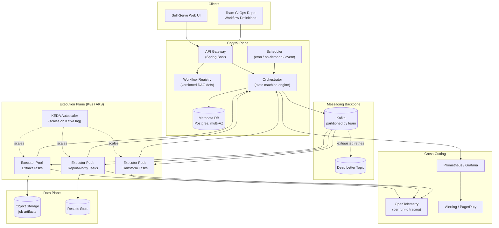
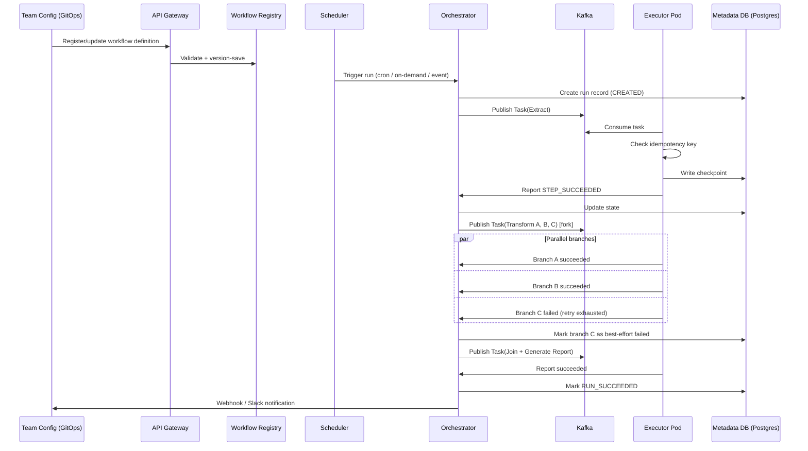
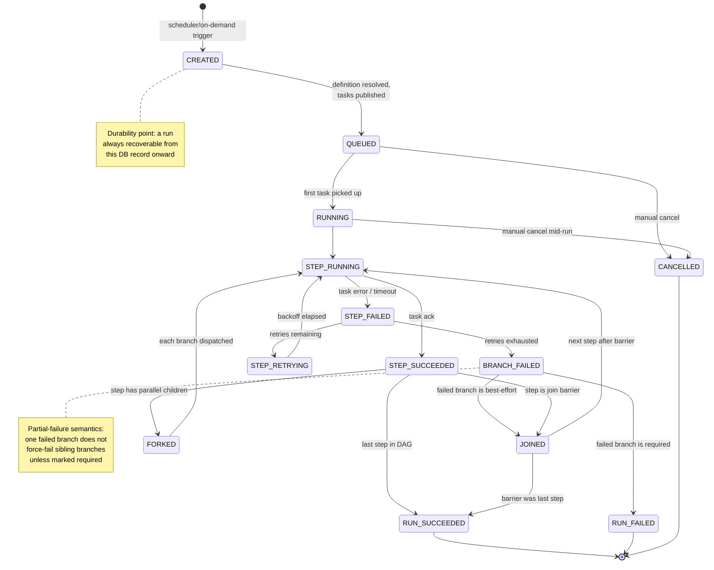
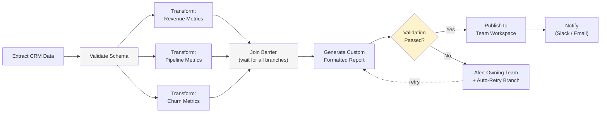

# Senior Engineering Manager — System Design Interview
### Mock Transcript: "Internal Long-Running Jobs Platform" — Strong Hire Calibration

**Interviewer persona:** Principal Engineer (L7), hiring for Senior EM, Platform Engineering
**Candidate persona:** Senior EM candidate (background equivalent to: Java/Spring backend, K8s/AKS infra, financial-data consistency experience, manages ~18-20 engineers)
**Format:** 55 minutes, EM-flavored system design (technical depth + org/operational judgment woven together)
**How to use this doc:** Read it as a model answer key. Inline `[SIGNAL]` callouts mark exactly *why* a line earns Strong Hire credit — those are the behaviors to internalize, not memorize.

---

## 0. Framing (1 min)

**Interviewer:** Today's prompt: design an internal platform for long-running jobs — things like quarterly business review reports generated from CRM data in custom formats, and daily customer health scores pulled from multiple data sources. It needs to be generic, support on-demand/scheduled/recurring triggering, and behave like a mini-Airflow — fixed state machine, but with forking paths for custom steps. Scale: ~440K jobs/day across 20 internal teams, roughly 10 jobs/team/day as a baseline. Treat me as a skeptical staff engineer on the team you'd be managing — push back if I'm wrong, ask me anything you need.

**Candidate:** Great, I'll start by nailing down requirements and scale, then sketch the architecture, then we can go deep wherever you want — including how I'd staff and run this with my org.

> `[SIGNAL]` Candidate states their plan out loud before diving in. This is a cheap, high-value move — it tells the interviewer how to interrupt and steer, and shows structured thinking under ambiguity.

---

## 1. Requirements Clarification (7 min)

**Candidate:** A few questions before I size anything.

First, on the numbers — 20 teams × 10 jobs/team/day is 200 *job definitions* triggered per day, but you said 440,000 *jobs* daily. Those don't reconcile unless "job" here means something like "one execution per customer." For example, daily health scores — if that's computed per-customer, and a team owns ~2,000-3,000 customers, that's how you get to 440K. Is that the right mental model — a small number of *job templates* (~200/day) that each fan out into many *job instances*?

**Interviewer:** Yes, exactly. A "job" registered by a team can fan out into thousands of instances at execution time.

**Candidate:** Good, that changes the design meaningfully — I need a fan-out/fan-in primitive in the execution model, not just a single DAG per trigger. Second set of questions:

- **Consistency bar:** You mentioned financial-product-level consistency elsewhere in scope. For these two example jobs, is "consistency" mostly about *exactly-once side effects* (don't double-charge, don't double-send a customer-facing report) or about *numerical correctness* (the health score must reconcile against source-of-truth data even under partial failure)? Both, probably, but I want to know which one breaks the business if I get it wrong.
- **Latency/SLA:** Is a QBR report due "by end of day" or "within X minutes of trigger"? Same for health scores — nightly batch with a hard cutoff before business hours?
- **Failure semantics:** If step 3 of an 8-step DAG fails, do downstream teams expect partial results, or is it all-or-nothing per job instance?
- **Multi-tenancy:** Do teams get isolated compute/quota, or is it a shared pool with priority? With 20 teams, one noisy team shouldn't starve another.
- **Extensibility:** When you say "custom steps," do teams bring their own container/code, or do they configure from a fixed step library (extract, transform, validate, notify, etc.)?

> `[SIGNAL]` This is the single highest-value block in the whole interview. The candidate (a) caught a real scale ambiguity instead of silently building on a guess, (b) translated "financial-grade consistency" into two genuinely different engineering problems instead of treating it as a buzzword, and (c) asked about partial-failure semantics, which most candidates skip and which determines half the architecture.

**Interviewer:** Good catches. Let's say: exactly-once side effects matter most (no duplicate customer-facing emails/reports), numerical correctness matters but is recoverable via reruns. SLA: health scores must complete before 8am local; QBR reports are on-demand/scheduled with a 4-hour soft SLA. Failure is per-job-instance — partial DAG failure should retry just the failed branch, not the whole thing. Teams get fair-share quota with burst capacity. And yes — teams bring custom step logic (a container image or a script), the platform provides the orchestration, scheduling, retries, and observability around it.

**Candidate:** That's enough to size this and start designing. One more: do step authors get arbitrary compute, or do we sandbox/limit them? I'll assume sandboxed containers with resource limits for now, since 20 different teams writing arbitrary code on shared infra is a security and noisy-neighbor problem — flag me if that's wrong.

**Interviewer:** Correct assumption.

---

## 2. Scale & Capacity Estimate (5 min)

**Candidate:** Let me do quick back-of-envelope math, because the prompt's "4 jobs/sec" and the literal 440,000/86,400 don't quite match — that's actually ~5.1 jobs/sec averaged over a full day. I'll use ~5/sec as the average, but averages lie for batch systems: health scores almost certainly cluster in an overnight window, and QBR reports cluster near quarter-end and business hours. I'd design for a peak multiplier of 8-10x average, so closer to **40-50 job-instances/sec at peak**, not 5.

> `[SIGNAL]` Catching the arithmetic mismatch unprompted, and — more importantly — refusing to design for the average when the workload is explicitly batchy. This is the difference between "did the math" and "understood what the math means for capacity planning."

Each job instance isn't one unit of work — it's a DAG with, let's estimate, 5-10 steps including fan-out branches. So:

- Step/task executions: 440,000 jobs × ~7 avg steps ≈ **3.1M task executions/day**, average ~36/sec, peak ~300-400/sec.
- Storage: if each job instance writes a small metadata record (~2KB) plus an output artifact (let's say avg 200KB for a report, much smaller for a health score number) — that's roughly 440K × 200KB ≈ 88GB/day of artifact data, which is trivial for object storage, and fine for a metadata DB if we partition/age out aggressively.
- State transitions: each task does maybe 4-5 DB writes (queued, running, succeeded/failed, checkpoint) → ~15M writes/day, ~175/sec average, ~1500/sec peak. That's the number that tells me the metadata store, not the compute, is the first thing to get serious about.

**Interviewer:** Why metadata store over compute?

**Candidate:** Because compute is horizontally scalable almost for free on K8s — I add executor pods. State writes against a relational store, especially one I want strongly consistent for financial-grade correctness, is where contention and lock behavior bite first. I'd rather over-provision there and validate with a load test than assume it scales linearly.

> `[SIGNAL]` Identifies the actual bottleneck instead of the obvious one (compute), and justifies it with a mechanism (lock contention on relational writes), not a vibe.

---

## 3. High-Level Architecture (10 min)

**Candidate:** Here's the shape of it. *(sketches on the whiteboard)*

*Diagram 1 — High-level architecture: control plane, messaging backbone, K8s execution plane, data plane, and observability.*

I'd split it into four planes:

1. **Control Plane** — API Gateway, a Workflow Registry (versioned job/DAG definitions, since teams will iterate on these and I never want an in-flight run to silently pick up a definition change), a Scheduler (cron/on-demand/event triggers), and an Orchestrator that owns the state machine for each run.
2. **Messaging backbone** — Kafka, partitioned by team, so one team's burst doesn't starve another's latency-sensitive job. Plus a dead-letter topic for tasks that exhaust retries.
3. **Execution Plane** — K8s-based executor pools, one pool family per step "type" or per team, depending on how much isolation we need. Autoscaled with KEDA off Kafka consumer lag, not CPU — lag is the metric that actually reflects backlog.
4. **Data Plane** — object storage for artifacts (reports, large payloads), and a metadata store (Postgres, primary/replica, financial-grade so it's the source of truth for "did this side effect happen").

Cross-cutting: observability (Prometheus/Grafana, OpenTelemetry tracing per run-ID so I can follow one job instance across 20 services), and multi-tenancy enforcement (namespace-level quotas in K8s, per-team Kafka partitions, RBAC at the API gateway).

**Interviewer:** Why Postgres and not something like Cassandra or DynamoDB, given the write volume you just estimated?

**Candidate:** Because the requirement that's load-bearing here is correctness, not raw throughput — 1500 writes/sec peak is well within a properly indexed, properly partitioned Postgres cluster's range; it's not a "we need eventual consistency to survive" number. I'd rather keep ACID semantics for state transitions and idempotency keys, and only reach for something like Cassandra if profiling tells me writes are the actual ceiling — which I doubt at this scale. I'd shard/partition by team or by date range if it does become a bottleneck, rather than reaching for a different consistency model up front.

> `[SIGNAL]` Resists a trendy-but-wrong tech choice by re-deriving the actual constraint (correctness > throughput at this scale) instead of pattern-matching "lots of writes → NoSQL."

**Interviewer:** Walk me through what happens, end to end, when the "daily health score" job fires for one team.

**Candidate:** *(walks through the flow step by step)*

*Diagram 2 — End-to-end sequence for one job run, including a fan-out with one best-effort branch failure.*

1. Scheduler fires at the cron time, asks the Orchestrator to create a run from the registered definition.
2. Orchestrator writes a `CREATED` record to the metadata store — this is the durability point; if anything crashes after this, we can recover from DB state, not from memory.
3. Orchestrator publishes the first task(s) to Kafka. For health scores, "first step" is probably "pull from data sources A, B, C" — which can run in parallel, so this is a fan-out from the start.
4. Executor pods consume, do the work, and critically — check an idempotency key before producing any side effect. If this task already succeeded under this run-ID (e.g., a redelivered message), it short-circuits instead of recomputing or double-sending.
5. On success, the executor writes a checkpoint and reports back to the Orchestrator, which updates state and decides the next step from the DAG definition — including whether to wait at a join barrier for sibling branches.
6. On failure, retry with backoff up to a configured limit, then route to the dead-letter topic and flip that branch to `FAILED` — without failing sibling branches that succeeded, per the partial-failure semantics we agreed on earlier.
7. When all branches reach a terminal state, the run is marked `SUCCEEDED` or `FAILED`, and downstream notification fires (webhook/Slack/email) to the owning team.

---

## 4. Deep Dive A — Generic State Machine + Fork/Join DAG Model (8 min)

**Interviewer:** You keep saying "generic." How do you actually let 20 teams define arbitrary-ish workflows without each one becoming a special case your team has to maintain forever?

**Candidate:** This is the crux of the platform, so let me be precise. *(sketches two diagrams)*

*Diagram 3 — The fixed, platform-owned job lifecycle state machine. Every team's job obeys this regardless of DAG content.*

*Diagram 4 — Example team-configured DAG (QBR report) showing fan-out, a join barrier, and a conditional retry branch — this is the "pluggable content" layered on top of Diagram 3's fixed state machine.*

I'd separate two things that are often conflated:

- **The state machine** — this is *fixed*, owned by the platform, and every run obeys it: `CREATED → QUEUED → RUNNING → (per-step states) → SUCCEEDED/FAILED/CANCELLED`. Teams never get to invent new top-level states. This is what makes the platform operable — I can build one dashboard, one alert set, one runbook, because every job in the company obeys the same lifecycle.
- **The DAG topology** — this is *configurable per team*, expressed as a declarative definition (YAML/JSON) listing steps, their dependencies, fan-out/fan-in points, and conditional branches. A step is a reference to a containerized unit of work with a defined input/output contract, not arbitrary platform code.

So "generic" doesn't mean "anything goes" — it means the *shape* is fixed and the *content* is pluggable. Concretely, for the QBR example: Extract CRM data → Validate schema → fan out into three parallel transforms (revenue, pipeline, churn metrics) → join barrier → generate custom-formatted report → conditional check → publish or alert-and-retry → notify. Each box is a team-owned container; the wiring, retries, and barrier logic are platform-owned.

**Interviewer:** What happens if a team wants a step type you don't support yet — say, a long-running step that takes 6 hours?

**Candidate:** Two things have to be true regardless of duration: the step has to checkpoint progress so a restart doesn't redo six hours of work, and it has to emit liveness heartbeats so the Orchestrator can distinguish "still working" from "silently dead." I'd require both as part of the step contract — not something I bolt on per team. If a team genuinely can't checkpoint (some external system, say), I'd let them register the step as long-running with a heartbeat-only contract and a much longer timeout, but I'd flag that as a step contract violation risk in design review, because it's the kind of thing that pages someone at 3am later.

> `[SIGNAL]` Distinguishes platform invariants (fixed state machine, step contracts) from team-customizable content (DAG topology, step logic). This is the actual architectural insight the prompt is testing for — most candidates either over-genericize (everything configurable, nothing operable) or under-genericize (hardcode for the two examples given).

---

## 5. Deep Dive B — Exactly-Once / Financial-Grade Consistency (7 min)

**Interviewer:** You said exactly-once side effects matter most. Kafka gives you at-least-once by default. How do you actually get there?

**Candidate:** I don't try to get true exactly-once delivery — I get **at-least-once delivery + idempotent consumers**, which is the achievable and battle-tested version of "exactly-once effect."

Concretely:
- Every task carries a deterministic idempotency key — typically `(run_id, step_id, attempt_scope)` — not `(run_id, step_id, attempt_number)`, because retries of the *same logical attempt* must collide on the same key, or a redelivery looks like a new attempt.
- Before producing any externally visible side effect (sending an email, writing a customer-facing report, charging anything), the executor checks a unique constraint in the metadata store on that idempotency key. If it's already marked done, skip the side effect and just re-ack.
- I use the transactional outbox pattern for anything that needs to atomically (a) update internal state and (b) emit an external effect — write both in one DB transaction, and have a separate relay publish the outbox row to Kafka/webhook. This avoids the classic "DB write succeeded, but the notification crashed before sending" gap.
- For numerical correctness under partial failure — like a health score computed from three data sources where one is temporarily down — I'd rather fail that branch loudly and retry than silently compute a partial score and call it done. Silent partial correctness is the actual nightmare scenario for anything "financial-grade"; an explicit failure that pages someone is recoverable, a quietly wrong number that ships is not.

**Interviewer:** What about two teams whose jobs both write to the same downstream system — any cross-job consistency concerns?

**Candidate:** I'd push that to be a non-goal for the platform itself, and instead make sure I expose strong per-run isolation (each run only touches its own idempotency-key namespace) so cross-job races are a downstream system's problem to solve with its own constraints — not something I want my orchestrator reasoning about. Trying to solve distributed consistency *across* unrelated teams' jobs is scope creep that would make this unmaintainable.

> `[SIGNAL]` Knows the difference between true exactly-once (extremely hard, usually a trap) and the engineering pattern that achieves the same observable guarantee. Also shows judgment by explicitly scoping *out* a problem rather than over-engineering toward it — a senior trait, not just technical correctness.

---

## 6. Deep Dive C — Multi-Tenancy & Scaling 20 Teams (5 min)

**Interviewer:** 20 teams, one platform. What stops team #14's burst from delaying team #3's SLA-bound health score job?

**Candidate:** Layered isolation, cheapest-first:

- **Kafka:** partition by team (or team + priority tier), so a consumer-side backlog for one team's topic doesn't block another's.
- **K8s:** namespace per team or per tenancy tier, with resource quotas and limit ranges, so a runaway container can't starve the node pool. KEDA autoscaling per topic/partition means hot teams scale their own executor pools up without taking capacity from others.
- **Priority tiers, not raw fairness:** I'd classify jobs by SLA criticality (health scores before 8am = high priority; ad-hoc QBR reruns = best-effort) and let the scheduler/queue respect that, rather than pure round-robin fairness, since "fair" isn't actually what the business wants here.
- **Quota as a product, not a punishment:** I'd give every team a self-service dashboard showing their quota usage and queue depth, so "why is my job slow" is self-serve, not a ticket to my team.

> `[SIGNAL]` The last point is an EM-flavored answer to a technical question — turning an operational concern into a self-service product decision, which reduces toil on their own org. That's the kind of answer that separates an EM candidate from an IC giving the same technical content.

---

## 7. Build vs. Buy (4 min)

**Interviewer:** This is, frankly, Airflow with extra steps. Why build it instead of adopting Airflow, Temporal, or Argo Workflows?

**Candidate:** Honest answer: I wouldn't default to building from scratch, and I'd want this conversation to happen *before* any design doc gets written, not after.

- **Airflow** is a strong fit for the DAG/scheduling parts, but its task-level state model and multi-tenancy story aren't naturally built for "20 independent teams with quotas and self-service onboarding" — you end up building a lot of the same control-plane wrapper around it anyway.
- **Temporal** gives you durable execution and great retry/checkpoint semantics natively, which would remove a meaningful chunk of what I described in section 5. The trade-off is operational: it's another stateful system to run well, and the team needs Temporal-specific expertise.
- **Argo Workflows** fits naturally if we're already deep in K8s-native tooling — DAGs as CRDs — but the multi-tenant quota/self-service layer is still something we'd build on top.

My honest recommendation, if I were actually starting this: prototype on Temporal or Argo for the orchestration core, and spend my team's energy on the parts that are genuinely our differentiated problem — the self-service registry, the multi-tenant quota system, and the financial-grade idempotency layer — rather than reinventing a workflow engine. I'd only justify a fully custom engine if there's a hard constraint these tools can't meet, and I'd want to name that constraint explicitly in the design doc, not discover it six months into the build.

> `[SIGNAL]` This is the single most common Strong-Hire/No-Hire fork in real EM interviews. A weaker candidate proudly designs a bespoke engine because the prompt invites it. A Strong Hire candidate names the existing alternatives unprompted, gives an honest trade-off, and explicitly resists the instinct to build for its own sake — while still being able to design the custom version competently, which the candidate already proved in sections 3-6.

---

## 8. Org Design & Leadership (8 min)

**Interviewer:** Say I greenlight the custom-build-on-top-of-Argo path. You have 18 engineers. How do you organize them, and how do you actually get all 20 teams to adopt this instead of their own scripts?

**Candidate:** I'd split 18 into purpose-built pods rather than one undifferentiated team, because the workstreams have genuinely different rhythms:

- **Core Orchestration (5-6 eng):** the state machine, scheduler, Argo/Temporal integration. This is the highest-skill, lowest-headcount pod — I'd staff my strongest distributed-systems engineers here.
- **Platform Experience / Self-Service (4-5 eng):** the registry, the onboarding flow, the team-facing dashboards. This pod's customer is internal engineers, so I'd want someone with strong product instincts even though it's an infra team.
- **Execution & Infra (4-5 eng):** K8s, KEDA, multi-tenancy enforcement, cost/capacity. Closest to my own AKS/K8s background, so I'd stay closer to this pod technically without bypassing its lead.
- **Reliability & Observability (3-4 eng):** SLOs, on-call, the financial-grade-correctness guarantees, incident response. I'd seed this from day one, not after the first incident — for a platform that 20 teams depend on, reliability is a feature, not a phase.

For adoption — and this is the part I've seen platform teams get wrong — I would not mandate migration on day one. I'd pick one or two *willing* teams with painful existing scripts, make them successful with a white-glove onboarding, and let their result be the adoption pitch. I'd track adoption as a real metric on my team's dashboard (% of the 200 job-templates migrated, not just "platform exists"), and I'd expect resistance from teams whose hand-rolled scripts already work — my job is to make the new platform strictly less work for them, not to win an argument about architecture.

**Interviewer:** What's the first real incident likely to look like, and how do you want your org to handle it?

**Candidate:** Most likely: a poison-message scenario — one team's step starts failing repeatedly, retries hammer a downstream dependency, and it looks like a platform-wide outage when it's actually one team's bad deploy. I'd want the on-call runbook to make "isolate by team/partition" the first action, not "page everyone." Postmortem-wise, I treat the DLQ design and per-team isolation from section 6 as exactly the thing that should turn a platform incident into a single-team incident — if it doesn't, that's a real architectural gap, not bad luck, and I'd want that traced back to a concrete fix, not just "we'll be more careful."

> `[SIGNAL]` Org design is mapped directly to the architecture's own seams (orchestration core vs. execution vs. platform experience vs. reliability), not generic "frontend/backend/infra" boilerplate. The adoption answer shows the EM-specific skill of influence without authority — a technical design alone doesn't get 20 teams to migrate; staffing one win at a time does. The incident answer connects org behavior back to the isolation design from earlier — showing the technical and people threads aren't separate tracks in this candidate's head.

---

## 9. Candidate's Questions to Interviewer (3 min)

**Candidate:** A few for you, genuinely useful for how I'd approach the role:

1. Is there an existing internal scheduler/cron system this would replace, or is this greenfield? That changes the migration story a lot.
2. Who absorbs on-call for this platform once it's live — my org alone, or shared with the consuming teams for their own step logic?
3. Is there a mandate or a budget conversation already happening around build-vs-buy, or would I be the one making that case from scratch?

**Interviewer:** Greenfield, mostly. On-call shared — platform on-call for orchestration, teams own their step logic. And no, you'd be making the build-vs-buy case yourself.

**Candidate:** Good to know — that reinforces that the Argo/Temporal evaluation I flagged earlier should probably be the first two weeks of work, not an afterthought, since it changes both my staffing plan and my first 90-day deliverable.

> `[SIGNAL]` Closing questions are operationally useful, not generic ("what's the culture like"), and the candidate visibly updates their plan in real time based on the answers — showing the questions weren't performative.

---

## 10. Interviewer's Closing Scorecard (internal notes)

| Dimension | Evidence from transcript | Rating |
|---|---|---|
| **Problem framing & ambiguity handling** | Caught the 200-vs-440K scale mismatch; translated "financial-grade" into concrete engineering requirements instead of accepting it as a slogan | Strong |
| **Technical architecture & judgment** | Fixed-state-machine + configurable-DAG split is the correct generic/specific boundary; correctly reasoned Postgres over NoSQL from the actual constraint, not trend | Strong |
| **Depth on hard sub-problems** | Idempotency key scoping, transactional outbox, partial-failure-by-branch — all correct and precisely stated, not hand-waved | Strong |
| **Operational/SRE mindset** | KEDA-on-lag, DLQ, heartbeat/checkpoint step contracts, incident isolation strategy tied back to architecture | Strong |
| **Build vs. buy / business judgment** | Proactively raised Airflow/Temporal/Argo trade-offs unprompted; resisted building a bespoke engine for its own sake | Strong |
| **Org design & people leadership** | Pod structure mapped to real architectural seams, not generic team boilerplate; adoption strategy via willing-team pilots rather than mandate | Strong |
| **Communication** | Stated plan up front, used diagrams to anchor discussion, answered the actual question asked, asked sharp clarifying questions throughout | Strong |

**Recommendation: Strong Hire.**
Rationale in one line: the candidate treated the technical design and the org design as one continuous problem the entire time, never switching into "now let me put on my manager hat" — which is exactly the failure mode this interview is designed to catch in EM candidates who are strong in only one dimension.

---

## Coaching Notes for Reuse (meta-layer, not part of the transcript)

If you're studying this rather than just reading it, the four moves worth internalizing are:

1. **Reconcile the numbers before designing.** The 200-vs-440K catch wasn't a trick — interviewers expect you to notice when given numbers don't compose.
2. **Separate "fixed platform invariant" from "team-customizable content"** explicitly, out loud. This is the actual answer to "how do you make it generic," and most candidates never say it in those words even when their design implies it.
3. **Name the build-vs-buy alternative before being asked.** Waiting for the interviewer to bring up Airflow/Temporal/Argo reads as either not knowing they exist or hoping not to be asked — both read badly at this level.
4. **Never let an architecture answer end without its organizational consequence**, and vice versa. The strongest single line in this transcript is mapping the four engineering planes directly onto four staffing pods — say something structurally equivalent to that in your own words, don't memorize this one.
