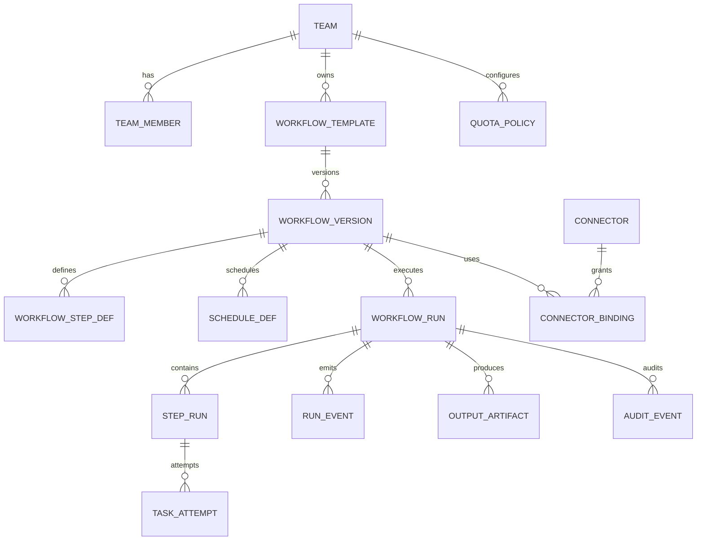

# Data Model and Schemas

This document defines the reference data model for the long-running job platform. It separates authoritative state from event streams, read projections, artifacts, logs, and search indexes.

## Storage Responsibilities

| Store | Responsibility | Not Responsible For |
|---|---|---|
| Postgres | Authoritative workflow metadata, run state, step state, attempts, quotas, leases, audit metadata, output manifest pointers | Large logs, report files, raw intermediate artifacts |
| Kafka | Durable event ingestion, state-change streams, log streams, reconciliation events, projection feeds | Authoritative queryable state by itself |
| Redis | Hot dashboard projections, cancellation acceleration, short-lived counters, websocket fan-out | Source of truth for state, audit, or cancellation |
| Object storage | Reports, manifests, intermediate artifacts, archived logs, snapshots | Fine-grained state transitions |
| ClickHouse or Elasticsearch | Recent searchable logs, operational history, dashboard filtering, forensic search | Durable workflow state machine |
| Iceberg or Parquet archive | Long-term metadata snapshots, old logs, audit exports | Hot control-plane operations |

## Entity Relationship Overview



## Postgres Authoritative Schema

Postgres is the source of truth for control-plane metadata and workflow state. All state changes should use optimistic concurrency control through `state_version` or compare-and-swap updates.

### teams

| Column | Type | Notes |
|---|---|---|
| team_id | uuid primary key | Stable tenant identifier |
| name | text unique not null | Human-readable team name |
| cost_center | text | Used for chargeback |
| default_priority | text | Example: `medium` |
| status | text | `active`, `suspended`, `deleted` |
| created_at | timestamptz |  |
| updated_at | timestamptz |  |

### team_members

| Column | Type | Notes |
|---|---|---|
| team_id | uuid references teams |  |
| principal_id | text | User or service principal |
| role | text | `viewer`, `operator`, `developer`, `admin` |
| created_at | timestamptz |  |

Primary key: `(team_id, principal_id, role)`.

### workflow_templates

| Column | Type | Notes |
|---|---|---|
| workflow_id | uuid primary key | Stable workflow identifier |
| team_id | uuid references teams | Owner |
| name | text not null |  |
| description | text |  |
| status | text | `draft`, `active`, `deprecated`, `disabled` |
| current_version_id | uuid | Points to active version |
| created_by | text | Principal |
| created_at | timestamptz |  |
| updated_at | timestamptz |  |

Unique index: `(team_id, name)`.

### workflow_versions

| Column | Type | Notes |
|---|---|---|
| version_id | uuid primary key | Immutable workflow version |
| workflow_id | uuid references workflow_templates |  |
| version_number | integer | Monotonic per workflow |
| definition_json | jsonb | DAG, params schema, step config |
| definition_hash | text | Hash of canonical definition |
| artifact_digest | text | Signed image or bundle digest |
| approval_status | text | `pending`, `approved`, `rejected`, `revoked` |
| approved_by | text | Principal |
| approved_at | timestamptz |  |
| created_by | text | Principal |
| created_at | timestamptz |  |

Unique indexes: `(workflow_id, version_number)`, `(workflow_id, definition_hash)`.

### workflow_step_defs

| Column | Type | Notes |
|---|---|---|
| step_def_id | uuid primary key | Immutable step definition |
| version_id | uuid references workflow_versions |  |
| step_key | text | Stable logical step key |
| operator_type | text | `container`, `connector`, `approval`, `callback` |
| dependencies | text[] | Upstream `step_key` values |
| max_attempts | integer | Retry limit |
| timeout_seconds | integer | Step timeout |
| max_parallelism | integer | Per-step fan-out cap |
| config_json | jsonb | Operator-specific config |

Unique index: `(version_id, step_key)`.

### schedule_defs

| Column | Type | Notes |
|---|---|---|
| schedule_id | uuid primary key |  |
| workflow_id | uuid references workflow_templates |  |
| version_id | uuid references workflow_versions | Optional pinned version |
| team_id | uuid references teams |  |
| cron_expression | text |  |
| timezone | text | Example: `Asia/Calcutta` |
| start_at | timestamptz |  |
| end_at | timestamptz | Nullable |
| misfire_policy | text | `skip`, `run_once`, `run_all` |
| status | text | `active`, `paused`, `disabled` |
| created_by | text | Principal |
| created_at | timestamptz |  |
| updated_at | timestamptz |  |

### workflow_runs

| Column | Type | Notes |
|---|---|---|
| run_id | uuid primary key |  |
| workflow_id | uuid references workflow_templates |  |
| version_id | uuid references workflow_versions | Immutable execution version |
| team_id | uuid references teams |  |
| trigger_type | text | `on_demand`, `scheduled`, `recurring`, `backfill`, `api` |
| trigger_key | text | Deterministic schedule or idempotency key |
| idempotency_key | text | Client-provided or generated |
| priority | text | `critical`, `high`, `medium`, `low` |
| state | text | See run states below |
| state_version | bigint | Monotonic OCC field |
| params_json | jsonb | Validated run parameters |
| input_snapshot_ref | text | Snapshot or query boundary |
| output_manifest_uri | text | Object storage manifest pointer |
| cancellation_reason | text | Nullable |
| requested_by | text | Principal |
| requested_at | timestamptz |  |
| started_at | timestamptz | Nullable |
| completed_at | timestamptz | Nullable |
| updated_at | timestamptz |  |

Unique indexes:

- `(team_id, idempotency_key)` where `idempotency_key is not null`
- `(workflow_id, trigger_key)` where `trigger_key is not null`

Recommended run states:

- `PENDING`
- `ADMITTED`
- `RUNNING`
- `SUCCEEDED`
- `FAILED`
- `CANCEL_REQUESTED`
- `CANCELED`
- `PAUSED`

### step_runs

| Column | Type | Notes |
|---|---|---|
| step_run_id | uuid primary key |  |
| run_id | uuid references workflow_runs |  |
| step_def_id | uuid references workflow_step_defs |  |
| step_key | text | Denormalized stable key |
| shard_key | text | Optional fan-out shard, such as region/customer |
| state | text | See step states below |
| state_version | bigint | Monotonic OCC field |
| attempt_count | integer |  |
| max_attempts | integer | Copied from definition at execution time |
| lease_owner | text | Worker or dispatcher id |
| lease_expires_at | timestamptz | Nullable |
| input_manifest_uri | text | Object storage pointer |
| output_manifest_uri | text | Object storage pointer |
| error_code | text | Nullable |
| error_message | text | Nullable, truncated |
| queued_at | timestamptz |  |
| started_at | timestamptz | Nullable |
| completed_at | timestamptz | Nullable |
| updated_at | timestamptz |  |

Unique index: `(run_id, step_key, shard_key)`.

Recommended step states:

- `PENDING`
- `QUEUED`
- `RUNNING`
- `SUCCEEDED`
- `FAILED`
- `TIMED_OUT`
- `RETRY_SCHEDULED`
- `CANCEL_REQUESTED`
- `CANCELED`
- `SKIPPED`

### task_attempts

| Column | Type | Notes |
|---|---|---|
| attempt_id | uuid primary key |  |
| step_run_id | uuid references step_runs |  |
| run_id | uuid references workflow_runs | Denormalized |
| attempt_number | integer | Starts at 1 |
| worker_id | text |  |
| pod_name | text | Nullable |
| image_digest | text | Executed artifact |
| state | text | `STARTED`, `SUCCEEDED`, `FAILED`, `KILLED` |
| heartbeat_at | timestamptz |  |
| started_at | timestamptz |  |
| completed_at | timestamptz | Nullable |
| exit_code | integer | Nullable |
| error_code | text | Nullable |
| error_message | text | Nullable, truncated |
| temp_output_uri | text | Attempt-specific output path |
| committed_output_uri | text | Only set for winning attempt |
| output_checksum | text | Nullable |

Unique index: `(step_run_id, attempt_number)`.

### output_artifacts

| Column | Type | Notes |
|---|---|---|
| artifact_id | uuid primary key |  |
| run_id | uuid references workflow_runs |  |
| step_run_id | uuid references step_runs | Nullable for final report |
| artifact_type | text | `report`, `intermediate`, `manifest`, `log_bundle` |
| uri | text | Object storage URI |
| content_type | text |  |
| size_bytes | bigint |  |
| checksum | text | SHA-256 or equivalent |
| classification | text | `public_internal`, `confidential`, `pii`, `restricted` |
| retention_class | text | `temporary`, `hot`, `warm`, `cold`, `legal_hold` |
| expires_at | timestamptz | Nullable |
| created_at | timestamptz |  |

### connector_bindings

| Column | Type | Notes |
|---|---|---|
| binding_id | uuid primary key |  |
| team_id | uuid references teams |  |
| workflow_id | uuid references workflow_templates | Nullable |
| version_id | uuid references workflow_versions | Nullable |
| connector_name | text | Example: `snowflake`, `crm`, `s3` |
| allowed_actions | text[] | Example: `read`, `write`, `cancel` |
| identity_ref | text | IAM role, service account, or workload identity |
| secret_ref | text | Vault or secret manager reference |
| egress_policy_ref | text | Network policy reference |
| approval_status | text | `pending`, `approved`, `revoked` |
| approved_by | text |  |
| approved_at | timestamptz |  |
| created_at | timestamptz |  |

### quota_policies

| Column | Type | Notes |
|---|---|---|
| quota_id | uuid primary key |  |
| scope_type | text | `team`, `workflow`, `run`, `step`, `connector`, `global` |
| scope_id | text | Team/workflow/connector id |
| priority | text | Nullable |
| max_concurrent_runs | integer | Nullable |
| max_concurrent_steps | integer | Nullable |
| max_tasks_per_run | integer | Nullable |
| max_fanout_per_step | integer | Nullable |
| max_output_bytes_per_run | bigint | Nullable |
| rate_per_second | numeric | Nullable |
| burst_limit | integer | Nullable |
| monthly_budget_cents | bigint | Nullable |
| status | text | `active`, `disabled` |
| created_at | timestamptz |  |
| updated_at | timestamptz |  |

### run_events

This table stores compact authoritative event metadata. Full event bodies can live in Kafka/object storage.

| Column | Type | Notes |
|---|---|---|
| event_id | uuid primary key |  |
| run_id | uuid references workflow_runs |  |
| step_run_id | uuid references step_runs | Nullable |
| attempt_id | uuid references task_attempts | Nullable |
| event_type | text |  |
| state_version | bigint | Associated version |
| event_time | timestamptz |  |
| producer | text | API, scheduler, worker, orchestrator |
| payload_ref | text | Kafka offset or object URI |

Index: `(run_id, event_time desc)`.

### audit_events

Audit records should be append-only. For high-compliance use cases, export to immutable object storage with object lock.

| Column | Type | Notes |
|---|---|---|
| audit_id | uuid primary key |  |
| event_time | timestamptz |  |
| actor_principal | text | User or service |
| team_id | uuid |  |
| action | text | Example: `workflow.approve`, `run.cancel`, `artifact.download` |
| resource_type | text |  |
| resource_id | text |  |
| decision | text | `allowed`, `denied` |
| reason | text | Nullable |
| request_id | text | Correlation id |
| ip_address | inet | Nullable |
| metadata_json | jsonb | Small structured metadata |

## State Transition Rules

All state updates should be monotonic. Example transition update:

```sql
update step_runs
set state = 'SUCCEEDED',
    state_version = state_version + 1,
    completed_at = now(),
    output_manifest_uri = $1
where step_run_id = $2
  and state = 'RUNNING'
  and state_version = $3;
```

If the update affects zero rows, the worker lost the race or the state changed. It must not overwrite the current state.

Invalid examples:

- `SUCCEEDED -> RUNNING`
- `CANCELED -> SUCCEEDED`
- `FAILED -> SUCCEEDED` without an explicit retry attempt transition
- Last-write-wins updates based only on event timestamp

## Kafka Topics and Event Schemas

Kafka should use a schema registry with backward-compatible evolution. Events should include correlation ids, idempotency keys, producer metadata, and version fields.

### Topic: job.requested

Purpose: durable trigger acceptance and degraded-mode buffering.

Key: `team_id + idempotency_key` or `workflow_id + trigger_key`.

```json
{
  "schema_version": 1,
  "event_id": "uuid",
  "event_time": "2026-06-21T09:00:00Z",
  "request_id": "req-123",
  "team_id": "uuid",
  "workflow_id": "uuid",
  "version_id": "uuid",
  "trigger_type": "scheduled",
  "trigger_key": "workflow:date:timezone",
  "idempotency_key": "client-key",
  "priority": "medium",
  "requested_by": "principal",
  "params": {},
  "input_snapshot_ref": "snapshot://crm/2026-06-21T09:00:00Z"
}
```

### Topic: workflow.state.changed

Purpose: publish durable run-level state transitions.

Key: `run_id`.

```json
{
  "schema_version": 1,
  "event_id": "uuid",
  "event_time": "2026-06-21T09:00:03Z",
  "run_id": "uuid",
  "workflow_id": "uuid",
  "version_id": "uuid",
  "team_id": "uuid",
  "previous_state": "ADMITTED",
  "new_state": "RUNNING",
  "state_version": 3,
  "reason": null,
  "producer": "orchestrator"
}
```

### Topic: step.state.changed

Purpose: publish step-level state changes for projections, search, and audit references.

Key: `run_id + step_run_id`.

```json
{
  "schema_version": 1,
  "event_id": "uuid",
  "event_time": "2026-06-21T09:00:12Z",
  "run_id": "uuid",
  "step_run_id": "uuid",
  "step_key": "aggregate_scores",
  "shard_key": "region:us-east-1",
  "attempt_id": "uuid",
  "previous_state": "RUNNING",
  "new_state": "SUCCEEDED",
  "state_version": 8,
  "output_manifest_uri": "s3://bucket/manifests/run/step.json",
  "producer": "worker"
}
```

### Topic: task.heartbeat

Purpose: worker liveness and stuck task detection.

Key: `attempt_id`.

```json
{
  "schema_version": 1,
  "event_time": "2026-06-21T09:01:00Z",
  "run_id": "uuid",
  "step_run_id": "uuid",
  "attempt_id": "uuid",
  "worker_id": "worker-17",
  "progress_percent": 42,
  "message": "processed 4200 of 10000 records"
}
```

### Topic: task.log

Purpose: high-volume logs. Keep payloads bounded and move large logs to object storage.

Key: `run_id + step_run_id`.

```json
{
  "schema_version": 1,
  "event_time": "2026-06-21T09:01:10Z",
  "run_id": "uuid",
  "step_run_id": "uuid",
  "attempt_id": "uuid",
  "level": "INFO",
  "message": "PDF generated",
  "attributes": {
    "customer_id_hash": "hash",
    "duration_ms": 812
  }
}
```

### Topic: control.command

Purpose: best-effort accelerated control messages. Durable state must already be committed in Postgres.

Key: `run_id`.

```json
{
  "schema_version": 1,
  "event_id": "uuid",
  "event_time": "2026-06-21T09:05:00Z",
  "command": "CANCEL_RUN",
  "run_id": "uuid",
  "requested_by": "principal",
  "reason": "user requested cancellation",
  "state_version": 12
}
```

### Topic: audit.event

Purpose: append-only audit stream for security and compliance exports.

Key: `team_id + resource_id`.

```json
{
  "schema_version": 1,
  "audit_id": "uuid",
  "event_time": "2026-06-21T09:05:10Z",
  "actor_principal": "user@example.com",
  "team_id": "uuid",
  "action": "artifact.download",
  "resource_type": "output_artifact",
  "resource_id": "uuid",
  "decision": "allowed",
  "request_id": "req-456",
  "metadata": {
    "classification": "pii",
    "run_id": "uuid"
  }
}
```

## Redis Cache Model

Redis is a projection and acceleration layer. It should be rebuildable from Postgres, Kafka, and search stores.

### Key Patterns

| Key | Type | TTL | Purpose |
|---|---|---:|---|
| `run:{run_id}:summary` | hash/json | 24h to 7d | Hot dashboard state |
| `run:{run_id}:steps` | sorted set | 24h to 7d | Step ordering and latest status |
| `team:{team_id}:active_runs` | sorted set | 1h | Active runs by update time |
| `team:{team_id}:quota` | hash/json | 5m | Cached quota policy |
| `run:{run_id}:cancel` | string | 1h | Best-effort cancellation acceleration |
| `ws:{principal_id}:subscriptions` | set | session TTL | Websocket fan-out |
| `rate:{scope}:{window}` | counter | window TTL | Rate limit and burst control |

### Example Run Summary

```json
{
  "run_id": "uuid",
  "workflow_id": "uuid",
  "workflow_name": "daily_customer_health_score",
  "version_number": 42,
  "team_id": "uuid",
  "state": "RUNNING",
  "state_version": 18,
  "priority": "medium",
  "total_steps": 1000,
  "succeeded_steps": 827,
  "failed_steps": 0,
  "running_steps": 20,
  "started_at": "2026-06-21T09:00:00Z",
  "updated_at": "2026-06-21T09:12:31Z",
  "projection_lag_ms": 850
}
```

## Object Storage Layout

Object storage should separate temporary attempt data from committed manifests and final outputs.

Recommended layout:

```text
s3://job-platform-artifacts/
  team_id=TEAM/
    workflow_id=WORKFLOW/
      version_id=VERSION/
        run_id=RUN/
          manifests/
            run_manifest.json
            step_key=STEP/shard_key=SHARD/manifest.json
          attempts/
            step_key=STEP/shard_key=SHARD/attempt_id=ATTEMPT/output.tmp
          outputs/
            report_id=REPORT/report.pdf
          logs/
            attempt_id=ATTEMPT/logs.parquet
          intermediates/
            step_key=STEP/shard_key=SHARD/object
```

### Run Manifest

```json
{
  "schema_version": 1,
  "run_id": "uuid",
  "workflow_id": "uuid",
  "version_id": "uuid",
  "team_id": "uuid",
  "definition_hash": "sha256:...",
  "artifact_digest": "sha256:...",
  "params_hash": "sha256:...",
  "input_snapshot_ref": "snapshot://crm/2026-06-21T09:00:00Z",
  "created_at": "2026-06-21T09:00:00Z",
  "completed_at": "2026-06-21T09:20:00Z",
  "steps": [
    {
      "step_key": "aggregate_scores",
      "shard_key": "region:us-east-1",
      "step_run_id": "uuid",
      "state": "SUCCEEDED",
      "attempt_id": "uuid",
      "output_uri": "s3://...",
      "checksum": "sha256:...",
      "size_bytes": 123456
    }
  ],
  "final_outputs": [
    {
      "artifact_id": "uuid",
      "type": "pdf",
      "uri": "s3://...",
      "checksum": "sha256:...",
      "classification": "pii"
    }
  ]
}
```

## Search and Analytics Indexes

ClickHouse or Elasticsearch should be optimized for operational lookup and recent forensic search.

### run_search_index

Fields:

- `run_id`
- `team_id`
- `workflow_id`
- `workflow_name`
- `version_number`
- `trigger_type`
- `requested_by`
- `state`
- `priority`
- `started_at`
- `completed_at`
- `duration_ms`
- `output_count`
- `error_code`
- `classification`
- `updated_at`

### step_event_index

Fields:

- `event_time`
- `run_id`
- `step_run_id`
- `step_key`
- `shard_key`
- `attempt_id`
- `team_id`
- `workflow_id`
- `state`
- `duration_ms`
- `worker_id`
- `error_code`
- `connector_name`

### log_index

Fields:

- `event_time`
- `run_id`
- `step_run_id`
- `attempt_id`
- `level`
- `message`
- `attributes`
- `trace_id`
- `span_id`

Keep only recent logs in query-optimized stores. Archive older logs to Parquet on object storage.

## Connector State

Some downstream operations need their own idempotency and cancellation records.

### external_operations

| Column | Type | Notes |
|---|---|---|
| operation_id | uuid primary key |  |
| run_id | uuid references workflow_runs |  |
| step_run_id | uuid references step_runs |  |
| attempt_id | uuid references task_attempts |  |
| connector_name | text | Example: `snowflake`, `email`, `crm` |
| idempotency_key | text | Sent to downstream if supported |
| external_ref | text | Query id, email batch id, callback id |
| operation_type | text | `read`, `write`, `send`, `query`, `cancel` |
| state | text | `STARTED`, `SUCCEEDED`, `FAILED`, `CANCEL_REQUESTED`, `CANCELED` |
| request_hash | text | Prevents duplicate mismatched calls |
| response_ref | text | Object URI for large responses |
| started_at | timestamptz |  |
| completed_at | timestamptz | Nullable |

Unique index: `(connector_name, idempotency_key)`.

## Archival Tables and Snapshots

Hot Postgres tables should be partitioned by time where appropriate:

- `workflow_runs` partitioned by `requested_at` or `started_at`
- `step_runs` partitioned by run time
- `run_events` partitioned by `event_time`
- `audit_events` partitioned by `event_time`

Archive process:

1. Select completed runs older than the operational retention window.
2. Export immutable rows and related manifests to Iceberg or Parquet.
3. Write checksums and export metadata.
4. Verify exported counts and checksums.
5. Mark hot rows as archived or delete only when retention policy allows.
6. Keep a small hot pointer row if dashboard lookup still needs to find archived runs.

## Data Access Patterns

### Trigger Job

1. API validates principal, team role, workflow version, params, and quota.
2. API writes or verifies idempotency record.
3. API emits `job.requested`.
4. Orchestrator creates `workflow_runs` and initial `step_runs`.
5. Projection updates Redis and search.

### Dispatch Step

1. Dispatcher reads eligible queued steps.
2. Dispatcher checks quota and downstream tokens.
3. Dispatcher leases a step with compare-and-swap.
4. Worker starts a `task_attempt`.
5. Worker heartbeats and emits events.
6. Worker writes temp output and commits via state transition.

### Dashboard Query

1. Read hot run summary from Redis.
2. Query search index for filtering and history.
3. Use Postgres for authoritative detail views.
4. Use object storage manifests for full lineage and output details.

### Forensic Debugging

1. Locate run through search index.
2. Read authoritative run and step rows from Postgres or archive.
3. Read run manifest from object storage.
4. Correlate Kafka/search events by `run_id`, `step_run_id`, and `attempt_id`.
5. Verify artifact checksums and image digests.
6. Use `external_operations` to trace downstream reads/writes/sends.

## Schema Design Principles

- Keep Postgres authoritative but compact.
- Keep high-volume logs and blobs outside Postgres.
- Make every execution bind to immutable workflow version, params, code digest, and input snapshot.
- Use state versions for all workflow and step state transitions.
- Make projections rebuildable.
- Make every side effect idempotent or explicitly non-idempotent with compensating controls.
- Store manifests and checksums so reports can be proven, reproduced, or corrected.
- Partition and archive before tables become operational liabilities.
