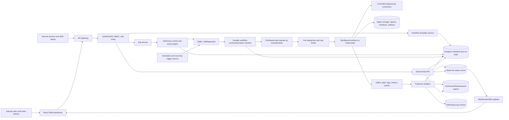
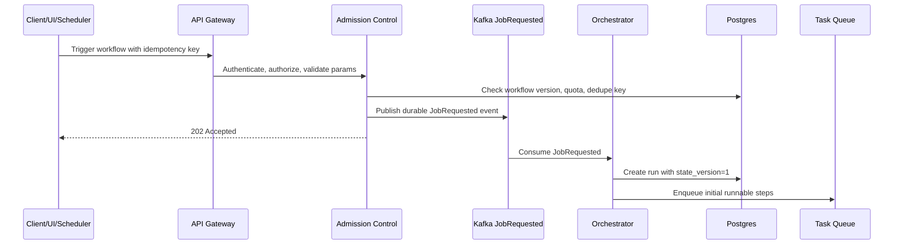
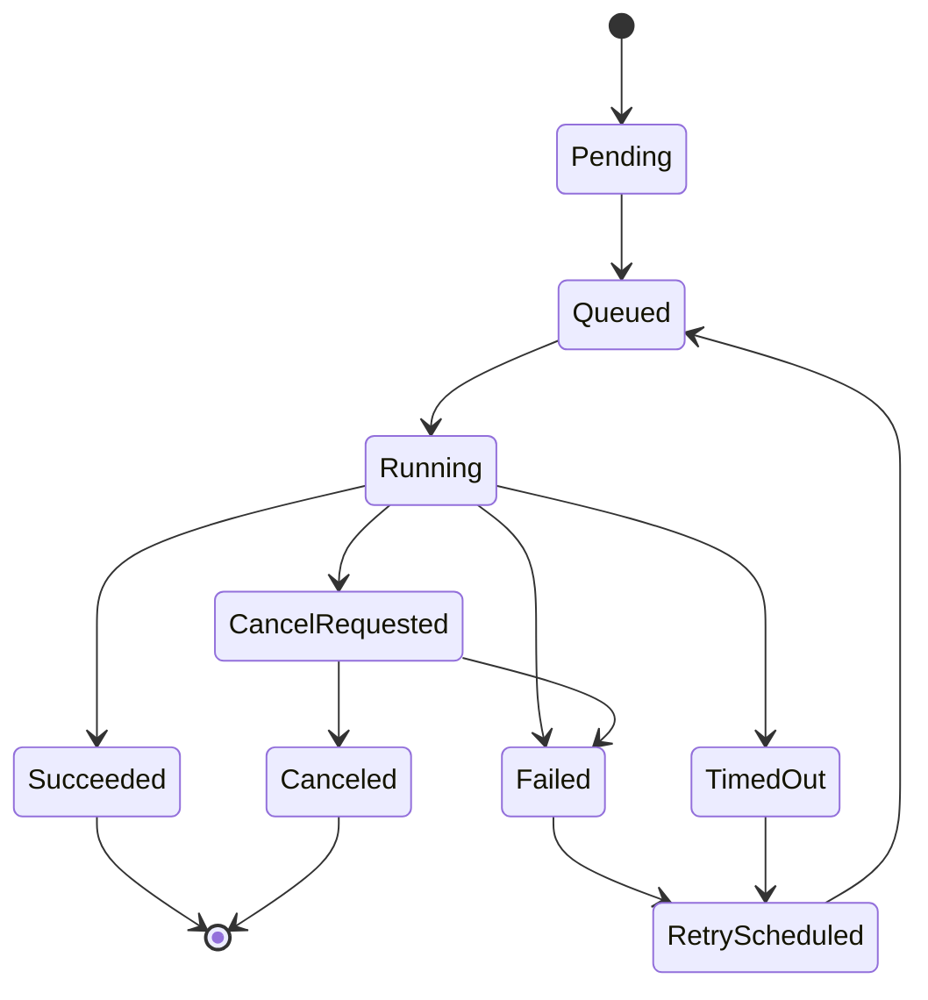
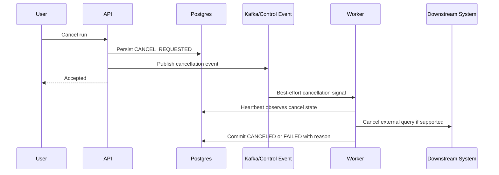
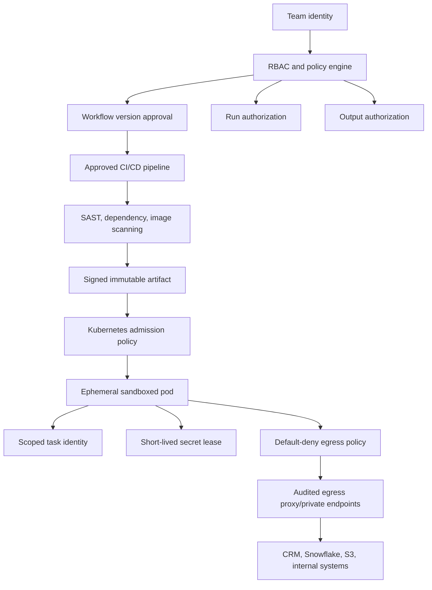
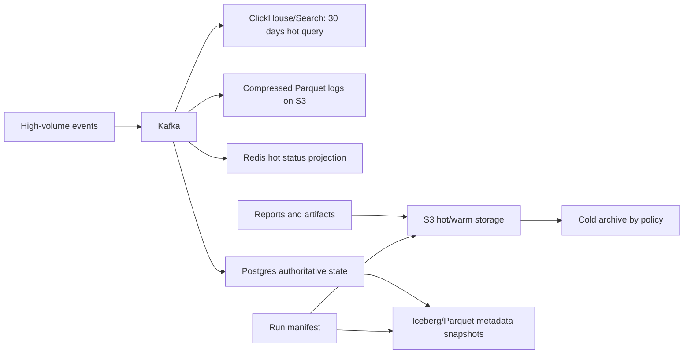

# Reference Architecture

## Architecture Summary

The platform has two major halves:

- Control plane: APIs, dashboard, RBAC, workflow metadata, versioning, quota policies, audit, and admission control.
- Data/execution plane: scheduler, durable workflow state machine, queues, dispatchers, workers, sandboxed execution, connectors, storage, logs, and telemetry.

Kafka can be an event backbone, but it is not sufficient by itself as a workflow orchestrator. The design needs a durable state machine that owns step dependencies, leases, heartbeats, retries, cancellation, timeout handling, and recovery.

## High-Level System Architecture

## Control Plane

The control plane owns the externally visible contract:

- Workflow template CRUD and immutable versioning.
- Parameter schema validation.
- Job trigger APIs with idempotency keys.
- RBAC and team-level authorization.
- Quota and priority configuration.
- Audit records.
- Dashboard and search APIs.

Postgres stores authoritative workflow definitions, active run state, state versions, quota configuration, and audit metadata. It should not store large logs, report blobs, or high-volume debug events.

## Scheduler and Trigger Path

Recurring schedules should be represented as durable schedule definitions. The scheduler periodically computes due windows, writes deduplicated trigger events, and records missed schedule recovery. A scheduled run should have a deterministic schedule key such as `workflow_id + version + scheduled_time + team_id`.

## Execution Engine

The execution engine owns durable workflow progression:

- Dispatch only runnable steps.
- Use leases and heartbeats for active task attempts.
- Record `run_id`, `step_id`, `attempt_id`, `state_version`, input manifest, output manifest, and retry policy.
- Reject invalid state transitions.
- Apply lazy fan-out expansion in bounded chunks.
- Enforce team, workflow, run, step, and downstream quotas.

Recommended task state model:

Use optimistic concurrency control or compare-and-swap updates:

- `PENDING -> RUNNING`
- `RUNNING -> SUCCEEDED`
- `RUNNING -> FAILED`
- `RUNNING -> CANCEL_REQUESTED`
- `CANCEL_REQUESTED -> CANCELED`

Do not use last-write-wins for authoritative workflow state. Out-of-order events must not regress a terminal or later state.

## Retry and Idempotency Model

For durable correctness, idempotency must exist at multiple layers:

- Job trigger idempotency: prevents duplicate runs from repeated API calls.
- Step idempotency: prevents duplicate logical work after redelivery.
- External side-effect idempotency: prevents duplicate emails, callbacks, database writes, and report publication.
- Output commit idempotency: prevents stale attempts from overwriting a valid manifest.

For object outputs, a safe pattern is:

1. Each task attempt writes to an attempt-specific temporary path.
2. Worker records checksum, size, content type, and metadata.
3. Orchestrator commits the output pointer through a compare-and-swap state transition.
4. The final manifest references only committed outputs.
5. Final consumers read from the manifest, not by listing raw object paths.

## Cancellation Model

Cancellation should be durable-state first and signal second. Redis or pub/sub can accelerate cancellation, but cannot be the source of truth. Expected behavior:

- Happy path: less than 2 seconds for cooperative cancellation.
- Heartbeat catch: 30 to 60 seconds.
- Forced termination: SIGTERM then SIGKILL for local execution, plus connector-specific cancellation for systems such as Snowflake.

## Security Architecture

Core controls:

- No arbitrary inline scripts in the control plane.
- Teams submit signed, immutable artifacts through an approved CI/CD pipeline.
- Runtime executes in ephemeral pods with CPU, memory, disk, and network limits.
- Use seccomp/AppArmor, read-only root filesystems, no privileged containers, allowed base images, and admission policies.
- Assign per-task identities; no shared default super-role.
- Fetch secrets through Vault or cloud secret manager with short leases and audit trails.
- Apply default-deny egress and allow only approved destination bindings.
- Use stronger isolation tiers such as dedicated node pools or VM groups for high-risk workloads.

## Data and Storage Model

Suggested retention:

- Intermediate artifacts: 7 days by default, shorter for high-volume temporary files.
- Final reports: 30 to 90 days hot or warm, based on classification and business policy.
- Cold reports: archive to lower-cost storage when needed.
- Logs: 30 days in query-optimized storage; older logs compressed to Parquet on object storage.
- Audit: immutable retention based on compliance policy, with checksums and object lock/WORM where required.
- Metadata: keep hot run metadata in Postgres for operational windows; archive immutable snapshots to object storage or Iceberg tables.

Cold archive retrieval may take minutes to hours depending on storage class and retrieval option. Do not promise sub-minute access unless using an appropriate warm tier.

## Dashboard Freshness

Dashboard freshness should be driven by projections rather than direct polling of authoritative tables.

- Workers emit state/log/metric events.
- Projection builders update Redis and search stores.
- UI receives WebSocket or Server-Sent Events for live updates.
- API can fall back to Postgres for authoritative detail views.
- During degraded mode, UI must label projected/cached state clearly.

## Postgres Outage Degraded Mode

If Postgres is the source of truth and becomes unavailable:

- New triggers can only be accepted if a durable `JobRequested` event is written to Kafka with an idempotency key.
- If Kafka write also fails, return retryable `503`.
- Scheduler and dispatcher pause creation of new executable work if they cannot persist required state transitions.
- Already-running workers may finish local work and write completion events to Kafka or an outbox, but final authoritative commit waits for recovery.
- Dashboard can continue showing projection state, but hard refreshes and authoritative operations degrade.
- Reconciliation replays ordered events into Postgres using `run_id`, `step_id`, `attempt_id`, and monotonic state versions.

## Automated Blast-Radius Controls

Controls should fail closed for dangerous expansion:

- Pre-flight fan-out estimation before enqueuing tasks.
- Hard caps for tasks per run, tasks per workflow, and total runnable tasks.
- Hierarchical quotas per team, workflow, run, step, priority, and downstream system.
- Token-bucket task creation and execution.
- Downstream bulkheads for Snowflake, CRM, S3, email, and callbacks.
- Circuit breakers for excessive errors, latency, or rate.
- Anomaly detection for unexpected fan-out or spend.
- Kill switches by workflow version, team, connector, and priority class.
- Budget alarms and automated pause when projected spend exceeds policy.
