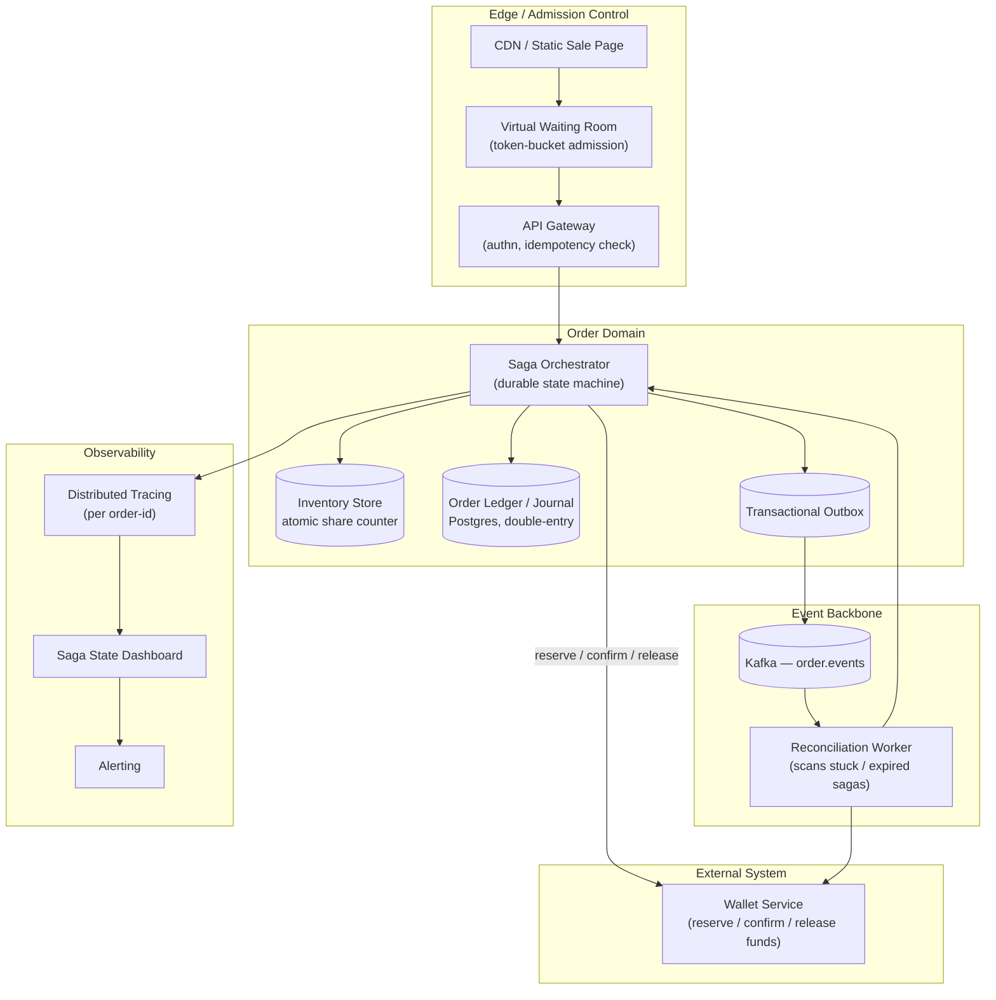
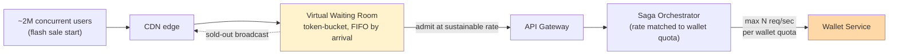
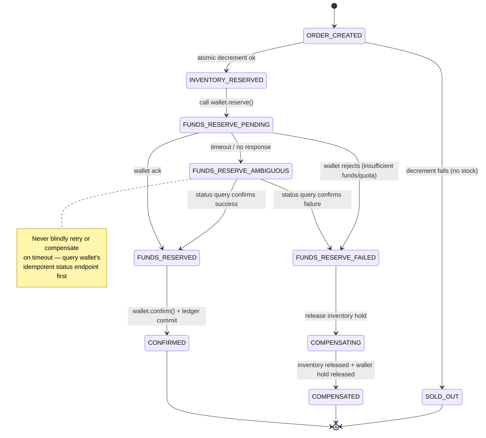
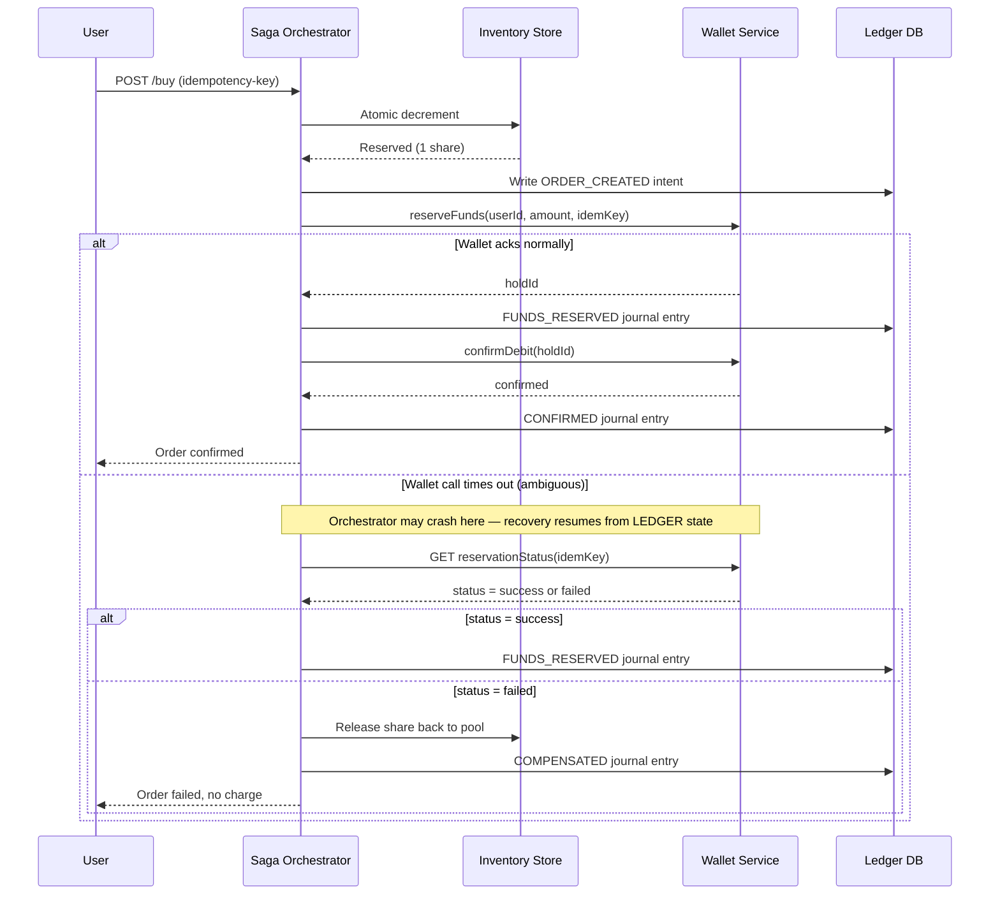

# Senior Engineering Manager / Director Interview — System Design
### "Limited Share Flash-Sale Allocation Platform" — Strong Hire Calibration

**Interviewer persona:** Principal Engineer (L7+), MAANG-caliber bar, evaluating SEM/DoE candidates on four pillars: Clarification & Scope Limitation, Requirement Blueprinting, Architectural Deep-Dives (scale/security/cost/maintainability), and Edge-Case Resilience.
**Candidate persona:** Senior EM/Director candidate — Java/Spring backend, Kafka, K8s/AKS, financial-grade consistency background.
**Format:** ~65 minutes. Deliberately vague prompt, no metrics given up front — the candidate must extract them.
**How to use this doc:** This is a model answer key, not a script to memorize. `[SIGNAL]` callouts mark exactly why a line earns credit on one of the four pillars.

---

## Phase 1 — Problem Introduction (The Ambiguity Trap)

**Interviewer:** Design a platform that sells a limited number of shares to users in a flash-sale event. Users spend money from a wallet to buy them. That's it — go.

> Note for the reader: no scale, no SLA, no compliance scope, no failure tolerance was given on purpose. A candidate who starts drawing boxes immediately is already behind.

**Candidate:** Before I draw anything, I want to spend a few minutes narrowing this down — this prompt has at least three different systems hiding inside it: a high-contention inventory problem, a payments/ledger problem, and a traffic-shaping problem for the sale moment itself. Getting the scope wrong here means designing the wrong system entirely, so I'd rather over-ask than under-ask.

> `[SIGNAL — Clarification & Scope Limitation]` States explicitly *why* clarification matters for this prompt instead of asking generic warm-up questions. Decomposes the problem into its constituent hard problems before architecting.

---

## Phase 2 — Interactive Clarification Loop

**Candidate:**

1. **Inventory shape:** Is it one global pool of N shares, or per-symbol/per-listing pools sold concurrently? Single pool is a hot-key contention problem; multiple pools is a sharding problem.
2. **Wallet boundary:** You said wallets are "handled by a different system which gives quotas." Does that mean the wallet system is the source of truth for funds, and gives *us* a rate/amount quota for how aggressively we can call it — like a partner API rate limit? Or does it mean per-user spending quotas?
3. **Allocation fairness model:** Strict first-come-first-served, or lottery/pro-rata allocation if demand exceeds supply in the same instant? This materially changes the architecture — FCFS is a queue problem, lottery is a batch problem.
4. **Failure contract:** If an order fails partway, is "no charge, no shares" always the only acceptable end state, or are partial fills allowed (e.g., partial share allocation if full quantity unavailable)?
5. **Regulatory scope:** Is this single-region/single-currency, or are we dealing with cross-border users where this looks like a securities transaction subject to KYC/AML and data residency rules?

**Interviewer:** Good list. Single global pool of shares, strict FCFS. Wallet system is external — it gives you a quota: a maximum reservation-call rate and a maximum outstanding-reservation amount per second that you must respect, or it starts rejecting you. No partial fills — full quantity or nothing. Regulatory: assume single jurisdiction for now, but I want you to flag anywhere that assumption would break the design.

**Candidate:** Good — one more, and this is the one I think is most likely to get missed: what happens to the user's money if our *own* system crashes mid-order, not just if the wallet call fails? "The wallet system fails" and "we go down after the wallet succeeded but before we recorded it" are two completely different failure classes, and the second one is the one that actually loses money in practice.

> `[SIGNAL — Clarification & Scope Limitation]` Candidate proactively surfaces the failure mode the problem statement is actually testing for (abrupt system failure vs. external dependency failure) without being told. This is the single highest-leverage question in the whole interview.

**Interviewer:** Correct instinct — that's exactly the scenario I want you to design for. Hold that thought; we'll go deep there.

**Candidate:** One thing I haven't heard you mention, and I'd normally expect a PM to bring it up — what's the target experience during the sale spike itself? Is it acceptable for users to see a queue/waiting room, or does the product require instant accept/reject at the moment of the click?

**Interviewer:** *(dropping a hint, per the "Functional & Non-Functional Drift" behavior)* Good — and notice you haven't asked about data retention or audit requirements yet, which matters a lot for a financial product. What's your assumption there?

**Candidate:** Fair catch — I was going to get to it but let me state it now: I'd assume every fund-movement event needs an immutable, append-only audit trail retained for whatever the regulator's statute of limitations is — years, not days — and that retention requirement shapes my ledger design later, not just my logging. I'll bake that in rather than treat it as an afterthought.

> `[SIGNAL]` Candidate doesn't get defensive about the hint — absorbs it immediately and explains *how* it changes the design, not just that they'll "remember" it.

---

## Phase 3 — Requirement Blueprinting (Math Before Architecture)

**Candidate:** Let me anchor some numbers so the rest of this isn't hand-wavy. I'll propose reasonable figures and you correct me.

- **Inventory:** 100,000 shares available.
- **Demand shape:** Flash sales are bursty by definition — let's say 2 million users hit the buy button within the first 10 seconds. That's a peak demand of ~200,000 requests/sec against 100,000 units of inventory — a 20:1 contention ratio at the hottest millisecond.
- **Wallet quota:** You said the wallet gives us a rate quota — let's say, for argument's sake, it can sustain 5,000 fund-reservation calls/sec before it starts throttling us. That's a **40x gap** between incoming demand and what our funds-reservation dependency can absorb. That gap is the single most important number in this whole design — it tells me I cannot let raw demand hit the wallet path directly; I need an admission-control layer in front of it that's decoupled from inventory contention.
- **Money-safety bound:** Whatever I build, the invariant is: *sum of all confirmed debits must always reconcile exactly against sum of all shares allocated, with zero unaccounted holds, even across a hard crash.* That's the bar, not "best effort."

**Interviewer:** Where do those 2,000,000 users and 5,000/sec wallet quota come from? You made them up.

**Candidate:** I did — and I want to be explicit that they're assumptions I'd validate with the wallet team and with whoever ran the last flash sale, not facts. But I need *some* number to reason about ratios, because the qualitative shape of this design — "admission control must sit upstream of the wallet call, because the wallet is the tightest constraint" — is the same whether the real ratio is 40x or 10x. I'd rather commit to a structurally correct design under a plausible assumption than wait for a number I don't have.

> `[SIGNAL — Requirement Blueprinting]` Explicitly distinguishes invented-but-reasonable estimation from fact, and — critically — explains *why the qualitative architecture is robust to the estimate being wrong*. This is the difference between a candidate doing math for show and one doing math to make a decision.

---

## Phase 4 — High-Level Architecture

**Candidate:** *(sketches)*

*Diagram 1 — High-level architecture. The waiting room exists specifically to protect the wallet quota, not just to protect our own servers.*

Walking through it: the **Virtual Waiting Room** is the load-shedding layer — it admits requests at a rate the *downstream wallet quota* can sustain, not just at a rate our own compute can sustain. The **Saga Orchestrator** owns a durable state machine per order, persisted before any external call. **Inventory** is a single atomic counter, not a row I lock pessimistically — at 200K req/sec even row locks fall over. The **Ledger** is double-entry: every fund movement is a journal entry, never an in-place balance mutation, so it's reconstructable after any crash. The **Reconciliation Worker** is the safety net that makes the "abrupt crash" failure class survivable — more on that shortly.

**Interviewer:** Why a waiting room instead of just rate-limiting at the gateway?

**Candidate:** A rate limiter at the gateway typically just rejects excess requests with a 429 — that's fine for protecting your own infra, but it's a bad user experience for a flash sale (everyone refreshes and hammers harder) and it doesn't solve the actual constraint, which is the wallet's quota, not our gateway's capacity. A waiting room **admits in order** and gives users a queue position, so the system absorbs the spike instead of shedding it chaotically, and the admission *rate* is tuned to the wallet's 5,000/sec ceiling specifically — everything behind the waiting room can assume that ceiling is already respected.

---

## Phase 5 — Deep Dive: Scale (Tricky Question Engine)

**Interviewer:** *Tricky question, tailored to your inventory design:* Your atomic counter handles the steady state fine. But what happens in the literal first 50 milliseconds of the sale — 200,000 requests landing on a single hot key for inventory decrement? Doesn't that key become a serialization bottleneck no matter what store it's in?

**Candidate:** Yes, and I want to be precise about why it's *not* the same problem as a cache stampede, because the fix is different. A cache stampede happens when a value expires and many requests race to *recompute* it — expensive, duplicated work. This is different: it's a single atomic decrement operation, which a well-implemented in-memory store (Redis with a Lua script doing compare-and-decrement) can serialize at extremely high throughput — hundreds of thousands of ops/sec — because the operation itself is O(1) and lock-free at the engine level, not application-level locking.

The real risk at 200K/sec isn't the decrement itself — it's the **network fan-in**: 200K concurrent connections hitting one logical endpoint. That's what the waiting room actually solves: by the time a request reaches the inventory decrement, it's already been admitted at a controlled rate. I'd also add a fast, cheap **pre-check**: once inventory hits zero, I broadcast a "sold out" flag to the edge/CDN layer so subsequent requests get rejected at the CDN, never even reaching the waiting room or the atomic counter — that's the cost-and-scale optimization for the tail of the sale.

> `[SIGNAL — Architectural Deep-Dive: Scale]` Correctly distinguishes a hot-key contention problem from a cache-stampede problem instead of pattern-matching the interviewer's phrasing. Proposes a specific mechanism (Lua CAS) and a specific optimization (broadcast sold-out flag) rather than a vague "we'd scale it."

*Diagram 4 — Admission control sized to the wallet's quota, not to our own capacity. The "sold-out broadcast" loop is the cost optimization: once inventory hits zero, rejection happens at the CDN edge, before a request ever reaches the queue or the orchestrator.*

**Interviewer:** What if that Redis instance holding the counter just dies mid-sale?

**Candidate:** Two layers of protection: first, it's not a single instance — I'd run it as a primary with synchronous-enough replication (or use a small Raft-backed counter service) so a failover doesn't silently reset to a stale count. Second — and this is the part people skip — every successful decrement is **also** durably logged to the ledger's outbox in the same orchestrator step before the order proceeds, so even in the worst case (counter store fully lost), I can reconstruct "how many shares were actually allocated" by replaying the ledger, which is the source of truth for money *and* the backstop source of truth for allocation count. The fast counter is an optimization; the ledger is the invariant.

> `[SIGNAL]` Names the counter as a performance optimization layered on top of a durable source of truth, rather than treating the fast path as the system of record — a senior distinction.

---

## Phase 6 — Deep Dive: Money-Safety, Sagas, and the Abrupt-Crash Failure Class

**Interviewer:** Let's go to the scenario you flagged earlier — your own system crashes mid-order. Walk me through it precisely.

**Candidate:** This is a distributed transaction across two systems I don't fully control (inventory + ledger are mine, wallet is external), so I'm using a **Saga pattern** with persisted state, not a 2-phase commit — 2PC would require the wallet team to support a transaction coordinator protocol they almost certainly don't.

*Diagram 2 — The fixed saga state machine. Every order in the system is always in exactly one of these states, persisted before any external call is made.*

The rule that makes this crash-safe: **the orchestrator writes its intent to the ledger before making the external call, and writes the result before transitioning state** — so on restart, recovery doesn't have to guess. It scans for orders stuck in a non-terminal state past a timeout and asks one question: "what actually happened on the wallet side?" — never "what do I assume happened."

**Interviewer:** That's the part I want to pressure-test. The wallet call times out — you genuinely don't know if it succeeded. Most candidates either retry blindly, which risks a double-debit, or compensate immediately, which risks under-charging if it actually succeeded. What do you do?

**Candidate:** Neither — I do neither of those because both assume information I don't have. The wallet's reservation API has to support an idempotency key on the *write* (`reserveFunds(userId, amount, idempotencyKey)`), and I require it to expose a **read-your-write status query** (`GET /reservations/{idempotencyKey}`). On ambiguous timeout, the orchestrator's recovery step calls that status endpoint, not the reservation endpoint again. The response is authoritative: succeeded, failed, or still-processing (in which case I back off and poll, bounded by a max wait before escalating to manual review). This turns "I don't know" into "I asked the source of truth" — which is the only safe move in a distributed transaction with an ambiguous outcome.

*Diagram 3 — Happy path and the ambiguous-timeout recovery path. The crash-recovery property comes from the ledger write happening before the external call, not after.*

If the orchestrator process itself dies between sending the reservation call and recording the result, that's fine — on restart, a recovery sweep finds the order still in `FUNDS_RESERVE_PENDING` past its timeout and runs exactly the same status-query logic. The crash is invisible to correctness; it only costs latency.

> `[SIGNAL — Architectural Deep-Dive + Edge-Case Resilience]` This is the model answer to the hardest sub-problem in the prompt: refuses the false binary of "retry or compensate," names the actual mechanism (idempotent status query), and shows the crash-recovery path is the *same* logic as the live-timeout path — not a special case bolted on.

---

## Phase 7 — Deep Dive: Security (Tricky Question Engine)

**Interviewer:** You're moving real money. How does this hold up under a zero-trust model, especially if this expands to users across sovereign boundaries?

**Candidate:** A few layers:

- **Service-to-service trust:** The Saga Orchestrator and the Wallet Service authenticate via mTLS with short-lived, scoped service tokens — the orchestrator gets a token that can only call `reserve`/`confirm`/`release` for this product line, nothing broader. I don't want a compromised orchestrator instance to have wallet-admin-equivalent access.
- **Replay protection:** Every wallet call carries the idempotency key *and* a signed request timestamp; the wallet service rejects stale or replayed signatures, independent of the idempotency dedup logic — those are two different defenses for two different threats (retries vs. attacks).
- **Audit immutability:** The ledger is append-only at the storage layer — no UPDATE/DELETE grants for the application's service account, only INSERT. Corrections happen via new compensating journal entries, never edits. That's both a security property and the thing that makes us reconcilable later.
- **Data residency / sovereignty:** If this expands cross-border, the part that breaks is the ledger and any PII tied to it — I'd need region-pinned ledger replicas with no cross-region replication of the raw journal for residency-bound users, and the reconciliation worker would need to run per-region rather than globally. I'd flag that as a real re-architecture, not a config flag — exactly the kind of assumption you asked me to surface earlier.
- **Fraud/bot defense:** The waiting room is also my first fraud control — token-bucket admission per user/device fingerprint, not just per IP, since bots distribute across IPs but reuse fewer device signatures.

> `[SIGNAL — Architectural Deep-Dive: Security]` Separates replay protection from idempotency deliberately (a common conflation), ties audit immutability back to the earlier compliance hint instead of treating it as a new topic, and is honest that cross-border expansion is a genuine re-architecture rather than minimizing it.

---

## Phase 8 — Deep Dive: Cost (Tricky Question Engine)

**Interviewer:** Your design has the orchestrator, inventory, and ledger potentially in different failure domains, and you mentioned region-pinning for compliance. How do you keep cross-region/cross-AZ data transfer costs down without weakening the consistency guarantees you just spent ten minutes building?

**Candidate:** The expensive traffic pattern to avoid is chatty synchronous cross-region calls on the hot path — so I keep the orchestrator, inventory counter, and ledger primary **co-located in a single region/AZ-set** for any given sale; I don't shard the hot path across regions just for the sake of "global scale," because the consistency cost of doing that would be far higher than the egress savings. Replication to other regions is **asynchronous** and exists for disaster recovery and regional read-replicas of the ledger (for the reconciliation worker and reporting), not for the transactional path itself.

Where I would spend money deliberately: the waiting room and CDN layer *should* be globally distributed at the edge, since that traffic is read-heavy and latency-sensitive — that's where edge compute earns its cost. And I'd run the burst-absorption tier (waiting room, gateway) on horizontally-autoscaled, possibly spot/preemptible compute, since it's stateless and disposable, while keeping the orchestrator/ledger path on stable, non-preemptible nodes — losing a wallet-reservation mid-call to a spot reclaim is not a cost tradeoff I'm willing to make.

> `[SIGNAL — Architectural Deep-Dive: Cost]` Distinguishes which tiers are safe to run cheaply (stateless, disposable) from which are not (anything touching money mid-transaction), instead of applying one cost strategy uniformly — and explicitly states the consistency-vs-cost tradeoff he's refusing to make.

---

## Phase 9 — Deep Dive: Maintainability (Tricky Question Engine)

**Interviewer:** It's 2am, an on-call engineer gets paged because order confirmations have stalled. This system spans a gateway, a waiting room, an orchestrator, inventory, Kafka, and an external wallet team's service. How do they find the actual problem in under five minutes?

**Candidate:** Two things have to already exist before the page fires, or five minutes is impossible:

1. **One correlation ID per order, propagated everywhere** — gateway, orchestrator, Kafka event headers, and included in every wallet API call as a request header. OpenTelemetry tracing stitches the whole journey into one trace, so the very first thing on-call does is pull up *any* stalled order's trace, not grep five services' logs.
2. **A saga-state dashboard**, not a generic services dashboard — a live view grouped by saga state (`how many orders are stuck in FUNDS_RESERVE_PENDING right now, and for how long`). If that number spikes, the on-call engineer immediately knows the stall is at the wallet boundary, without reading a single log line — the state machine itself is the diagnostic tool.

From there it's a binary search, not detective work: dashboard says stuck-at-wallet → check wallet service health/rate-limit dashboard (probably someone else's on-call, paged via a clear ownership boundary) → if wallet is healthy, check our own outbox lag on Kafka → if outbox is backed up, it's our infra, not the dependency. Each step has an unambiguous next owner. That ownership clarity is itself a maintainability decision I'd make at design time, not something I'd leave for the runbook to improvise.

> `[SIGNAL — Architectural Deep-Dive: Maintainability]` Treats the saga state machine itself as the primary debugging tool rather than relying on log archaeology, and explicitly designs the on-call escalation path (who gets paged next) as part of the architecture, not as a separate process document.

---

## Phase 10 — Edge-Case Resilience: Rapid-Fire Curveballs

**Interviewer:** Quick-fire round. I'll throw scenarios, you tell me the failure mode and the fix in under 30 seconds each.

**Curveball 1 — "User double-clicks buy, two requests fire with the same idempotency key but race each other to the orchestrator."**
**Candidate:** Idempotency key has a uniqueness constraint at the database level on order creation — the second request gets a constraint violation, not a duplicate order, and is short-circuited to return the same result as the first. This has to be enforced at the DB, not just in application logic, because two app instances could both think they're "first."

**Curveball 2 — "Wallet team tells you they're about to deploy and your reservation calls will fail for 90 seconds."**
**Candidate:** That's a planned degradation, so the waiting room pauses admission for that window rather than admitting users into orders that will fail — better to widen the queue than to generate a wave of compensating transactions. This is exactly why admission control needs a manual "pause intake" lever, not just an automatic one.

**Curveball 3 — "Reconciliation worker finds a ledger entry showing FUNDS_RESERVED with no matching CONFIRMED or COMPENSATED after 1 hour — what happened, and what do you do?"**
**Candidate:** That's a stuck saga the recovery sweep should have caught — either the sweep itself is broken, or the order's timeout was set too long. Immediate action: treat it like the ambiguous-timeout case — query the wallet's status endpoint for ground truth, resolve to CONFIRMED or COMPENSATED accordingly, and separately page on-call because a stuck-saga sweep failing silently is itself the bug to fix, not just this one order.

**Curveball 4 — "Two shares are accidentally allocated for the same single remaining unit due to a bug — found a day later."**
**Candidate:** This is why the ledger is the source of truth and not the fast counter — I reconstruct exactly which two orders raced from the journal's timestamps and sequence, and the resolution is a business decision (refund one, or honor both if inventory allows a one-unit overcommit) — but the *system's* job is to make that incident fully reconstructable and auditable, never silently lossy. I'd also treat it as a sev-1 postmortem on the atomic-decrement implementation, since it shouldn't be possible if the CAS logic is correct.

> `[SIGNAL — Edge-Case Resilience]` Consistent answers across all four curveballs: never guesses, always falls back to the ledger as ground truth, and distinguishes "what the system should auto-resolve" from "what's a human/business decision" — that boundary is exactly right for a financial system.

---

## Phase 11 — Candidate's Closing Questions

**Candidate:**
1. Is the wallet team's quota a hard contract with an SLA, or a best-effort number that's changed without notice in the past? That changes how defensively I'd build the backpressure logic.
2. Has there been a past incident with a flash sale or similar burst event I should know the shape of?
3. Who owns the reconciliation worker operationally — is it considered part of the critical path on-call rotation, or a batch job nobody pages on? I'd push for the former given what it protects.

**Interviewer:** Fair questions, and that last one is a real gap in how we run it today.

**Candidate:** That's useful to know — I'd make closing that gap one of my first 30-day priorities, since the reconciliation worker is the thing standing between "a bug" and "lost money," and that shouldn't be a job nobody's on the hook for.

---

## Phase 12 — Closing Scorecard

| Pillar | Evidence | Rating |
|---|---|---|
| **Clarification & Scope Limitation** | Decomposed the prompt into three sub-problems before designing; surfaced the abrupt-crash failure class unprompted; absorbed the audit-retention hint and explained its design impact immediately | Strong |
| **Requirement Blueprinting** | Derived the 40x demand-vs-wallet-quota gap and used it to justify the single most important architectural decision (admission control upstream of wallet calls); explicit about estimate vs. fact | Strong |
| **Architectural Deep-Dive — Scale** | Correctly distinguished hot-key contention from cache stampede; named counter-as-optimization vs. ledger-as-source-of-truth | Strong |
| **Architectural Deep-Dive — Security** | Separated replay protection from idempotency; honest about cross-border being a real re-architecture, not a flag | Strong |
| **Architectural Deep-Dive — Cost** | Tiered cost strategy by criticality (disposable edge vs. non-negotiable transactional path); explicit refusal of an unsafe tradeoff | Strong |
| **Architectural Deep-Dive — Maintainability** | Saga state itself as the primary diagnostic tool; designed on-call ownership boundaries as part of the architecture | Strong |
| **Edge-Case Resilience** | Four rapid-fire curveballs answered with one consistent mental model (ledger as ground truth, never guess); correctly separated system auto-resolution from human business decisions | Strong |

**Recommendation: Strong Hire.**
One-line rationale: every deep-dive answer, regardless of pillar, resolved back to the same two invariants stated in Phase 3 — *never act on an assumption when ground truth is queryable* and *the ledger is the only thing allowed to be authoritative about money.* That consistency under pressure, across security, cost, scale, and failure questions, is the actual signal this interview is designed to detect.

---

## Coaching Notes for Reuse (meta-layer)

1. **State your invariants out loud, early, in Phase 3** — not as a throwaway line, but as something you visibly return to in every later answer. The scorecard above is built almost entirely around the candidate doing exactly that.
2. **On any "it timed out, what do you do" question, the answer is never retry-or-compensate** — it's "query the authoritative source for ground truth first." This single move resolves at least three different curveballs in this transcript.
3. **Separate the fast/cheap layer from the durable/authoritative layer explicitly**, every time — inventory counter vs. ledger, replay protection vs. idempotency, disposable compute vs. non-preemptible compute. Naming the distinction is worth more than the individual technical fact.
4. **When asked about cost or scale, name what you're explicitly refusing to optimize and why** — "I won't run the transactional path on spot instances even though it's cheaper" reads as judgment; optimizing everything uniformly reads as not having judgment.
