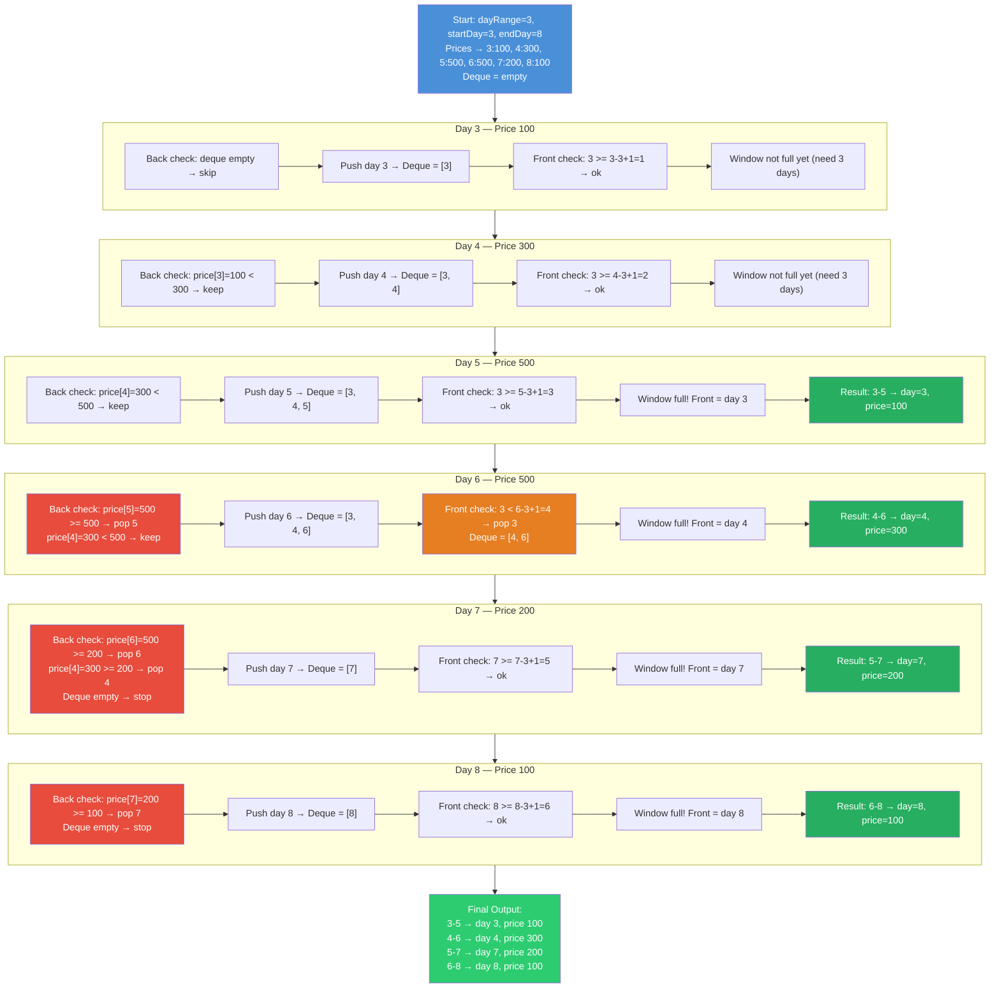

# Cheapest Flights in a Sliding Window

## Problem Statement

Given a range of days (`startDay` to `endDay`), each with a flight price, find the **cheapest flight (day and price)** for every consecutive window of `dayRange` days.

### Function Signature

```java
Map<String, Map<String, Integer>> getCheapestFlights(int dayRange, int startDay, int endDay)
```

### Example

```
getCheapestFlights(3, 3, 8)

Day:     3    4    5    6    7    8
Price:  100  300  500  500  200  100

Window "3-5" → days [3,4,5] → prices [100,300,500] → cheapest: day 3, price 100
Window "4-6" → days [4,5,6] → prices [300,500,500] → cheapest: day 4, price 300
Window "5-7" → days [5,6,7] → prices [500,500,200] → cheapest: day 7, price 200
Window "6-8" → days [6,7,8] → prices [500,200,100] → cheapest: day 8, price 100
```

### Expected Output

```
{
  "3-5": {"day": 3, "price": 100},
  "4-6": {"day": 4, "price": 300},
  "5-7": {"day": 7, "price": 200},
  "6-8": {"day": 8, "price": 100}
}
```

---

## Approach 1 — Brute Force

For each window, iterate through all `dayRange` elements and find the minimum.

```java
for (int i = startDay; i <= endDay - dayRange + 1; i++) {
    int minPrice = Integer.MAX_VALUE;
    int minDay = i;
    for (int j = i; j < i + dayRange; j++) {
        if (flights.get(j).get("price") < minPrice) {
            minPrice = flights.get(j).get("price");
            minDay = j;
        }
    }
    // store result for window i to i+dayRange-1
}
```

### Complexity

| Metric | Value |
|--------|-------|
| Time   | O(n * k) where n = number of days, k = dayRange |
| Space  | O(1) extra (beyond the result map) |

### Pros

- Simple to understand and implement.
- No additional data structures needed.
- Easy to debug and verify correctness.

### Cons

- Redundant work — each element is compared up to `k` times across overlapping windows.
- Becomes slow when `dayRange` is large (e.g., k = 10,000 over n = 100,000 days → 10^9 operations).

---

## Approach 2 — Monotonic Deque (Optimal)

Use a double-ended queue (deque) that maintains day indices in **increasing order of price** from front to back. The front of the deque always holds the index of the cheapest day in the current window.

### Algorithm

1. For each day (left to right):
   - **Remove from back**: pop all days from the deque whose price >= current day's price. They can never be the minimum while the current day is in the window.
   - **Add current day** to the back of the deque.
   - **Remove from front**: pop days that have fallen outside the current window.
   - **Record result**: once a full window is formed, the front of the deque is the answer.

### Why It Works

Each day enters the deque once and leaves at most once (either from the front when it expires, or from the back when a cheaper day arrives). This amortizes to O(1) per day.

### Complexity

| Metric | Value |
|--------|-------|
| Time   | O(n) — each element is pushed and popped at most once |
| Space  | O(k) — the deque holds at most `dayRange` elements |

### Pros

- Optimal time complexity — can't do better since every price must be examined at least once.
- Efficient even for very large inputs (n = 10^6, k = 10^5 is trivial).
- Each element is processed at most twice (one push, one pop).

### Cons

- Slightly more complex to implement and reason about.
- Requires understanding of the monotonic deque pattern.
- Harder to debug if the deque invariant is broken.

### Step-by-Step Visualization — `getCheapestFlights(3, 3, 8)`



---

## Comparison

| Criteria         | Brute Force | Monotonic Deque |
|------------------|-------------|-----------------|
| Time Complexity  | O(n * k)    | O(n)            |
| Space Complexity | O(1)        | O(k)            |
| Implementation   | Simple      | Moderate         |
| Best for         | Small k     | Any input size   |

---

## How to Run

```bash
javac src/Main.java -d out
java -cp out Main
```
