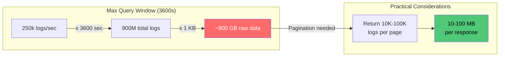

# 01 — Requirements & Capacity Estimates

## Functional Requirements

1. **POST `/logs`** — Accept a log entry from any microservice and persist it to MySQL
2. **GET `/logs?from=X&to=Y`** — Retrieve log entries within a timestamp range
   - Maximum window: `to - from <= 3600` seconds (1 hour)
   - Results ordered by timestamp

## Non-Functional Requirements

| Requirement | Target |
|---|---|
| Write throughput | 250k RPS sustained (baseline, can burst higher) |
| Write acknowledgment | 202 Accepted (async persistence is fine) |
| Read latency (P99) | Multi-second acceptable |
| Data durability | Small data loss tolerable (2-3s window on crash) |
| Retention | 6 months |
| Persistent store | MySQL only (transient buffers allowed) |

## Clarifying Assumptions

- Log entries are **append-only** — no updates or deletes (except retention purge)
- No need to filter by `service`, `level`, or `message` content in GET queries
- Microservices produce logs at variable rates; the 250k RPS is the aggregate baseline
- Clock skew across services is bounded to a few seconds (NTP-synchronized)
- No real-time alerting or streaming — this is a store-and-query system

## Back-of-Envelope Calculations

### Write Throughput

```
250,000 logs/sec x 1 KB/log = 250 MB/sec = 0.25 GB/sec
```

### Daily Volume

```
250 MB/sec x 86,400 sec/day = 21,600,000 MB/day
                              = 21,600 GB/day
                              ≈ 21.09 TB/day
```

### Monthly Volume (30 days)

```
21.09 TB/day x 30 = 632.81 TB/month ≈ 633 TB/month
```

### 6-Month Volume (Raw)

```
633 TB x 6 = 3,796 TB ≈ 3.8 PB
```

### Storage with InnoDB Overhead

InnoDB adds ~30-40% overhead for row headers, page structure, undo logs, and B-tree internal nodes:

```
3.8 PB x 1.35 = 5.13 PB (with InnoDB overhead)
```

### Storage with Compression

Using `ROW_FORMAT=COMPRESSED, KEY_BLOCK_SIZE=8` typically achieves 2-3x compression on text-heavy log data:

```
5.13 PB / 2 = 2.57 PB (compressed, conservative estimate)
5.13 PB / 3 = 1.71 PB (compressed, optimistic estimate)
```

**Working estimate: ~2.6 PB compressed over 6 months.**

### Index Overhead

Primary index on `(id, ts)`:

```
Index entry ≈ 16 bytes (BIGINT id) + 8 bytes (DATETIME) + 6 bytes (pointer) = 30 bytes
250,000/sec x 30 bytes = 7.5 MB/sec of index writes
Per day: 7.5 MB x 86,400 = 648 GB/day
6 months: 648 GB x 180 = ~116 TB of index data
```

This is included in the InnoDB overhead estimate above.

### Network Bandwidth

```
Ingestion:  250 MB/sec inbound to API layer
Kafka:      250 MB/sec producer → 250 MB/sec consumer = 500 MB/sec internal
MySQL:      ~250 MB/sec write (spread across shards)
Query:      Variable, but bounded by 3600s window
            Max query result: 250,000 logs/sec x 3,600 sec = 900M logs
            At 1 KB each = 900 GB per query (worst case, needs pagination)
```

### Query Result Size



> **Note:** A 3600-second query window could theoretically return 900M rows. The GET endpoint **must** support pagination (limit/offset or cursor-based) to avoid OOM on both server and client.

### Summary Table

| Metric | Value |
|---|---|
| Write rate | 250 MB/sec |
| Daily volume | ~21.1 TB |
| Monthly volume | ~633 TB |
| 6-month volume (raw) | ~3.8 PB |
| 6-month volume (compressed) | ~2.6 PB |
| Total log entries (6 months) | ~3.89 trillion rows |
| Max rows per 1-hour query | ~900 million |
| Index data (6 months) | ~116 TB |
