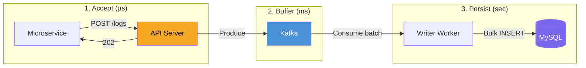
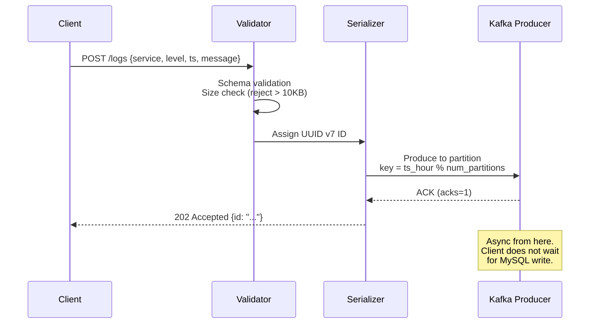
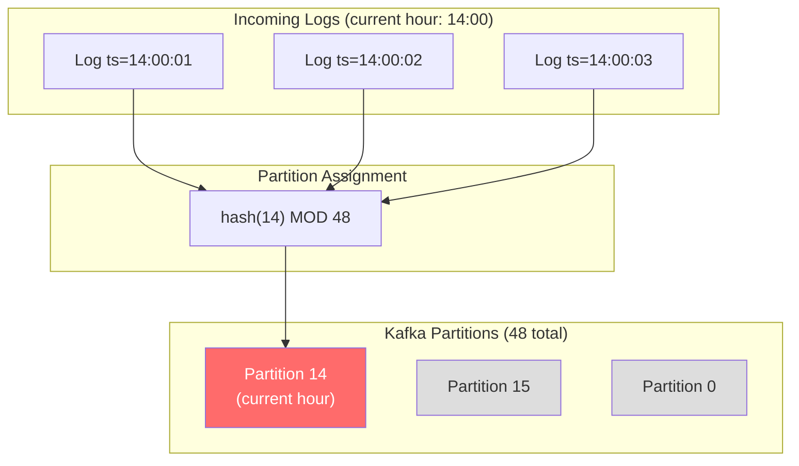
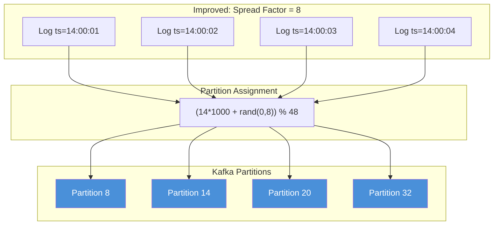
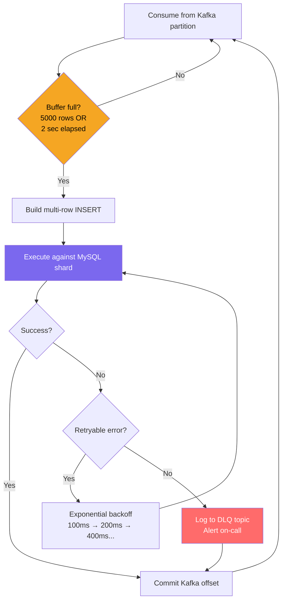
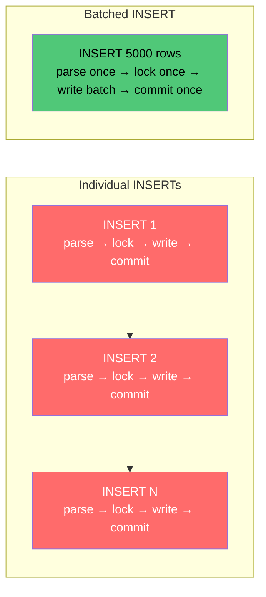
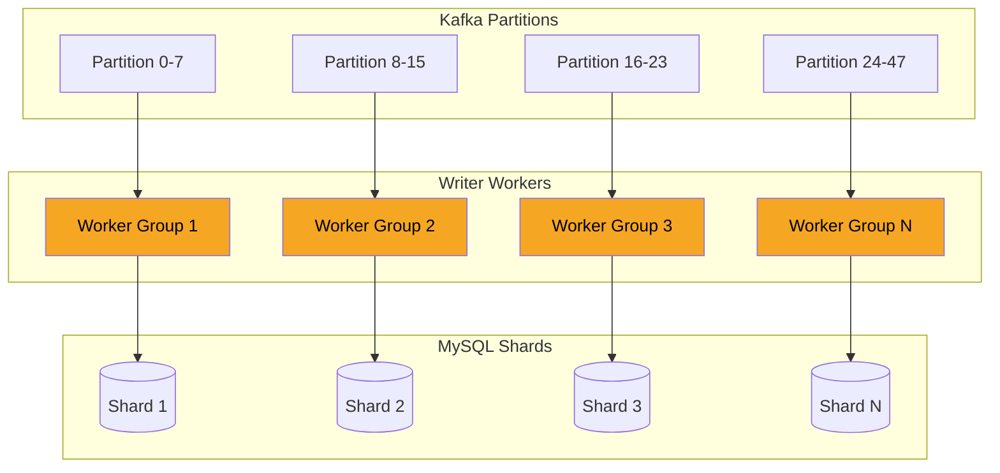
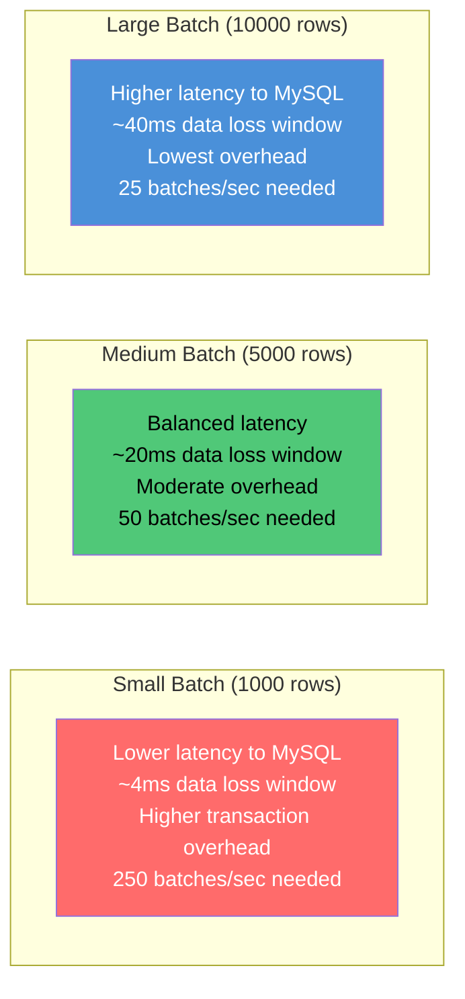

# 02 — Write Path Deep Dive

## Overview

The write path is designed around three principles:
1. **Decouple ingestion from persistence** — API responds immediately, MySQL writes happen async
2. **Absorb bursts** — Kafka acts as a shock absorber between variable-rate producers and fixed-rate MySQL consumers
3. **Maximize MySQL efficiency** — Batch inserts to amortize transaction overhead



## Layer 1: API Servers

### Responsibilities

1. Accept HTTP POST request
2. Validate payload structure (reject malformed entries)
3. Assign a UUID v7 (time-ordered) as the log ID
4. Serialize and produce to Kafka
5. Return 202 Accepted

### Why UUID v7?

UUID v7 embeds a timestamp prefix, making it **monotonically increasing** and friendly to B-tree inserts. This avoids the random-write penalty of UUID v4 which causes page splits in InnoDB.

```
UUID v7 structure:
┌──────────────────┬────────┬──────────────┐
│ 48-bit timestamp │ 4-bit  │ 76-bit       │
│ (ms precision)   │ version│ random       │
└──────────────────┴────────┴──────────────┘
```

### Sizing

```
Single API server throughput: ~30-50k RPS (Go/Rust, fire-and-forward)
Required servers: 250,000 / 35,000 ≈ 8 servers (baseline)
With headroom for bursts: 10-12 servers
```

### Request Flow



### Trade-off: `acks=1` vs `acks=all`

| Setting | Durability | Latency | Throughput |
|---|---|---|---|
| `acks=0` | Fire-and-forget, can lose data | ~0.5ms | Highest |
| `acks=1` | Leader acknowledged | ~2-5ms | High |
| `acks=all` | All ISR replicas acknowledged | ~10-20ms | Lower |

**Choice: `acks=1`** — The leader acknowledges the write. If the leader crashes before replicating, we lose that batch. Since we tolerate small data loss, this is the right trade-off. `acks=all` would add 5-15ms to every POST response for durability we don't need.

---

## Layer 2: Kafka Buffer

### Topic Design

```
Topic: logs
Partitions: 48-64
Replication Factor: 3
Retention: 72 hours
```

### Partition Strategy

**Key: `timestamp_hour MOD num_partitions`**



**Problem:** All traffic for the current hour hits the same partition — hot partition.

**Solution:** Use `timestamp_hour * 1000 + random(0, spread_factor) MOD num_partitions` where `spread_factor` is 8-16. This distributes current-hour traffic across multiple partitions while keeping temporal locality.



### Why 72-Hour Retention?

Kafka retention serves as a **replay buffer**, not long-term storage. 72 hours gives us:

- **MySQL maintenance window**: If a shard needs failover (promote replica, repair), we have 3 days to catch up
- **Reprocessing**: If writer workers had a bug, fix and replay from Kafka offsets
- **Burst absorption**: If MySQL can't keep up temporarily, Kafka absorbs the backlog

### Kafka Broker Sizing

```
Data rate:       250 MB/sec inbound
Replication:     x3 = 750 MB/sec total disk write
72h retention:   250 MB/sec x 72h x 3600 = 64.8 TB per replica
                 x 3 replicas = ~194.4 TB total Kafka storage
Broker count:    5-7 brokers (each with ~30 TB SSD)
```

---

## Layer 3: Writer Workers

### Core Loop



### Batching Strategy

Each writer worker accumulates rows in memory and flushes when **either** threshold is met:

```
Flush Trigger:
  row_count >= 5000   (row threshold)
  OR
  elapsed   >= 2s     (time threshold, prevents stale data in low-traffic periods)
```

**The generated SQL:**

```sql
INSERT INTO logs (id, ts, service, level, message)
VALUES
  (uuid1, '2024-06-15 10:30:00.123', 'payment-svc', 3, 'Connection timeout...'),
  (uuid2, '2024-06-15 10:30:00.124', 'auth-svc', 1, 'User login success...'),
  ... (5000 rows)
;
```

### Why Multi-Row INSERT?



| Approach | Transactions/sec needed | InnoDB fsync calls | Network round trips |
|---|---|---|---|
| 1 row per INSERT | 250,000/sec | 250,000/sec | 250,000/sec |
| 5,000 rows per INSERT | 50/sec | 50/sec | 50/sec |

**5000x reduction** in transaction overhead, fsync calls, and network round trips. This is what makes MySQL viable at this scale.

### Worker-to-Shard Affinity

Each writer worker is assigned to **exactly one MySQL shard**. This avoids:
- Cross-shard connection pool bloat
- Distributed transaction complexity
- Unpredictable load distribution



### Dead Letter Queue (DLQ)

Rows that fail after max retries (e.g., schema mismatch, data too large) are sent to a separate Kafka topic `logs-dlq` for manual inspection. This prevents a single bad row from blocking the entire partition.

### Writer Worker Sizing

```
Global batch rate:   250,000 / 5,000 = 50 batches/sec
Per shard (N=40):    50 / 40 = 1.25 batches/sec per shard
Workers per shard:   2 (for redundancy during rebalances)
Total workers:       40 x 2 = 80 worker instances
                     (but lightweight — 2-4 cores, 8 GB RAM each)
```

### Trade-off: Batch Size vs. Data Loss Window



**Choice: 5,000 rows.** The data loss window on worker crash is ~20ms worth of data (5000 rows in the in-memory buffer), which is within our tolerance. Going larger gives diminishing returns on transaction overhead reduction.
