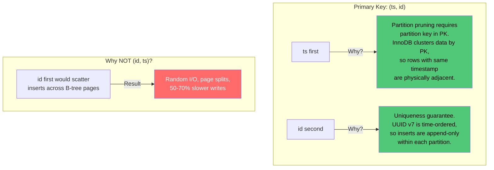
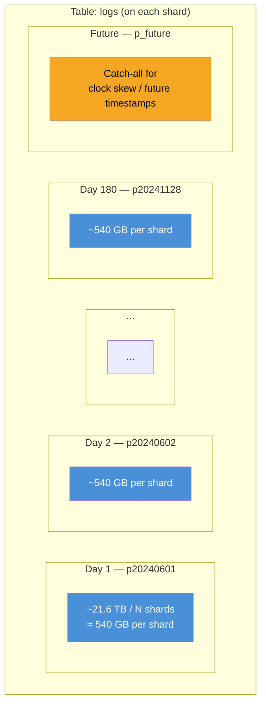
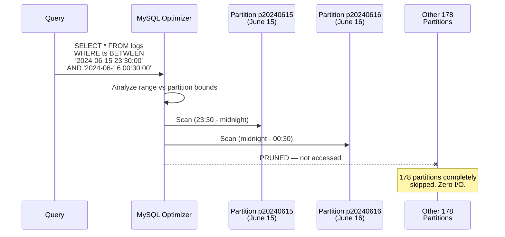
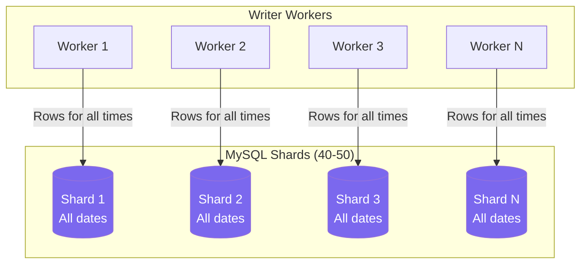
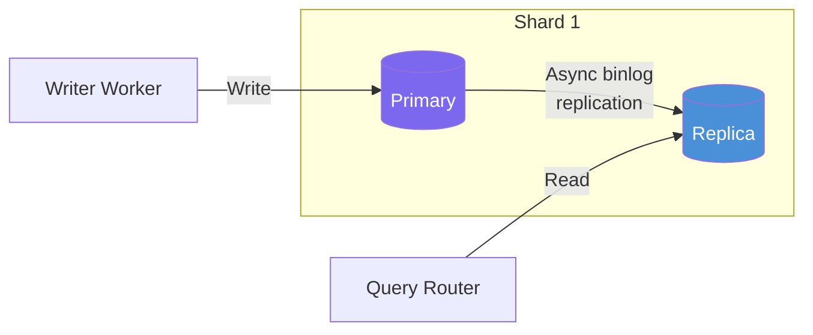

# 03 — MySQL Storage Design Deep Dive

## The Core Challenge

MySQL was not designed for 250 MB/sec sustained writes with petabyte-scale storage. Making it work requires a carefully layered strategy:

1. **Horizontal sharding** — Distribute load across many instances
2. **RANGE partitioning** — Enable efficient time-range queries and O(1) retention purge
3. **Minimal indexing** — Every index doubles write amplification
4. **Compression** — Trade CPU for storage on text-heavy log data

---

## Schema Design

```sql
CREATE TABLE logs (
    id         BINARY(16)      NOT NULL,  -- UUID v7 stored as binary (16 bytes vs 36 for VARCHAR)
    ts         DATETIME(3)     NOT NULL,  -- millisecond precision
    service    VARCHAR(128)    NOT NULL,
    level      TINYINT UNSIGNED NOT NULL, -- 0=TRACE,1=DEBUG,2=INFO,3=WARN,4=ERROR,5=FATAL
    message    TEXT            NOT NULL,
    PRIMARY KEY (ts, id)                  -- ts first for partition pruning, id for uniqueness
) ENGINE=InnoDB
  ROW_FORMAT=COMPRESSED
  KEY_BLOCK_SIZE=8
  PARTITION BY RANGE (TO_DAYS(ts)) (
    PARTITION p20240601 VALUES LESS THAN (TO_DAYS('2024-06-02')),
    PARTITION p20240602 VALUES LESS THAN (TO_DAYS('2024-06-03')),
    PARTITION p20240603 VALUES LESS THAN (TO_DAYS('2024-06-04')),
    -- ... one partition per day, 180 partitions total
    PARTITION p_future  VALUES LESS THAN MAXVALUE
  );
```

### Schema Design Decisions



### Why `BINARY(16)` for UUID?

| Storage | Size | Index Impact |
|---|---|---|
| `CHAR(36)` | 36 bytes | Large B-tree, more page splits |
| `VARCHAR(36)` | 37 bytes | Same + length prefix overhead |
| `BINARY(16)` | 16 bytes | Compact B-tree, fewer pages, faster comparisons |

At 3.89 trillion rows over 6 months, this saves **~78 TB** of storage on the primary key alone.

### Why `TINYINT` for Log Level?

`ENUM` creates a string-to-int mapping stored in the `.frm` file. Schema changes to add a new level require `ALTER TABLE`. `TINYINT` is equally compact (1 byte) and adding new levels is just a convention change, no DDL required.

### No Secondary Indexes

**Deliberate omission.** Every secondary index in InnoDB:
- Stores a copy of the primary key in each leaf node (for bookmark lookup)
- Doubles write amplification (insert into table + insert into each index)
- At 250k RPS, each index adds ~7.5 MB/sec of write I/O

Since the only query pattern is `WHERE ts BETWEEN X AND Y`, the clustered primary key `(ts, id)` handles it directly. No secondary index needed.

---

## Partitioning Strategy

### RANGE Partitioning by Day



### Why Daily Granularity?

| Granularity | Partition Count (6 months) | Size per Partition per Shard | Pros | Cons |
|---|---|---|---|---|
| **Hourly** | 4,320 | ~22.5 GB | Fine-grained pruning | Exceeds MySQL's comfortable partition limit (~1000-2000) |
| **Daily** | 180 | ~540 GB | Manageable count, good pruning | Slightly coarser scans |
| **Weekly** | 26 | ~3.78 TB | Very few partitions | 1-hour query scans a large partition |

**Daily is the sweet spot.** 180 partitions is well within MySQL limits, and within each partition, the B-tree index on `ts` efficiently handles the 3600-second query window.

### Partition Pruning in Action



A 3600-second query window spans **at most 2 daily partitions** (when it crosses midnight). The other 178 partitions are never touched.

### Retention Management

```mermaid
flowchart LR
    subgraph "Daily Cron Job"
        A[Check oldest partition] --> B{Age > 180 days?}
        B -->|Yes| C["ALTER TABLE logs<br/>DROP PARTITION p20240101"]
        B -->|No| D[Skip]
        C --> E["Add tomorrow's partition<br/>ALTER TABLE logs<br/>ADD PARTITION p20241201..."]
    end

    subgraph "Performance Impact"
        C -->|O(1)| F["Instant.<br/>Drops the .ibd file.<br/>No row-by-row delete.<br/>No undo log generation.<br/>No table lock."]
    end

    style C fill:#50c878,color:#000
    style F fill:#50c878,color:#000
```

**`DROP PARTITION` vs `DELETE FROM`:**

| Operation | Duration | Lock | Undo Log | Disk I/O |
|---|---|---|---|---|
| `DROP PARTITION` | Milliseconds | Metadata lock only | None | Unlinks file |
| `DELETE FROM logs WHERE ts < X` | Hours-Days | Row locks | Massive | Reads every row |

At 540 GB per partition per shard, `DELETE` would take hours and generate hundreds of GB of undo logs. `DROP PARTITION` is the only viable approach.

---

## Sharding Strategy

### Why Shard?

A single MySQL instance cannot handle:
- **Storage:** 2.6 PB compressed doesn't fit on one machine
- **Write I/O:** Even batched, 250 MB/sec exceeds single-instance SSD throughput
- **Buffer pool pressure:** InnoDB buffer pool can't cache the working set

### Shard Key: Round-Robin (Write-Distributed)



**Every shard stores data for ALL time periods.** Writes are distributed round-robin (via Kafka partition → worker → shard affinity). This means:

- **No hot shard:** Write load is evenly distributed
- **Reads require scatter-gather:** A time-range query must hit all shards and merge results
- **This is acceptable:** Multi-second P99 on reads is fine, and the scatter-gather is parallelized

### Trade-off: Time-Based Sharding vs. Round-Robin

| Strategy | Write Distribution | Read Efficiency | Hot Shard Risk |
|---|---|---|---|
| **Shard by time range** | All writes hit "current" shard | Query hits 1 shard | Severe — current shard is bottleneck |
| **Shard by hash(id)** | Even distribution | Scatter-gather all shards | None |
| **Round-robin (chosen)** | Even distribution | Scatter-gather all shards | None |

Time-based sharding would allow single-shard reads but creates a write bottleneck on the current-time shard. Since read latency tolerance is generous (multi-second P99), round-robin with scatter-gather is the right trade-off.

### Shard Count Calculation

**Storage-driven (the bottleneck):**

```
Total compressed data (6 months): 2,600 TB
Usable storage per MySQL node:    64 TB (high-end NVMe server)
Minimum shards:                   2,600 / 64 = 40.6 → 41 shards
```

**Write-throughput-driven:**

```
Global batch rate:                50 batches/sec (at 5000 rows/batch)
Batch capacity per MySQL:         ~30 batches/sec (conservative)
Minimum shards for write:         50 / 30 = 1.7 → 2 shards
```

**Storage dominates.** We need **40-50 shards** for storage, which provides massive write throughput headroom.

### Replication

Each shard runs **async replication** with 1 replica:



- **Writes go to primary** — single writer per shard, no conflicts
- **Reads go to replica** — offloads query load from write path
- **Replication lag:** Typically <1 second with async. Acceptable since logs from 2 seconds ago being slightly delayed in query results is fine for a debugging/ops tool

### InnoDB Tuning (Per Shard)

```ini
[mysqld]
# Buffer pool: 70-80% of available RAM
innodb_buffer_pool_size = 96G        # On a 128 GB machine
innodb_buffer_pool_instances = 16    # Reduce contention

# Write optimization
innodb_flush_log_at_trx_commit = 2   # Flush to OS buffer, not disk, per commit
                                      # 1-second data loss window on OS crash
                                      # Massive write performance improvement
innodb_log_file_size = 4G            # Large redo log reduces checkpoint frequency
innodb_log_buffer_size = 64M         # Buffer redo log writes

# Compression
innodb_file_per_table = ON           # Each partition gets its own .ibd file
                                      # Required for DROP PARTITION to work

# Concurrency
innodb_write_io_threads = 16
innodb_read_io_threads = 16

# Disable features we don't need
innodb_doublewrite = OFF             # We tolerate data loss, skip double-write buffer
                                      # Saves ~50% of write I/O
skip-innodb-adaptive-hash-index      # Overhead not worth it for bulk inserts
```

### Trade-off: `innodb_flush_log_at_trx_commit`

| Value | Behavior | Durability | Write Speed |
|---|---|---|---|
| `1` (default) | fsync redo log on every commit | Full ACID | Slowest |
| `2` (chosen) | Write to OS buffer, fsync every 1 second | 1-second loss window on OS crash | ~2-3x faster |
| `0` | Write to log buffer, fsync every 1 second | 1-second loss window on MySQL crash | Fastest |

**Choice: `2`** — We already tolerate data loss (Kafka is the durability layer for recent data). Setting this to `2` roughly doubles write throughput per shard.
