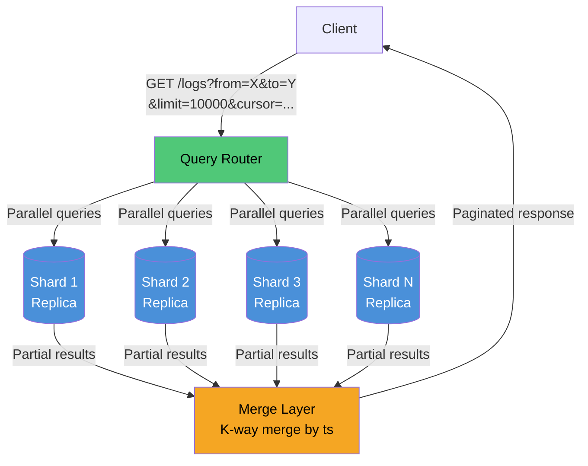
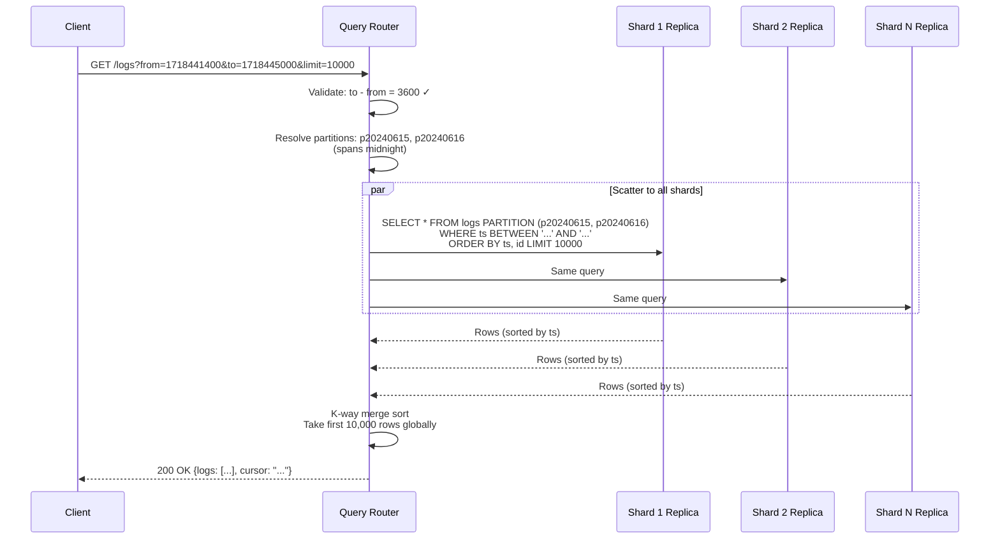
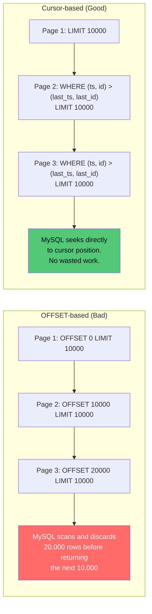
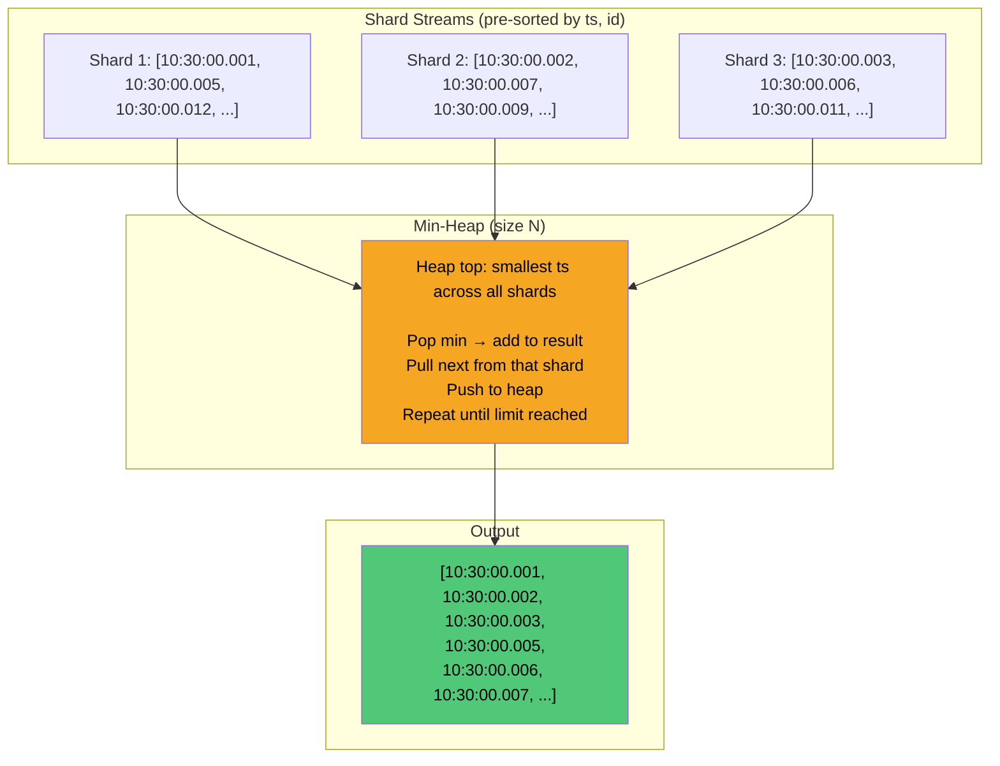
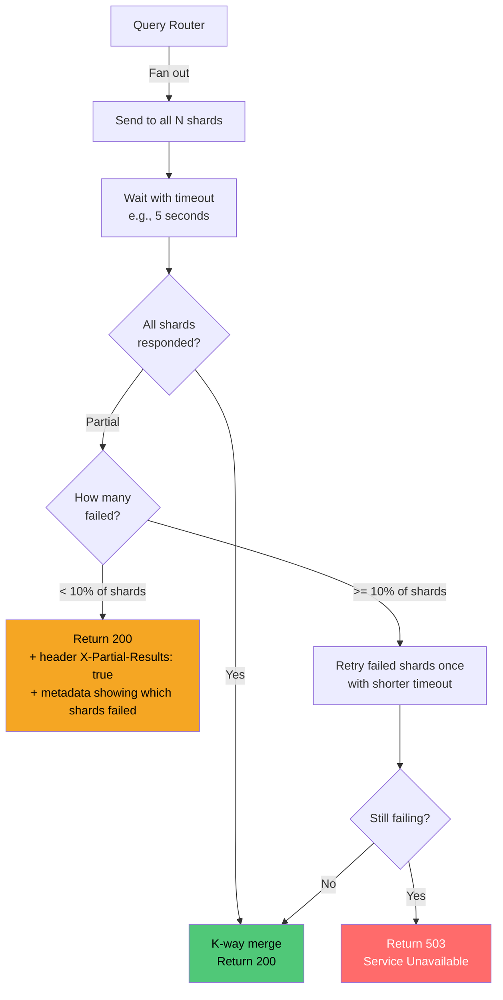
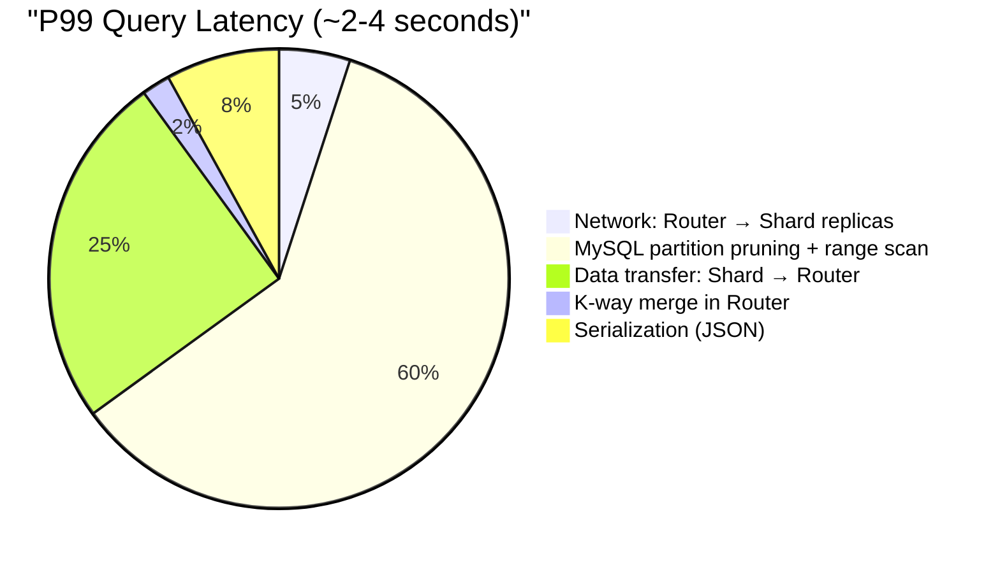
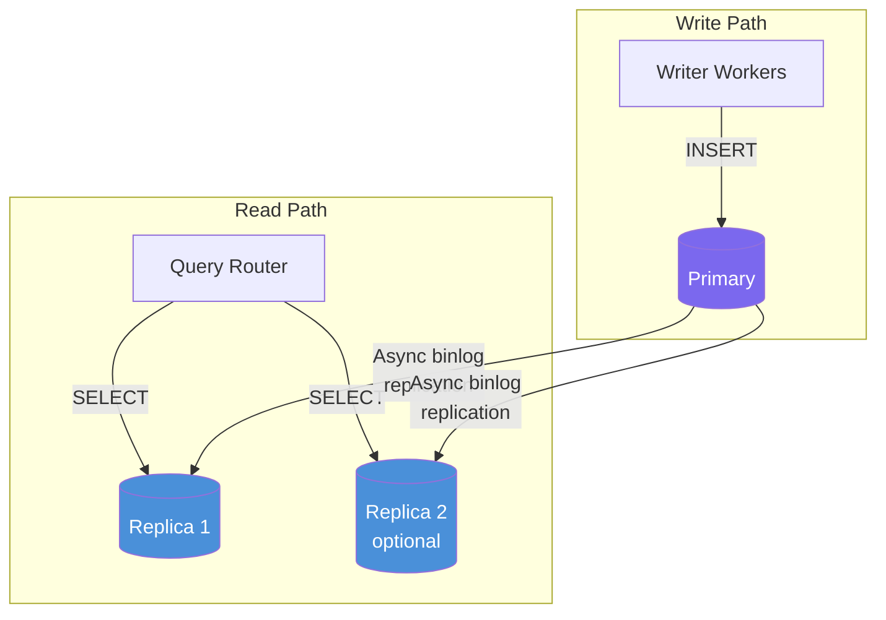

# 04 — Read Path & Query Routing

## Overview

The read path handles `GET /logs?from=X&to=Y` with a maximum 3600-second window. Since data is distributed across all shards (round-robin writes), every query must **scatter-gather** across all N shards, merge results by timestamp, and return a paginated response.



---

## Query Router

### Responsibilities

1. Parse and validate `from` / `to` parameters (reject if delta > 3600s)
2. Determine which daily partition(s) the range spans
3. Fan out parallel queries to all shard replicas
4. K-way merge results by timestamp
5. Apply pagination (cursor-based)
6. Return response

### Request Lifecycle



---

## The SQL Query

### Generated Per Shard

```sql
SELECT id, ts, service, level, message
FROM logs PARTITION (p20240615, p20240616)
WHERE ts >= '2024-06-15 23:30:00.000'
  AND ts <  '2024-06-16 00:30:00.000'
ORDER BY ts, id
LIMIT 10000;
```

### Why Explicit `PARTITION` Clause?

MySQL's optimizer does automatic partition pruning based on `WHERE` conditions. However, explicitly naming partitions:
- **Guarantees pruning** even if the optimizer makes a suboptimal plan
- **Documents intent** — makes it clear to code reviewers which partitions are targeted
- **Avoids edge cases** with `MAXVALUE` catch-all partition

### Query Execution Plan (EXPLAIN)

```
+----+-------------+-------+------------+-------+---------------+---------+---------+------+------+----------+-----------------------------+
| id | select_type | table | partitions | type  | possible_keys | key     | key_len | ref  | rows | filtered | Extra                       |
+----+-------------+-------+------------+-------+---------------+---------+---------+------+------+----------+-----------------------------+
|  1 | SIMPLE      | logs  | p20240615, | range | PRIMARY       | PRIMARY | 11      | NULL | 5000 |   100.00 | Using where                 |
|    |             |       | p20240616  |       |               |         |         |      |      |          |                             |
+----+-------------+-------+------------+-------+---------------+---------+---------+------+------+----------+-----------------------------+
```

**Key points:**
- `partitions` shows only 2 partitions accessed (out of 180)
- `type: range` confirms B-tree range scan on primary key
- `key: PRIMARY` — using the clustered index directly, no secondary index lookup
- No filesort needed — data is already ordered by `(ts, id)` in the clustered index

---

## Pagination Strategy

### Why Cursor-Based (Not Offset)?



### Cursor Encoding

```
Cursor = base64(last_ts_unix_ms + ":" + last_id_hex)

Example:
  last_ts  = 2024-06-15T23:45:12.456Z → 1718494712456
  last_id  = 0190a3b4-5c6d-7e8f-9a0b-1c2d3e4f5a6b → hex bytes
  cursor   = base64("1718494712456:0190a3b45c6d7e8f9a0b1c2d3e4f5a6b")
           = "MTcxODQ5NDcxMjQ1NjowMTkwYTNiNDVjNmQ3ZThmOWEwYjFjMmQzZTRmNWE2Yg=="
```

### Per-Shard Query with Cursor

```sql
-- First page
SELECT id, ts, service, level, message
FROM logs PARTITION (p20240615)
WHERE ts >= '2024-06-15 23:30:00.000'
  AND ts <  '2024-06-16 00:30:00.000'
ORDER BY ts, id
LIMIT 250;  -- limit/N shards = per-shard limit

-- Subsequent page (with cursor)
SELECT id, ts, service, level, message
FROM logs PARTITION (p20240615)
WHERE ts >= '2024-06-15 23:30:00.000'
  AND ts <  '2024-06-16 00:30:00.000'
  AND (ts > '2024-06-15 23:45:12.456'
       OR (ts = '2024-06-15 23:45:12.456' AND id > 0x0190A3B45C6D7E8F9A0B1C2D3E4F5A6B))
ORDER BY ts, id
LIMIT 250;
```

---

## K-Way Merge

The query router receives sorted streams from N shards and must produce a single globally-sorted result.



### Complexity

```
N = number of shards (40-50)
K = result page size (10,000)

Merge: O(K * log N) — for each of K results, heap operation is O(log N)
       = O(10,000 * log 50) ≈ O(10,000 * 6) = O(60,000 comparisons)
       = negligible (sub-millisecond)
```

The merge itself is cheap. The latency is dominated by the slowest shard's query execution.

---

## Handling Shard Failures During Query



**Trade-off:** Returning partial results (with a header indicating incompleteness) vs. failing the entire query. For a debugging/ops tool, partial results are more useful than a 503.

---

## Query Latency Breakdown



The dominant cost is the MySQL range scan across the partition. For a 3600-second window at 250k RPS per shard slice, each shard scans:

```
250,000 / 40 shards = 6,250 logs/sec per shard
x 3600 seconds = 22.5M rows per shard per query
At 1 KB each = ~22.5 GB scanned per shard (worst case, no LIMIT)
```

This is why pagination with reasonable `LIMIT` sizes (10,000-100,000) is critical.

---

## Read Path Optimization: Read Replicas



Reads go to replicas exclusively. This ensures:
- Query load never impacts write performance on primaries
- Read scaling is independent — add more replicas if query load grows
- Replication lag (~1 second) is acceptable for log querying use case
