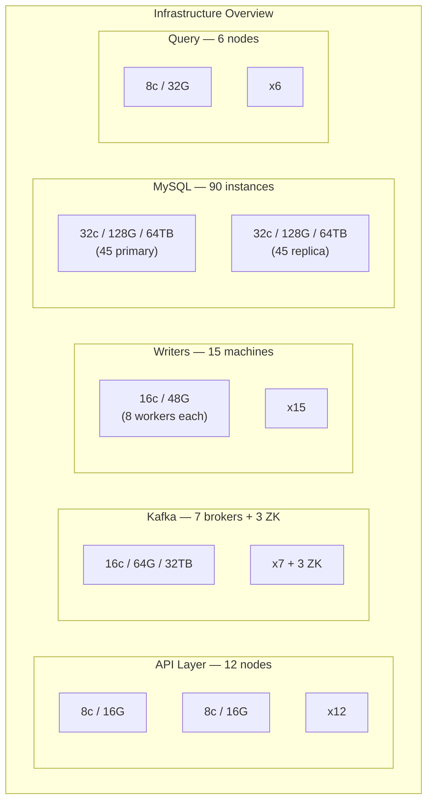
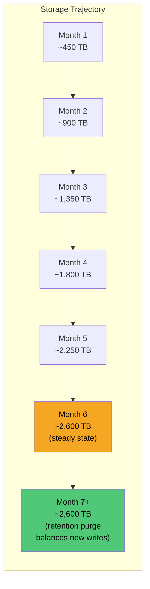
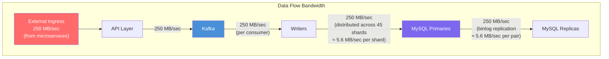
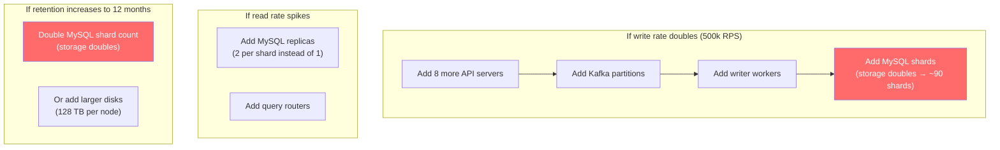

# 05 — Resource Estimation (6 Months)

## Component-by-Component Sizing

### API Servers

```
Write rate:           250,000 RPS (baseline)
Per-server capacity:  ~35,000 RPS (Go/Rust, fire-and-forward to Kafka)
Servers needed:       250,000 / 35,000 = 7.1 → 8 (baseline)
With burst headroom:  12 servers (handles ~420k RPS)
```

| Spec | Value |
|---|---|
| Count | 12 |
| CPU | 8 cores |
| RAM | 16 GB |
| Disk | 50 GB SSD (stateless, only for OS + binary) |
| Network | 10 Gbps |

### Kafka Cluster

```
Inbound data rate:    250 MB/sec
Replication factor:   3
Total disk write:     250 x 3 = 750 MB/sec
Retention:            72 hours
Storage per broker:   250 MB/sec x 72h x 3600 / num_brokers
```

| Spec | Value |
|---|---|
| Brokers | 7 |
| CPU | 16 cores |
| RAM | 64 GB |
| Disk | 32 TB NVMe per broker (750 MB/s x 72h x 3600 / 7 ≈ 28 TB + headroom) |
| Network | 25 Gbps |
| Partitions | 48 (topic: `logs`) + 8 (topic: `logs-dlq`) |
| ZooKeeper / KRaft | 3 nodes (lightweight, 4 core / 8 GB) |

### Writer Workers

```
Global batch rate:    50 batches/sec (at 5000 rows/batch)
Per-shard rate:       50 / 40 = 1.25 batches/sec
Workers per shard:    2 (redundancy during Kafka rebalances)
Total workers:        40 x 2 = 80
```

Workers are lightweight processes — most of their time is spent waiting on Kafka consume + MySQL bulk insert:

| Spec | Value |
|---|---|
| Count | 80 (can be consolidated onto fewer machines with multiple processes) |
| CPU | 2 cores per worker |
| RAM | 4 GB per worker (in-memory batch buffer ≈ 5000 x 1 KB = 5 MB) |
| Disk | Minimal (stateless) |
| Deployment | 10-15 machines, each running 6-8 worker processes |

### MySQL Cluster

```
Total compressed storage (6 months):  2,600 TB
Usable storage per node:              64 TB NVMe
Shard count (primaries):              2,600 / 64 = 41 → 45 (with headroom)
Replicas (1 per shard):               45
Total MySQL instances:                90
```

| Spec | Per Instance |
|---|---|
| Count | 90 (45 primaries + 45 replicas) |
| CPU | 32 cores |
| RAM | 128 GB (96 GB → InnoDB buffer pool) |
| Disk | 64 TB NVMe (RAID-10 across 8x 16 TB drives) |
| Network | 25 Gbps |
| MySQL Version | 8.0+ (native partitioning, improved compression) |

### Query Routers

```
Expected query rate:  Low compared to writes (logs are written far more than read)
                      Estimate: 100-1000 queries/sec
Routers needed:       4-6 for availability
```

| Spec | Value |
|---|---|
| Count | 6 |
| CPU | 8 cores |
| RAM | 32 GB (for K-way merge buffering) |
| Disk | 50 GB SSD (stateless) |
| Network | 25 Gbps (high bandwidth for scatter-gather responses) |

---

## Total Resource Summary



| Component | Machines | Total CPU | Total RAM | Total Disk |
|---|---|---|---|---|
| API Servers | 12 | 96 cores | 192 GB | 600 GB |
| Kafka Brokers | 7 | 112 cores | 448 GB | 224 TB |
| Kafka ZK/KRaft | 3 | 12 cores | 24 GB | 150 GB |
| Writer Machines | 15 | 240 cores | 720 GB | minimal |
| MySQL Primaries | 45 | 1,440 cores | 5,760 GB | 2,880 TB |
| MySQL Replicas | 45 | 1,440 cores | 5,760 GB | 2,880 TB |
| Query Routers | 6 | 48 cores | 192 GB | 300 GB |
| **Total** | **133** | **3,388 cores** | **13,096 GB (~13 TB)** | **~5,985 TB (~6 PB)** |

---

## Storage Growth Over Time



After month 6, the system reaches **steady state**: daily `DROP PARTITION` removes ~21 TB/day, and new writes add ~21 TB/day. Storage remains flat at ~2.6 PB.

---

## Network Bandwidth Requirements



### Per-Component Network

| Component | Inbound | Outbound | Notes |
|---|---|---|---|
| API Server (each) | ~21 MB/sec | ~21 MB/sec | From LB, to Kafka |
| Kafka Broker (each) | ~107 MB/sec | ~107 MB/sec | Replication + consumer |
| Writer (each) | ~3.1 MB/sec | ~3.1 MB/sec | From Kafka, to MySQL |
| MySQL Primary (each) | ~5.6 MB/sec | ~5.6 MB/sec | From writer, to replica |
| MySQL Replica (each) | ~5.6 MB/sec | Variable | From primary, to query router |

---

## Cost Estimate (Cloud, On-Demand Pricing Ballpark)

> These are rough order-of-magnitude estimates for planning purposes.

| Component | Monthly Cost (est.) |
|---|---|
| 12 API servers (c5.2xlarge equiv.) | ~$2,500 |
| 7 Kafka brokers (i3.4xlarge equiv.) | ~$9,000 |
| 3 ZK nodes | ~$600 |
| 15 Writer machines (m5.4xlarge equiv.) | ~$7,500 |
| 90 MySQL instances (i3.16xlarge equiv.) | ~$360,000 |
| Network/Data transfer | ~$15,000 |
| **Total monthly** | **~$395,000** |
| **Total 6 months** | **~$2.37M** |

MySQL instances dominate the cost (~91%). This is the price of the "MySQL only" constraint. A purpose-built log store (Elasticsearch, ClickHouse) would cost a fraction of this for the same workload.

---

## Scaling Levers



| Scenario | Action | Cost Impact |
|---|---|---|
| Write rate doubles | Double everything proportionally | ~2x cost |
| Read rate 10x | Add replicas per shard | ~1.5x cost |
| Retention → 12 months | Double MySQL shards or disk | ~1.8x cost |
| Log size → 2 KB | Double storage shards | ~1.8x cost |
