# 06 — Failure Modes & Trade-off Summary

## Failure Scenarios

### 1. API Server Crash

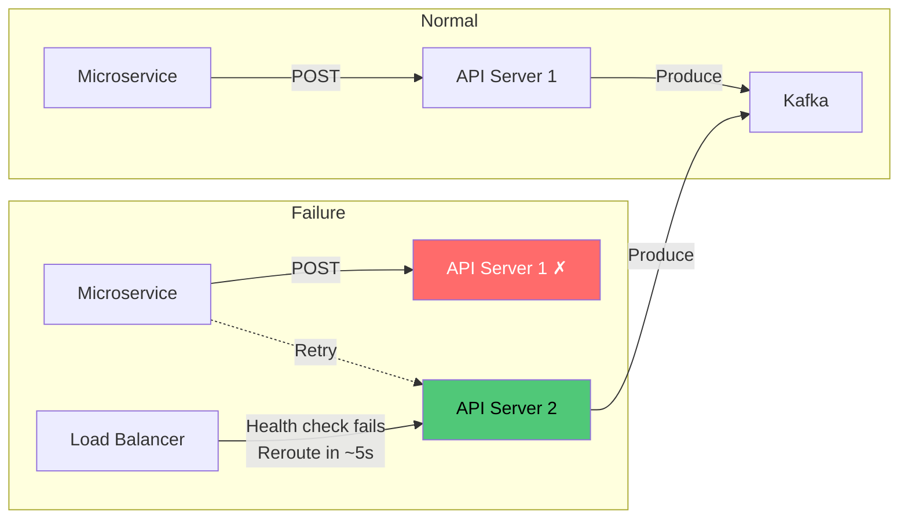

| Aspect | Impact |
|---|---|
| Data loss | Zero — API server is stateless. No in-flight data is stored locally. |
| Availability | 5-10 second blip while LB detects failure and reroutes. |
| Recovery | Automatic — LB removes dead server, remaining servers absorb load. |
| Mitigation | Run N+2 servers for headroom. |

---

### 2. Kafka Broker Failure

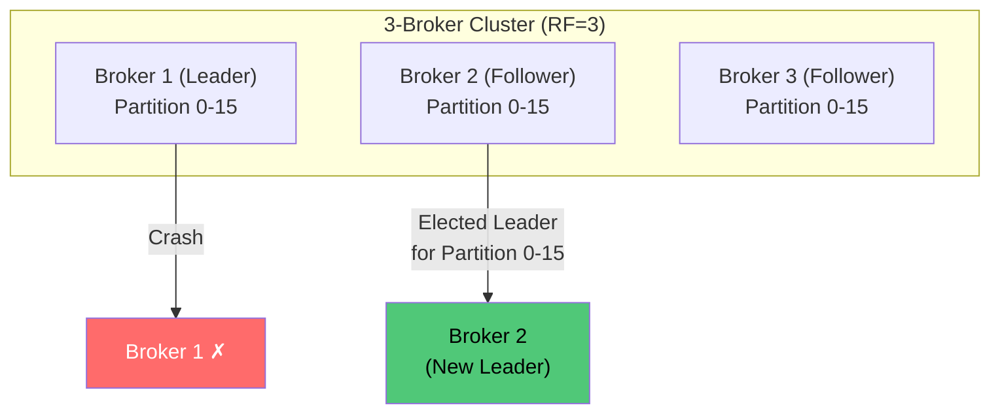

| Aspect | Impact |
|---|---|
| Data loss | Zero (with `acks=1` and RF=3, data survives 1 broker loss). Possible loss of unacknowledged in-flight messages (~milliseconds). |
| Availability | Leader election takes 1-5 seconds. Producers retry automatically. |
| Throughput | Temporary reduction (~33% less capacity with 1 of 3 brokers down). |
| Recovery | Replace broker, Kafka rebalances partitions automatically. |

---

### 3. Writer Worker Crash

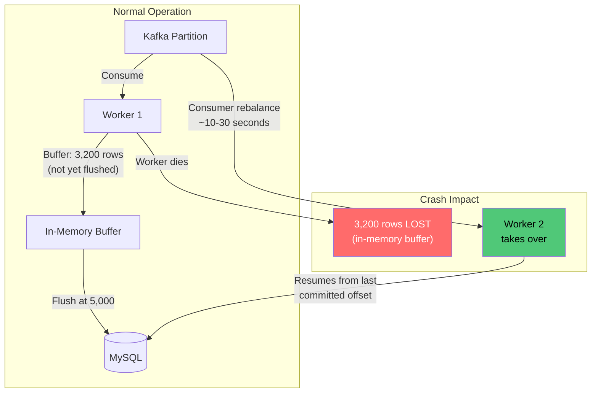

| Aspect | Impact |
|---|---|
| Data loss | Up to 1 batch worth of data (~5,000 rows = ~5 MB = ~20ms of traffic). This is the unflushed in-memory buffer. |
| Availability | Kafka consumer group rebalances in 10-30 seconds. |
| Duplicate risk | Worker may have written to MySQL but crashed before committing Kafka offset. Next worker replays and re-inserts. **Duplicates possible.** |
| Mitigation | UUID v7 primary key makes duplicates idempotent (`INSERT IGNORE` or `ON DUPLICATE KEY UPDATE`). |

### Duplicate Handling Trade-off

| Strategy | Pros | Cons |
|---|---|---|
| `INSERT IGNORE` | Simple, fast, drops dupes silently | Silent data loss if PK collision is from different data |
| `ON DUPLICATE KEY UPDATE` | Explicit, can log occurrences | Slightly slower (update path) |
| Accept duplicates | Simplest, no overhead | Query results may contain dupes |

**Choice: `INSERT IGNORE`.** At log ingestion scale, occasional duplicates are less harmful than the complexity of exactly-once semantics. UUID v7 collision from genuinely different data is astronomically unlikely.

---

### 4. MySQL Primary Crash

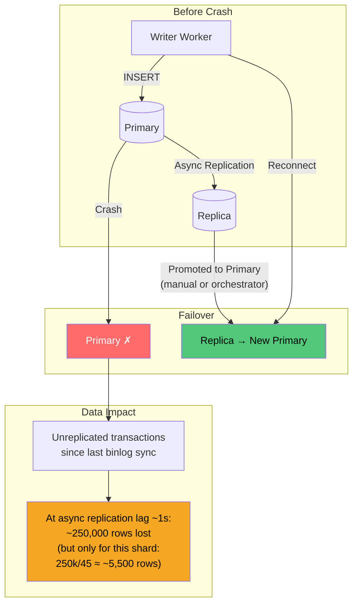

| Aspect | Impact |
|---|---|
| Data loss | Unreplicated transactions. With async replication and 1 shard: ~5,500 rows (1 second of traffic for that shard). But Kafka still has this data. |
| Recovery | Promote replica. Writer workers reconnect. Replay from Kafka offset. |
| Availability | Failover: 30s-2min (with orchestrator like Orchestrator/ProxySQL). |
| Read impact | Query router gets errors from that shard during failover. Returns partial results. |

### Kafka as the Durability Backbone

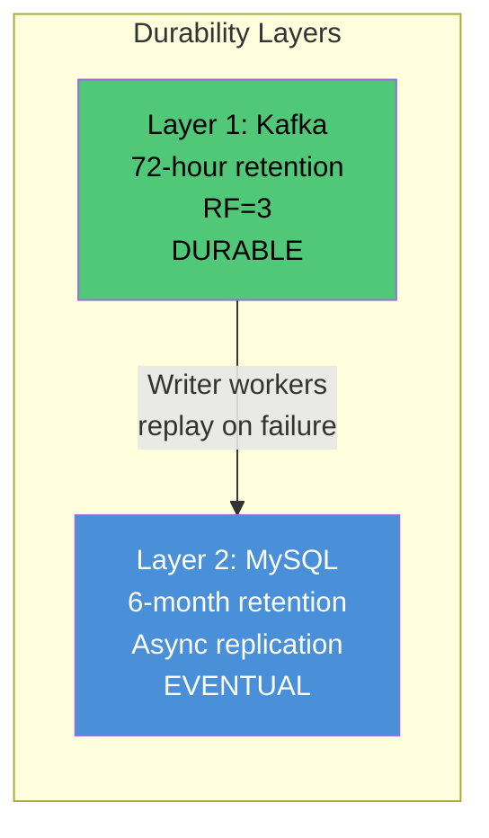

**Key insight:** Kafka is the true durability layer for recent data (0-72 hours). MySQL is the long-term store. If MySQL loses data, Kafka replays it. After 72 hours, MySQL is the only copy.

---

### 5. Full Shard Disk Exhaustion

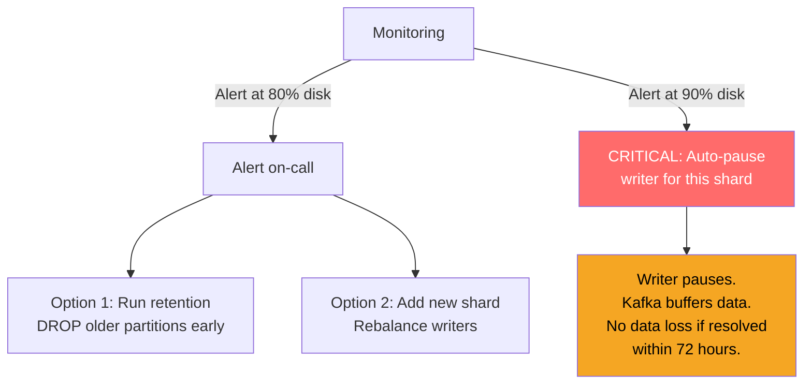

---

### 6. Kafka Consumer Lag (Writers Can't Keep Up)

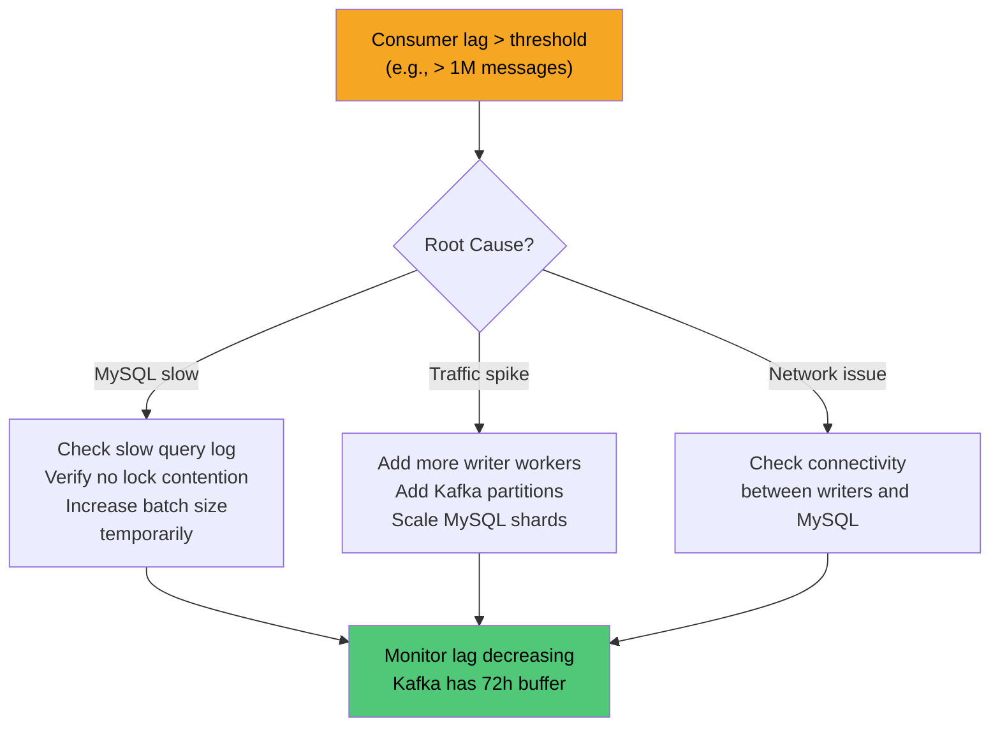

---

## Trade-off Summary Matrix

### Architecture-Level Trade-offs

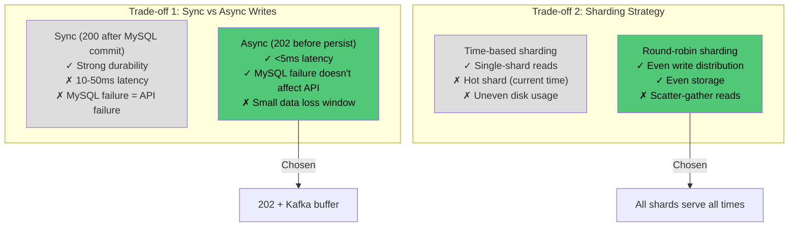

### Component-Level Trade-offs

| Decision | Chosen | Alternative | Why |
|---|---|---|---|
| **Kafka `acks`** | `acks=1` | `acks=all` | Tolerate small loss; 5-15ms latency savings per request |
| **Batch size** | 5,000 rows | 1,000 or 10,000 | Balance between transaction overhead and data loss window |
| **Batch flush** | 5000 rows OR 2s | Row count only | Time-based flush prevents stale data in low-traffic periods |
| **MySQL `flush_log`** | `= 2` | `= 1` (ACID) | 2-3x write speed; 1-second loss window on OS crash acceptable |
| **Doublewrite buffer** | OFF | ON | ~50% write I/O savings; Kafka provides replay for corrupted pages |
| **Primary key** | `(ts, id)` | `(id, ts)` | `ts` first enables partition pruning and sequential writes |
| **ID format** | UUID v7 (binary) | UUID v4 / AUTO_INCREMENT | Time-ordered (append-only writes), no coordinator needed for global uniqueness |
| **Partition granularity** | Daily | Hourly | 180 vs 4320 partitions; daily is within MySQL limits |
| **Secondary indexes** | None | `(service, ts)` | Each index adds ~30% write I/O; only time-range queries needed |
| **Replication** | Async | Semi-sync | Higher throughput; 1s lag acceptable for log queries |
| **Read target** | Replica only | Primary | Isolate read load from write path |
| **Compression** | `KEY_BLOCK_SIZE=8` | Uncompressed / `=4` | 2x storage savings; 8KB blocks balance CPU vs compression ratio |
| **Pagination** | Cursor-based | OFFSET | O(1) seek vs O(N) scan-and-discard |
| **Partial query results** | Return with header | Fail entire query | Partial data more useful than 503 for debugging |

---

## Top 3 Critical Metrics

Ranked by how fast they escalate from "degraded" to "permanent damage."

### #1 — Kafka Consumer Lag (messages behind)

The single most critical metric. It is the **countdown timer to data loss**.

Kafka retention is 72 hours. If consumer lag grows and the oldest unconsumed message ages past 72 hours, those logs are **permanently gone** — no recovery possible. Every other failure in the pipeline (MySQL slowdown, writer crashes, traffic spikes) manifests as growing consumer lag first. It is a composite health signal for the entire write path.

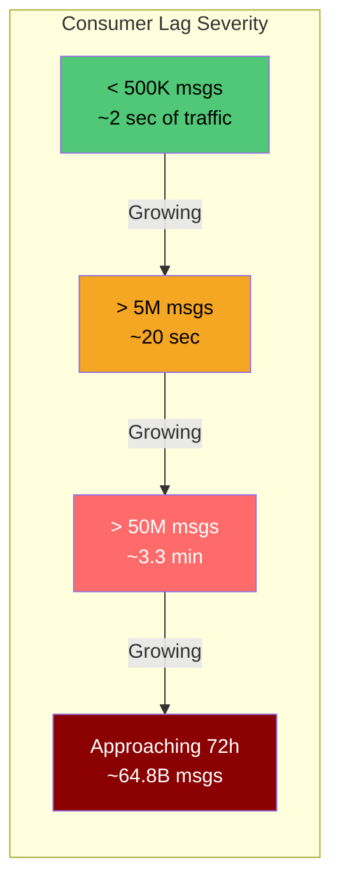

**Why #1:** It is the only metric where crossing the threshold causes **irreversible** data loss. Everything else is recoverable.

### #2 — MySQL Disk Usage per Shard (%)

When a shard hits 100% disk, InnoDB flips to **read-only mode** or crashes outright. Unlike other failures, this one compounds — the daily retention cron (`DROP PARTITION`) may itself fail if there is no space for metadata operations, so you cannot free space to fix the problem. It is a deadlock.

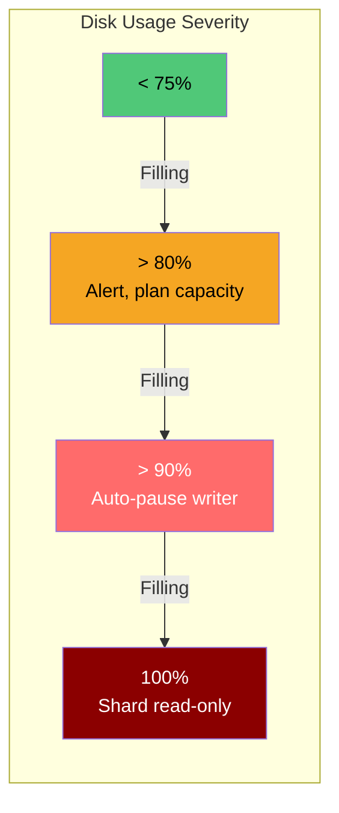

**Why #2:** It is **predictable but catastrophic**. Storage grows linearly at ~540 GB/day/shard. A missed alert gives you days of warning, but if ignored, recovery requires manual intervention on a downed shard while Kafka buffers are draining.

### #3 — End-to-End Ingestion Delay (POST accepted to queryable in GET)

The **user-facing SLA metric**. Measures the delta between when a log gets a 202 response and when it appears in GET query results. It rolls up the health of every component: Kafka produce latency + consumer lag + MySQL bulk insert latency + replication lag to the read replica.

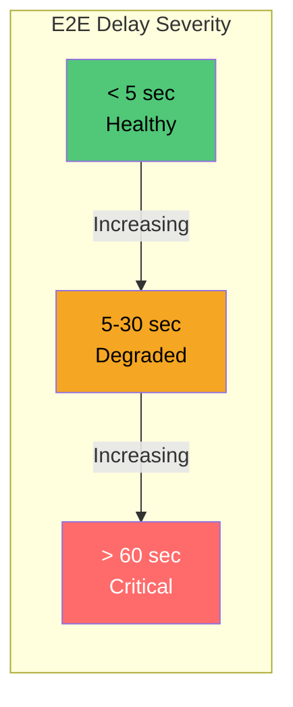

**Why #3:** Metrics #1 and #2 are infrastructure-facing. This metric tells you whether the system is **fulfilling its purpose** — making logs queryable. An engineer debugging a production incident does not care about consumer lag; they care that the log they are looking for shows up when they query for it.

### Why These Three?

| Metric you might expect | Why it is not top 3 |
|---|---|
| API error rate (5xx) | Self-healing — LB reroutes, clients retry. No permanent damage. |
| MySQL replication lag | Subsumed by metric #3 (end-to-end delay). Replication lag is one contributor, not the whole picture. |
| Query latency (P99) | Multi-second P99 was already accepted as a constraint. Comfort metric, not criticality. |
| Writer batch latency | Leading indicator for #1 (consumer lag). Monitor it, but consumer lag is what actually kills you. |

> **Mental model: #1 protects durability, #2 protects availability, #3 protects utility.**

---

## Monitoring & Alerting Checklist

| Metric | Alert Threshold | Action |
|---|---|---|
| Kafka consumer lag | > 500K messages | Scale writers or investigate MySQL |
| MySQL disk usage | > 80% | Plan capacity or early retention purge |
| MySQL replication lag | > 10 seconds | Investigate replica performance |
| Writer batch latency (P99) | > 500ms | Check MySQL load, connection pool |
| API server error rate | > 1% | Check Kafka connectivity |
| GET query latency (P99) | > 10 seconds | Check replica load, add read replicas |
| Kafka broker disk | > 75% | Reduce retention or add brokers |
| DLQ message rate | > 100/min | Investigate data quality issues |

---

## What MySQL Cannot Do Well (And What We Accept)

| Capability | MySQL Reality | Our Mitigation |
|---|---|---|
| Full-text search on log messages | Possible with `FULLTEXT` index but crippling at this scale | Out of scope — use a separate search system if needed |
| Aggregations (count by level/service) | Full table scan per shard | Pre-compute in a separate analytics pipeline |
| Real-time streaming / tailing | No native support | Use Kafka consumers directly for real-time |
| Columnar compression | Row-store only, poor compression ratio vs columnar | Accept 2x compression instead of 5-10x |
| Sub-second queries at scale | Not achievable with scatter-gather across 45 shards | Accept multi-second P99, optimize with pagination |

The MySQL constraint adds ~3-5x cost compared to a purpose-built log store (ClickHouse, Elasticsearch). This is the explicit trade-off the system accepts.
