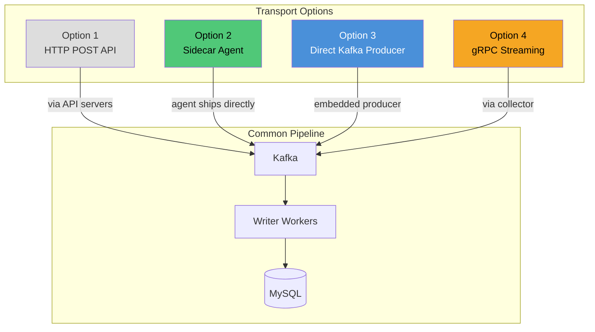
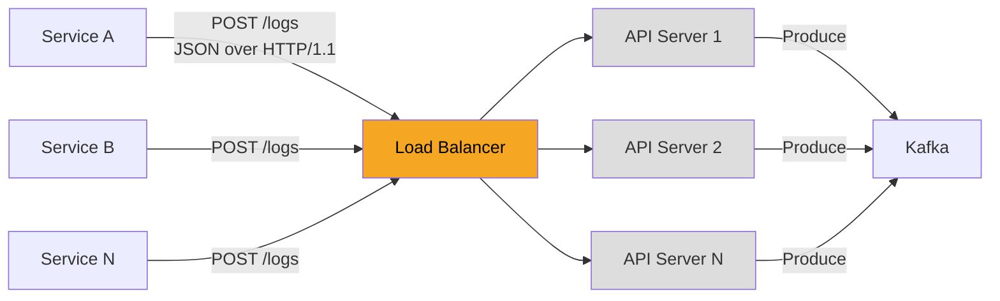
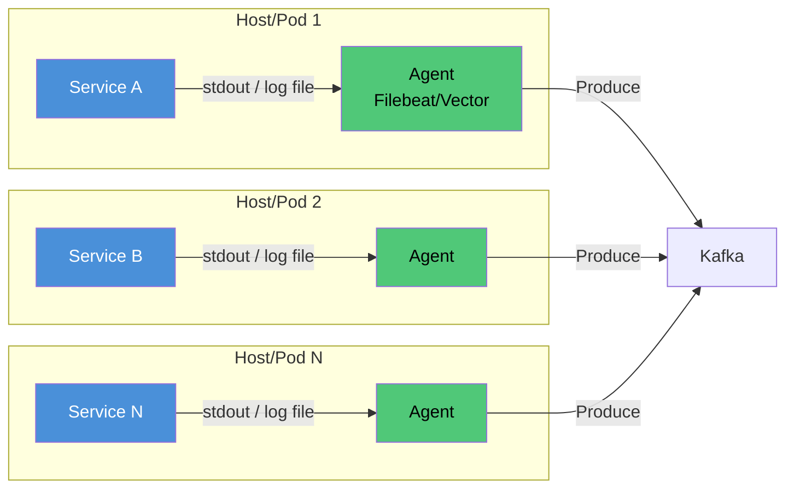
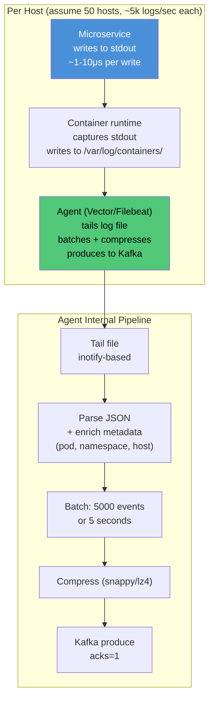
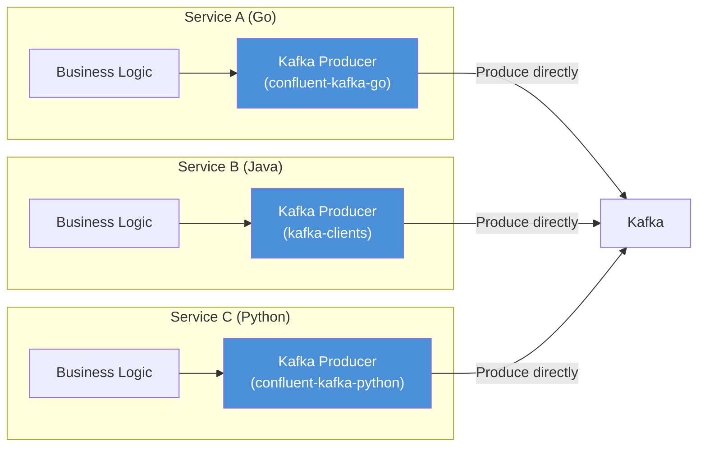
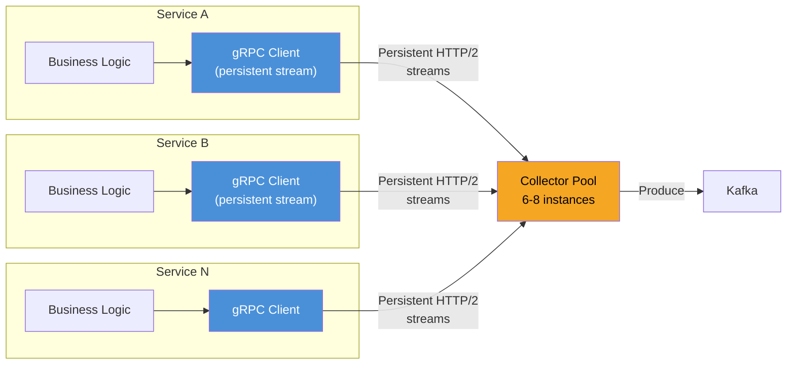
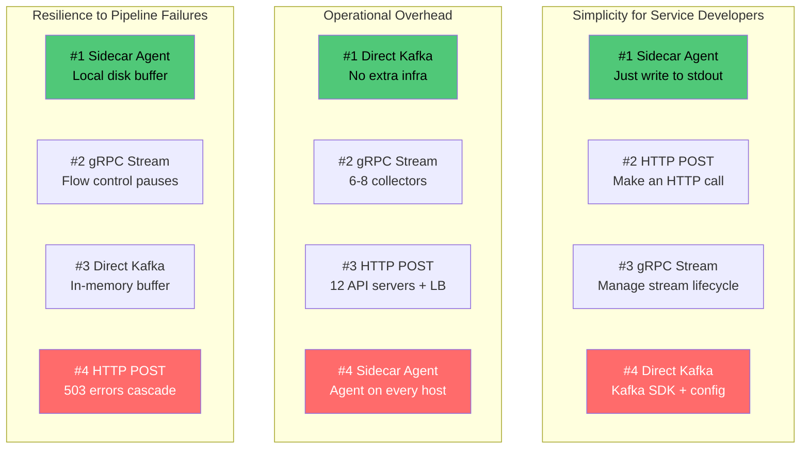
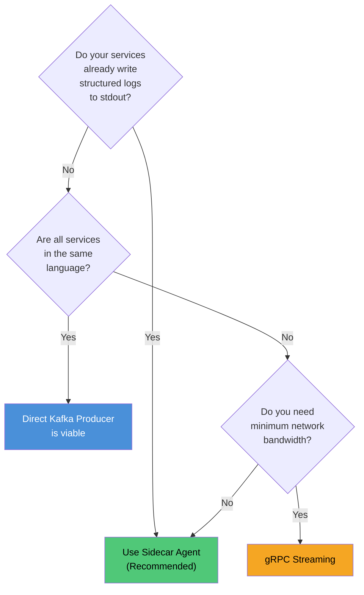
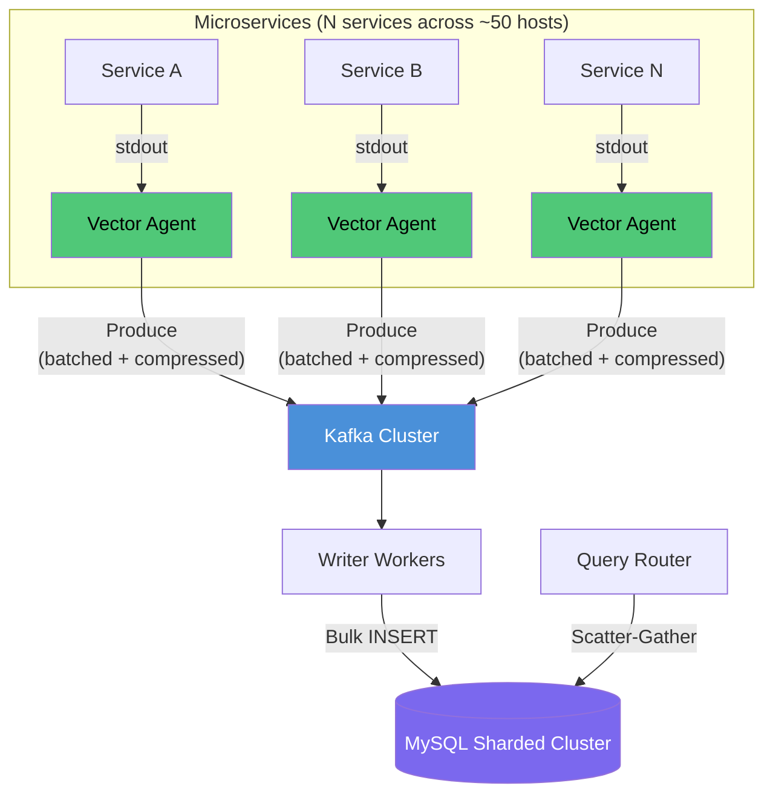

# 07 — Log Transport Alternatives (Beyond HTTP POST API)

## Context

The baseline design uses an HTTP POST API endpoint for log ingestion. At 250k RPS from N backend microservices, this works but introduces unnecessary overhead. This document evaluates four transport mechanisms and recommends the best fit.



---

## Option 1: HTTP POST API (Baseline)

### Architecture



Each microservice makes an HTTP POST call for every log entry (or batches them client-side). API servers validate, serialize, and produce to Kafka.

### At 250k RPS Scale

```
Per-log overhead:
  - TCP connection management (keep-alive helps but not free)
  - HTTP request parsing (headers, method, path)
  - JSON deserialization + validation
  - HTTP response serialization
  - Network round trip: ~2-5ms per call

Infrastructure required:
  - Load balancer (L7)
  - 10-12 API servers (8 core / 16 GB each)

Total API layer cost: ~$2,500/month (cloud)
```

### Pros

| Pro | Detail |
|---|---|
| Universal client compatibility | Every language has an HTTP client. Zero SDK dependency. |
| Simple to understand | Standard REST endpoint. Any developer can integrate in minutes. |
| Protocol-level observability | HTTP status codes, request tracing, access logs work out of the box. |
| Independent versioning | API contract can evolve independently of the transport layer (e.g., add fields, versioned endpoints). |
| Easy to secure | TLS, API keys, rate limiting — well-understood HTTP middleware. |

### Cons

| Con | Detail at 250k RPS |
|---|---|
| High per-log overhead | HTTP parsing + JSON serialization for every log entry. At 250k RPS, that is 250k request/response cycles per second across the cluster. |
| Extra infrastructure | 10-12 API servers + load balancer that exist only to relay logs to Kafka. Pure overhead. |
| Application coupling | Every microservice needs HTTP client code, retry logic, timeout handling, circuit breakers for the log endpoint. Logging should not require this. |
| Failure blast radius | If the API layer goes down or the LB has issues, all microservices start failing their log calls. Depending on implementation, this can cause request latency spikes in the microservices themselves (blocked on log POST). |
| Connection pressure | 250k RPS means tens of thousands of concurrent HTTP connections. Even with keep-alive, connection pool management across N services is non-trivial. |
| Head-of-line blocking | HTTP/1.1 has head-of-line blocking. A slow log POST can delay subsequent requests on the same connection. |

---

## Option 2: Sidecar / DaemonSet Agent (Recommended)

### Architecture



Microservices write structured logs (JSON) to **stdout** or a local log file. A co-located agent (Filebeat, Fluentd, Vector) tails the output and ships it to Kafka.

### How It Handles 250k RPS



```
Per-host agent resource usage:
  - CPU: 0.5-1 core (tailing + parsing + producing)
  - RAM: 256-512 MB (buffer + batch accumulation)
  - Disk buffer: 1-2 GB (for local retry if Kafka is temporarily unreachable)

At 50 hosts x 5,000 logs/sec each:
  - Each agent handles 5,000 logs/sec (well within capacity — Vector handles 100k+ events/sec)
  - Network: 5 MB/sec per host outbound to Kafka
```

### Pros

| Pro | Detail at 250k RPS |
|---|---|
| Zero application coupling | Microservices write to stdout. No HTTP client, no Kafka SDK, no retry logic, no serialization code. Logging is a `println()`. Works in any language. |
| Eliminates API layer entirely | 10-12 API servers + load balancer removed. Saves ~$2,500/month and one entire failure domain. |
| Local buffering on failure | If Kafka is unreachable, agents buffer to local disk (configurable, e.g., 1-2 GB). No log data is lost during brief Kafka outages. HTTP POST would start returning 503s. |
| Microsecond log call latency | `stdout` write is a local syscall (~1-10μs). vs HTTP POST (~2-5ms). 100-1000x faster from the application's perspective. The microservice is never blocked. |
| Automatic metadata enrichment | Agents add host, pod, container, namespace, deployment metadata automatically. With HTTP POST, each service must include this in the payload manually. |
| Backpressure isolation | If the pipeline backs up, the agent absorbs it. The microservice's performance is completely unaffected. With HTTP POST, a slow API can cascade latency into the calling service. |
| Industry standard | This is how Datadog, Splunk, ELK, Loki, and every production observability system ships logs. Proven at millions of events/sec. |

### Cons

| Con | Detail at 250k RPS |
|---|---|
| Agent deployment overhead | Must deploy and manage an agent on every host/pod. In Kubernetes, this is a DaemonSet (trivial). On bare metal, it is one more process per VM to manage, monitor, and upgrade. |
| Local disk dependency | If the host's disk fills up, the agent cannot buffer. Logs may be dropped. Need disk usage monitoring on every host. |
| Log format coupling | Agent expects a specific log format (typically JSON lines). If a service writes unstructured text, the agent cannot parse it reliably. Need to enforce structured logging standards across teams. |
| Slight delivery delay | Agent tails files and batches before shipping. Adds 1-5 seconds of latency vs. a synchronous HTTP POST. For a log system with multi-second P99 query latency, this is negligible. |
| Agent failure = silent log loss | If the agent crashes and is not restarted, logs accumulate in the file but are not shipped. Need health monitoring for agents. (Kubernetes restarts crashed pods automatically.) |
| File rotation complexity | Log files must be rotated to prevent disk exhaustion. Agent must handle rotation gracefully (track inodes, not filenames). Mature agents (Filebeat, Vector) handle this, but misconfiguration can cause log duplication or loss. |

---

## Option 3: Direct Kafka Producer (Embedded SDK)

### Architecture



Each microservice embeds a Kafka producer client library. Log calls go directly from the application to Kafka — no intermediary.

### How It Handles 250k RPS

```
Kafka producer internal batching:
  linger.ms = 50       (wait up to 50ms to accumulate a batch)
  batch.size = 512 KB   (flush when batch reaches 512 KB)
  compression = lz4     (compress before sending)

Result:
  - Application calls producer.send() — non-blocking, returns immediately (~50-100μs)
  - Producer accumulates messages in memory
  - Flushes batch to Kafka broker every 50ms or 512 KB
  - At 5,000 logs/sec per service instance: ~50ms = 250 logs per batch
  - Network: one TCP round trip per batch instead of per log
```

### Pros

| Pro | Detail at 250k RPS |
|---|---|
| Fewest network hops | Microservice → Kafka directly. One hop. HTTP POST is Microservice → LB → API → Kafka (three hops). |
| No intermediary infrastructure | No API servers, no load balancer, no agents. Kafka is the only infrastructure between service and pipeline. |
| Native async batching | Kafka producer batches internally. `producer.send()` is non-blocking. Application is never blocked on log delivery. Throughput is maximized automatically. |
| Lowest end-to-end latency | Log goes from application memory to Kafka broker in one network call. With `linger.ms=50`, data reaches Kafka within 50ms of the log call. |
| Exactly-once semantics available | Kafka's idempotent producer (`enable.idempotence=true`) prevents duplicates even on retry. HTTP POST requires `INSERT IGNORE` or dedup logic. |
| No extra processes to manage | No agent to deploy, monitor, or upgrade. The producer lives inside the application process. |

### Cons

| Con | Detail at 250k RPS |
|---|---|
| Tight infrastructure coupling | Every microservice now depends on the Kafka client library. If Kafka broker addresses change, TLS certs rotate, or auth mechanism changes, every service needs a config update or redeploy. |
| Multi-language SDK burden | If you have services in Go, Java, Python, Node.js, and Rust — you need Kafka client libraries in all five. Each has different maturity, configuration, and behavior. `confluent-kafka-go` behaves differently from `kafka-clients` (Java). |
| Application memory pressure | Kafka producer buffers messages in application memory (`buffer.memory` default is 32 MB). At 5,000 logs/sec with 1 KB each, that is 5 MB/sec flowing through the producer buffer. If Kafka is slow, buffer fills up and `send()` blocks or throws. This can affect the microservice's primary business logic. |
| No local disk buffer | Unlike the sidecar agent, if Kafka is unreachable, the producer's in-memory buffer fills and logs are dropped. No disk-based retry. A 2-minute Kafka outage at 250k RPS = ~30M logs lost. |
| Logging affects application startup | Kafka producer initialization (broker discovery, metadata fetch) adds 1-5 seconds to application startup time. If Kafka is down when a service starts, the service may fail to boot or log. |
| Version coupling | Upgrading the Kafka cluster may require upgrading client libraries in every service simultaneously. At N microservices, this is a coordination nightmare. |
| Debugging complexity | When logs are missing, is it the application? The producer config? Kafka partition assignment? Network? With HTTP POST or sidecar, the boundaries are clearer. |

---

## Option 4: gRPC Streaming

### Architecture



Each microservice opens a persistent gRPC stream (client-side streaming) to a collector service. Log entries are continuously pushed over the stream as protobuf messages. The collector batches and produces to Kafka.

### How It Handles 250k RPS

```
Protocol efficiency:
  - Protobuf encoding: 1 KB JSON log ≈ 600-700 bytes in protobuf (~30-40% smaller)
  - HTTP/2 multiplexing: one TCP connection carries thousands of concurrent streams
  - No per-message HTTP overhead (no headers, status codes, parsing per log)

Connection model:
  - Each service instance maintains 1 persistent gRPC connection to a collector
  - 500 service instances → 500 connections (vs. 250k HTTP connections/sec)
  - Stream-level flow control handles backpressure automatically

Collector sizing:
  - Each collector handles ~40k streams
  - 6-8 collectors for 250k RPS with headroom

Bandwidth savings:
  - 250k x 1 KB = 250 MB/sec (JSON over HTTP)
  - 250k x 0.65 KB = 162 MB/sec (protobuf over gRPC)
  - ~35% bandwidth reduction
```

### Protobuf Schema

```protobuf
syntax = "proto3";

service LogIngestion {
  rpc StreamLogs (stream LogEntry) returns (LogAck);
}

message LogEntry {
  string id = 1;
  int64 timestamp_ms = 2;
  string service = 3;
  LogLevel level = 4;
  string message = 5;
}

enum LogLevel {
  TRACE = 0;
  DEBUG = 1;
  INFO = 2;
  WARN = 3;
  ERROR = 4;
  FATAL = 5;
}

message LogAck {
  int64 received_count = 1;
}
```

### Pros

| Pro | Detail at 250k RPS |
|---|---|
| Connection efficiency | One persistent HTTP/2 connection per service instance instead of a new connection per log. At 500 service instances, that is 500 long-lived connections vs. 250k short-lived requests/sec. Massive reduction in TCP overhead, TLS handshakes, and LB connection tracking. |
| Binary protocol (smaller payloads) | Protobuf is 30-40% smaller than JSON for log data. At 250 MB/sec, this saves ~88 MB/sec of network bandwidth. Over 6 months, that is ~1.36 PB of network transfer saved. |
| Native streaming backpressure | HTTP/2 flow control is built in. If the collector slows down, the stream naturally throttles the producer. No retry logic, no dropped messages, no 503 errors. The client just slows down. |
| Multiplexing (no head-of-line blocking) | HTTP/2 multiplexes streams on one connection. A slow log entry does not block others. HTTP/1.1 POST has head-of-line blocking. |
| Bidirectional capability | The collector can push back metadata (e.g., "your logs are being rate-limited", "switch to sampling mode") over the same stream. HTTP POST is strictly request-response. |
| Strongly typed contract | Protobuf schema enforces structure at compile time. No runtime JSON parsing errors. No malformed log entries reaching the pipeline. |

### Cons

| Con | Detail at 250k RPS |
|---|---|
| Client integration complexity | Every microservice needs a gRPC client stub, connection lifecycle management, stream reconnection logic, and protobuf code generation. Significantly more work than `println()` to stdout. |
| Collector infrastructure | Replaces API servers with collector servers (6-8 instances). Similar operational overhead, though fewer instances needed due to HTTP/2 efficiency. Not a net reduction in infra like the sidecar approach. |
| Stream lifecycle management | Persistent streams can drop (network blips, collector restarts, load balancer idle timeout). Every client needs reconnection logic with exponential backoff. This is subtle to implement correctly across N services. |
| Load balancing challenges | HTTP/2 persistent connections defeat round-robin LB. A new service instance connects to one collector and stays there. Over time, load becomes uneven. Need client-side load balancing or periodic connection cycling. |
| Protobuf schema evolution | Adding fields requires regenerating client stubs and redeploying services. JSON is schema-less — you can add fields without client changes. For a log schema that rarely changes this is minor, but it is still coordination overhead. |
| Debugging is harder | Protobuf payloads are binary — you cannot `curl` the endpoint or inspect payloads in plain text. Need specialized tools (grpcurl, Bloom RPC) for debugging. HTTP+JSON is universally inspectable. |
| Cold start latency | Establishing a gRPC channel involves DNS resolution, TCP connect, TLS handshake, and HTTP/2 negotiation. If a service restarts frequently (e.g., spot instances, scaling events), the stream setup cost is non-trivial. |

---

## Head-to-Head Comparison at 250k RPS

### Quantitative Comparison

| Metric | HTTP POST | Sidecar Agent | Direct Kafka | gRPC Stream |
|---|---|---|---|---|
| Per-log latency (app-side) | 2-5ms | **1-10μs** | 50-100μs | 100-200μs |
| Network bandwidth | 250 MB/sec | 250 MB/sec | 250 MB/sec | **~162 MB/sec** |
| Infra components | LB + 12 API servers | Agent per host | None | 6-8 collectors |
| Connections to manage | ~250k/sec | ~50 (agent→Kafka) | ~500 (per instance) | ~500 (persistent) |
| Data loss on pipeline failure | Logs dropped (503) | **Buffered to disk** | Buffered in memory (limited) | Stream paused (flow control) |
| Code changes in services | HTTP client + retry | **None (stdout)** | Kafka SDK + config | gRPC stub + reconnect |
| Failure blast radius | API down → all services affected | **Agent down → 1 host affected** | Kafka down → producer blocks | Collector down → streams drop |

### Qualitative Comparison



### Decision Matrix

| Factor | Weight | HTTP POST | Sidecar | Direct Kafka | gRPC |
|---|---|---|---|---|---|
| Zero app coupling | High | 2 | **5** | 1 | 2 |
| Failure isolation | High | 1 | **5** | 3 | 3 |
| Operational simplicity | Medium | 3 | 3 | **4** | 3 |
| Network efficiency | Medium | 2 | 3 | 4 | **5** |
| Multi-language support | High | 4 | **5** | 2 | 3 |
| Local buffering on failure | High | 1 | **5** | 2 | 3 |
| Debuggability | Low | **5** | 4 | 2 | 2 |
| **Weighted Score** | | **2.1** | **4.6** | **2.5** | **2.9** |

---

## Recommendation



**Sidecar Agent is the recommended approach** for this system because:

1. **Zero coupling** — Microservices just write to stdout. No SDK, no retry logic, no connection management.
2. **Best failure isolation** — Agent failure affects one host. Pipeline failure affects zero applications.
3. **Local disk buffering** — Survives Kafka outages without data loss. No other option provides this.
4. **Language agnostic** — Works identically for Go, Java, Python, Rust, or any language. stdout is universal.
5. **Eliminates the API layer** — 12 fewer servers to operate.

### Revised Architecture with Sidecar Agent



Components removed vs. baseline HTTP POST design:
- ~~Load Balancer (for log ingestion)~~
- ~~10-12 API Servers~~
- Savings: ~12 machines, ~$2,500/month, one fewer failure domain
