# 08 — Client-Side Resilience Patterns

## Context

The baseline design responds with **202 Accepted** and relies on the pipeline (Kafka → Writers → MySQL) for durability. But what happens when the POST endpoint itself is unavailable? If we consider our clients (backend microservices) to be **smart enough** to hold and retry, several resilience patterns become viable.

This document evaluates four patterns for client-side resilience, their trade-offs at 250k RPS, and the recommended combination.

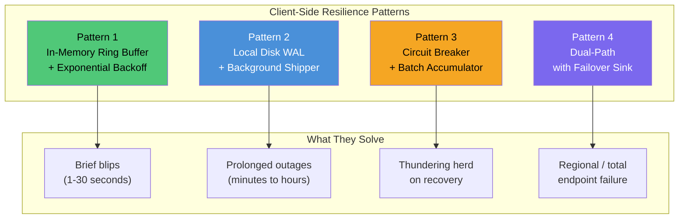

---

## Pattern 1: In-Memory Ring Buffer + Exponential Backoff

The simplest "smart client." Logs go into a fixed-size circular buffer. A background thread drains the buffer to the POST endpoint. On failure, it backs off and retries.

### Architecture

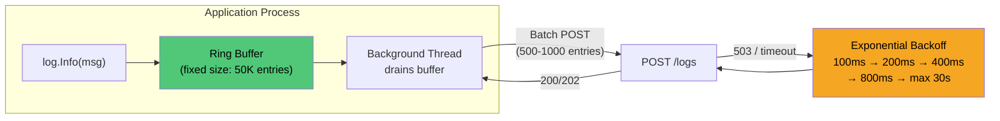

### How It Works at 250k RPS

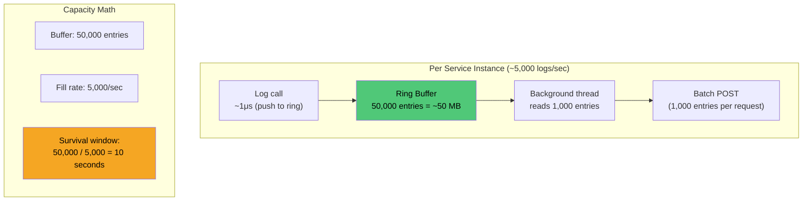

- Each service instance produces ~500-5,000 logs/sec
- Buffer size: 50,000 entries (~50 MB per instance)
- At 5,000 logs/sec, buffer holds ~10 seconds of data before overwriting oldest entries
- Background thread batches 500-1,000 entries per POST (reduces HTTP calls 500-1000x)

### Pros

| Pro | Detail |
|---|---|
| Minimal implementation | 100-200 lines of code in any language. No external dependencies. |
| No disk I/O | Purely in-memory. Zero impact on application's disk performance. |
| Handles brief outages | Seconds to low minutes without any data loss. |
| Natural batching | Background thread accumulates entries, amortizing HTTP overhead. |
| Bounded memory | Fixed ring size. Memory footprint is predictable regardless of failure duration. |

### Cons

| Con | Detail at 250k RPS |
|---|---|
| Data loss on prolonged outages | 50 MB buffer at 5,000 logs/sec overflows in ~10 seconds. A 5-minute outage loses ~95% of logs during that window. |
| Data loss on application crash | Entire buffer is in-process memory. Gone on crash/restart. |
| Memory pressure | 50 MB per instance. Across 100 instances on a host, that is 5 GB dedicated to log buffering. |
| Silent data loss | Ring buffer overwrites oldest entries without notification unless you add drop counters. |
| Backoff tuning is fragile | Too aggressive: saturates recovering server. Too conservative: buffer fills while server is already healthy. |
| No crash recovery | After restart, no way to recover what was in the buffer. Starts fresh with empty ring. |

### Verdict

**Best for brief network blips (1-30 seconds).** Not suitable for multi-minute outages or when data loss on crash is unacceptable.

---

## Pattern 2: Local Disk WAL (Write-Ahead Log) + Background Shipper

Logs are appended to a local write-ahead log file first (durable), then a background thread reads from the WAL and ships to the POST endpoint. The WAL is the durability guarantee.

### Architecture

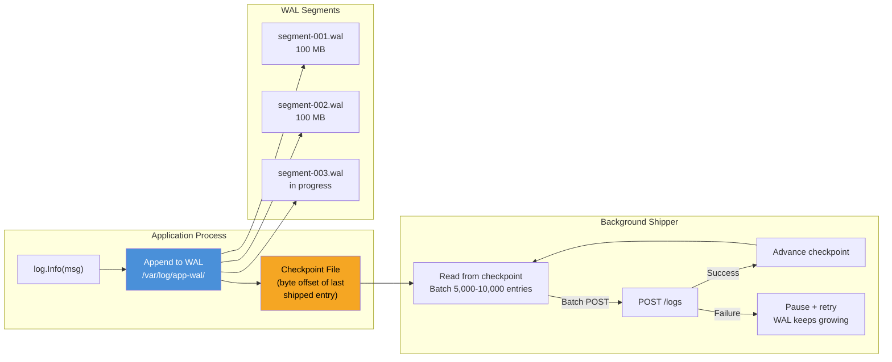

### How It Works at 250k RPS

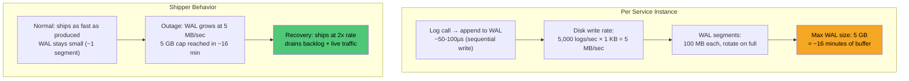

- Each instance appends to a local file: 5,000 logs/sec x 1 KB = 5 MB/sec disk write
- WAL is segmented (100 MB per segment file, rotate when full)
- Shipper tracks position via checkpoint file (byte offset of last successfully shipped entry)
- On failure, shipper stops advancing — WAL keeps growing
- On recovery, shipper catches up from checkpoint
- Configurable max WAL size (e.g., 5 GB = ~16 minutes of buffering at 5,000 logs/sec)

### Pros

| Pro | Detail |
|---|---|
| Survives application crashes | WAL is on disk. Shipper resumes from checkpoint after restart. Zero data loss on crash. |
| Survives prolonged outages | 5 GB WAL holds ~16 minutes of data. Configurable larger for longer outages. |
| Zero data loss within WAL capacity | Every log that hits the WAL is eventually shipped (unless WAL overflows). |
| Fast log calls | Append to local file is ~50-100μs. Sequential writes are SSD-friendly. |
| Aggressive batching from WAL | Shipper reads 10,000 entries at once from disk. Efficient bulk POST. |
| Crash recovery is built in | Checkpoint file tells shipper exactly where to resume. No duplicate guessing. |

### Cons

| Con | Detail at 250k RPS |
|---|---|
| Disk I/O on every log call | 5 MB/sec sequential write per instance. On hosts with 20 instances, that is 100 MB/sec of disk I/O dedicated to WAL writes. |
| fsync trade-off | fsync per write: durable but costs ~1-5ms per log call. fsync per batch (every 1,000 writes): faster but risks losing up to 1,000 entries on power loss. Must choose. |
| Disk space management | WAL must be bounded. When it hits max size, oldest segments are deleted — same data loss as ring buffer, just with a much larger window. |
| Implementation complexity | File rotation, checkpoint tracking, crash recovery, segment cleanup, file locking. ~500-1,000 lines of robust code. |
| Essentially reinventing the sidecar | At this point, you're building Filebeat inside your application. A dedicated agent does this better with years of battle-testing. |
| Disk failure = log failure | If the local disk has issues (full, slow, failing), both the application and its log buffering are affected simultaneously. |

### Verdict

**Best for multi-minute outages where zero data loss matters.** Trade-off is disk I/O and implementation complexity. At this complexity level, consider whether an external agent (Filebeat/Vector) does this better.

---

## Pattern 3: Circuit Breaker + Batch Accumulator

Uses the circuit breaker pattern to detect POST endpoint health. When the circuit is open (endpoint down), logs accumulate in a buffer. When it closes (recovery), the buffer drains in a controlled manner.

### Architecture

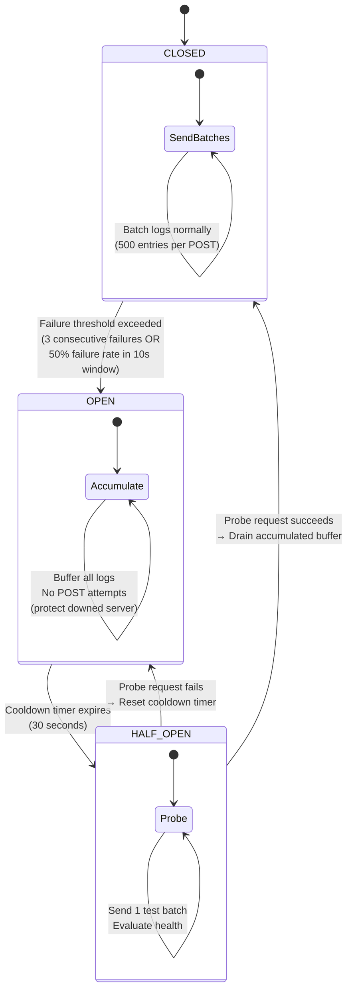

### How It Works at 250k RPS

```mermaid
graph TD
    subgraph "Normal Operation (CLOSED)"
        N1["Logs arrive: 5,000/sec"]
        N2["Batch accumulator: 500 logs"]
        N3["POST every 100ms"]
        N4["10 POST calls/sec per instance"]
        N1 --> N2 --> N3 --> N4
    end

    subgraph "During Outage (OPEN)"
        O1["3 failures detected"]
        O2["Circuit OPENS"]
        O3["All POSTs stop immediately"]
        O4["Logs accumulate in memory"]
        O5["No hammering the dead server"]
        O1 --> O2 --> O3 --> O4 --> O5
    end

    subgraph "Recovery (HALF-OPEN → CLOSED)"
        R1["30s cooldown expires"]
        R2["Send 1 probe batch"]
        R3["Probe succeeds → CLOSE circuit"]
        R4["Drain buffer at 2x rate"]
        R5["Catch up without overwhelming server"]
        R1 --> R2 --> R3 --> R4 --> R5
    end

    style O3 fill:#ff6b6b,color:#fff
    style R3 fill:#50c878,color:#000
```

### Pros

| Pro | Detail |
|---|---|
| Protects recovering server | Unlike retry-based patterns, circuit breaker stops ALL traffic to a downed endpoint. No thundering herd. |
| Fast failure detection | Application knows within seconds that the endpoint is down. Can emit metrics, log locally, or take alternative action. |
| Controlled drain on recovery | Doesn't flood the server with buffered logs on recovery. Drains at configurable rate (e.g., 2x normal) to let the server warm up. |
| Well-understood pattern | Standard pattern with library support in every language (Hystrix, resilience4j, gobreaker, polly). |
| Composable | Pairs naturally with Pattern 1 or 2. Circuit breaker controls *when* to send. Buffer controls *what* to store. |
| Prevents cascade failures | Without circuit breaker, 500 instances retrying against a struggling server can prevent it from recovering. Circuit breaker gives the server breathing room. |

### Cons

| Con | Detail at 250k RPS |
|---|---|
| Incomplete solution alone | Circuit breaker only decides when to stop/start sending. Still needs a buffer strategy (memory or disk) for the accumulation period. On its own, logs are simply dropped while the circuit is open. |
| Tuning is sensitive | Failure threshold too low: opens on a single timeout (false positive). Too high: hammers a struggling server before opening. Half-open interval too short: probes overwhelm recovering server. Too long: delays recovery detection. |
| Thundering herd on close | If 500 instances all detect recovery simultaneously, they all drain buffers at once. Need jitter and rate limiting on drain. |
| Doesn't help with crashes | Accumulated buffer is in-memory (unless paired with WAL). |
| Per-dependency state | Multiple log endpoints or failover targets each need their own circuit. Adds state management complexity. |
| False positives | A single slow network hop can trip the circuit for a healthy server. Need to distinguish between "server down" and "network slow." |

### Verdict

**Best for protecting downstream services during outages.** Not a standalone solution — must be combined with Pattern 1 or 2 for buffering.

---

## Pattern 4: Dual-Path with Failover Sink

Client writes to the primary endpoint (POST). On failure, it automatically fails over to a secondary sink. A reconciliation process later drains the secondary sink back into the primary pipeline.

### Architecture

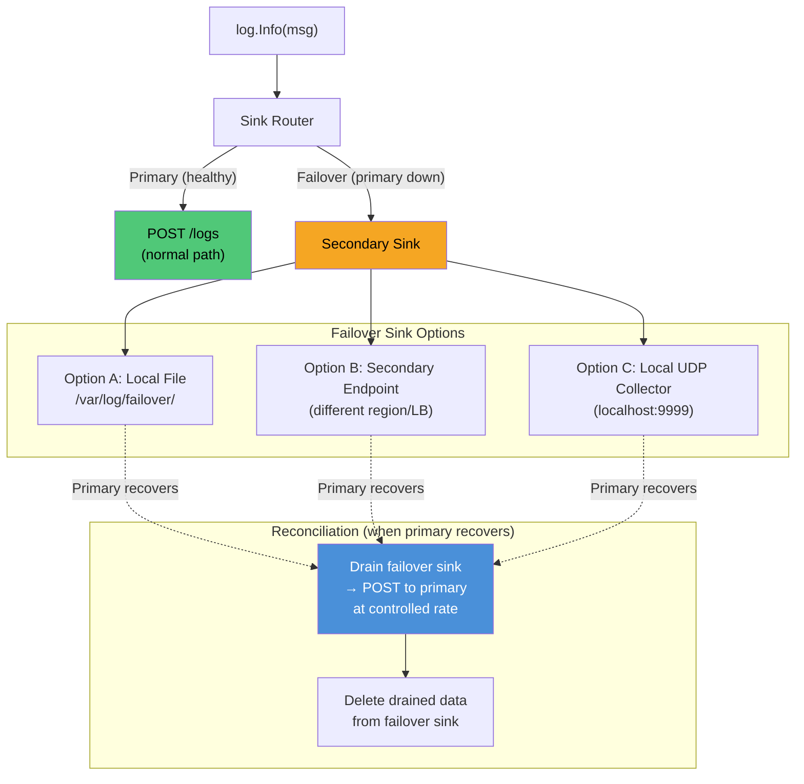

### How It Works at 250k RPS

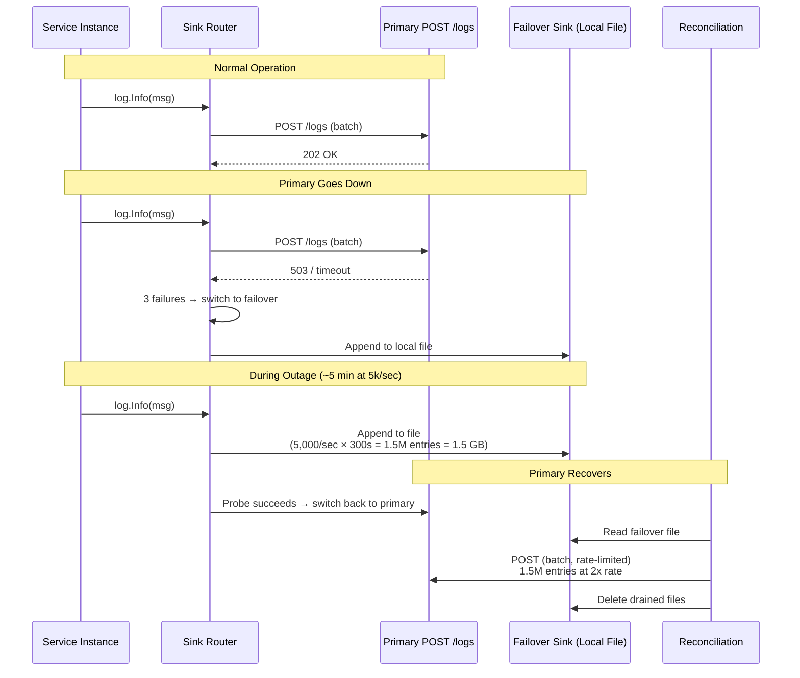

### Failover Sink Options Compared

| Sink | Durability | Latency | Complexity | Best For |
|---|---|---|---|---|
| Local file | Survives crashes | ~50-100μs | Medium (file mgmt) | Most scenarios |
| Secondary endpoint | Survives host failure | ~2-5ms | High (two infra paths) | Regional failover |
| Local UDP collector | No durability | ~10-20μs | Low | Ultra-low latency needs |

### Pros

| Pro | Detail |
|---|---|
| Near-zero data loss | If failover sink is disk-based, survives both outages and application crashes. |
| Application never blocks | Always has somewhere to write — primary or failover. Log call never fails from the application's perspective. |
| Geographic resilience | If failover is a secondary endpoint in another region, survives regional outages entirely. |
| Clean separation | Primary path stays simple and fast. Failover logic is isolated. Easy to reason about each independently. |
| Graceful degradation | System degrades from "logs in pipeline" to "logs on local disk" rather than "logs dropped." Operator knows exactly where to look. |
| Predictable failover behavior | Unlike retry/backoff, the switchover is explicit. Easy to monitor: "failover sink active" is a clear alert. |

### Cons

| Con | Detail at 250k RPS |
|---|---|
| Reconciliation complexity | Draining failover back into primary must handle: ordering (failover logs are out-of-order relative to primary), deduplication (some logs may have reached both paths), rate limiting (don't overwhelm primary with replay + live traffic). |
| Two code paths | Primary POST logic and failover write logic both need testing, monitoring, and alerting. Bugs hide in the failover path because it's rarely exercised. |
| Dual-write risk | During transition between primary and failover (and back), there is a window where logs might go to both sinks or neither. Need atomic switchover logic. |
| Failover sink capacity | 1-hour outage at 5,000 logs/sec = 5,000 x 3,600 x 1 KB = 18 GB per instance. Must ensure local disk can handle this across all instances on the host. |
| Query blind spot | Logs in the failover sink are not yet in MySQL and not yet queryable via GET. During an outage, query results are incomplete. Need alerting on failover sink depth. |
| Testing burden | Failover path is the path you need most and test least. Must actively exercise it (chaos engineering / game days) to ensure it works when needed. |

### Verdict

**Most resilient pattern.** Best for systems where data loss is unacceptable and you can invest in reconciliation logic. Also the most complex — ~1,500 lines of robust implementation.

---

## Head-to-Head Comparison at 250k RPS

### Data Loss Scenarios

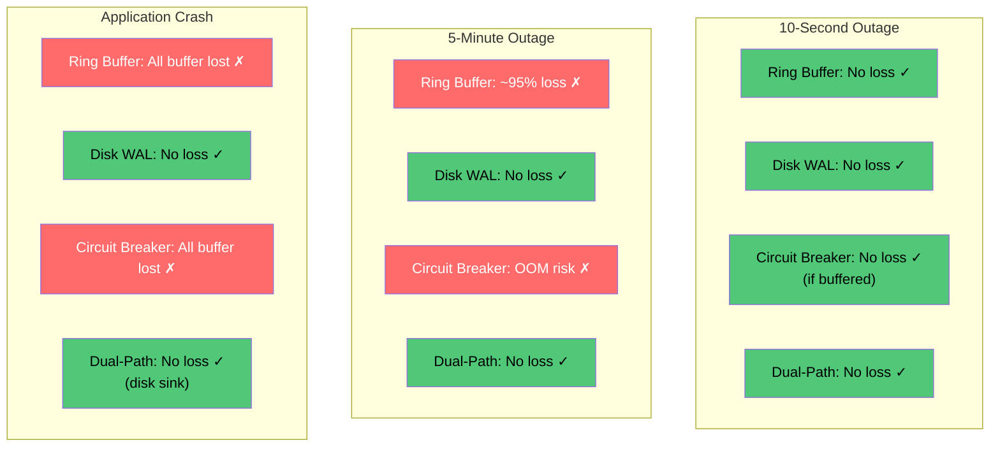

### Quantitative Comparison

| Factor | Ring Buffer | Disk WAL | Circuit Breaker | Dual-Path |
|---|---|---|---|---|
| Data loss on 10s outage | None | None | None (if buffered) | None |
| Data loss on 5-min outage | ~95% of window | None (within WAL cap) | Depends on buffer | None |
| Data loss on app crash | **All buffered data** | None | **All buffered data** | None (disk sink) |
| Implementation complexity | Low (~200 LOC) | Medium (~800 LOC) | Low (~100 LOC + library) | High (~1500 LOC) |
| Disk I/O impact | None | 5 MB/sec per instance | None | 5 MB/sec during failover |
| Memory overhead | 50 MB fixed | Minimal | Variable (grows during outage) | Minimal |
| Protects recovering server | No (retry storms) | No | **Yes** | Partial (reconciliation rate) |
| Survives prolonged outage | No | Yes (within disk cap) | No (memory OOM) | **Yes** |

---

## Recommended Combination

These patterns are **not mutually exclusive**. The strongest client layers them together:

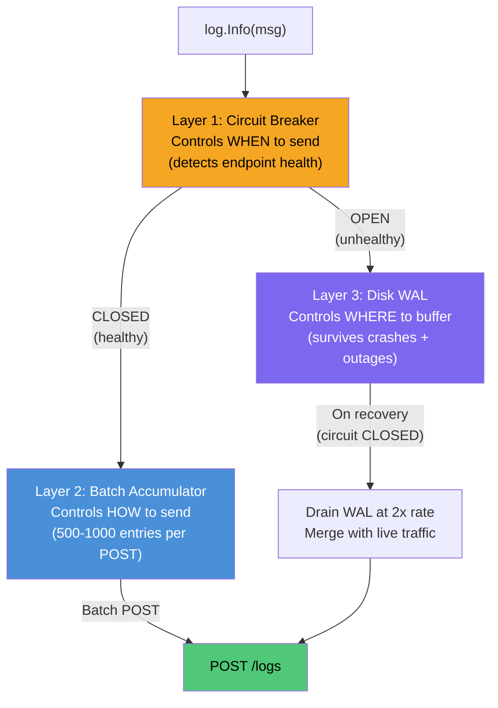

| Layer | Role | Handles |
|---|---|---|
| **Circuit Breaker** | Controls *when* to send | Prevents thundering herd, detects recovery |
| **Batch Accumulator** | Controls *how* to send | Reduces HTTP overhead, efficient bulk POST |
| **Disk WAL** | Controls *where* to buffer | Survives crashes, prolonged outages, bounded disk |

### The Convergence Observation

> Building a robust "smart client" with all three layers (circuit breaker + batching + disk WAL) produces **~1,500 lines of code that does exactly what a sidecar agent already does.** Filebeat, Vector, and Fluentd implement all of these patterns with years of production hardening.
>
> The question becomes: do you embed this complexity in every microservice (N implementations, N languages, N maintenance burdens), or externalize it into one well-tested agent?

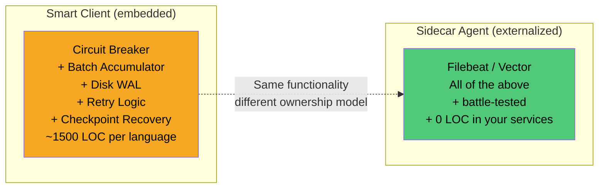

**If you have the organizational ability to deploy a sidecar agent, that is strictly better than building smart clients.** Smart clients make sense when you cannot control the deployment environment (e.g., third-party services sending you logs, edge devices, mobile clients).
