# 09 — MySQL Read Replica Tuning

## The Key Insight: Replicas Don't Need Durability

The primary pays a massive performance tax for durability: fsync, doublewrite buffer, binary logging, redo log flushing. **The replica doesn't need any of this.** If a replica crashes, you promote another or rebuild it from the primary. This lets us strip out every durability mechanism and redirect those resources toward read performance.

---

## Optimal Replica Machine Configuration

### Why Different From Primary?

The primary is **write-optimized**: fast sequential writes, large redo logs, durable commits. The replica is **read-optimized**: maximum RAM for buffer pool cache and fast random reads.

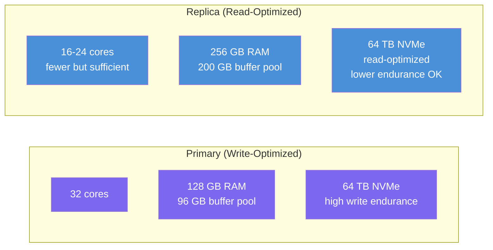

| Resource | Primary | Replica | Why Different |
|---|---|---|---|
| **RAM** | 128 GB | **256 GB** | More buffer pool = more cache hits. RAM is the single biggest read performance lever. |
| **CPU** | 32 cores | 16-24 cores | Reads are I/O bound, not CPU bound. Fewer but sufficient cores. Saves cost. |
| **Disk** | 64 TB NVMe (high write endurance) | 64 TB NVMe (read-optimized, lower endurance OK) | Replica disk sees mostly sequential replication writes + random reads. Write endurance matters less. |
| **Network** | 25 Gbps | 25 Gbps | Same — scatter-gather responses need bandwidth. |

---

## Buffer Pool Sizing Math

This is the most critical decision for read performance.

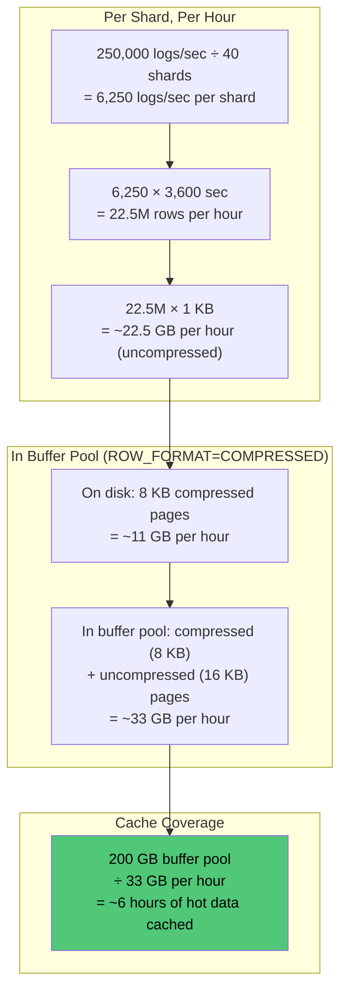

Most operational queries target the **last 1-2 hours** of logs (engineers debugging live issues). With 6 hours cached, the vast majority of queries are served entirely from memory — no disk I/O.

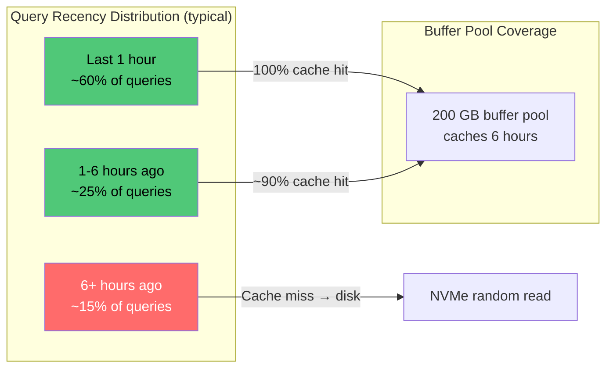

---

## MySQL-Level Replica Optimizations

### 1. Disable All Durability Mechanisms

```ini
[mysqld]
# === DURABILITY STRIPPING (safe on replicas) ===

# Don't fsync redo log on commit — biggest single performance gain
# Primary uses 2, replica can use 0 (flush only every second)
innodb_flush_log_at_trx_commit = 0

# Don't fsync binary log (or disable it entirely)
sync_binlog = 0

# Disable binary logging entirely — replica doesn't need it
# (unless chaining replication to another replica)
skip-log-bin

# Disable doublewrite buffer — no need for torn page protection
# If replica crashes, rebuild from primary
innodb_doublewrite = OFF

# Disable change buffering — replica applies inserts sequentially
# via replication, so buffering random inserts is unnecessary
innodb_change_buffering = none
```

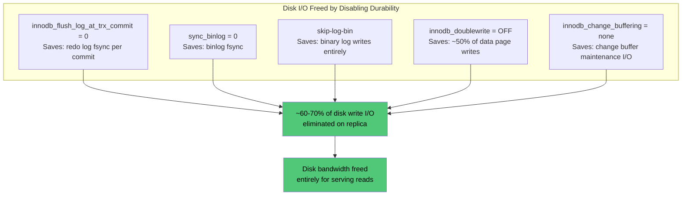

### 2. Maximize Buffer Pool

```ini
# === BUFFER POOL (the #1 read performance lever) ===

# 200 GB buffer pool on a 256 GB machine
# Leave ~56 GB for OS page cache, connections, tmp tables
innodb_buffer_pool_size = 200G

# 32 instances to reduce mutex contention on concurrent reads
# Rule of thumb: 1 instance per 4-8 GB of buffer pool
innodb_buffer_pool_instances = 32

# Warm up buffer pool after restart — critical for replicas
# Without this, a restarted replica serves everything from disk
# until the buffer pool warms up naturally (could take hours)
innodb_buffer_pool_dump_at_shutdown = ON
innodb_buffer_pool_load_at_startup = ON

# Dump 100% of buffer pool pages (default is 25%)
innodb_buffer_pool_dump_pct = 100
```

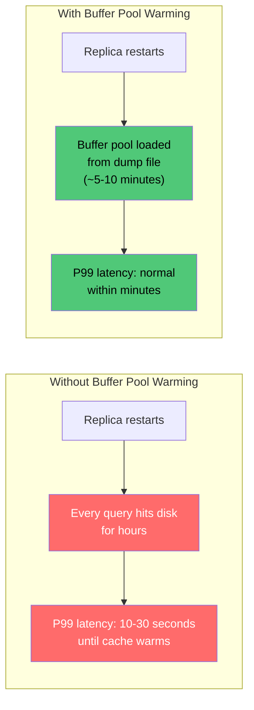

### 3. Read-Specific I/O Tuning

```ini
# === READ I/O OPTIMIZATION ===

# More read I/O threads for parallel disk reads
innodb_read_io_threads = 32

# Fewer write I/O threads (replica only does replication writes)
innodb_write_io_threads = 4

# Higher I/O capacity — tell InnoDB the NVMe can handle more
innodb_io_capacity = 20000
innodb_io_capacity_max = 40000

# Aggressive read-ahead for sequential scans (range queries on ts)
# Prefetch pages when 16 out of 64 pages in an extent are accessed
innodb_read_ahead_threshold = 16

# Parallel clustered index range scans (MySQL 8.0.14+)
# Speeds up large range scans across the (ts, id) primary key
innodb_parallel_read_threads = 8
```

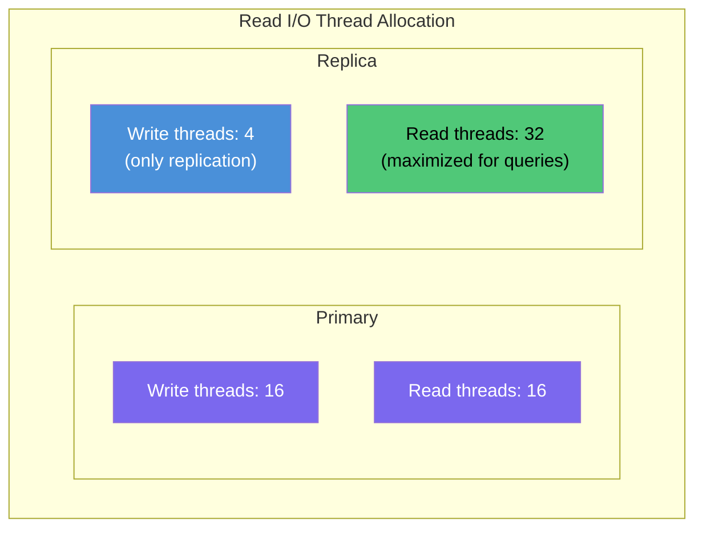

### 4. Transaction Isolation Relaxation

```ini
# === ISOLATION LEVEL ===

# READ-UNCOMMITTED eliminates MVCC overhead:
# - No consistent read snapshots
# - No undo log lookups
# - No read view management
# Dirty reads are perfectly fine for log queries — a log entry
# being half-replicated won't cause business logic errors
transaction_isolation = READ-UNCOMMITTED
```

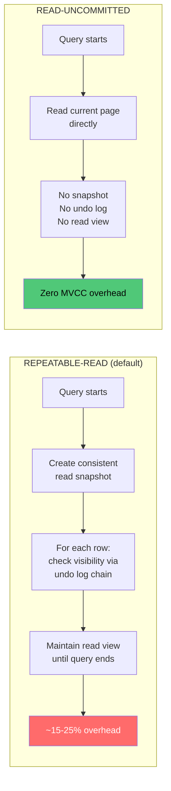

**This is a significant optimization most designs miss.** The default `REPEATABLE-READ` creates a consistent snapshot for every query, maintaining read views and potentially reading from undo logs. For log data, this is pure overhead. `READ-UNCOMMITTED` skips all of it.

### 5. Parallel Replication (Keep Replica In Sync)

```ini
# === REPLICATION PERFORMANCE ===

# Apply replication events in parallel (16 worker threads)
replica_parallel_workers = 16

# Use logical clock parallelism (MySQL 8.0+)
# Transactions committed in the same binlog group on primary
# can be applied in parallel on replica
replica_parallel_type = LOGICAL_CLOCK

# Preserve commit ordering for consistency
replica_preserve_commit_order = ON
```

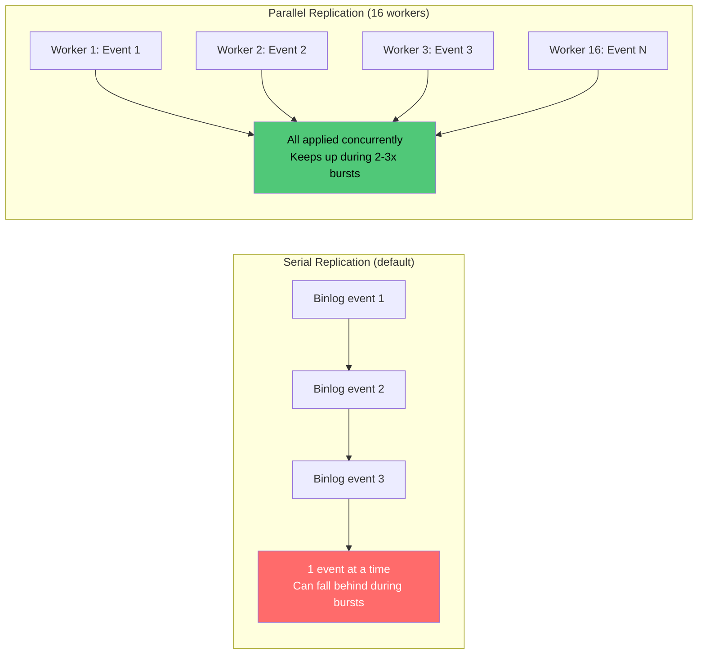

### 6. Enable Adaptive Hash Index (For Reads)

```ini
# === ADAPTIVE HASH INDEX ===

# ON for replicas (OFF on primaries)
# AHI builds in-memory hash indexes for frequently accessed pages
# Overhead on writes (maintaining the hash) — bad for primaries
# Pure benefit on reads (O(1) lookup vs B-tree traversal) — good for replicas
innodb_adaptive_hash_index = ON
innodb_adaptive_hash_index_parts = 16
```

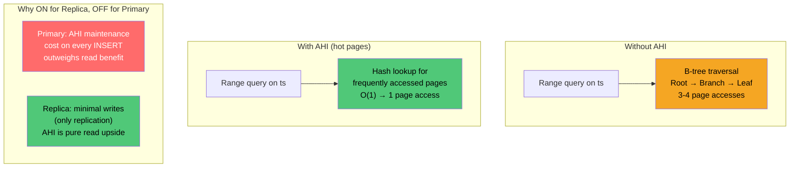

---

## Advanced: Partition-Affinity Replicas

Instead of every replica serving queries for all 180 days, assign each replica a time-range affinity:

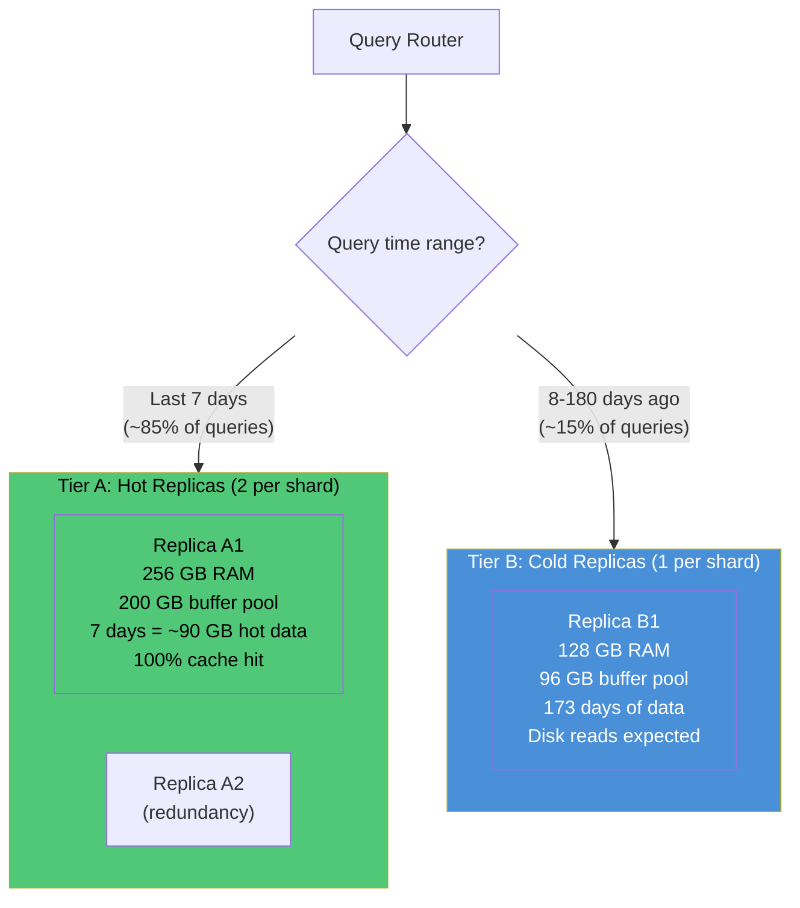

### Why This Works

| Aspect | All-Data Replica | Partition-Affinity Replica |
|---|---|---|
| Buffer pool utilization | Polluted with old + new data | Concentrated on relevant data |
| Cache hit rate (recent queries) | ~70-80% | **~95-100%** |
| Machine cost (Tier A) | Same for all | Can use smaller disks (only recent data needed fast) |
| Machine cost (Tier B) | Same for all | Can use less RAM (cold queries tolerate disk reads) |
| Routing complexity | Simple (any replica) | Query router must inspect time range |

### Implementation

The query router inspects `from`/`to` and routes accordingly:

```
if (from >= now - 7 days):
    route to Tier A replica (random pick for load balancing)
else:
    route to Tier B replica
```

All replicas still replicate ALL data from the primary (they have the full dataset). The tiering only affects which replica the query router prefers for a given time range. This means any replica can serve any query in a failover scenario.

---

## Complete Replica Configuration

```ini
[mysqld]
# ============================================
# READ REPLICA — OPTIMIZED FOR QUERY SERVING
# ============================================

# --- Durability: OFF (not needed on replicas) ---
innodb_flush_log_at_trx_commit      = 0
sync_binlog                         = 0
skip-log-bin
innodb_doublewrite                  = OFF
innodb_change_buffering             = none

# --- Buffer Pool: MAXIMIZED ---
innodb_buffer_pool_size             = 200G
innodb_buffer_pool_instances        = 32
innodb_buffer_pool_dump_at_shutdown = ON
innodb_buffer_pool_load_at_startup  = ON
innodb_buffer_pool_dump_pct         = 100

# --- Read I/O: AGGRESSIVE ---
innodb_read_io_threads              = 32
innodb_write_io_threads             = 4
innodb_io_capacity                  = 20000
innodb_io_capacity_max              = 40000
innodb_read_ahead_threshold         = 16
innodb_parallel_read_threads        = 8

# --- Isolation: RELAXED ---
transaction_isolation               = READ-UNCOMMITTED

# --- Replication: PARALLEL ---
replica_parallel_workers            = 16
replica_parallel_type               = LOGICAL_CLOCK
replica_preserve_commit_order       = ON

# --- Adaptive Hash Index: ON (benefits reads) ---
innodb_adaptive_hash_index          = ON
innodb_adaptive_hash_index_parts    = 16

# --- Compression (same as primary) ---
innodb_file_per_table               = ON
```

---

## Impact Summary

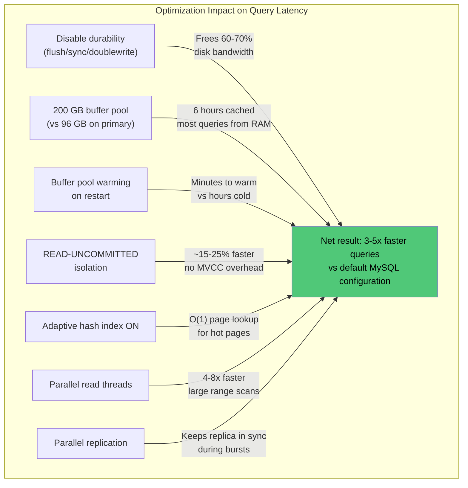

| Optimization | Mechanism | Expected Impact |
|---|---|---|
| Disable durability | Eliminates write I/O overhead | Frees ~60-70% of disk bandwidth for reads |
| 200 GB buffer pool | Cache 6 hours of hot data | Most queries served from memory — sub-second per shard |
| Buffer pool warm-up | Preloads cache from dump file | Avoids hours of cold cache after replica restart |
| `READ-UNCOMMITTED` | Skips MVCC read views and undo log | ~15-25% faster reads |
| Adaptive hash index ON | In-memory hash for hot pages | O(1) page lookup for repeated accesses |
| Parallel read threads | Parallel clustered index scans | Large range scans 4-8x faster |
| Parallel replication | 16 workers applying binlog events | Keeps replica in sync during burst traffic |

**Net effect:** A properly tuned read replica serves the same query **3-5x faster** than a default-configured MySQL instance, while costing roughly the same (trading CPU cores for RAM).
