# 10 — SLI / SLO / SLA / Error Budget & Alerting

## Terminology

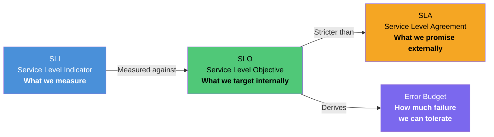

**Key principle:** SLO is always stricter than SLA. If SLA promises 99.9%, SLO targets 99.95%. The gap is your safety margin — if you breach SLO, you have time to react before breaching SLA and owing customers remediation.

---

## SLIs (Service Level Indicators)

### Defining Good SLIs

An SLI must be a **ratio**: good events / total events. Not an average, not a percentile on its own. The ratio gives us a number between 0 and 1 (or 0% and 100%) that directly maps to SLO thresholds and error budgets.

### Write Path SLIs

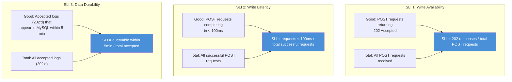

| SLI | Formula | What It Captures |
|---|---|---|
| **Write Availability** | `count(POST returning 202) / count(all POST requests)` | Can clients send logs? |
| **Write Latency** | `count(POST < 100ms) / count(successful POST requests)` | Is the POST endpoint responsive? |
| **Data Durability** | `count(accepted logs queryable within 5 min) / count(all accepted logs)` | Do accepted logs actually reach MySQL? |

### Read Path SLIs

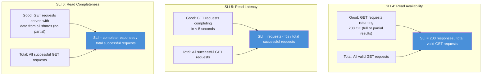

| SLI | Formula | What It Captures |
|---|---|---|
| **Read Availability** | `count(GET returning 200) / count(valid GET requests)` | Can clients query logs? |
| **Read Latency** | `count(GET < 5s) / count(successful GET requests)` | Are queries responsive? |
| **Read Completeness** | `count(GET with all shards responding) / count(successful GET requests)` | Are query results complete? |

### Pipeline Health SLI

| SLI | Formula | What It Captures |
|---|---|---|
| **Ingestion Freshness** | `count(logs queryable within 60s of POST) / count(all accepted logs)` | End-to-end pipeline delay |

---

## SLOs (Service Level Objectives)

### Setting Realistic Targets

Each SLO is based on the architecture's failure characteristics. Overpromising creates alert fatigue. Underpromising wastes engineering capacity.

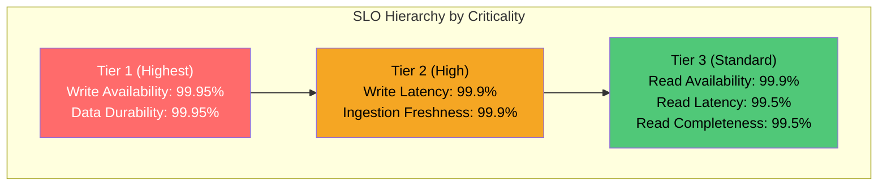

### SLO Targets with Justification

#### Tier 1 — Critical (Protect Data Ingestion)

| SLI | SLO Target | Rolling Window | Justification |
|---|---|---|---|
| **Write Availability** | **99.95%** | 30 days | POST is stateless → Kafka. Only fails if both LB and Kafka are down. 99.99% is unrealistic because Kafka partition leader elections and LB config changes cause brief blips. |
| **Data Durability** | **99.95%** | 30 days | Accepted logs must reach MySQL. Loss comes from: writer worker crash (buffer lost: ~5K rows), MySQL shard crash (unreplicated: ~5.5K rows), Kafka retention exceeded (catastrophic). 99.95% allows for the first two. |

**Why not 99.99% for Write Availability?**

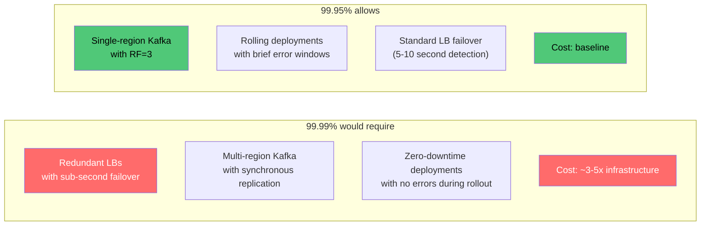

#### Tier 2 — High (Protect User Experience)

| SLI | SLO Target | Rolling Window | Justification |
|---|---|---|---|
| **Write Latency** (< 100ms) | **99.9%** | 30 days | POST is fire-and-forward. P99 should be <50ms normally. 0.1% budget covers GC pauses, Kafka producer backpressure during spikes, and network jitter. |
| **Ingestion Freshness** (< 60s) | **99.9%** | 30 days | Log should be queryable within 60 seconds. Budget covers: Kafka consumer lag spikes, writer batch flush delays, MySQL replication lag. |

#### Tier 3 — Standard (Operational Queries)

| SLI | SLO Target | Rolling Window | Justification |
|---|---|---|---|
| **Read Availability** | **99.9%** | 30 days | Scatter-gather across 40+ shards. Any shard replica down = degraded. With partial results, we can maintain 99.9%. Without partial results, even one replica outage across 45 shards drops availability. |
| **Read Latency** (< 5s) | **99.5%** | 30 days | Large range queries (3600s window) scan millions of rows. Tail latency is inherently variable. 99.5% allows 0.5% of queries to exceed 5s (cold cache, large result sets, shard stragglers). |
| **Read Completeness** | **99.5%** | 30 days | All 45 shards must respond. Even with replicas, 1 in 45 being briefly unavailable during failover is expected. 99.5% accommodates ~2.2 hours of partial results per month. |

**Why Read SLOs are lower than Write SLOs:**

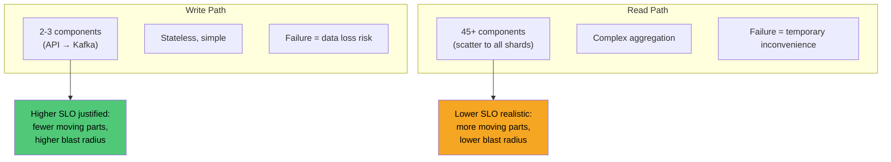

---

## SLA (Service Level Agreement)

SLA is the **external promise** with financial or contractual consequences. Always set below the internal SLO to provide a safety buffer.

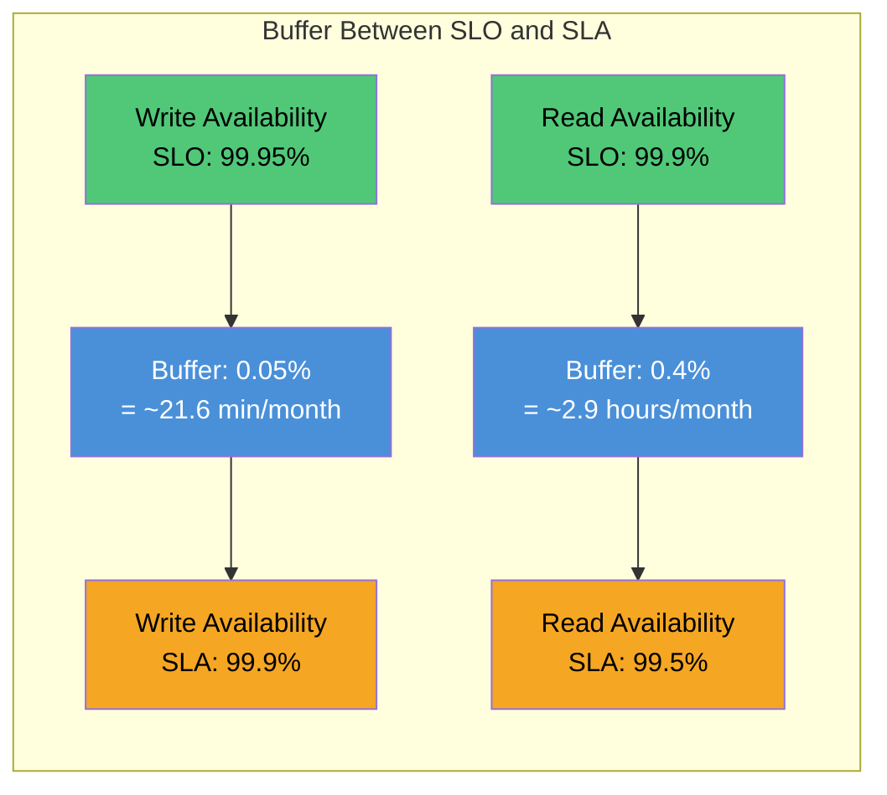

| SLI | SLO (Internal) | SLA (External) | Buffer |
|---|---|---|---|
| Write Availability | 99.95% | **99.9%** | 0.05% (~21.6 min/month) |
| Data Durability | 99.95% | **99.9%** | 0.05% |
| Write Latency (< 100ms) | 99.9% | **99.5%** | 0.4% |
| Read Availability | 99.9% | **99.5%** | 0.4% |
| Read Latency (< 5s) | 99.5% | **99.0%** | 0.5% |
| Ingestion Freshness (< 60s) | 99.9% | **99.5%** | 0.4% |

### SLA Breach Consequences

| Breach Level | Condition | Consequence |
|---|---|---|
| Level 1 | Any SLA metric below target for 1 day | Incident report within 48 hours |
| Level 2 | Any SLA metric below target for 7 days in a month | Service credit (10% of monthly cost) |
| Level 3 | Any SLA metric below target for 15+ days in a month | Service credit (30%) + executive review |

---

## Error Budget Calculation

### What Is Error Budget?

```
Error Budget = 1 - SLO

If SLO = 99.95%, Error Budget = 0.05%
This means: 0.05% of requests (or time) are ALLOWED to fail.
```

The error budget is a **spending account for unreliability**. You can "spend" it on deployments, experiments, planned maintenance, or unexpected failures. When it runs out, you freeze changes and focus on reliability.

### Monthly Error Budgets

#### Write Availability (SLO: 99.95%)

```
Error Budget = 0.05%

In time:
  30 days × 24 hours × 60 min = 43,200 minutes/month
  43,200 × 0.0005 = 21.6 minutes of downtime allowed

In requests:
  250,000 RPS × 86,400 sec/day × 30 days = 648,000,000,000 requests/month
  648B × 0.0005 = 324,000,000 failed requests allowed per month
  = ~324M errors/month
  = ~125 errors/second sustained (if spread evenly)
```

#### Data Durability (SLO: 99.95%)

```
Error Budget = 0.05%

In logs:
  648B logs accepted/month
  648B × 0.0005 = 324,000,000 logs allowed to be lost
  = ~324M lost logs/month
  = ~125 logs/second sustained loss rate
```

#### Read Availability (SLO: 99.9%)

```
Error Budget = 0.1%

In time:
  43,200 min × 0.001 = 43.2 minutes of downtime allowed

In requests (assuming ~1,000 queries/sec):
  1,000 × 86,400 × 30 = 2,592,000,000 requests/month
  2.59B × 0.001 = 2,592,000 failed queries allowed
  = ~2.59M query failures/month
```

### Complete Error Budget Table

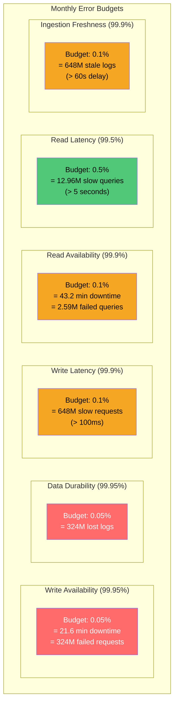

| SLI | SLO | Error Budget (%) | Monthly Time Budget | Monthly Request Budget |
|---|---|---|---|---|
| Write Availability | 99.95% | 0.05% | 21.6 min | 324M failed POSTs |
| Data Durability | 99.95% | 0.05% | — | 324M lost logs |
| Write Latency | 99.9% | 0.1% | — | 648M slow POSTs (>100ms) |
| Read Availability | 99.9% | 0.1% | 43.2 min | 2.59M failed GETs |
| Read Latency | 99.5% | 0.5% | — | 12.96M slow GETs (>5s) |
| Ingestion Freshness | 99.9% | 0.1% | — | 648M stale logs (>60s) |

### Error Budget Policies

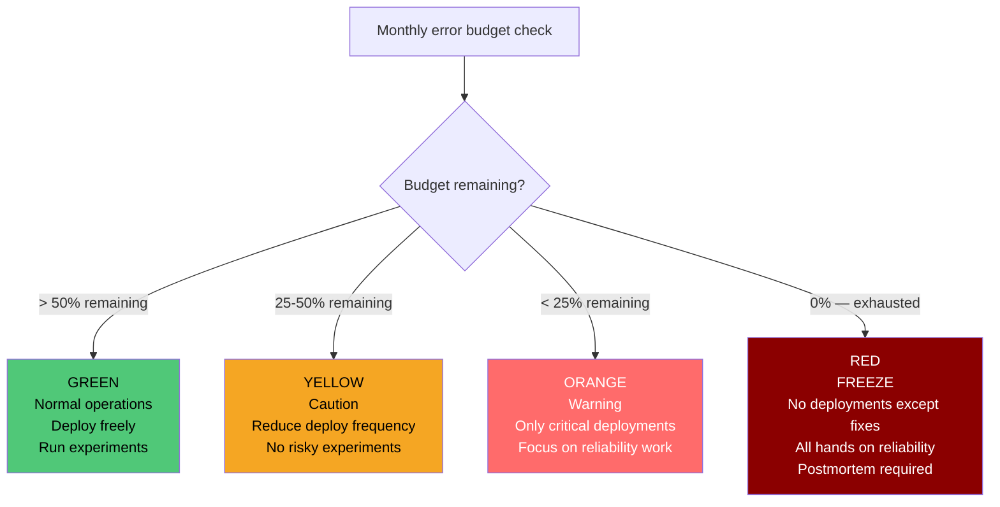

| Budget Status | Action |
|---|---|
| **> 50% remaining** | Normal velocity. Deploy, experiment, iterate. |
| **25-50% remaining** | Reduce deployment frequency. Skip non-critical changes. Review recent incidents. |
| **< 25% remaining** | Only critical/security deployments. Redirect engineering to reliability improvements. |
| **Exhausted (0%)** | **Change freeze.** No deployments except reliability fixes. Mandatory postmortem. Leadership review. |

---

## Burn Rate & Multi-Window Alerting

### What Is Burn Rate?

```
Burn Rate = rate of error budget consumption relative to the natural rate

Natural rate: consuming 100% of budget evenly over 30 days
Burn Rate 1.0 = consuming budget at exactly the allowed rate
Burn Rate 2.0 = consuming budget 2x faster → exhausted in 15 days
Burn Rate 14.4 = consuming budget 14.4x faster → exhausted in ~2 days
```

### Multi-Window, Multi-Burn-Rate Alerting

The key insight from the Google SRE Workbook: a **single-threshold alert** either fires too late (low burn rate) or too often (low threshold). Multi-window alerting solves this by combining a short window (detect fast) with a long window (confirm sustained).

```mermaid
graph TB
    subgraph "Alert Level 1: PAGE (Critical)"
        P_SHORT["Short window: 5 min<br/>Burn rate > 14.4x"]
        P_LONG["Long window: 1 hour<br/>Burn rate > 14.4x"]
        P_SHORT & P_LONG -->|"BOTH true"| PAGE["PAGE on-call<br/>Budget exhausted in ~2 days<br/>if sustained"]
    end

    subgraph "Alert Level 2: PAGE (High)"
        H_SHORT["Short window: 30 min<br/>Burn rate > 6x"]
        H_LONG["Long window: 6 hours<br/>Burn rate > 6x"]
        H_SHORT & H_LONG -->|"BOTH true"| HIGH["PAGE on-call<br/>Budget exhausted in ~5 days<br/>if sustained"]
    end

    subgraph "Alert Level 3: TICKET (Warning)"
        T_SHORT["Short window: 2 hours<br/>Burn rate > 3x"]
        T_LONG["Long window: 24 hours<br/>Burn rate > 3x"]
        T_SHORT & T_LONG -->|"BOTH true"| TICKET["Create ticket<br/>Budget exhausted in ~10 days<br/>if sustained"]
    end

    subgraph "Alert Level 4: LOG (Informational)"
        L_WINDOW["Window: 24 hours<br/>Burn rate > 1x"]
        L_WINDOW --> LOG["Log warning<br/>Budget being consumed<br/>faster than planned"]
    end

    style PAGE fill:#8b0000,color:#fff
    style HIGH fill:#ff6b6b,color:#fff
    style TICKET fill:#f5a623,color:#000
    style LOG fill:#50c878,color:#000
```

### Alert Configuration Per SLI

#### Write Availability (SLO: 99.95%, Budget: 0.05%)

```
Error rate threshold at each burn rate:

  Burn Rate 14.4x → error rate = 14.4 × 0.05% = 0.72%
  At 250k RPS: 0.72% = 1,800 errors/sec sustained over 5 min

  Burn Rate 6x   → error rate = 6 × 0.05% = 0.30%
  At 250k RPS: 0.30% = 750 errors/sec sustained over 30 min

  Burn Rate 3x   → error rate = 3 × 0.05% = 0.15%
  At 250k RPS: 0.15% = 375 errors/sec sustained over 2 hours

  Burn Rate 1x   → error rate = 1 × 0.05% = 0.05%
  At 250k RPS: 0.05% = 125 errors/sec sustained over 24 hours
```

| Level | Burn Rate | Short Window | Long Window | Error Rate | Errors/sec | Action |
|---|---|---|---|---|---|---|
| **PAGE (P1)** | 14.4x | 5 min | 1 hour | 0.72% | 1,800/sec | Wake on-call. Budget gone in 2 days. |
| **PAGE (P2)** | 6x | 30 min | 6 hours | 0.30% | 750/sec | Page on-call. Budget gone in 5 days. |
| **TICKET** | 3x | 2 hours | 24 hours | 0.15% | 375/sec | Create JIRA ticket. Budget gone in 10 days. |
| **LOG** | 1x | — | 24 hours | 0.05% | 125/sec | Dashboard warning. On track to exhaust budget. |

#### Read Availability (SLO: 99.9%, Budget: 0.1%)

| Level | Burn Rate | Short Window | Long Window | Error Rate | Action |
|---|---|---|---|---|---|
| **PAGE (P1)** | 14.4x | 5 min | 1 hour | 1.44% | Wake on-call |
| **PAGE (P2)** | 6x | 30 min | 6 hours | 0.60% | Page on-call |
| **TICKET** | 3x | 2 hours | 24 hours | 0.30% | Create ticket |
| **LOG** | 1x | — | 24 hours | 0.10% | Dashboard warning |

#### Data Durability (SLO: 99.95%, Budget: 0.05%)

```
Measured differently: compare logs accepted (Kafka offset) vs logs in MySQL.

Durability deficit = accepted_count - queryable_count
Deficit rate = durability deficit per hour / accepted per hour
```

| Level | Condition | Window | Action |
|---|---|---|---|
| **PAGE (P1)** | Deficit rate > 0.72% | 5 min + 1 hour | Wake on-call. Logs being lost. |
| **PAGE (P2)** | Kafka consumer lag > 1 hour of data | 30 min | Page on-call. Pipeline stalled. |
| **TICKET** | Deficit rate > 0.15% | 2 hours + 24 hours | Create ticket. Slow data loss. |
| **LOG** | Any DLQ messages | 1 hour | Log. Investigate bad records. |

#### Ingestion Freshness (SLO: 99.9%, Budget: 0.1%)

```
Measured by: synthetic log injection.
Every 30 seconds, inject a canary log via POST.
Measure time until it appears in GET results.
Freshness = canary round-trip time.
```

| Level | Condition | Window | Action |
|---|---|---|---|
| **PAGE (P1)** | Canary freshness > 5 min | 5 min + 1 hour | Wake on-call. Pipeline severely backed up. |
| **PAGE (P2)** | Canary freshness > 2 min | 30 min + 6 hours | Page on-call. Pipeline degraded. |
| **TICKET** | Canary freshness > 60s | 2 hours + 24 hours | Create ticket. Approaching SLO boundary. |
| **LOG** | Canary freshness > 30s | 24 hours | Dashboard warning. |

---

## Alert Flow Architecture

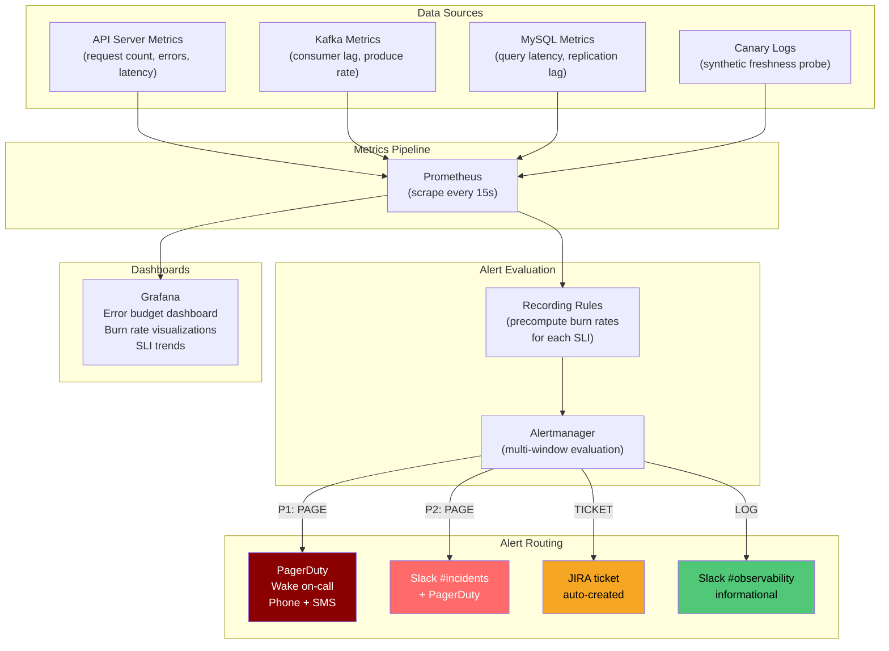

### Prometheus Recording Rules (Example)

```yaml
# Pre-compute error ratios for burn rate alerting
groups:
  - name: sli_write_availability
    interval: 30s
    rules:
      # Error ratio over various windows
      - record: sli:write_availability:error_ratio_5m
        expr: |
          1 - (
            sum(rate(http_requests_total{endpoint="/logs",method="POST",code="202"}[5m]))
            /
            sum(rate(http_requests_total{endpoint="/logs",method="POST"}[5m]))
          )

      - record: sli:write_availability:error_ratio_1h
        expr: |
          1 - (
            sum(rate(http_requests_total{endpoint="/logs",method="POST",code="202"}[1h]))
            /
            sum(rate(http_requests_total{endpoint="/logs",method="POST"}[1h]))
          )

      - record: sli:write_availability:error_ratio_6h
        expr: |
          1 - (
            sum(rate(http_requests_total{endpoint="/logs",method="POST",code="202"}[6h]))
            /
            sum(rate(http_requests_total{endpoint="/logs",method="POST"}[6h]))
          )

      - record: sli:write_availability:error_ratio_24h
        expr: |
          1 - (
            sum(rate(http_requests_total{endpoint="/logs",method="POST",code="202"}[24h]))
            /
            sum(rate(http_requests_total{endpoint="/logs",method="POST"}[24h]))
          )

  - name: sli_write_availability_alerts
    rules:
      # P1 PAGE: 14.4x burn rate over 5min AND 1h
      - alert: WriteAvailabilityBurnRateCritical
        expr: |
          sli:write_availability:error_ratio_5m > (14.4 * 0.0005)
          and
          sli:write_availability:error_ratio_1h > (14.4 * 0.0005)
        labels:
          severity: page_p1
        annotations:
          summary: "Write availability burning error budget at 14.4x rate"
          description: "Budget will be exhausted in ~2 days at this rate"

      # P2 PAGE: 6x burn rate over 30min AND 6h
      - alert: WriteAvailabilityBurnRateHigh
        expr: |
          sli:write_availability:error_ratio_30m > (6 * 0.0005)
          and
          sli:write_availability:error_ratio_6h > (6 * 0.0005)
        labels:
          severity: page_p2
        annotations:
          summary: "Write availability burning error budget at 6x rate"

      # TICKET: 3x burn rate over 2h AND 24h
      - alert: WriteAvailabilityBurnRateWarning
        expr: |
          sli:write_availability:error_ratio_2h > (3 * 0.0005)
          and
          sli:write_availability:error_ratio_24h > (3 * 0.0005)
        labels:
          severity: ticket
        annotations:
          summary: "Write availability burning error budget at 3x rate"
```

---

## Error Budget Dashboard

### What to Display

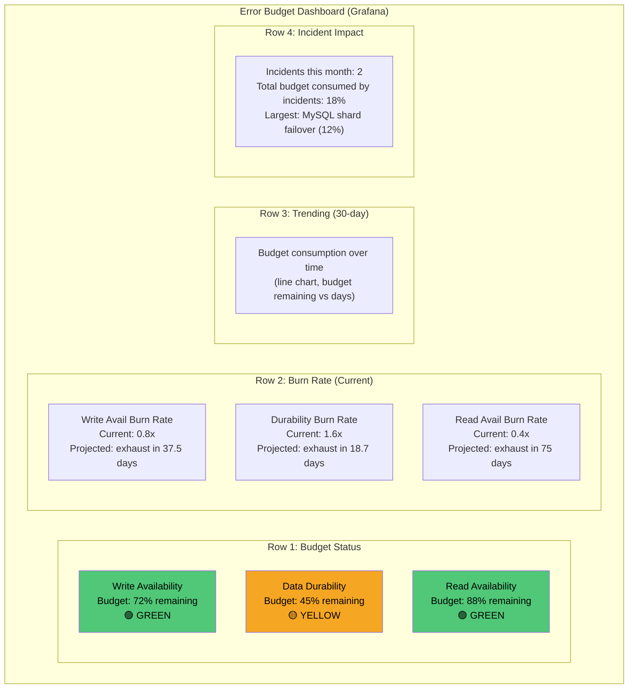

### Key Dashboard Panels

| Panel | Visualization | Purpose |
|---|---|---|
| Budget Remaining (%) | Gauge per SLI | At-a-glance health |
| Burn Rate (current) | Single stat with color thresholds | Is budget being consumed too fast? |
| Budget Consumption Over Time | Time series (30-day) | Trending — are things getting worse? |
| Error Rate vs SLO Threshold | Time series with horizontal SLO line | Are we above or below the line? |
| Incident Impact Log | Table | Which incidents consumed how much budget? |
| Days Until Exhaustion | Single stat | Projected budget exhaustion date at current burn rate |

---

## Summary: SLI → SLO → SLA → Error Budget → Alerts

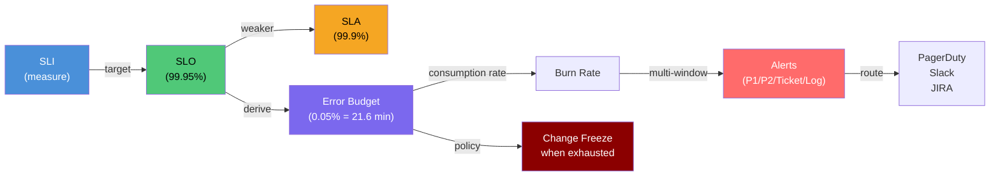

| Layer | Write Availability | Data Durability | Read Availability | Read Latency |
|---|---|---|---|---|
| **SLI** | 202s / total POSTs | queryable / accepted | 200s / total GETs | GETs < 5s / total |
| **SLO** | 99.95% | 99.95% | 99.9% | 99.5% |
| **SLA** | 99.9% | 99.9% | 99.5% | 99.0% |
| **Error Budget** | 21.6 min/month | 324M logs/month | 43.2 min/month | 12.96M queries/month |
| **P1 Alert** | 14.4x burn, 5m+1h | deficit > 0.72% | 14.4x burn, 5m+1h | 14.4x burn, 5m+1h |
| **P2 Alert** | 6x burn, 30m+6h | lag > 1h data | 6x burn, 30m+6h | 6x burn, 30m+6h |
| **Ticket** | 3x burn, 2h+24h | deficit > 0.15% | 3x burn, 2h+24h | 3x burn, 2h+24h |
