# 11 — Pre-Aggregation Strategies

## Context

At 250k RPS, the pipeline must process ~250 MB/sec and store ~2.6 PB over 6 months. Not all of this volume carries equal value. Pre-aggregation reduces the load **before** it reaches Kafka and MySQL, shrinking infrastructure proportionally.

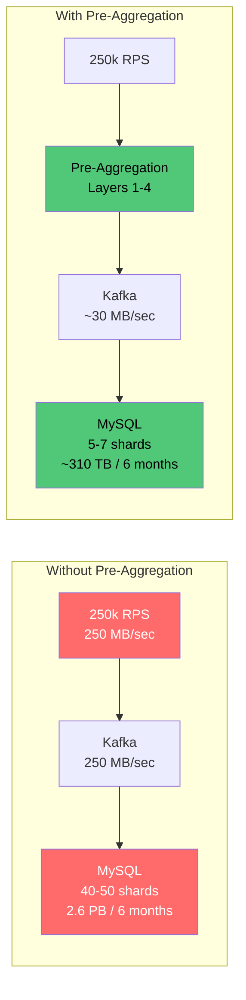

---

## Strategy 1: Log Level Tiering (Sample by Severity)

Not all logs are equal. DEBUG logs at 250k RPS are overwhelmingly noise. Treat each level differently.

### Typical Log Distribution

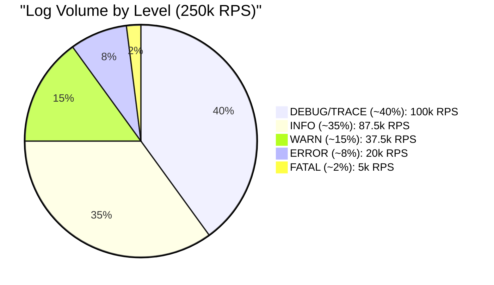

### Sampling Rates by Level

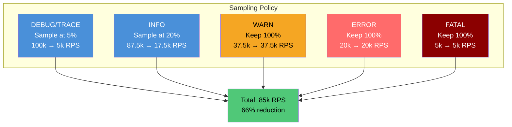

| Level | Original Volume | Sampling Rate | Effective Volume | Eliminated |
|---|---|---|---|---|
| DEBUG/TRACE | 100k RPS | 5% | 5k RPS | 95k RPS |
| INFO | 87.5k RPS | 20% | 17.5k RPS | 70k RPS |
| WARN | 37.5k RPS | 100% | 37.5k RPS | 0 |
| ERROR | 20k RPS | 100% | 20k RPS | 0 |
| FATAL | 5k RPS | 100% | 5k RPS | 0 |
| **Total** | **250k RPS** | | **85k RPS** | **165k RPS (66%)** |

### Dynamic Sampling

Static sampling rates work for steady state, but engineers debugging a live issue need full-fidelity DEBUG logs temporarily.

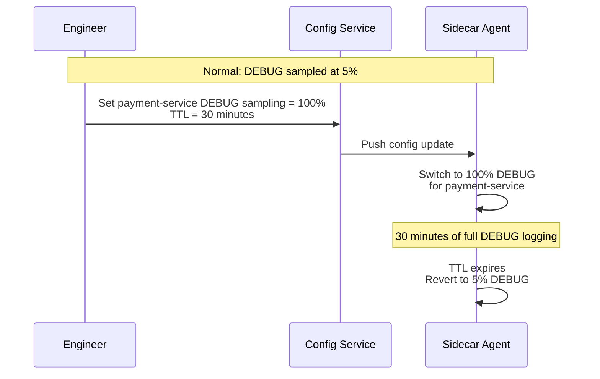

**Implementation:** Store sampling config in a fast K/V store (etcd, Consul). Agents poll every 30 seconds. Engineers toggle via CLI or dashboard. TTL auto-reverts to prevent forgotten overrides from flooding the pipeline.

### Pros

| Pro | Detail |
|---|---|
| Highest impact, simplest implementation | One config change eliminates 66% of volume. No code changes in services. |
| Preserves all high-value logs | ERROR and FATAL are never sampled. Every actionable log is kept. |
| Dynamic override capability | Engineers can temporarily get full logs for specific services when debugging. |
| Deterministic sampling | Use consistent hashing on trace ID so all logs for a given request are either kept or dropped together. No partial traces. |
| Agent-level enforcement | Sampling happens at the sidecar — services don't need to implement it. |

### Cons

| Con | Detail |
|---|---|
| Sampled-out logs are gone forever | If a dropped DEBUG log contained the clue to a production issue, it's unrecoverable. This is the fundamental trade-off. |
| Sampling rates are a guess | What's the right rate for INFO? 10%? 20%? 50%? Too low and you miss patterns. Too high and you save nothing. Requires tuning over time. |
| Breaks log-based metrics | If another system counts log messages to derive metrics (e.g., "requests per second" from INFO logs), sampling breaks those counts. Must use proper metrics instrumentation instead. |
| Inconsistent developer experience | "I can see my ERROR logs but my DEBUG logs are missing" causes confusion. Teams must understand the sampling policy. |
| Per-service tuning needed | A 5% DEBUG rate might be fine for a chatty service but too aggressive for a critical service that logs DEBUG sparingly. One-size-fits-all is suboptimal. |

---

## Strategy 2: Template-Based Deduplication

Most log messages follow templates with variable parts filled in at runtime. Instead of storing thousands of identical messages, collapse them into a single aggregated entry.

### How Template Extraction Works

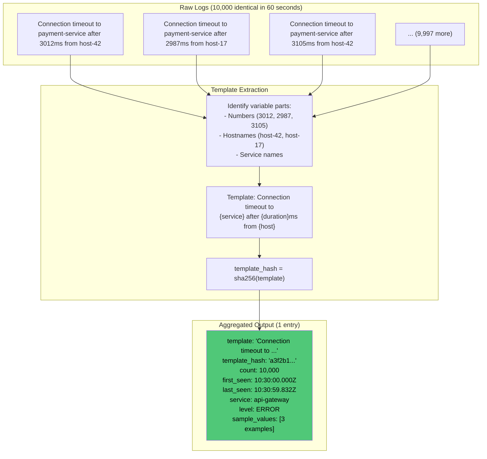

### Aggregated Entry Schema

```json
{
  "type": "aggregated",
  "template": "Connection timeout to {service} after {duration}ms from {host}",
  "template_hash": "a3f2b1c4d5e6...",
  "count": 10000,
  "window_start": "2024-06-15T10:30:00.000Z",
  "window_end": "2024-06-15T10:30:59.999Z",
  "first_seen": "2024-06-15T10:30:00.123Z",
  "last_seen": "2024-06-15T10:30:59.832Z",
  "service": "api-gateway",
  "level": "ERROR",
  "sample_values": [
    {"service": "payment-service", "duration": 3012, "host": "host-42"},
    {"service": "payment-service", "duration": 2987, "host": "host-17"},
    {"service": "payment-service", "duration": 3105, "host": "host-42"}
  ],
  "value_stats": {
    "duration": {"min": 1823, "max": 5102, "avg": 3041, "p99": 4890}
  }
}
```

### Deduplication Ratios by Service Type

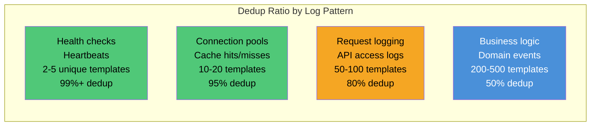

| Service Type | Unique Templates | Dedup Ratio | Example Messages |
|---|---|---|---|
| Health checks / heartbeats | 2-5 | 99%+ | Same message every second |
| Connection pools | 10-20 | 95% | "Acquired/released connection to {db}" |
| Request logging | 50-100 | 80% | "Handled {method} {path} in {duration}ms" |
| Business logic | 200-500 | 50% | More unique messages with variable context |

**Conservative estimate across all services:** 60-70% dedup within a 60-second window.

### Windowing Strategy

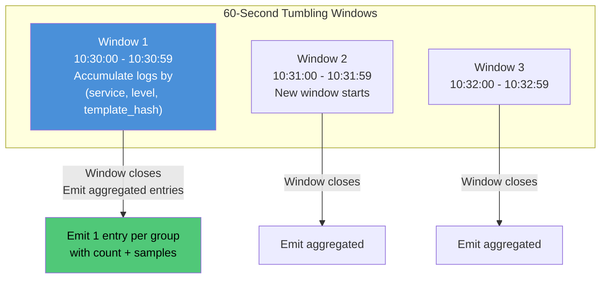

**Why 60 seconds?**

| Window Size | Dedup Ratio | Latency Impact | Memory Overhead |
|---|---|---|---|
| 10 seconds | ~30% | +10s ingestion delay | Low |
| **60 seconds** | **~65%** | **+60s ingestion delay** | **Moderate** |
| 300 seconds | ~80% | +300s ingestion delay | High |

60 seconds balances dedup effectiveness with ingestion freshness. The SLO allows 60-second freshness, so this fits within the budget.

### Pros

| Pro | Detail |
|---|---|
| Massive volume reduction | 60-70% dedup on remaining traffic after sampling. Compounding with Strategy 1 yields 85%+ total reduction. |
| Preserves aggregate signal | You still know "10,000 timeouts happened in this minute." The count preserves the pattern even though individual entries are collapsed. |
| Statistical summaries retained | `value_stats` (min, max, avg, p99) for variable fields give more insight than 10,000 individual entries in many cases. |
| Sample values for investigation | 3-5 sample values preserved per window. Engineers can see real examples without storing every instance. |
| Reduces query result sizes | GET queries return aggregated entries instead of millions of duplicates. Faster queries, smaller responses. |

### Cons

| Con | Detail |
|---|---|
| Loses individual log sequence | Cannot reconstruct the exact order of 10,000 events within the window. Only first_seen, last_seen, and samples are available. |
| Template extraction is imperfect | Log messages with inconsistent formatting, embedded JSON, or stack traces are hard to templatize. False positives (different messages collapsed) or false negatives (same message not matched) are possible. |
| Increases ingestion latency | Must wait for the 60-second window to close before emitting aggregated entries. Adds 30-60 seconds to end-to-end freshness. |
| Memory overhead at the agent | Agent must hold a hash map of `(service, level, template_hash) → aggregation state` per window. At 5,000 templates × ~2 KB state each = ~10 MB per agent. Manageable but non-zero. |
| Schema change in MySQL | Aggregated entries have a different structure (count, sample_values, value_stats) than raw entries. The `logs` table schema or a separate `logs_aggregated` table is needed. |
| Breaks correlation with traces | If logs are correlated with distributed traces (trace_id), aggregation breaks that link. Individual trace IDs are lost in the aggregate. |

---

## Strategy 3: Rate Limiting Per Service (Log Storm Protection)

A single misbehaving service can flood the pipeline. One infinite loop with a log statement can produce 100k logs/sec from a single instance, consuming 40% of the entire pipeline capacity.

### Rate Cap Configuration

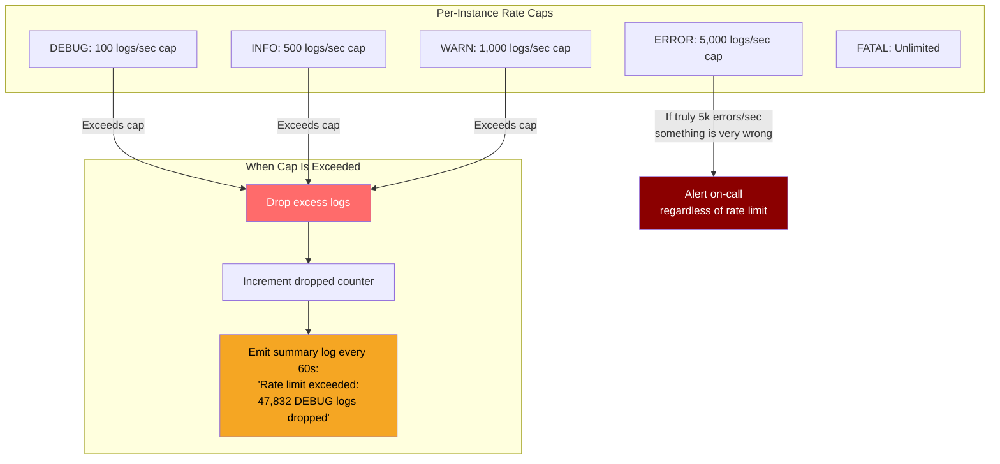

### Log Storm Anatomy

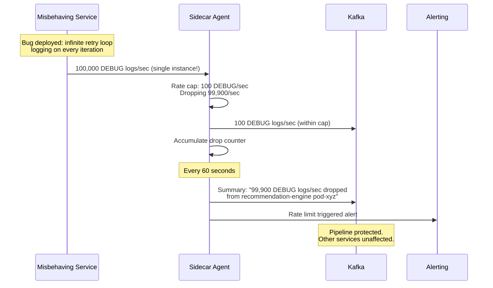

### Pros

| Pro | Detail |
|---|---|
| Pipeline protection | Prevents a single service from consuming disproportionate pipeline capacity. The pipeline serves all services fairly. |
| Automatic storm containment | No manual intervention needed. Agent enforces caps automatically. Broken services cannot break the pipeline. |
| Visibility via summary logs | Dropped counts are recorded. Engineers can see "47,832 logs dropped" and investigate the root cause. Nothing is silently lost without a trace. |
| Per-level granularity | ERROR logs get a much higher cap than DEBUG. High-value logs are preserved even during storms. |
| Protects downstream MySQL | Even if Kafka absorbs a storm, writer workers and MySQL would struggle. Rate limiting prevents this from ever reaching downstream. |

### Cons

| Con | Detail |
|---|---|
| Legitimate high-volume services penalized | A service that legitimately produces 1,000 DEBUG logs/sec (e.g., high-throughput data processing pipeline) hits the cap during normal operation. Need per-service cap overrides. |
| Cap tuning per service | One-size-fits-all caps are suboptimal. A web frontend and a batch processor have very different log profiles. Maintaining per-service configs adds operational overhead. |
| Drops may hide real issues | If a service suddenly emits 10,000 ERROR logs/sec, the cap keeps only 5,000. The other 5,000 are dropped. Those dropped errors might contain unique failure details not present in the kept ones. |
| Summary logs are delayed | The 60-second summary window means you learn about a log storm 60 seconds after it starts. Fast-moving incidents may escalate before the alert fires. |
| False sense of security | Rate limiting protects the pipeline but does not fix the root cause. The misbehaving service is still burning CPU on logging. Rate limiting masks the symptom without curing the disease. |

---

## Strategy 4: Edge Aggregation at the Sidecar Agent

If using the sidecar agent approach (recommended in doc 07), the agent can perform all three strategies above as a **unified aggregation pipeline** before producing to Kafka.

### Agent Aggregation Pipeline

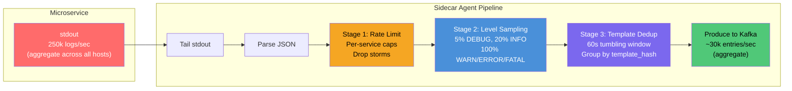

### Vector Configuration Example

```toml
# vector.toml — Sidecar agent with pre-aggregation

[sources.app_logs]
type = "file"
include = ["/var/log/containers/*.log"]

[transforms.parse]
type = "remap"
inputs = ["app_logs"]
source = '''
. = parse_json!(.message)
'''

# Stage 1: Rate limiting
[transforms.rate_limit]
type = "throttle"
inputs = ["parse"]
key_field = "service"
window_secs = 1
threshold = 1000  # per service per second

# Stage 2: Log level sampling
[transforms.sample_debug]
type = "sample"
inputs = ["rate_limit"]
rate = 20  # keep 1 in 20 = 5%
key_field = "message"
exclude."level" = ["WARN", "ERROR", "FATAL"]

# Stage 3: Template dedup (via reduce)
[transforms.aggregate]
type = "reduce"
inputs = ["sample_debug"]
group_by = ["service", "level", "template_hash"]
expire_after_ms = 60000
merge_strategies.message = "retain"
merge_strategies.count = "sum"
merge_strategies.first_seen = "min"
merge_strategies.last_seen = "max"

[sinks.kafka]
type = "kafka"
inputs = ["aggregate"]
bootstrap_servers = "kafka-1:9092,kafka-2:9092"
topic = "logs"
encoding.codec = "json"
```

### Pros

| Pro | Detail |
|---|---|
| Single point of aggregation | All three strategies (rate limiting, sampling, dedup) applied in one pipeline. No duplication of logic across components. |
| Transparent to applications | Services write to stdout as before. No code changes, no SDK dependencies, no awareness of aggregation. |
| Reduces Kafka volume | Unlike stream-processor-based approaches (Strategy applied after Kafka), agent aggregation reduces volume **before** Kafka. Saves Kafka disk, network, and broker count. |
| Battle-tested tooling | Vector, Fluentd, and Fluent Bit natively support throttling, sampling, and reduce/aggregate transforms. Proven at scale. |
| Per-host containment | Each agent aggregates independently. A misbehaving host's agent contains the storm locally without affecting other hosts. |

### Cons

| Con | Detail |
|---|---|
| Agent resource overhead | Aggregation requires CPU (template extraction, hashing) and memory (window state). Each agent may need 1-2 cores and 512 MB-1 GB RAM instead of 0.5 cores and 256 MB for simple forwarding. |
| Template extraction quality | Agent-based template extraction (regex, heuristic) is less accurate than application-level structured logging. Complex messages with embedded JSON or stack traces may not template well. |
| Window state is per-host | Each agent aggregates independently. The same template from 50 hosts produces 50 aggregated entries (one per agent) instead of 1 globally. Cross-host dedup requires a centralized stage (stream processor). |
| Agent failure loses window state | If the agent crashes mid-window, the in-memory aggregation state is lost. Partially aggregated data for that window is not emitted. |
| Configuration complexity | Multi-stage pipeline config (rate limit → sample → dedup) is more complex than simple forwarding. Misconfig can silently drop valid logs or fail to aggregate effectively. |

---

## Combined Multi-Layer Pipeline

### Volume Reduction Waterfall

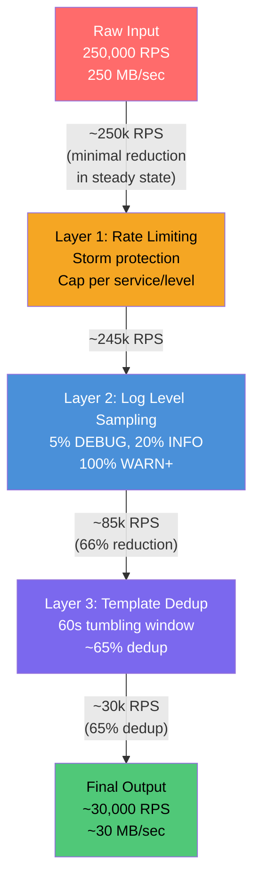

### Infrastructure Impact

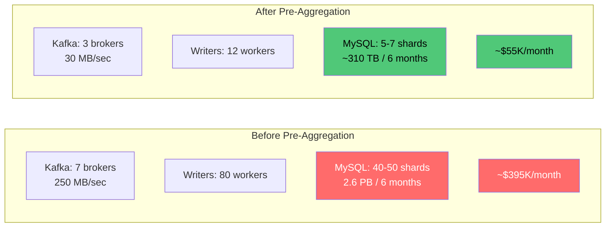

| Resource | Before (250k RPS) | After (~30k RPS) | Savings |
|---|---|---|---|
| Kafka Brokers | 7 | **3** | ~57% |
| Kafka Throughput | 250 MB/sec | ~30 MB/sec | ~88% |
| Writer Workers | 80 | **12** | ~85% |
| MySQL Shards (Primary) | 40-50 | **5-7** | ~85% |
| MySQL Shards (Replica) | 40-50 | **5-7** | ~85% |
| Storage (6 months) | ~2.6 PB | **~310 TB** | ~88% |
| Total Machines | ~133 | **~30** | ~77% |
| Monthly Cost | ~$395K | **~$55K** | ~86% |

---

## What NOT to Aggregate

Some logs must always pass through at full fidelity, regardless of aggregation settings.

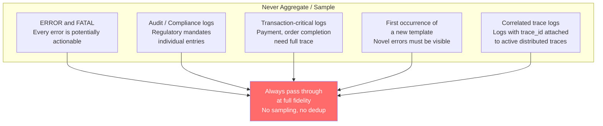

| Category | Why Never Aggregate |
|---|---|
| ERROR and FATAL | Every error is potentially actionable. Aggregating hides individual failure details needed for root cause analysis. |
| Audit / compliance logs | Regulatory requirements (SOX, PCI-DSS, GDPR) may mandate individual entries with full context and exact timestamps. |
| Transaction-critical logs | Payment processing, order completion — need full trace with every intermediate step preserved. |
| First occurrence of a new template | The first time a never-seen-before message appears, it should always be stored. Novel errors are the most important to surface. |
| Trace-correlated logs | Logs attached to an active distributed trace (with trace_id) must be preserved individually to maintain trace completeness. |

---

## Where Should Aggregation Happen?

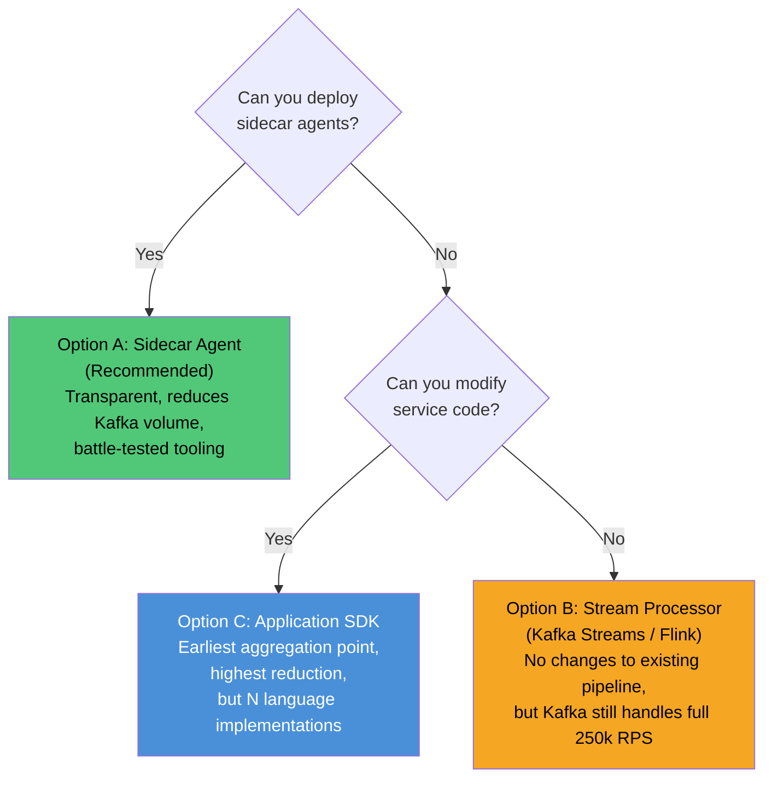

| Location | Reduces Kafka Load | Reduces MySQL Load | Code Changes | Complexity |
|---|---|---|---|---|
| **Sidecar agent (recommended)** | Yes | Yes | None | Medium (agent config) |
| Stream processor (Flink) | No (Kafka still full) | Yes | None | High (new component) |
| Application SDK | Yes | Yes | Every service, every language | High (N implementations) |

**Sidecar agent is the optimal choice** — reduces volume at the earliest external point, requires no application code changes, and uses battle-tested tooling (Vector, Fluentd).

---

## Trade-off Summary

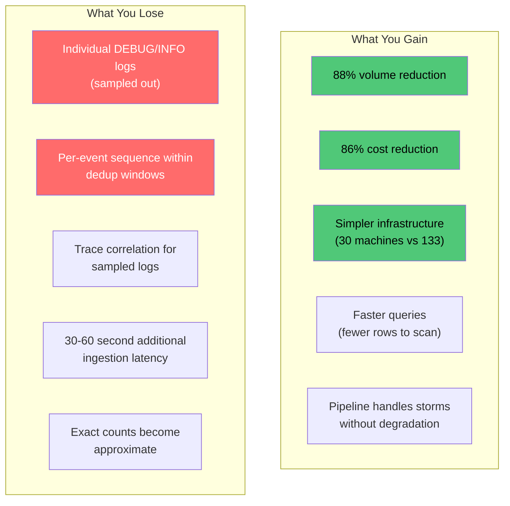

| Gain | Loss | Acceptable? |
|---|---|---|
| 88% volume reduction ($340K/month saved) | Individual DEBUG/INFO log entries | Yes — these are rarely queried and low-value individually |
| Storm protection | Some detail during storms | Yes — summary logs capture the signal |
| Faster queries | Aggregated view instead of raw entries | Depends — for debugging specific requests, need ERROR-level raw logs |
| Simpler infrastructure | 30-60s additional latency | Yes — within SLO budget for ingestion freshness |
