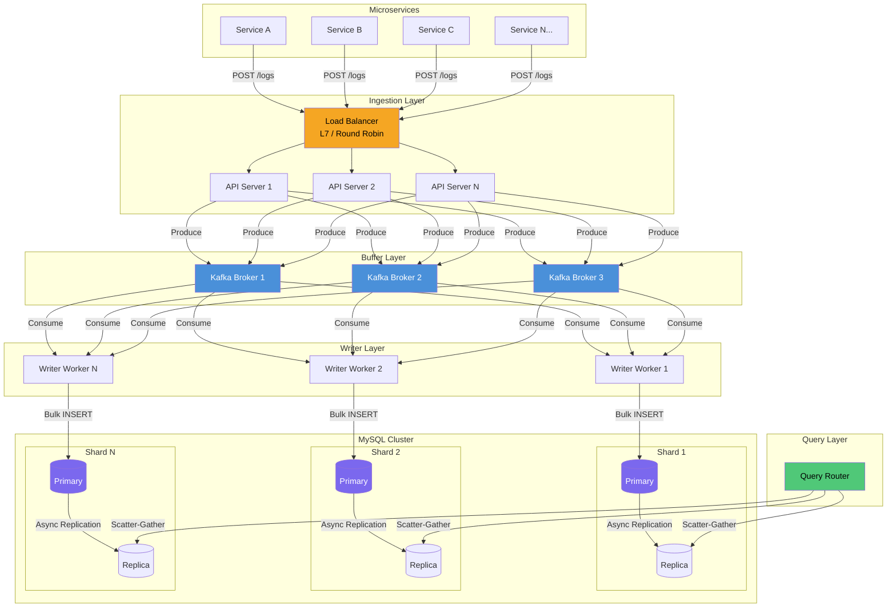
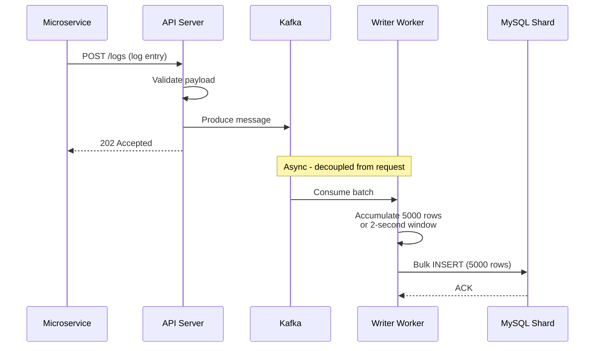

# Log Ingestion System — System Design

## Problem Statement

Design a log ingestion system that handles **250,000 log entries per second** from multiple microservices, with each log entry approximately **1 KB** in size. The system must persist all data to **MySQL** and support time-range queries.

## API Contract

### POST `/logs` — Ingest Log Entry

```json
// Request
{
  "service": "payment-service",
  "level": "ERROR",
  "timestamp": "2024-06-15T10:30:00.123Z",
  "message": "Connection timeout to downstream service..."
}

// Response: 202 Accepted
{
  "status": "accepted",
  "id": "uuid-v7"
}
```

### GET `/logs?from={unix_ts}&to={unix_ts}` — Query Logs

```
Constraint: (to - from) <= 3600 seconds
```

```json
// Response: 200 OK
{
  "logs": [
    {
      "id": "...",
      "service": "payment-service",
      "level": "ERROR",
      "timestamp": "2024-06-15T10:30:00.123Z",
      "message": "..."
    }
  ],
  "count": 12345
}
```

## Design Constraints

| Constraint | Detail |
|---|---|
| Persistent store | MySQL only |
| Write rate | 250k RPS baseline (can burst higher) |
| Entry size | ~1 KB per log |
| Retention | 6 months |
| Write acknowledgment | 202 Accepted (async persistence) |
| Query window | Max 3600 seconds (1 hour) |
| Query latency | Multi-second P99 acceptable |
| Data loss tolerance | Small window acceptable (2-3s on crash) |
| Query filters | Timestamp range only (no service/level filters) |

## High-Level Architecture



## Data Flow Summary



## Document Index

| Document | Description |
|---|---|
| [01 — Requirements & Capacity Estimates](./01-requirements-and-estimates.md) | Functional/non-functional requirements, back-of-envelope math |
| [02 — Write Path Deep Dive](./02-write-path.md) | API layer, Kafka design, writer workers, batching strategy |
| [03 — MySQL Storage Design](./03-mysql-storage-design.md) | Sharding, partitioning, schema, indexing, retention |
| [04 — Read Path & Query Routing](./04-read-path.md) | Scatter-gather, partition pruning, response assembly |
| [05 — Resource Estimation (6 Months)](./05-resource-estimation.md) | Hardware sizing, instance counts, cost analysis |
| [06 — Failure Modes & Trade-offs](./06-failure-modes.md) | Failure scenarios, data loss analysis, trade-off summary |
