# Parking Lot System Design — Complete Interview Guide

---

## Table of Contents

1. [Clarifying Questions](#1-clarifying-questions)
2. [Functional Requirements](#2-functional-requirements)
3. [Non-Functional Requirements](#3-non-functional-requirements)
4. [Capacity Estimation](#4-capacity-estimation)
5. [API Design](#5-api-design)
6. [Data Model](#6-data-model)
7. [High-Level Architecture](#7-high-level-architecture)
8. [Deep Dives](#8-deep-dives)
   - Spot Allocation Algorithm
   - Pricing Engine
   - Payment Flow (Auth/Capture)
   - Reservation System
   - Real-Time Availability
   - Sensor & IoT Integration
9. [Algorithms](#9-algorithms)
10. [Technology Choices & Tradeoffs](#10-technology-choices--tradeoffs)
11. [Cost Analysis](#11-cost-analysis)
12. [Monitoring & Observability](#12-monitoring--observability)
13. [Failure Scenarios & Resilience](#13-failure-scenarios--resilience)
14. [Extension Points](#14-extension-points)

---

## 1. Clarifying Questions

Always ask these before designing. They signal seniority and prevent wasted effort.

| # | Question | Why It Matters |
|---|----------|---------------|
| 1 | How many parking lots? Single facility or multi-tenant SaaS? | Single lot = simpler. Multi-tenant = need tenant isolation, config per lot |
| 2 | Scale — how many spots per lot? How many lots total? | Determines database choice, caching strategy, concurrency model |
| 3 | Manned or unmanned? | Unmanned = need automated gate control, payment kiosks, camera-based entry |
| 4 | Spot types? (compact, regular, handicapped, EV, motorcycle) | Affects allocation algorithm complexity |
| 5 | Pricing model? (flat, hourly, tiered, dynamic/surge, subscription) | Determines pricing engine complexity |
| 6 | Do we support reservations? | Adds temporal dimension to spot allocation — significantly more complex |
| 7 | Payment methods? (card, mobile wallet, cash, subscription pass) | Affects PSP integration, PCI scope, offline capability |
| 8 | Do we need real-time availability on a public API/app? | Adds read-heavy traffic pattern, needs caching |
| 9 | International or single country? | Multi-currency, tax rules, data residency |
| 10 | SLA for gate open latency? | Real-time constraint — affects architecture significantly |

**Assumed answers for this design:**
- Multi-tenant SaaS serving 10,000 parking lots
- 100–5,000 spots per lot
- Unmanned with automated gates and sensors
- All spot types including EV
- Tiered pricing with dynamic surge capability
- Reservations supported
- Card + mobile wallet payments
- Real-time availability API
- US-first, international later
- Gate must open within 500ms of authorization

---

## 2. Functional Requirements

### Core (P0)

| Feature | Description |
|---------|-------------|
| **Vehicle Entry** | Vehicle arrives → system identifies vehicle (ticket/QR/LPR) → assigns spot → opens gate |
| **Vehicle Exit** | Vehicle exits → system calculates charges → processes payment → opens gate |
| **Spot Allocation** | Assign optimal spot based on type, proximity, availability |
| **Pricing** | Calculate charges based on duration, spot type, time-of-day, membership |
| **Payment Processing** | Accept card payments, pre-auth on entry, capture on exit |
| **Real-Time Availability** | Show available spots by type and level — for app and signage |
| **Session Tracking** | Track active parking sessions with entry time, spot, vehicle info |

### Extended (P1)

| Feature | Description |
|---------|-------------|
| **Reservations** | Pre-book a spot for a time window |
| **Subscription/Passes** | Monthly passes, corporate accounts, loyalty programs |
| **EV Charging** | Time-based billing for charging spots, charging status |
| **Multi-Lot Management** | Operator dashboard across multiple facilities |
| **Notifications** | Session expiry warnings, payment receipts, reservation reminders |
| **Analytics** | Occupancy trends, revenue reports, peak hour analysis |

### Out of Scope (for initial design)

- Valet parking
- Autonomous vehicle integration
- Multi-modal transport integration
- In-lot navigation/wayfinding

---

## 3. Non-Functional Requirements

| Requirement | Target | Rationale |
|-------------|--------|-----------|
| **Availability** | 99.99% (52 min downtime/year) | Gate must always work — cars physically blocked |
| **Gate Latency** | < 500ms end-to-end | Cars are waiting; queue builds fast |
| **API Latency (p99)** | < 200ms for availability queries | Mobile app and signage depend on this |
| **Consistency** | Strong consistency for spot allocation | Cannot double-assign a spot |
| **Throughput** | 1,000 entries/exits per second across all lots | Peak hour across 10K lots |
| **Data Durability** | Zero transaction loss | Financial data — must never lose a payment record |
| **Security** | PCI-DSS Level 1 compliant | Processing card payments |
| **Multi-Tenancy** | Full data isolation between operators | Operators must not see each other's data |

---

## 4. Capacity Estimation

### Assumptions

```
Total lots:              10,000
Avg spots per lot:       500
Total spots:             5,000,000
Avg sessions per spot:   3 per day
Total sessions per day:  15,000,000
Peak multiplier:         3x
Peak sessions per hour:  15M / 16 active hours * 3 = ~2.8M/hour = ~780/sec
```

### Storage

```
Session record:          ~500 bytes (IDs, timestamps, spot, vehicle, payment ref)
Daily sessions:          15M * 500B = 7.5 GB/day
Annual:                  ~2.7 TB/year
Retain 7 years (fin):    ~19 TB total

Spot state:              ~200 bytes per spot
Total spot state:        5M * 200B = 1 GB (fits in memory)

Availability cache:      ~2 KB per lot (aggregated counts)
Total cache:             10K * 2 KB = 20 MB
```

### Bandwidth

```
Availability queries:    ~50K QPS (apps + signage polling)
Entry/Exit events:       ~780/sec peak
Payment calls:           ~780/sec peak (to PSP)
Total inbound:           ~10 MB/s
Total outbound:          ~50 MB/s (availability responses)
```

---

## 5. API Design

### Authentication

All APIs use OAuth 2.0 with JWT tokens. Three roles:

| Role | Scope | Example |
|------|-------|---------|
| `operator` | Full CRUD on their lots, spots, pricing, reports | Lot management dashboard |
| `system` | Entry/exit events, sensor data, gate control | IoT devices, gate controllers |
| `customer` | View availability, manage reservations, payment methods | Mobile app |

### Versioning

URL-path versioning: `/api/v1/...`

### Core Endpoints

#### Entry / Exit

```
POST /api/v1/lots/{lotId}/entry
Headers: Idempotency-Key: {uuid}
Body: {
  "vehicleIdentifier": "ABC-1234",       // license plate or ticket ID
  "identificationMethod": "LPR",         // LPR | TICKET | QR
  "vehicleType": "regular",              // compact | regular | oversized | motorcycle | ev
  "timestamp": "2026-02-16T09:30:00Z"
}
Response 201: {
  "sessionId": "sess_abc123",
  "spotId": "spot_L2_042",
  "level": 2,
  "spotType": "regular",
  "entryTime": "2026-02-16T09:30:00Z",
  "preAuthId": "pa_xyz789",              // payment pre-authorization reference
  "gateAction": "OPEN",
  "expiresAt": "2026-02-16T09:30:30Z"   // gate open window
}

POST /api/v1/lots/{lotId}/exit
Headers: Idempotency-Key: {uuid}
Body: {
  "sessionId": "sess_abc123",
  "vehicleIdentifier": "ABC-1234",
  "timestamp": "2026-02-16T14:45:00Z"
}
Response 200: {
  "sessionId": "sess_abc123",
  "duration": { "hours": 5, "minutes": 15 },
  "charges": {
    "baseAmount": 2625,                  // in cents
    "currency": "USD",
    "breakdown": [
      { "description": "First 2 hours @ $4/hr", "amount": 800 },
      { "description": "Hours 3-5 @ $5/hr", "amount": 1500 },
      { "description": "Partial hour (15 min)", "amount": 125 },
      { "description": "Tax (8%)", "amount": 200 }
    ]
  },
  "paymentStatus": "CAPTURED",
  "paymentId": "pay_def456",
  "gateAction": "OPEN"
}
```

#### Availability

```
GET /api/v1/lots/{lotId}/availability
Response 200: {
  "lotId": "lot_001",
  "totalSpots": 500,
  "available": 142,
  "lastUpdated": "2026-02-16T09:30:05Z",
  "byType": {
    "compact": { "total": 100, "available": 32 },
    "regular": { "total": 300, "available": 85 },
    "handicapped": { "total": 20, "available": 12 },
    "ev": { "total": 50, "available": 8 },
    "motorcycle": { "total": 30, "available": 5 }
  },
  "byLevel": [
    { "level": 1, "total": 150, "available": 20 },
    { "level": 2, "total": 175, "available": 62 },
    { "level": 3, "total": 175, "available": 60 }
  ]
}
```

#### Sessions

```
GET /api/v1/sessions/{sessionId}
GET /api/v1/sessions/{sessionId}/estimate    // real-time price estimate
GET /api/v1/lots/{lotId}/sessions?status=active&page=1&limit=50
```

#### Reservations

```
POST /api/v1/lots/{lotId}/reservations
Body: {
  "spotType": "regular",
  "startTime": "2026-02-17T10:00:00Z",
  "endTime": "2026-02-17T14:00:00Z",
  "vehicleIdentifier": "ABC-1234",
  "paymentMethodId": "pm_abc123"
}
Response 201: {
  "reservationId": "res_001",
  "spotId": "spot_L1_005",              // assigned at reservation time or on arrival
  "status": "CONFIRMED",
  "preAuthId": "pa_res_001",
  "qrCode": "https://..."              // for gate entry
}

DELETE /api/v1/reservations/{reservationId}   // cancel
GET /api/v1/reservations/{reservationId}      // check status
```

#### Payments

```
POST /api/v1/sessions/{sessionId}/payments
Body: {
  "paymentMethodId": "pm_abc123",
  "amount": 2625,
  "currency": "USD"
}

POST /api/v1/payments/{paymentId}/refund
Body: {
  "amount": 500,                        // partial refund in cents
  "reason": "OVERCHARGE"
}
```

#### Webhooks (for partners)

```
POST /api/v1/webhooks
Body: {
  "url": "https://partner.com/hooks",
  "events": ["session.completed", "payment.captured", "lot.full"],
  "secret": "whsec_..."                // for HMAC signature verification
}
```

### Error Response Format

```json
{
  "error": {
    "code": "SPOT_UNAVAILABLE",
    "message": "No spots of type 'ev' available in lot_001",
    "details": {
      "lotId": "lot_001",
      "requestedType": "ev",
      "availableTypes": ["compact", "regular"]
    },
    "requestId": "req_abc123",
    "timestamp": "2026-02-16T09:30:00Z"
  }
}
```

### Idempotency

Every mutating endpoint accepts an `Idempotency-Key` header.

| Scenario | Behavior |
|----------|----------|
| First request with key | Process normally, store result keyed by idempotency key |
| Duplicate key, same params | Return stored result (HTTP 200), do not reprocess |
| Duplicate key, different params | Return HTTP 409 Conflict |
| Key expiry | 24 hours — after that, key can be reused |

**Implementation:** Store `{idempotency_key, request_hash, response, status}` in Redis with 24h TTL. Check before processing.

---

## 6. Data Model

### Entity Relationship

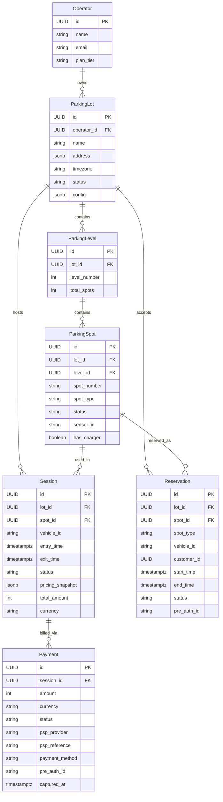

### Schema Details

```sql
-- Core tables

CREATE TABLE parking_lots (
    id              UUID PRIMARY KEY,
    operator_id     UUID NOT NULL REFERENCES operators(id),
    name            VARCHAR(255) NOT NULL,
    address         JSONB NOT NULL,
    timezone        VARCHAR(50) NOT NULL,
    total_spots     INT NOT NULL,
    status          VARCHAR(20) DEFAULT 'ACTIVE',    -- ACTIVE | MAINTENANCE | CLOSED
    config          JSONB,                           -- pricing rules, operating hours, etc.
    created_at      TIMESTAMPTZ DEFAULT NOW(),
    updated_at      TIMESTAMPTZ DEFAULT NOW()
);

CREATE TABLE parking_spots (
    id              UUID PRIMARY KEY,
    lot_id          UUID NOT NULL REFERENCES parking_lots(id),
    level_id        UUID REFERENCES parking_levels(id),
    spot_number     VARCHAR(20) NOT NULL,
    spot_type       VARCHAR(20) NOT NULL,            -- COMPACT | REGULAR | HANDICAPPED | EV | MOTORCYCLE
    status          VARCHAR(20) DEFAULT 'AVAILABLE', -- AVAILABLE | OCCUPIED | RESERVED | MAINTENANCE
    sensor_id       VARCHAR(100),
    has_charger     BOOLEAN DEFAULT FALSE,
    updated_at      TIMESTAMPTZ DEFAULT NOW(),
    UNIQUE(lot_id, spot_number)
);
-- Index for allocation queries
CREATE INDEX idx_spots_allocation ON parking_spots(lot_id, spot_type, status) WHERE status = 'AVAILABLE';

CREATE TABLE sessions (
    id              UUID PRIMARY KEY,
    lot_id          UUID NOT NULL REFERENCES parking_lots(id),
    spot_id         UUID NOT NULL REFERENCES parking_spots(id),
    vehicle_id      VARCHAR(50) NOT NULL,            -- license plate or ticket ID
    entry_time      TIMESTAMPTZ NOT NULL,
    exit_time       TIMESTAMPTZ,
    status          VARCHAR(20) DEFAULT 'ACTIVE',    -- ACTIVE | COMPLETED | ABANDONED | DISPUTED
    pricing_snapshot JSONB,                          -- snapshot of pricing rules at entry time
    total_amount    INT,                             -- in cents, set on exit
    currency        VARCHAR(3) DEFAULT 'USD',
    created_at      TIMESTAMPTZ DEFAULT NOW()
);
-- Partition sessions by month for query performance
-- CREATE TABLE sessions PARTITION BY RANGE (created_at);

CREATE TABLE payments (
    id              UUID PRIMARY KEY,
    session_id      UUID NOT NULL REFERENCES sessions(id),
    amount          INT NOT NULL,
    currency        VARCHAR(3) NOT NULL,
    status          VARCHAR(20) NOT NULL,             -- PRE_AUTHORIZED | CAPTURED | REFUNDED | FAILED
    psp_provider    VARCHAR(50),                      -- stripe | adyen | braintree
    psp_reference   VARCHAR(255),
    payment_method  VARCHAR(20),                      -- CARD | WALLET | PASS
    pre_auth_id     VARCHAR(255),
    captured_at     TIMESTAMPTZ,
    created_at      TIMESTAMPTZ DEFAULT NOW()
);

CREATE TABLE reservations (
    id              UUID PRIMARY KEY,
    lot_id          UUID NOT NULL REFERENCES parking_lots(id),
    spot_id         UUID REFERENCES parking_spots(id),
    spot_type       VARCHAR(20) NOT NULL,
    vehicle_id      VARCHAR(50),
    customer_id     UUID,
    start_time      TIMESTAMPTZ NOT NULL,
    end_time        TIMESTAMPTZ NOT NULL,
    status          VARCHAR(20) DEFAULT 'CONFIRMED',  -- CONFIRMED | CHECKED_IN | COMPLETED | CANCELLED | NO_SHOW
    pre_auth_id     VARCHAR(255),
    created_at      TIMESTAMPTZ DEFAULT NOW(),
    CONSTRAINT no_overlap EXCLUDE USING gist (
        spot_id WITH =,
        tstzrange(start_time, end_time) WITH &&
    ) WHERE (status IN ('CONFIRMED', 'CHECKED_IN'))
);
```

### Why PostgreSQL?

| Factor | PostgreSQL Advantage |
|--------|---------------------|
| ACID transactions | Critical for spot allocation — cannot double-assign |
| Exclusion constraints | `EXCLUDE USING gist` prevents overlapping reservations at DB level |
| JSONB | Flexible config and pricing rules per lot without schema changes |
| Partitioning | Native range partitioning for sessions table by date |
| Mature ecosystem | pgBouncer for connection pooling, pg_stat for monitoring |

---

## 7. High-Level Architecture

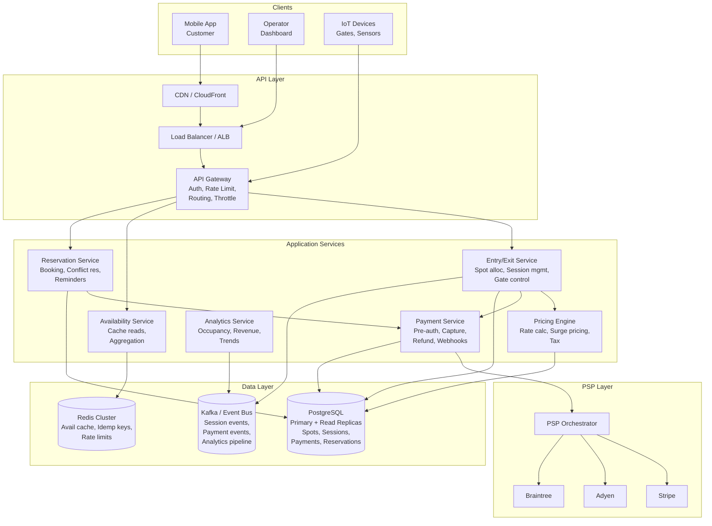

### Service Responsibilities

| Service | Responsibility | Scaling Strategy |
|---------|---------------|------------------|
| **Entry/Exit** | Spot allocation, session lifecycle, gate commands | Horizontal — stateless, partition by lot_id |
| **Availability** | Read-heavy cache of spot counts | Redis-backed, eventual consistency (1-2s lag acceptable) |
| **Reservation** | Booking, conflict detection, no-show handling | Horizontal — DB-level exclusion constraints handle conflicts |
| **Pricing Engine** | Rate calculation, surge pricing, tax | Stateless — rules loaded from config, cacheable |
| **Payment** | Pre-auth, capture, refund, reconciliation | Horizontal — idempotent, async capture via event bus |
| **Analytics** | Occupancy trends, revenue, reporting | Async — consumes events from Kafka, writes to data warehouse |

---

## 8. Deep Dives

### 8.1 Spot Allocation Algorithm

This is the most critical real-time operation. A car is waiting at the gate.

#### Requirements

- Must complete in < 100ms (leaves 400ms for payment pre-auth + gate)
- Must guarantee no double-assignment
- Should optimize for driver convenience (closest to entrance/elevator)
- Must respect spot type constraints
- Must account for reservations

#### Algorithm

```
FUNCTION allocateSpot(lotId, vehicleType, preferredLevel):

    1. Query available spots:
       SELECT id, level_id, spot_number, spot_type
       FROM parking_spots
       WHERE lot_id = lotId
         AND spot_type = mapVehicleToSpotType(vehicleType)
         AND status = 'AVAILABLE'
         AND id NOT IN (
             SELECT spot_id FROM reservations
             WHERE lot_id = lotId
               AND status = 'CONFIRMED'
               AND start_time <= NOW() + INTERVAL '30 minutes'
         )
       ORDER BY
         CASE WHEN level_id = preferredLevel THEN 0 ELSE 1 END,
         level_number ASC,
         spot_number ASC
       LIMIT 1
       FOR UPDATE SKIP LOCKED;            -- pessimistic lock, skip contended rows

    2. If no spot found for exact type, try upsizing:
       compact -> regular -> (fail)
       motorcycle -> compact -> regular -> (fail)
       ev (if no charger needed) -> regular

    3. Atomically update spot status:
       UPDATE parking_spots SET status = 'OCCUPIED', updated_at = NOW()
       WHERE id = selectedSpotId AND status = 'AVAILABLE';
       -- If affected_rows = 0, retry from step 1 (lost race)

    4. Create session record

    5. Publish event: spot.allocated

    RETURN session
```

#### Spot Allocation Flow

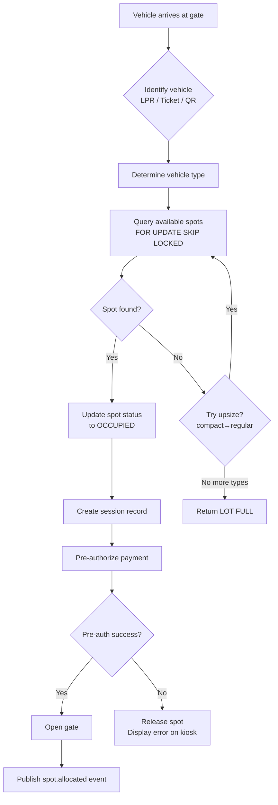

#### Why `FOR UPDATE SKIP LOCKED`?

| Approach | Pros | Cons |
|----------|------|------|
| **Optimistic locking** (version column) | No lock contention | Retry storms at high concurrency — every loser retries |
| **Pessimistic locking** (`FOR UPDATE`) | Guarantees exclusive access | Queue forms — later requests wait for lock release |
| **`FOR UPDATE SKIP LOCKED`** | No waiting — skips locked rows, picks next available | May not get "optimal" spot if it's locked — acceptable tradeoff |
| **Distributed lock (Redis)** | Works across services | Extra dependency, lock expiry edge cases, not needed here |

**Decision:** `FOR UPDATE SKIP LOCKED` — best fit for parking. A car doesn't care if it gets spot 42 vs spot 43. Speed matters more than optimality.

#### Concurrency: Two Cars, One Spot Left

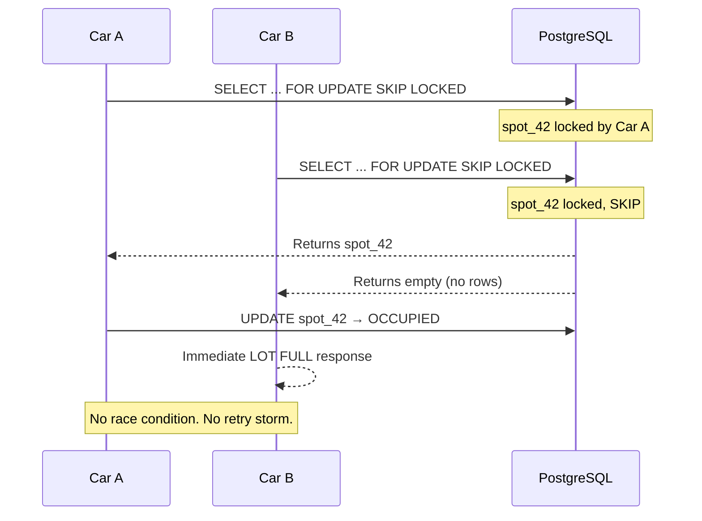

---

### 8.2 Pricing Engine

#### Architecture

```mermaid
flowchart LR
    subgraph Input
        ET[entry_time, exit_time]
        ST[spot_type]
        LI[lot_id]
        MI[membership_id]
    end

    subgraph Pipeline["Pricing Pipeline"]
        direction TB
        S1["1. Load pricing rules for lot"]
        S2["2. Calculate base duration charge"]
        S3["3. Apply spot type multiplier"]
        S4["4. Apply time-of-day surge"]
        S5["5. Apply membership discount"]
        S6["6. Apply max daily cap"]
        S7["7. Calculate tax"]
        S8["8. Return itemized breakdown"]
        S1 --> S2 --> S3 --> S4 --> S5 --> S6 --> S7 --> S8
    end

    Input --> S1
    S8 --> OUT[Itemized Breakdown<br/>subtotal + tax + total]
```

#### Pricing Rules Schema (stored as JSONB in lot config)

```json
{
  "currency": "USD",
  "tiers": [
    { "upToHours": 1, "ratePerHourCents": 400 },
    { "upToHours": 3, "ratePerHourCents": 500 },
    { "upToHours": 8, "ratePerHourCents": 300 },
    { "upToHours": 24, "ratePerHourCents": 200 }
  ],
  "spotMultipliers": {
    "compact": 0.8,
    "regular": 1.0,
    "handicapped": 1.0,
    "ev": 1.5,
    "motorcycle": 0.5
  },
  "surgeRules": [
    { "dayOfWeek": [1,2,3,4,5], "startHour": 8, "endHour": 10, "multiplier": 1.3 },
    { "dayOfWeek": [6,7], "startHour": 10, "endHour": 14, "multiplier": 1.2 }
  ],
  "maxDailyCapCents": 5000,
  "gracePeriodMinutes": 15,
  "taxRate": 0.08,
  "evChargingPerKwhCents": 25
}
```

#### Pricing Snapshot

When a vehicle enters, the current pricing rules are snapshotted into the session record. This prevents retroactive price changes from affecting in-progress sessions.

**Why snapshot?**
- Operator changes price from $5/hr to $8/hr at 2 PM
- Car that entered at 9 AM should NOT pay $8/hr for hours before 2 PM
- Snapshot guarantees price at time of entry
- Also serves as audit trail for disputes

#### Algorithm

```
FUNCTION calculatePrice(session):
    rules = session.pricing_snapshot
    duration = session.exit_time - session.entry_time

    IF duration <= rules.gracePeriodMinutes:
        RETURN 0   // free for grace period

    totalCents = 0
    remainingMinutes = duration.totalMinutes

    FOR EACH tier IN rules.tiers:
        tierMinutes = MIN(remainingMinutes, tier.upToHours * 60 - previousTierMinutes)
        totalCents += CEIL(tierMinutes / 60) * tier.ratePerHourCents
        remainingMinutes -= tierMinutes
        IF remainingMinutes <= 0: BREAK

    // Apply spot multiplier
    totalCents *= rules.spotMultipliers[session.spotType]

    // Apply surge (weighted by hours in each surge window)
    surgeMultiplier = calculateWeightedSurge(session.entry_time, session.exit_time, rules.surgeRules)
    totalCents *= surgeMultiplier

    // Apply daily cap
    totalCents = MIN(totalCents, rules.maxDailyCapCents * numberOfDays)

    // Apply membership discount
    IF session.membershipId:
        discount = getMembershipDiscount(session.membershipId)
        totalCents *= (1 - discount)

    // Tax
    tax = ROUND(totalCents * rules.taxRate)

    RETURN { subtotal: totalCents, tax: tax, total: totalCents + tax, breakdown: [...] }
```

---

### 8.3 Payment Flow (Auth/Capture Pattern)

This is the most interview-relevant section for the Playlist Director of Engineering role.

#### Payment Timeline

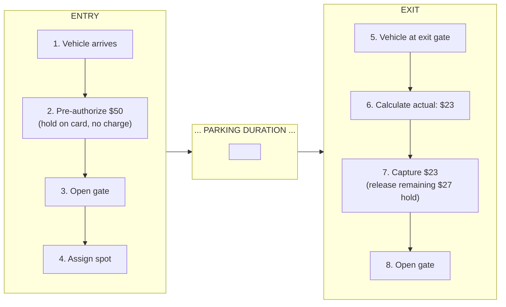

#### Why Auth/Capture (not Charge on Exit)?

| Approach | Pros | Cons |
|----------|------|------|
| **Charge on exit** | Simple | Card may decline at exit — car blocks lane. No card on file for unmanned lots. |
| **Pre-auth on entry, capture on exit** | Guarantees payment. Handles unmanned. Card already validated. | More complex. Pre-auth expires (typically 7 days). |
| **Charge flat rate on entry** | Simplest | Unfair pricing. No refund for short stays. |

**Decision:** Auth/Capture — industry standard for parking and gas stations.

#### Payment Service Flow

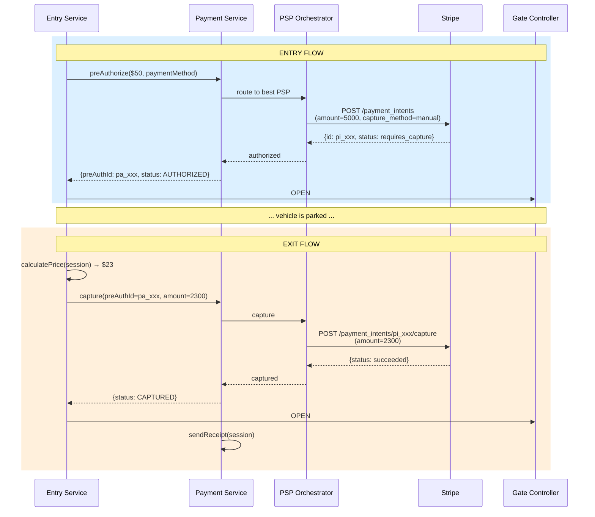

#### PSP Orchestration Layer

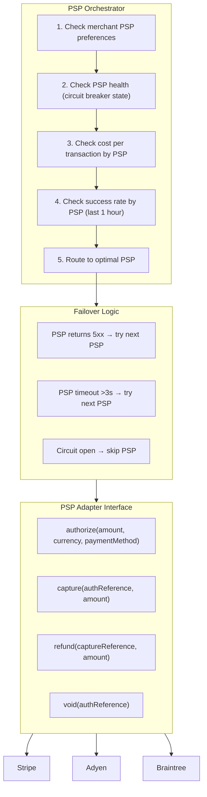

#### Edge Cases

| Scenario | Handling |
|----------|----------|
| Pre-auth declines | Do not open gate. Display "payment required" on kiosk. Allow retry with different card. |
| Pre-auth expires (7 days) | Cron job detects sessions > 5 days. Alert operator. Attempt re-auth. If fails, flag as abandoned. |
| Capture amount > pre-auth amount | Some PSPs allow overcapture up to 20%. Beyond that, do a separate charge for the difference. |
| Card network decline on capture | Retry with exponential backoff. After 3 failures, mark session as "payment pending" and send notification. |
| Refund after capture | Full or partial refund via PSP. Refund record linked to original payment. |
| Subscription pass holder | Skip pre-auth entirely. Validate pass on entry. Deduct from pass balance or validate active subscription. |

---

### 8.4 Reservation System

#### Temporal Spot Allocation Problem

Reservations add a time dimension. A spot is not just "available or not" — it's "available during this time window."

```mermaid
gantt
    title Spot 42 — Reservation Timeline
    dateFormat HH:mm
    axisFormat %H:%M

    section Spot 42
    Reserved (Bob)       :active, bob, 06:00, 08:00
    Available            :avail1, 08:00, 10:00
    Reserved (Alice)     :active, alice, 10:00, 12:00
    Available            :avail2, 12:00, 14:00
    Reserved (Carol)     :active, carol, 14:00, 16:00
```

#### Preventing Overlaps

PostgreSQL exclusion constraints handle this at the database level:

```sql
CONSTRAINT no_overlap EXCLUDE USING gist (
    spot_id WITH =,
    tstzrange(start_time, end_time) WITH &&
) WHERE (status IN ('CONFIRMED', 'CHECKED_IN'))
```

If two concurrent requests try to book overlapping windows for the same spot, one will fail with a constraint violation — no application-level locking needed.

#### Reservation vs. Walk-In Priority

```
FUNCTION allocateSpot(lotId, vehicleType, isReservation, reservationId):

    IF isReservation:
        // Reserved spot is pre-assigned — just validate and assign
        spot = getReservedSpot(reservationId)
        ASSERT spot.status == 'RESERVED'
        updateSpotStatus(spot.id, 'OCCUPIED')
        RETURN spot

    ELSE:
        // Walk-in — exclude spots reserved in the next 30 minutes
        SELECT ... FROM parking_spots
        WHERE status = 'AVAILABLE'
          AND id NOT IN (
              SELECT spot_id FROM reservations
              WHERE status = 'CONFIRMED'
                AND start_time <= NOW() + INTERVAL '30 minutes'
          )
        FOR UPDATE SKIP LOCKED
        LIMIT 1;
```

The 30-minute buffer prevents assigning a walk-in to a spot that's reserved soon.

#### No-Show Handling

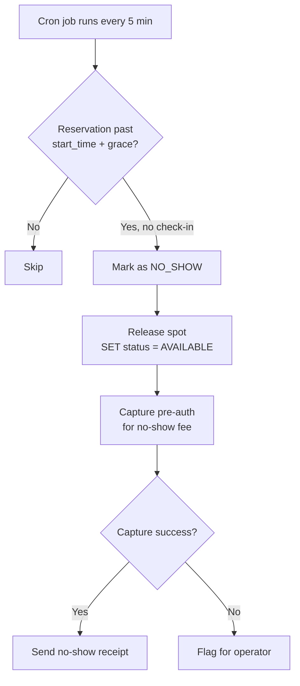

---

### 8.5 Real-Time Availability

#### Problem

- 50K QPS for availability queries (apps + signage)
- Data changes on every entry/exit (~780/sec)
- Must be accurate within 2 seconds

#### Architecture

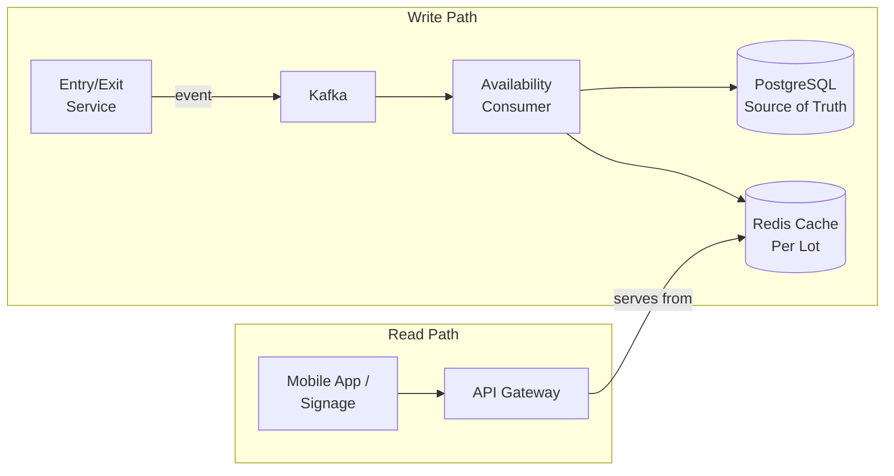

#### Cache Structure (Redis)

```
Key: availability:{lotId}
Value (Hash):
  total_spots:        500
  available_total:    142
  compact_total:      100
  compact_available:  32
  regular_total:      300
  regular_available:  85
  handicapped_total:  20
  handicapped_available: 12
  ev_total:           50
  ev_available:       8
  motorcycle_total:   30
  motorcycle_available: 5
  last_updated:       1708081805

TTL: 30 seconds (fallback — normally refreshed on every event)
```

#### Why Not Query DB Directly?

| Approach | Latency | Load on DB | Accuracy |
|----------|---------|-----------|----------|
| Direct DB query | ~20ms | 50K QPS = DB melts | Real-time |
| Redis cache + event-driven updates | ~1ms | 0 read load | 1-2s lag |
| Polling DB every N seconds | ~20ms | Moderate | N-second lag |

**Decision:** Event-driven Redis cache. The 1-2s lag is acceptable — a parking availability display showing "142 spots" vs "141 spots" doesn't matter.

#### Cache Invalidation

On every `spot.allocated` or `spot.released` event:

```
HINCRBY availability:{lotId} available_total -1
HINCRBY availability:{lotId} {spotType}_available -1
HSET availability:{lotId} last_updated {timestamp}
```

Atomic Redis operations — no read-modify-write race condition.

#### Fallback

If Redis is down, the Availability Service falls back to a direct DB query with a circuit breaker (max 1K QPS to DB).

---

### 8.6 Sensor & IoT Integration

#### Architecture

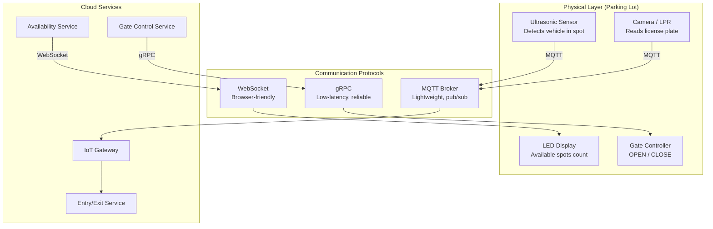

#### Why MQTT for Sensors?

| Protocol | Pros | Cons |
|----------|------|------|
| HTTP REST | Simple, familiar | High overhead per message, not designed for IoT |
| MQTT | Lightweight, pub/sub, QoS levels, works on constrained devices | Need MQTT broker |
| gRPC | Low latency, bi-directional streaming | Heavier than MQTT for simple sensor data |
| WebSocket | Real-time, bi-directional | Connection management overhead for thousands of sensors |

**Decision:** MQTT for sensor → cloud. gRPC for cloud → gate (needs low latency and reliability). WebSocket for cloud → display (browser-friendly).

#### Sensor Data Flow

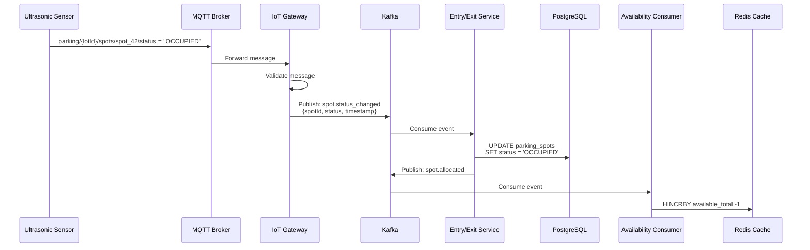

#### Reconciliation

Sensor data can drift from DB state (sensor failure, network issue). Run reconciliation every 5 minutes:

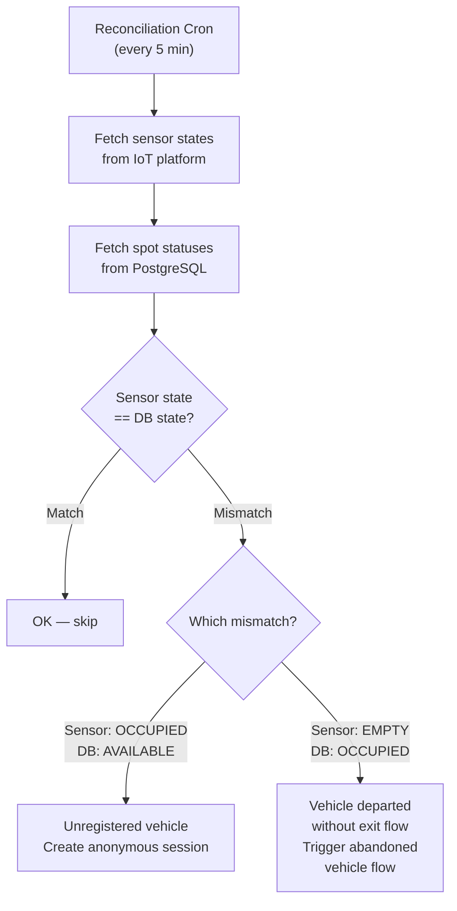

---

## 9. Algorithms

### 9.1 Spot Allocation — Scoring Algorithm

For premium parking apps, simple "first available" isn't enough. Use a scoring function:

```
FUNCTION scoreSpot(spot, vehicleType, entryPoint, preferences):
    score = 100   // base score

    // Distance penalty (0-30 points deducted)
    distance = calculateWalkingDistance(spot, entryPoint)
    score -= (distance / maxDistance) * 30

    // Level preference (0-20 points)
    IF spot.level == preferences.preferredLevel:
        score += 20
    ELSE:
        score -= ABS(spot.level - preferences.preferredLevel) * 5

    // Type match bonus (0-15 points)
    IF spot.type == idealTypeFor(vehicleType):
        score += 15
    ELSE IF spot.type is compatible but not ideal:
        score += 5

    // EV charger bonus for EV vehicles
    IF vehicleType == 'EV' AND spot.hasCharger:
        score += 25

    // Cluster penalty — prefer spreading cars across levels
    nearbyOccupied = countOccupiedNearby(spot, radius=3)
    score -= nearbyOccupied * 2

    RETURN score
```

In practice, the simple `FOR UPDATE SKIP LOCKED` approach from Section 8.1 is sufficient for most lots. The scoring algorithm is a premium feature.

### 9.2 Dynamic/Surge Pricing

```
FUNCTION calculateSurgeMultiplier(lotId, currentTime):
    occupancyRate = getOccupancyRate(lotId)   // 0.0 to 1.0

    // Piecewise linear surge curve
    IF occupancyRate < 0.5:
        RETURN 1.0                 // no surge below 50% occupancy
    ELSE IF occupancyRate < 0.75:
        RETURN 1.0 + (occupancyRate - 0.5) * 0.8    // 1.0x to 1.2x
    ELSE IF occupancyRate < 0.90:
        RETURN 1.2 + (occupancyRate - 0.75) * 2.0   // 1.2x to 1.5x
    ELSE:
        RETURN 1.5 + (occupancyRate - 0.90) * 5.0   // 1.5x to 2.0x

    // Cap at 2.0x
    RETURN MIN(result, 2.0)
```

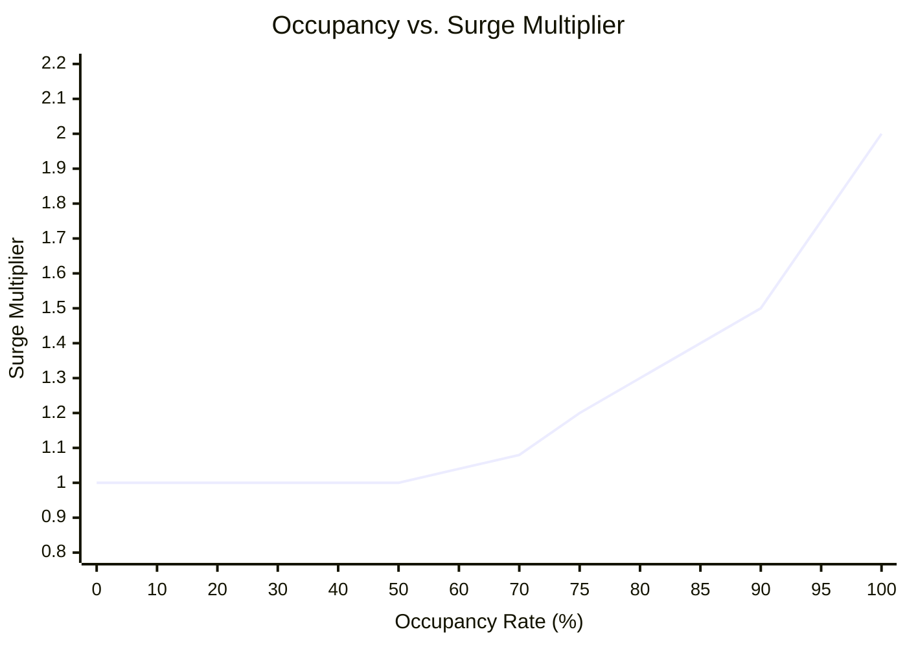

### 9.3 Abandoned Vehicle Detection

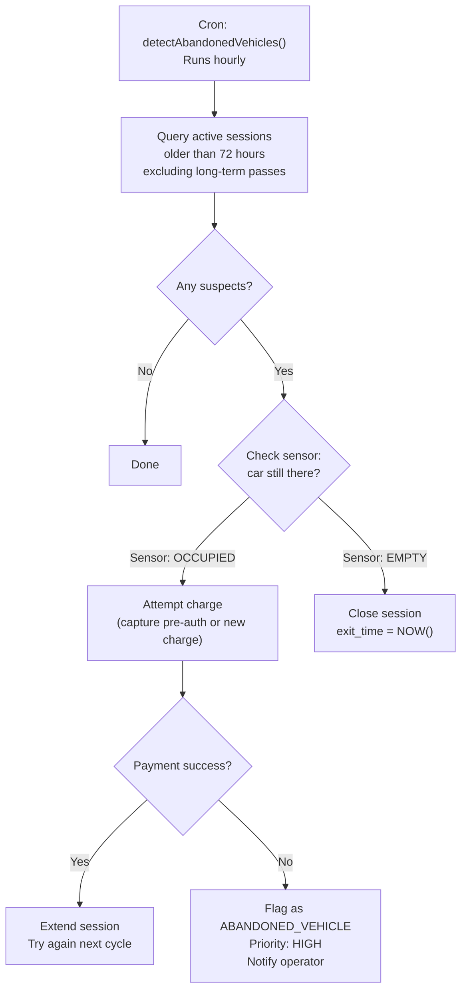

---

## 10. Technology Choices & Tradeoffs

### Compute

| Option | Choice | Rationale |
|--------|--------|-----------|
| **Entry/Exit Service** | Kubernetes (EKS) | Needs fast horizontal scaling for peak hours. Stateless pods. |
| **Availability Service** | Kubernetes (EKS) | High QPS, stateless, scales with read traffic. |
| **IoT Gateway** | AWS IoT Core + Lambda | Managed MQTT broker. Pay-per-message. No server management for bursty sensor data. |
| **Gate Control** | Edge compute (AWS Greengrass) | Sub-100ms latency requirement. Must work during internet outages. |
| **Analytics** | Serverless (Lambda + Athena) | Batch processing, infrequent queries, cost-efficient. |

### Database

| Component | Technology | Why |
|-----------|-----------|-----|
| **Primary datastore** | PostgreSQL (RDS Multi-AZ) | ACID, exclusion constraints, JSONB, mature. Handles 780 writes/sec easily. |
| **Read replicas** | PostgreSQL read replicas (2x) | Offload reporting and analytics queries. |
| **Cache** | Redis Cluster (ElastiCache) | Availability cache, idempotency keys, rate limiting. Sub-ms reads. |
| **Event bus** | Kafka (MSK) | Durable event streaming. Decouple services. Replay capability for recovery. |
| **Data warehouse** | Redshift or BigQuery | Long-term analytics, occupancy trends, revenue reporting. |
| **Time-series** | TimescaleDB or InfluxDB | Sensor telemetry, occupancy over time, charting. |

### Why Not NoSQL for Primary Store?

| Factor | PostgreSQL | DynamoDB/Cassandra |
|--------|-----------|-------------------|
| Transactions | Full ACID | Limited (DynamoDB single-table transactions) |
| Exclusion constraints | Native `EXCLUDE USING gist` | Must implement in application — error-prone |
| Joins | Native | Must denormalize or do app-side joins |
| Flexible queries | Ad-hoc SQL | Must design access patterns upfront |
| Scale | 5M spots, 780 writes/sec — well within PG limits | Overkill for this scale |

**If scale grows to 100K+ lots:** Shard PostgreSQL by lot_id using Citus, or migrate hot-path (spot allocation) to DynamoDB with conditional writes.

### Message Queue: Kafka vs. SQS vs. RabbitMQ

| Factor | Kafka | SQS | RabbitMQ |
|--------|-------|-----|----------|
| Throughput | 1M+ msg/sec | 3K msg/sec (standard) | 50K msg/sec |
| Ordering | Per-partition | FIFO queues (limited) | Per-queue |
| Replay | Yes — retention period | No | No |
| Consumer groups | Yes | No (need SNS fan-out) | Exchanges |
| Operations | Moderate (MSK simplifies) | Zero (managed) | High |
| **Fit for parking** | **Best** — need replay for analytics, ordering per lot, multiple consumers | Acceptable for simpler setup | Good but no replay |

**Decision:** Kafka (MSK) — replay is valuable for analytics backfill and debugging. Partition key = lot_id for ordering.

### API Gateway

| Option | Choice | Rationale |
|--------|--------|-----------|
| AWS API Gateway | Good for serverless | Per-request pricing gets expensive at 50K QPS |
| Kong / NGINX | Self-managed | Full control, plugin ecosystem, but operational overhead |
| **AWS ALB + custom auth middleware** | **Selected** | Cost-effective at high QPS, sufficient features, low latency |

---

## 11. Cost Analysis

### Monthly Cost Estimate (10K lots, US region)

| Component | Service | Specification | Monthly Cost |
|-----------|---------|---------------|-------------|
| **Compute** | EKS (Entry/Exit) | 6x c5.xlarge (4 vCPU, 8GB) | $1,500 |
| | EKS (Availability) | 4x c5.large (2 vCPU, 4GB) | $500 |
| | EKS (Other services) | 4x m5.large (2 vCPU, 8GB) | $560 |
| **Database** | RDS PostgreSQL Multi-AZ | db.r5.2xlarge (8 vCPU, 64GB) + 2 read replicas | $3,200 |
| | Storage (2 TB GP3) | | $320 |
| **Cache** | ElastiCache Redis | 3-node cluster, r6g.large | $780 |
| **Event Bus** | MSK (Kafka) | 3 brokers, kafka.m5.large | $1,200 |
| **IoT** | AWS IoT Core | 5M sensor messages/day | $500 |
| **Load Balancer** | ALB | 50K QPS | $400 |
| **Storage** | S3 (backups, logs) | 5 TB | $115 |
| **Monitoring** | CloudWatch + Datadog | Metrics, logs, traces | $800 |
| **Payment Processing** | Stripe/Adyen fees | 15M txns @ $0.30 + 2.9% | ~$4.5M (passed to merchants) |
| | | | |
| **Total Infrastructure** | | | **~$9,875/month** |
| **Annual Infrastructure** | | | **~$118,500/year** |

### Cost Per Transaction

```
Infrastructure cost per session:
  $9,875 / 15M sessions per month = $0.00066 per session

Payment processing cost per session (passed to merchant):
  Average session value: $15
  Stripe fee: $0.30 + 2.9% = $0.30 + $0.435 = $0.735 per session
```

### Cost Optimization Strategies

| Strategy | Savings | Tradeoff |
|----------|---------|----------|
| **Reserved instances (1-year)** | 30-40% on compute + DB | Commitment |
| **Spot instances for analytics** | 60-70% on batch compute | Interruption risk (acceptable for analytics) |
| **S3 lifecycle policies** | 40% on storage after 90 days | Older data in cheaper tier |
| **Redis right-sizing** | 20% — most lots need minimal cache | Monitor hit rates |
| **PSP routing by cost** | 5-15% on payment processing | May sacrifice 0.1% success rate |

---

## 12. Monitoring & Observability

### Key Metrics (SLIs)

| Metric | SLO | Alert Threshold | Why |
|--------|-----|-----------------|-----|
| **Gate open latency (p99)** | < 500ms | > 400ms | Cars waiting = complaints |
| **Payment pre-auth success rate** | > 99.5% | < 99% | Failed pre-auth = car can't park |
| **Payment capture success rate** | > 99.9% | < 99.5% | Failed capture = revenue loss |
| **Availability API latency (p99)** | < 200ms | > 150ms | App experience |
| **Availability API uptime** | 99.99% | Any downtime | Signage goes blank |
| **Session data consistency** | 100% | Any mismatch | Sensor vs. DB reconciliation |
| **Spot allocation latency (p99)** | < 100ms | > 80ms | Part of gate-open critical path |

### Operations Dashboard

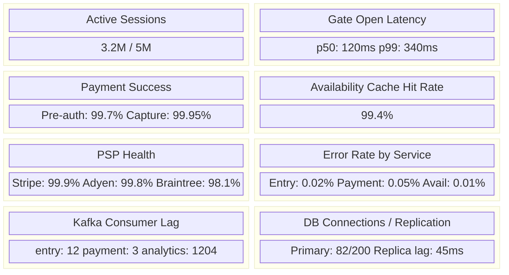

### Alerting Rules

```yaml
alerts:
  - name: GateLatencyHigh
    condition: p99(gate_open_latency) > 400ms for 2 minutes
    severity: P1
    action: Page on-call, auto-scale Entry/Exit service

  - name: PaymentPreAuthFailureSpike
    condition: pre_auth_success_rate < 99% for 5 minutes
    severity: P1
    action: Page on-call, check PSP health, consider failover

  - name: PaymentCaptureFailure
    condition: capture_success_rate < 99.5% for 5 minutes
    severity: P2
    action: Notify on-call, queue failed captures for retry

  - name: AvailabilityCacheStale
    condition: max(time_since_last_update) > 10 seconds
    severity: P2
    action: Check Kafka consumer lag, Redis health

  - name: SpotReconciliationDrift
    condition: sensor_db_mismatch_count > 50 per lot
    severity: P3
    action: Trigger manual reconciliation, notify operator

  - name: KafkaConsumerLagHigh
    condition: consumer_lag > 10000 for 5 minutes
    severity: P2
    action: Scale consumers, investigate processing bottleneck
```

### Distributed Tracing

Every request gets a trace ID propagated across services:

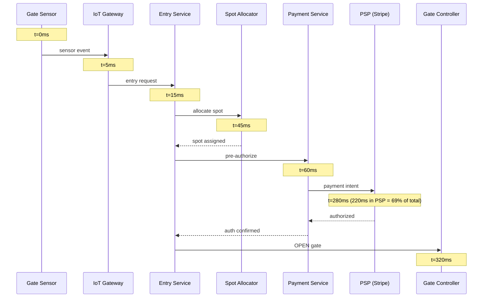

Use OpenTelemetry for instrumentation, Jaeger or Datadog APM for visualization.

---

## 13. Failure Scenarios & Resilience

### Failure Matrix

| Failure | Impact | Mitigation | Recovery |
|---------|--------|-----------|----------|
| **PostgreSQL primary down** | No new sessions, no spot allocation | Multi-AZ failover (automatic, ~60s) | Automatic promotion of standby |
| **Redis cluster down** | Availability queries hit DB | Circuit breaker → fall back to DB queries (throttled) | Redis cluster auto-recovery |
| **Kafka broker down** | Events delayed | 3-broker cluster with replication factor 3 — survive 1 broker failure | Kafka auto-rebalances partitions |
| **PSP outage (Stripe)** | Payment pre-auth fails | PSP orchestrator routes to Adyen/Braintree | Automatic failover, manual switch-back after recovery |
| **Internet outage at lot** | Gate can't reach cloud | Edge compute (Greengrass) runs locally — stores sessions, syncs later | Automatic sync when connectivity restored |
| **Sensor failure** | Incorrect spot status | Reconciliation cron detects drift. LPR camera as backup. | Replace sensor, reconcile state |
| **DDoS on availability API** | API unresponsive | Rate limiting at API Gateway. CDN caching for public endpoints. | Auto-scale + WAF rules |
| **Duplicate entry event** | Double session created | Idempotency key prevents duplicate processing | Reconciliation detects and merges |

### Edge Computing for Offline Resilience

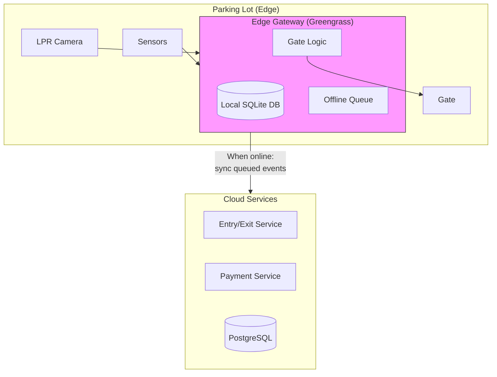

During internet outage:
- Edge gateway opens gates based on local rules
- Stores sessions in local SQLite
- Queues payment pre-auths for later processing
- When connectivity returns, syncs all queued events to cloud
- Reconciliation resolves any conflicts

### Circuit Breaker Pattern (PSP calls)

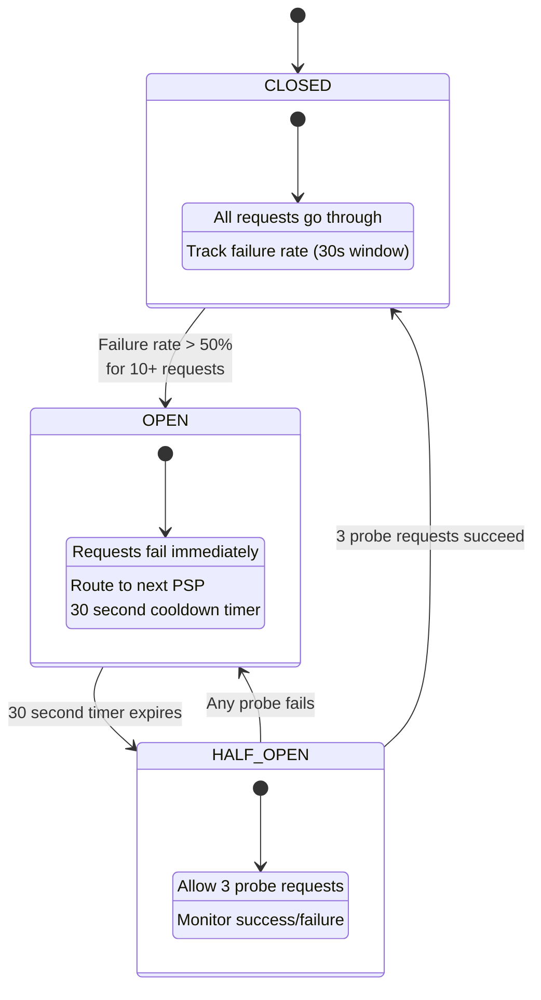

---

## 14. Extension Points

### EV Charging Integration

```mermaid
flowchart LR
    subgraph EVFlow["EV Charging Flow"]
        A[Vehicle parks<br/>in EV spot] --> B[Start charging<br/>session]
        B --> C[Monitor kWh<br/>delivered]
        C --> D[Stop charging<br/>on exit or full]
        D --> E[Calculate bill:<br/>parking + energy + tax]
    end

    subgraph Endpoints["New API Endpoints"]
        E1["POST /sessions/{id}/charging/start"]
        E2["POST /sessions/{id}/charging/stop"]
        E3["GET /sessions/{id}/charging/status"]
    end
```

### Multi-Currency (International Expansion)

**Considerations:**
- Store amounts in smallest unit of local currency (cents, paise, yen)
- Pricing rules per lot in local currency
- Settlement in merchant's preferred currency
- FX conversion at capture time (not pre-auth time) to minimize exposure
- Display currency based on lot locale, not user locale

### Valet Parking

```mermaid
sequenceDiagram
    participant C as Customer
    participant V as Valet Attendant
    participant S as System
    participant KL as Key Locker (RFID)

    C->>V: Arrives, hands over car
    V->>S: Create valet request
    V->>KL: Store key (RFID tagged)
    V->>S: Park car, assign spot, create session
    Note over C,S: ... time passes ...
    C->>S: Request car retrieval (app/kiosk)
    S->>V: Assign retrieval task
    V->>KL: Retrieve key (RFID)
    V->>C: Deliver car
    S->>S: Close session, capture payment
```

### License Plate Recognition (LPR) Flow

```mermaid
flowchart TD
    A[Camera captures plate] --> B[OCR service<br/>extracts text]
    B --> C{"Confidence<br/>> 85%?"}
    C -->|No| D[Fallback to<br/>ticket/QR at kiosk]
    C -->|Yes| E[Lookup in DB]
    E --> F{"Match found?"}
    F -->|Reservation| G[Check in<br/>Assign reserved spot]
    F -->|Subscription| H[Validate pass<br/>Assign spot]
    F -->|No match| I[Create walk-in session<br/>Prompt payment at kiosk]

    B --> J[Store raw image<br/>for dispute resolution]
```

---

## Summary: How to Present This in an Interview

### Time Management (45-minute interview)

| Phase | Time | Focus |
|-------|------|-------|
| **Clarify requirements** | 5 min | Ask the 10 questions from Section 1. Confirm scope. |
| **High-level design** | 10 min | Draw the architecture from Section 7. Name the services. |
| **API design** | 10 min | Walk through entry/exit flow + key endpoints from Section 5. |
| **Deep dive 1** | 8 min | Spot allocation algorithm (Section 8.1) — concurrency is the interesting part. |
| **Deep dive 2** | 8 min | Payment flow (Section 8.3) — auth/capture pattern. Tie to PSP orchestration. |
| **Scale & resilience** | 4 min | Capacity numbers, failure matrix, edge computing for offline mode. |

### Key Phrases to Use

- "I'd use an **auth/capture** pattern here — pre-authorize on entry, capture on exit"
- "For concurrency, **`FOR UPDATE SKIP LOCKED`** avoids both retry storms and lock queuing"
- "I'd **snapshot pricing rules** at entry time to prevent retroactive price changes"
- "The availability cache is **eventually consistent** — 1-2 second lag is acceptable for spot counts"
- "We need **edge computing** for offline resilience — the gate must work without internet"
- "I'd partition the **Kafka topic by lot_id** for ordered processing within a lot"
- "The **exclusion constraint** in PostgreSQL prevents reservation overlaps at the database level"
