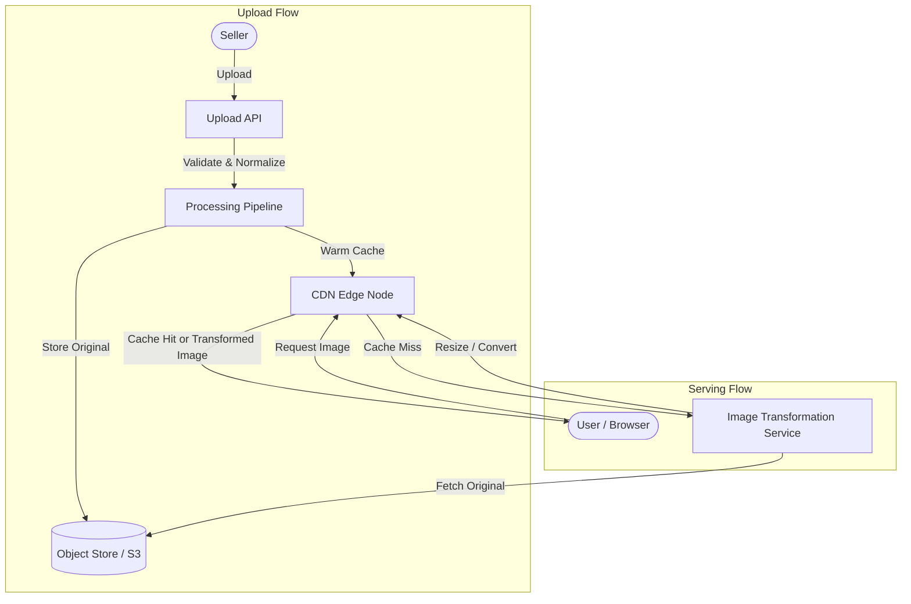
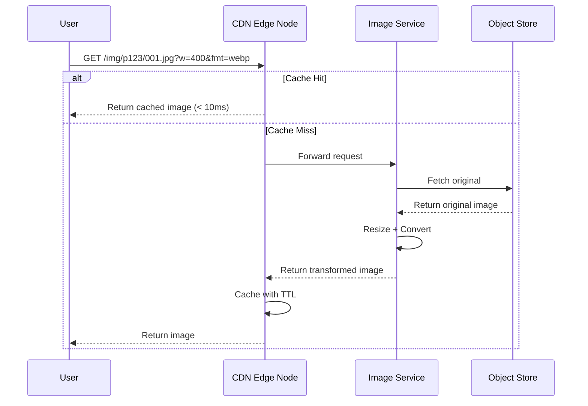
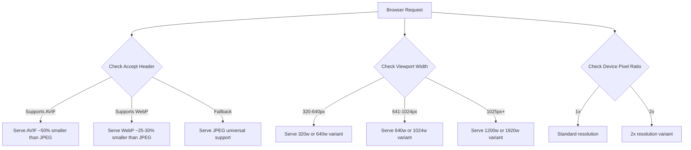
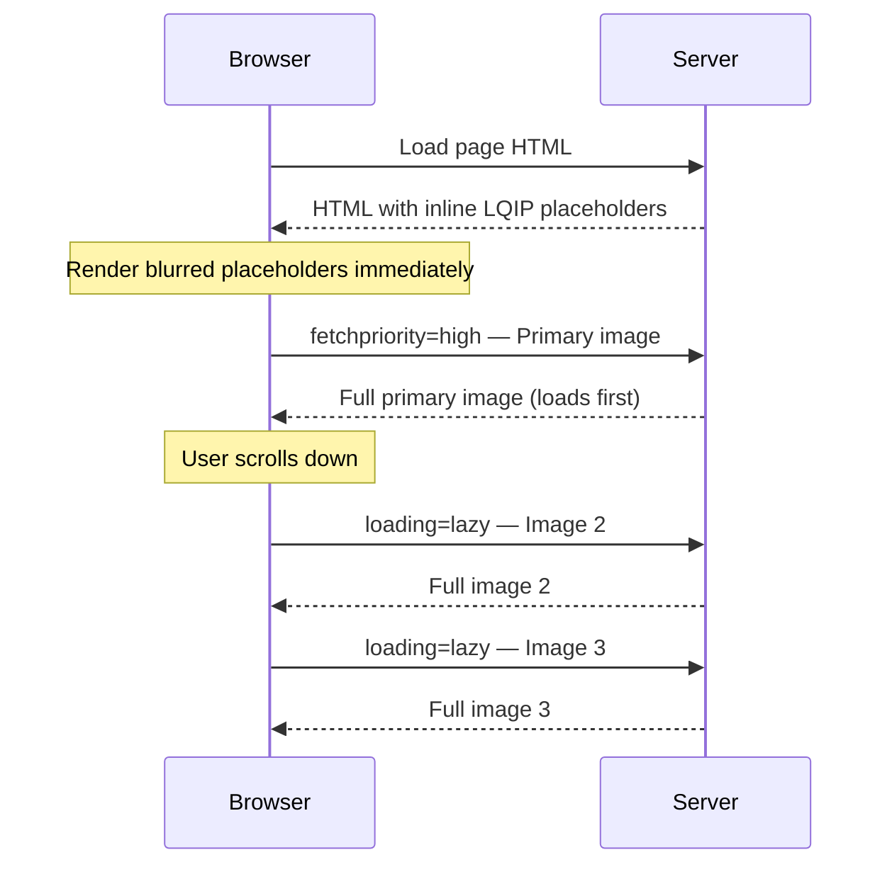
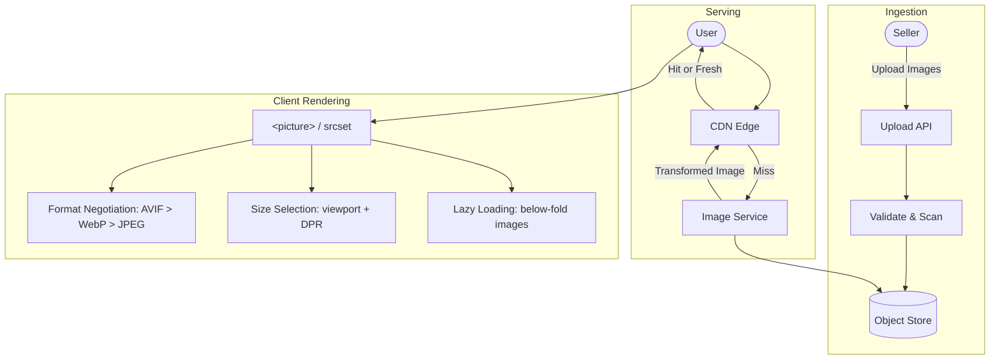

# E-Commerce Image Serving System Design

## Problem Statement

A large e-commerce company is facing challenges in displaying product images on their website. Products can have multiple images, and the platform must support various devices (mobile, tablet, desktop, retina). The current system suffers from slow page loads, high bandwidth consumption, storage inefficiency, and poor global availability.

---

## Challenges Identified

| Challenge | Symptom |
|-----------|---------|
| Slow page loads | High latency serving large original images directly |
| Bandwidth waste | Serving desktop-sized images to mobile devices |
| Storage costs | Storing multiple pre-generated variants per product |
| Global latency | Users far from origin server experience delays |
| Availability | Single point of failure for image storage |
| Multi-image management | Gallery ordering, primary image selection, metadata |

---

## High-Level Architecture



---

## Component Design

### 1. Image Storage Layer

Use an object store (e.g., AWS S3, GCS) as the single source of truth. Store only originals — never persist pre-generated variants permanently.

**Storage structure:**

```
product_id/
  ├── original/
  │     ├── img_001.jpg
  │     ├── img_002.jpg
  │     └── img_003.jpg
  └── metadata.json
```

**metadata.json example:**

```json
{
  "product_id": "p123",
  "images": [
    {
      "id": "img_001",
      "filename": "img_001.jpg",
      "order": 1,
      "is_primary": true,
      "alt_text": "Product front view",
      "uploaded_at": "2025-01-15T10:30:00Z"
    },
    {
      "id": "img_002",
      "filename": "img_002.jpg",
      "order": 2,
      "is_primary": false,
      "alt_text": "Product side view",
      "uploaded_at": "2025-01-15T10:30:05Z"
    }
  ]
}
```

**Key decisions:**
- Replicate across regions for durability.
- Metadata tracks image ordering, primary flag, alt text, and upload status.
- Versioned storage to support image replacement without breaking cached URLs.

---

### 2. Image Upload Pipeline

Sellers upload arbitrary images that vary in quality, dimensions, and format. An async pipeline validates and normalizes them before they become available.


**Validation rules:**
- Max file size: 20MB
- Allowed formats: JPEG, PNG, WebP
- Minimum dimensions: 500x500 pixels
- Aspect ratio constraints (product category specific)
- Strip EXIF metadata (privacy and size reduction)

---

### 3. Image Transformation Service

Instead of pre-generating all variants (which creates a combinatorial explosion), transform images on demand based on request parameters.

**Request format:**

```
GET /images/{product_id}/{image_id}.jpg?w=400&h=400&fmt=webp&q=80&fit=cover
```

**Parameters:**

| Parameter | Description | Example Values |
|-----------|-------------|----------------|
| `w` | Target width | 320, 640, 1200 |
| `h` | Target height | 320, 640, 1200 |
| `fmt` | Output format | webp, avif, jpeg, png |
| `q` | Quality (compression) | 60-85 (sweet spot for e-commerce) |
| `fit` | Crop strategy | cover, contain, pad |


---

### 4. CDN Layer

A CDN eliminates global latency by caching transformed images at edge nodes close to users.



**CDN configuration:**
- **Cache key:** Full URL including query params (e.g., `product/img_001.jpg?w=400&fmt=webp`)
- **TTL:** 30-90 days (product images rarely change)
- **Cache-Control header:** `public, max-age=31536000, immutable` for versioned URLs
- **Invalidation:** Purge by product_id prefix when images are updated by the seller

---

### 5. Responsive Image Delivery (Multi-Device Support)

Different devices need different image sizes. Serving a 2000x2000 image to a 320px mobile screen wastes bandwidth.

**Device breakpoints:**

| Device Class | Width Range | Use Case |
|---|---|---|
| Mobile | 320-640px | Product listing, detail page |
| Tablet | 641-1024px | Grid view, detail page |
| Desktop | 1025-1920px | Detail page, image gallery |
| Retina / HiDPI | 2x multiplier | Crisp display on high-density screens |

**HTML implementation using `<picture>` and `srcset`:**

```html
<picture>
  <!-- Modern browsers: AVIF (smallest file size) -->
  <source
    type="image/avif"
    srcset="/img/p123/001.jpg?w=320&fmt=avif 320w,
           /img/p123/001.jpg?w=640&fmt=avif 640w,
           /img/p123/001.jpg?w=1200&fmt=avif 1200w"
    sizes="(max-width: 640px) 100vw, 50vw" />

  <!-- Fallback: WebP -->
  <source
    type="image/webp"
    srcset="/img/p123/001.jpg?w=320&fmt=webp 320w,
           /img/p123/001.jpg?w=640&fmt=webp 640w,
           /img/p123/001.jpg?w=1200&fmt=webp 1200w"
    sizes="(max-width: 640px) 100vw, 50vw" />

  <!-- Ultimate fallback: JPEG -->
  
</picture>
```



**Format comparison:**

| Format | Size vs JPEG | Browser Support |
|---|---|---|
| AVIF | ~50% smaller | Chrome, Firefox, Safari 16+ |
| WebP | ~25-30% smaller | All modern browsers |
| JPEG | Baseline | Universal |

---

### 6. Lazy Loading & Progressive Rendering

Product pages often have 5-15 images. Loading all upfront blocks the page.

**Techniques:**

| Technique | How It Works | Benefit |
|-----------|-------------|---------|
| Lazy loading | `loading="lazy"` on below-fold `` | Defers off-screen image requests |
| LQIP | Inline a tiny blurred placeholder (~1-2KB base64), swap on load | Instant perceived content |
| Progressive JPEG | Image renders blurry first, then sharpens | Better perceived performance |
| Priority hints | `fetchpriority="high"` on primary product image | Browser prioritizes the hero image |



---

## Data Flow Summary



---

## Resolution Summary

| Problem | Resolution |
|---|---|
| Slow loads | CDN edge caching + lazy loading + priority hints |
| Bandwidth waste | On-the-fly resize per device viewport width |
| Large file sizes | Modern formats (AVIF/WebP) + quality tuning (q=60-85) |
| Multi-device support | Responsive `<picture>` + `srcset` with breakpoints |
| Multiple images per product | Structured storage with metadata for ordering and primary flag |
| Global latency | CDN with geo-distributed edge nodes |
| Storage bloat | Store originals only, transform on demand, cache at CDN |
| Bad/inconsistent uploads | Validation pipeline with async processing |

---

## Key Design Principle

> **Store once, transform on demand, cache aggressively.**
>
> This avoids the combinatorial explosion of pre-generating every variant while still serving optimized images to every device and browser.
