# E-Commerce Image Serving System Design

## Problem Statement

A large e-commerce company is facing challenges in displaying product images on their website. Products can have multiple images, and the platform must support various devices (mobile, tablet, desktop, retina). The current system suffers from slow page loads, high bandwidth consumption, storage inefficiency, and poor global availability.

---

## Challenges Identified

| Challenge | Symptom |
|-----------|---------|
| Slow page loads | High latency serving large original images directly |
| Bandwidth waste | Serving desktop-sized images to mobile devices |
| Storage costs | Storing multiple pre-generated variants per product |
| Global latency | Users far from origin server experience delays |
| Availability | Single point of failure for image storage |
| Multi-image management | Gallery ordering, primary image selection, metadata |

---

## High-Level Architecture


---

## Component Design

### 1. Image Storage Layer

Use an object store (e.g., AWS S3, GCS) as the single source of truth. Store only originals — never persist pre-generated variants permanently.

**Storage structure:**

```
product_id/
  ├── original/
  │     ├── img_001.jpg
  │     ├── img_002.jpg
  │     └── img_003.jpg
  └── metadata.json
```

**metadata.json example:**

```json
{
  "product_id": "p123",
  "images": [
    {
      "id": "img_001",
      "filename": "img_001.jpg",
      "order": 1,
      "is_primary": true,
      "alt_text": "Product front view",
      "uploaded_at": "2025-01-15T10:30:00Z"
    },
    {
      "id": "img_002",
      "filename": "img_002.jpg",
      "order": 2,
      "is_primary": false,
      "alt_text": "Product side view",
      "uploaded_at": "2025-01-15T10:30:05Z"
    }
  ]
}
```

**Key decisions:**
- Replicate across regions for durability.
- Metadata tracks image ordering, primary flag, alt text, and upload status.
- Versioned storage to support image replacement without breaking cached URLs.

---

### 2. Image Upload Pipeline

Sellers upload arbitrary images that vary in quality, dimensions, and format. An async pipeline validates and normalizes them before they become available.

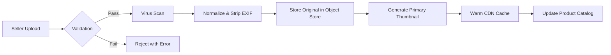

**Validation rules:**
- Max file size: 20MB
- Allowed formats: JPEG, PNG, WebP
- Minimum dimensions: 500x500 pixels
- Aspect ratio constraints (product category specific)
- Strip EXIF metadata (privacy and size reduction)

---

### 3. Image Transformation Service

Instead of pre-generating all variants (which creates a combinatorial explosion), transform images on demand based on request parameters.

**Request format:**

```
GET /images/{product_id}/{image_id}.jpg?w=400&h=400&fmt=webp&q=80&fit=cover
```

**Parameters:**

| Parameter | Description | Example Values |
|-----------|-------------|----------------|
| `w` | Target width | 320, 640, 1200 |
| `h` | Target height | 320, 640, 1200 |
| `fmt` | Output format | webp, avif, jpeg, png |
| `q` | Quality (compression) | 60-85 (sweet spot for e-commerce) |
| `fit` | Crop strategy | cover, contain, pad |

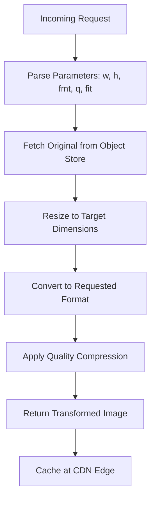

---

### 4. CDN & Multi-Tier Caching Strategy

#### Why NOT Cache Everything

With millions of products, caching every image variant at every CDN edge node is impractical:

```
10M products × 5 images × 6 variants (3 sizes × 2 formats) = 300M objects per region
× 10+ global PoPs = 3B+ total cache entries
```

Most products follow a **power-law distribution** — a small percentage of products drive the majority of traffic. Caching everything wastes storage on images that are rarely or never requested.

#### Tiered Caching Architecture

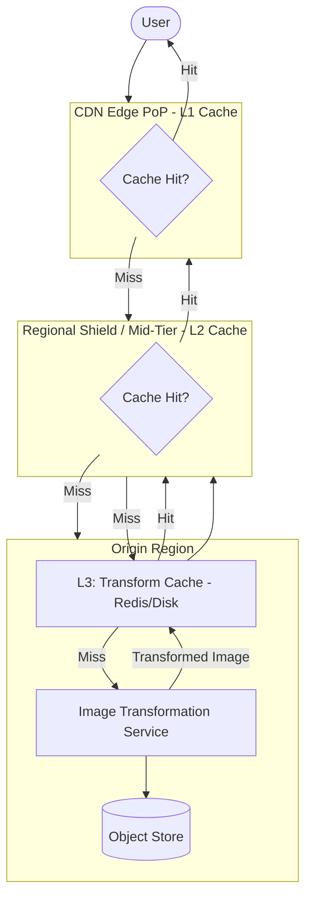

| Tier | What It Stores | Eviction Policy | Typical Size |
|------|---------------|-----------------|--------------|
| **L1 — CDN Edge** | Hot variants for that geographic region | LRU with short-medium TTL | Limited per PoP (CDN-managed) |
| **L2 — Regional Shield** | Broader set of variants, shared by multiple edge PoPs in a region | LRU with longer TTL | Larger pool, fewer locations |
| **L3 — Origin Transform Cache** | Recently transformed images on disk/Redis near the image service | LRU, TTL-based | Controlled by you |
| **Object Store** | Only originals — the source of truth | No eviction, versioned | All images |

#### How LRU Eviction Solves the Scale Problem

CDN edge nodes do **not** pre-load every image. They work passively:

1. **First request** for a variant → cache miss → image service generates it → CDN stores it.
2. **Subsequent requests** → cache hit → served from edge.
3. **Unpopular images** get evicted via **LRU (Least Recently Used)** when the cache is full.

This means at any given time, only the **working set** (actively viewed products) lives in cache — not the entire catalog.

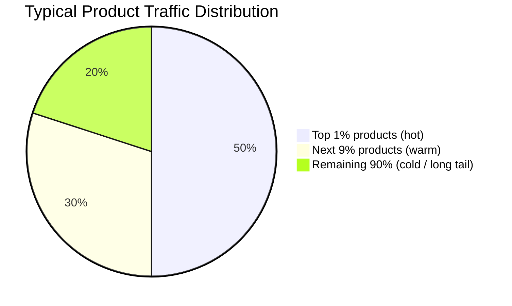

- **Hot products** (trending, featured, bestsellers): Always in L1 edge cache. Near-zero latency.
- **Warm products** (moderate traffic): May be in L2 regional shield. One extra hop.
- **Cold products** (long tail): Cache miss, generated on demand from origin. Two extra hops but rarely requested.

#### Multi-Region Deployment

For a website hosted across multiple countries, deploy image infrastructure per region rather than relying on a single global origin:

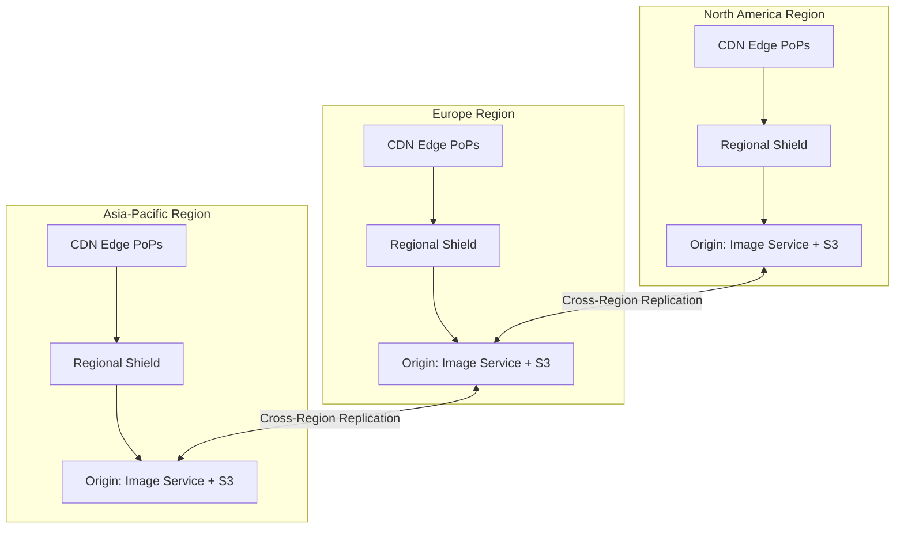

**Multi-region strategy:**

| Concern | Approach |
|---------|----------|
| **Original storage** | Replicate object store across regions (S3 cross-region replication) |
| **Image service** | Deploy transformation service per region, close to the regional object store |
| **CDN shield** | One regional shield per major region to consolidate cache misses |
| **User routing** | DNS-based or anycast routing to the nearest CDN edge PoP |
| **Consistency** | Eventual consistency is acceptable — images are immutable once uploaded; updates create new versions |

#### Pre-warming Strategy

Not all caching should be passive. For predictable high-traffic events, **pre-warm** the cache:

| Trigger | Action |
|---------|--------|
| New product listing | Generate and cache the primary thumbnail in the most common variants |
| Flash sale / promotion | Pre-warm featured product images in all regional shields |
| Seasonal events | Batch pre-warm the top-selling category images before the event |

This ensures zero cold-start latency for images you **know** will be requested.

#### CDN Configuration

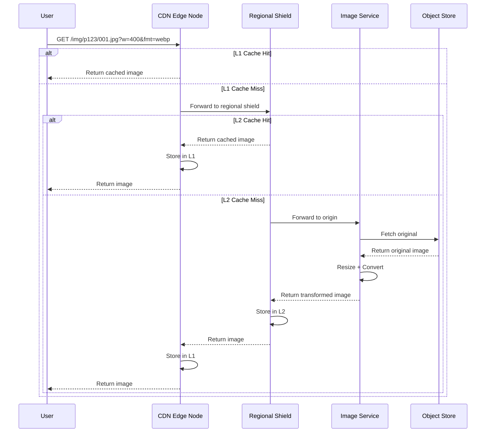

**Configuration details:**
- **Cache key:** Full URL including query params (e.g., `product/img_001.jpg?w=400&fmt=webp`)
- **L1 TTL:** 24-72 hours (edge nodes, limited space, frequent eviction is fine)
- **L2 TTL:** 30-90 days (regional shield, larger capacity)
- **Cache-Control header:** `public, max-age=31536000, immutable` for versioned URLs
- **Invalidation:** Purge by product_id prefix when images are updated by the seller
- **Collapse forwarding:** Multiple simultaneous cache misses for the same image are collapsed into a single origin request (prevents thundering herd)

---

### 5. Responsive Image Delivery (Multi-Device Support)

Different devices need different image sizes. Serving a 2000x2000 image to a 320px mobile screen wastes bandwidth.

**Device breakpoints:**

| Device Class | Width Range | Use Case |
|---|---|---|
| Mobile | 320-640px | Product listing, detail page |
| Tablet | 641-1024px | Grid view, detail page |
| Desktop | 1025-1920px | Detail page, image gallery |
| Retina / HiDPI | 2x multiplier | Crisp display on high-density screens |

**HTML implementation using `<picture>` and `srcset`:**

```html
<picture>
  <!-- Modern browsers: AVIF (smallest file size) -->
  <source
    type="image/avif"
    srcset="/img/p123/001.jpg?w=320&fmt=avif 320w,
           /img/p123/001.jpg?w=640&fmt=avif 640w,
           /img/p123/001.jpg?w=1200&fmt=avif 1200w"
    sizes="(max-width: 640px) 100vw, 50vw" />

  <!-- Fallback: WebP -->
  <source
    type="image/webp"
    srcset="/img/p123/001.jpg?w=320&fmt=webp 320w,
           /img/p123/001.jpg?w=640&fmt=webp 640w,
           /img/p123/001.jpg?w=1200&fmt=webp 1200w"
    sizes="(max-width: 640px) 100vw, 50vw" />

  <!-- Ultimate fallback: JPEG -->
  
</picture>
```

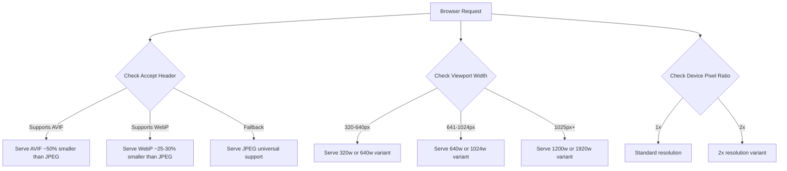

**Format comparison:**

| Format | Size vs JPEG | Browser Support |
|---|---|---|
| AVIF | ~50% smaller | Chrome, Firefox, Safari 16+ |
| WebP | ~25-30% smaller | All modern browsers |
| JPEG | Baseline | Universal |

---

### 6. Lazy Loading & Progressive Rendering

Product pages often have 5-15 images. Loading all upfront blocks the page.

**Techniques:**

| Technique | How It Works | Benefit |
|-----------|-------------|---------|
| Lazy loading | `loading="lazy"` on below-fold `` | Defers off-screen image requests |
| LQIP | Inline a tiny blurred placeholder (~1-2KB base64), swap on load | Instant perceived content |
| Progressive JPEG | Image renders blurry first, then sharpens | Better perceived performance |
| Priority hints | `fetchpriority="high"` on primary product image | Browser prioritizes the hero image |

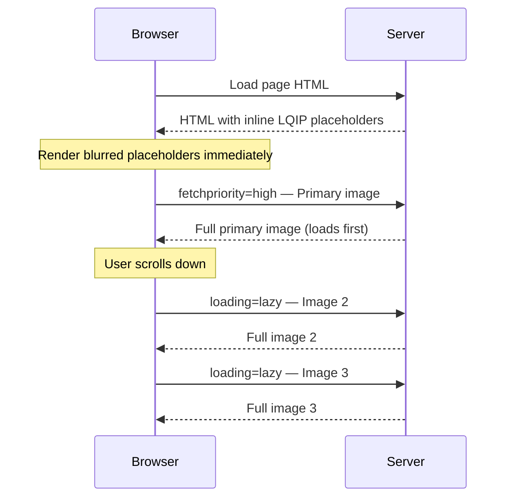

---

### 7. Image Updates & Replacement — Cache Invalidation Strategy

When a seller uploads new images or replaces existing ones for a product, stale cached variants must not be served. There are two distinct scenarios, each requiring a different approach.

#### The Core Problem

A replaced image may be cached in hundreds of locations across three cache tiers:

```
1 replaced image × 6 variants × 10+ edge PoPs + regional shields + origin cache
= hundreds of stale cache entries that must not be served
```

Active purging across all these locations is slow, unreliable, and expensive. The preferred approach is to **make stale entries unreachable** rather than trying to delete them everywhere.

#### Approach: Immutable URLs with Version Stamping

Every image URL includes a **version identifier**. When an image changes, the version changes, producing an entirely new URL. The old cached entries simply expire naturally via LRU/TTL — no purge needed.

**URL format:**

```
/img/{product_id}/v{version}/{image_id}.jpg?w=400&fmt=webp

# Before replacement
/img/p123/v1/img_002.jpg?w=400&fmt=webp

# After replacement
/img/p123/v2/img_002.jpg?w=400&fmt=webp
```

Since the URL itself is different, the CDN treats it as a brand-new resource. The old `v1` entries are never requested again and get evicted naturally by LRU.

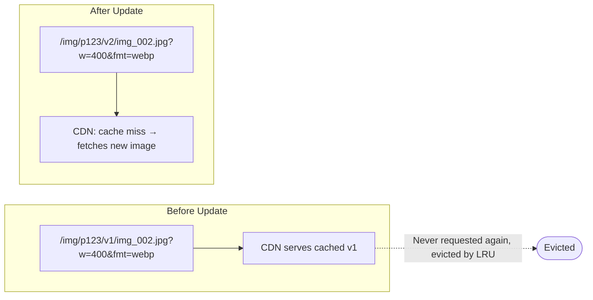

#### Scenario A: Adding New Images to an Existing Product

A seller adds image 6 to a product that already has 5 images. No existing cached content is affected — only metadata changes.

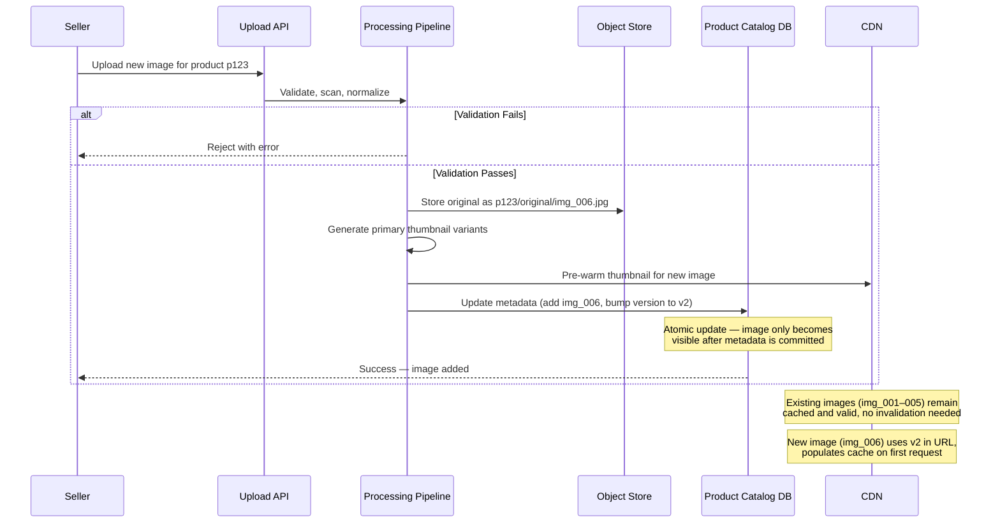

**Key points:**
- Existing cached images remain valid — no invalidation required.
- The new image enters cache naturally on first request.
- The catalog metadata update is **atomic** — the new image only becomes visible to users after metadata is committed. This prevents the case where a URL points to an image that hasn't finished uploading.

#### Scenario B: Replacing an Existing Image

A seller replaces image 2 with a new photo. This is the harder case — stale versions of the old image 2 exist across all cache tiers.

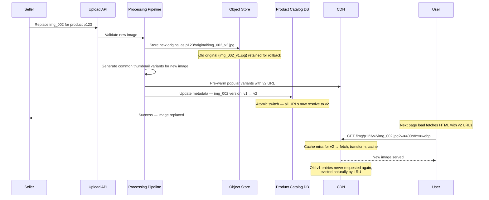

#### End-to-End Update Flow — Both Scenarios Combined

```mermaid
flowchart TD
    Start([Seller Initiates Image Change]) --> Type{What type of change?}

    Type -->|Add new image| AddFlow
    Type -->|Replace existing image| ReplaceFlow
    Type -->|Delete image| DeleteFlow
    Type -->|Reorder images| ReorderFlow

    subgraph AddFlow[Add New Image]
        A1[Validate & process new image] --> A2[Store original in object store]
        A2 --> A3[Pre-warm thumbnail in CDN]
        A3 --> A4[Append to metadata, bump version]
    end

    subgraph ReplaceFlow[Replace Existing Image]
        R1[Validate & process replacement] --> R2[Store new original alongside old]
        R2 --> R3[Pre-warm popular variants with new version URL]
        R3 --> R4[Atomic metadata update: bump image version]
        R4 --> R5[Background: purge old version from L3 origin cache]
        R5 --> R6[Old L1/L2 entries expire via LRU/TTL naturally]
    end

    subgraph DeleteFlow[Delete Image]
        D1[Remove image reference from metadata, bump version]
        D1 --> D2[Soft-delete original from object store]
        D2 --> D3[Background purge from L3 origin cache]
        D3 --> D4[Old L1/L2 entries expire naturally]
    end

    subgraph ReorderFlow[Reorder Images]
        O1[Update order fields in metadata]
        O1 --> O2[No cache invalidation needed]
        Note_O[URLs unchanged — only display order changes in catalog API response]
    end

    AddFlow --> Done([Product Catalog Updated])
    ReplaceFlow --> Done
    DeleteFlow --> Done
    ReorderFlow --> Done
```

#### Handling the Transition Window

Between the metadata update and full cache propagation, some users may still see old images. This is managed through **versioned URLs and catalog API coordination**:

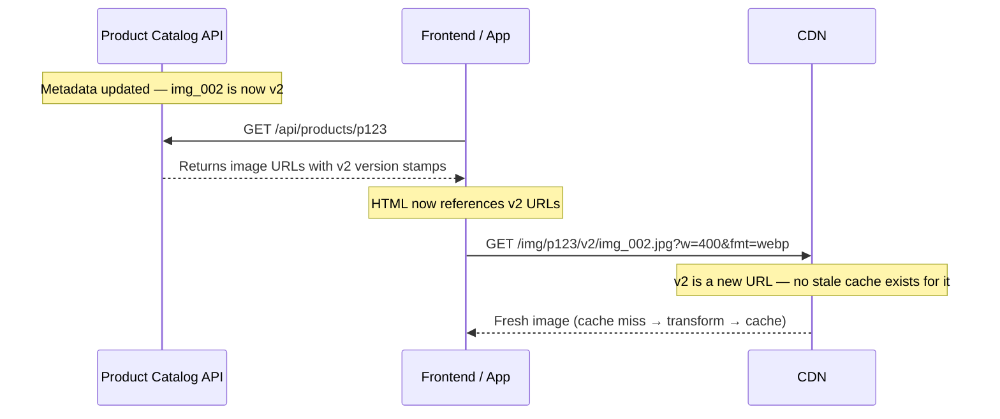

**Why this works with zero stale serving:**
- The catalog API is the single source of truth for which version is current.
- The frontend always fetches image URLs from the catalog API before rendering.
- Since the URL itself changes (v1 → v2), there is no window where a stale cache entry is served — the browser never requests the old URL once the catalog returns the new version.
- Users who have the page already open with v1 URLs will continue to see v1 until they refresh — this is acceptable and expected behavior.

#### Rollback Support

If a replacement image has quality issues or the seller made an error, the system supports rollback:

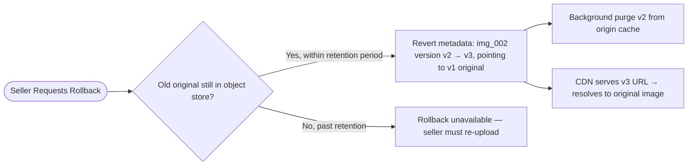

- Old originals are **soft-deleted** with a retention period (e.g., 30 days), not permanently removed.
- Rollback creates a **new version** (v3) pointing to the old original — it does not revert to v1, so cache keys remain unique and no stale entry issues arise.

#### Summary: Why Versioned URLs Over Active Purging

| Approach | Active Purging | Versioned URLs (chosen) |
|----------|---------------|------------------------|
| Cache stale window | Purge propagation delay (seconds to minutes) | Zero — new URL is a cache miss by definition |
| Complexity | Must track all cache tiers and PoPs | Version bump in metadata, done |
| Cost | Per-purge API costs at CDN provider | No purge costs |
| Reliability | Purge can fail at some edge nodes | Guaranteed — URL change is deterministic |
| Old entry cleanup | Must actively delete | Natural LRU eviction |
| Rollback | Re-purge, risk serving wrong version | New version, clean resolution |

---

## Data Flow Summary


---

## Resolution Summary

| Problem | Resolution |
|---|---|
| Slow loads | CDN edge caching + lazy loading + priority hints |
| Bandwidth waste | On-the-fly resize per device viewport width |
| Large file sizes | Modern formats (AVIF/WebP) + quality tuning (q=60-85) |
| Multi-device support | Responsive `<picture>` + `srcset` with breakpoints |
| Multiple images per product | Structured storage with metadata for ordering and primary flag |
| Global latency | CDN with geo-distributed edge nodes |
| Storage bloat | Store originals only, transform on demand, cache at CDN |
| Bad/inconsistent uploads | Validation pipeline with async processing |

---

## Key Design Principle

> **Store once, transform on demand, cache aggressively.**
>
> This avoids the combinatorial explosion of pre-generating every variant while still serving optimized images to every device and browser.
