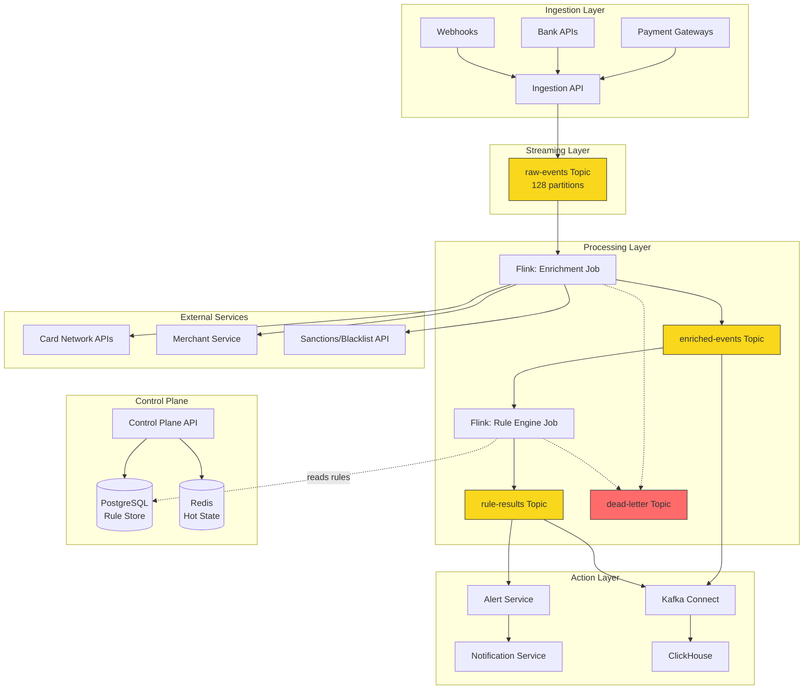
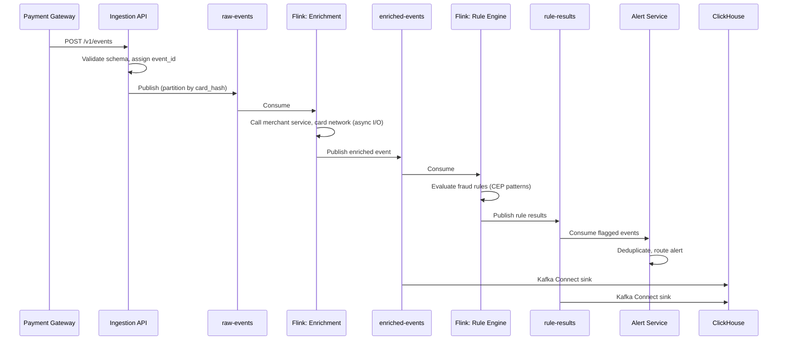
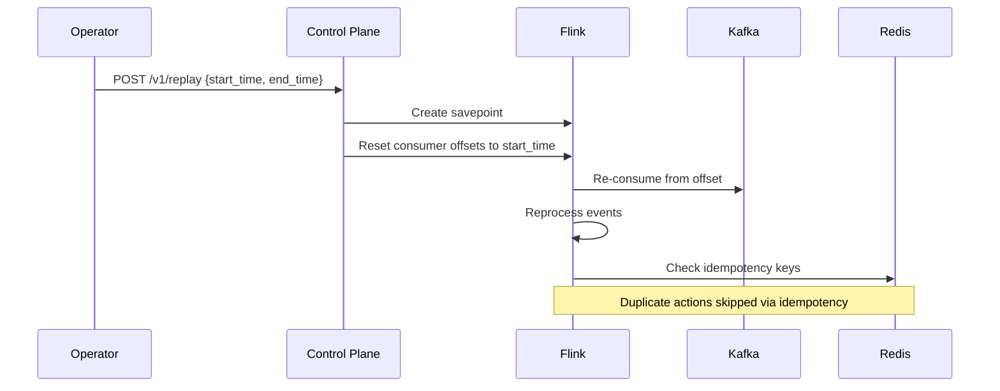

# Real-Time Event Processing System -- Design Spec

**Domain**: Fintech / Payments  
**Architecture**: Kafka + Apache Flink (cloud-agnostic)  
**Scale**: 100K+ events/sec, sub-second latency  
**Team**: Large (20+ engineers)  
**Date**: 2026-04-01

---

## 1. Executive Summary

A real-time event processing platform for fintech/payments that ingests transaction events from multiple sources (payment gateways, bank APIs, webhooks), processes them through configurable fraud detection and compliance rules using Apache Flink, enriches events with external data (merchant info, card network data, blacklists), and triggers downstream alerts and analytics pipelines.

**Core value**: Detect fraudulent transactions and compliance violations in real-time (sub-second) before they settle, while feeding all processed events into an analytics layer for reporting and pattern discovery.

---

## 2. Architecture

The system follows a **pipeline architecture** with 5 layers:

1. **Ingestion Layer** -- API Gateway + Kafka producers
2. **Streaming Layer** -- Kafka topics (partitioned by card hash)
3. **Processing Layer** -- Flink jobs (validation, enrichment, rule evaluation)
4. **Action Layer** -- Alert service, analytics sink
5. **Control Plane** -- Rule management API, configuration store



### Key Design Decisions

- **Kafka partitioning by card hash**: All events for the same card land on the same partition, enabling stateful fraud detection without cross-partition joins.
- **Flink checkpointing to S3/GCS**: Fault tolerance and replay capability.
- **Sidecar pattern for enrichment**: Flink async I/O to external services with local caching via Redis.

---

## 3. Data Flows

### Happy Path (Transaction Event)



### Replay Flow



### Error Flow

Events that fail schema validation or processing are routed to the `dead-letter` topic with error metadata. A separate consumer monitors this topic, stores failures in PostgreSQL for investigation, and triggers an alert if the DLQ growth rate exceeds thresholds.

---

## 4. API Routes

### Ingestion API (high-throughput, public-facing)

| Method | Path | Description |
|--------|------|-------------|
| POST | `/v1/events` | Ingest a single event |
| POST | `/v1/events/batch` | Ingest batch (up to 1000 events) |
| GET | `/v1/events/{id}/status` | Check processing status |

**Event payload**:
```json
{
  "source": "stripe",
  "external_id": "evt_1234",
  "type": "transaction.authorized",
  "timestamp": "2026-04-01T10:00:00Z",
  "data": {
    "amount": 5000,
    "currency": "USD",
    "card_hash": "sha256:abc123",
    "merchant_id": "m_456",
    "country": "US"
  }
}
```

### Control Plane API (internal, authenticated)

| Method | Path | Description |
|--------|------|-------------|
| GET | `/v1/rules` | List all rules |
| POST | `/v1/rules` | Create a new rule |
| PUT | `/v1/rules/{id}` | Update a rule |
| DELETE | `/v1/rules/{id}` | Delete a rule |
| POST | `/v1/rules/{id}/activate` | Activate a rule |
| POST | `/v1/rules/{id}/deactivate` | Deactivate without deleting |
| POST | `/v1/replay` | Trigger event replay |
| GET | `/v1/replay/{id}/status` | Check replay progress |
| GET | `/v1/health` | System health |
| GET | `/v1/metrics` | Prometheus-compatible metrics |

### Alert API (internal)

| Method | Path | Description |
|--------|------|-------------|
| GET | `/v1/alerts` | List recent alerts |
| PUT | `/v1/alerts/{id}/acknowledge` | Acknowledge an alert |

---

## 5. Database

### PostgreSQL (Rule Store)

```mermaid
erDiagram
    RULES {
        uuid id PK
        string name
        string type
        jsonb condition_json
        int priority
        boolean active
        timestamp created_at
        timestamp updated_at
        uuid group_id FK
    }
    RULE_VERSIONS {
        uuid id PK
        uuid rule_id FK
        int version
        jsonb condition_json
        string changed_by
        timestamp created_at
    }
    RULE_GROUPS {
        uuid id PK
        string name
        string description
    }
    RULE_GROUPS ||--o{ RULES : contains
    RULES ||--o{ RULE_VERSIONS : "has versions"
```



### Redis (Hot State)

| Key Pattern | Purpose | TTL |
|-------------|---------|-----|
| `idemp:{event_id}` | Idempotency check | 7 days |
| `vel:{card_hash}:{window}` | Velocity counter (sorted set with timestamps) | Window duration + buffer |
| `rl:{source_ip}` | Rate limiting counter | 1 minute |
| `enrich:{merchant_id}` | Cached merchant profile | 1 hour |

### ClickHouse (Analytics)

```sql
-- Events table (MergeTree, partitioned by date)
CREATE TABLE events (
    event_id       UUID,
    source         String,
    type           String,
    event_time     DateTime64(3),
    amount         Decimal64(2),
    currency       LowCardinality(String),
    card_hash      String,
    merchant_id    String,
    country        LowCardinality(String),
    enrichment     String,  -- JSON blob
    ingested_at    DateTime64(3)
) ENGINE = MergeTree()
PARTITION BY toDate(event_time)
ORDER BY (merchant_id, event_time);

-- Rule evaluations
CREATE TABLE rule_evaluations (
    event_id       UUID,
    rule_id        UUID,
    rule_name      String,
    matched        Bool,
    score          Float32,
    evaluated_at   DateTime64(3)
) ENGINE = MergeTree()
PARTITION BY toDate(evaluated_at)
ORDER BY (rule_id, evaluated_at);
```

### Kafka Topics

| Topic | Partitions | Retention | Key |
|-------|------------|-----------|-----|
| `raw-events` | 128 | 7 days | card_hash |
| `enriched-events` | 128 | 7 days | card_hash |
| `rule-results` | 64 | 7 days | event_id |
| `dead-letter` | 16 | 30 days | event_id |
| `alert-notifications` | 16 | 3 days | alert_type |

---

## 6. External Dependencies

| Service | Purpose | Integration | Fallback |
|---------|---------|-------------|----------|
| Card Network APIs (Visa/MC) | Card validation, BIN lookup | REST, async I/O from Flink | Local BIN cache (updated daily) |
| Merchant Service | Merchant risk profile | gRPC, cached in Redis (TTL 1hr) | Stale cache, flag for re-enrichment |
| Sanctions/Blacklist API | PEP/sanctions screening | REST, batch-refreshed hourly | Local snapshot, alert on staleness |
| Notification Service | Send alerts (email/SMS/Slack) | Kafka topic (`alert-notifications`) | Queue and retry, no data loss |
| Analytics (ClickHouse) | Reporting & dashboards | Kafka Connect sink connector | Kafka retains data, backfill on recovery |

### Circuit Breaker Configuration

All external service calls use circuit breakers (e.g., Resilience4j):
- **Failure threshold**: 50% of calls in a 10-second window
- **Open duration**: 30 seconds
- **Half-open probes**: 3 calls
- On circuit open: use cached/stale data, tag event as "partially enriched"

---

## 7. Key Files / Components

| Component | Responsibility |
|-----------|---------------|
| `ingestion-api/` | Schema validation, dedup check, Kafka producer |
| `flink-jobs/enrichment/` | Async I/O enrichment, external service calls with caching |
| `flink-jobs/rule-engine/` | CEP pattern matching, rule evaluation, scoring |
| `flink-jobs/common/` | Avro serializers, state schemas, watermark strategies |
| `control-plane/` | Rule CRUD API, replay orchestration, config propagation |
| `alert-service/` | Alert routing, deduplication, acknowledgement tracking |
| `analytics-sink/` | Kafka Connect configuration for ClickHouse sink |
| `schema-registry/` | Avro schemas for all event types, compatibility enforcement |
| `deploy/` | Kubernetes manifests, Flink job configs, Kafka topic configs |

---

## 8. Common Gotchas

### 1. Kafka Partition Skew
If a single merchant generates disproportionate traffic, its partition becomes a hotspot. **Mitigation**: Use composite partition key (`merchant_id + card_hash_prefix`) to spread load while maintaining locality for fraud patterns.

### 2. Flink Checkpoint Storms
Large state combined with frequent checkpointing causes backpressure. **Mitigation**: Use incremental checkpointing with RocksDB state backend. Set checkpoint interval to 1 minute with 30-second timeout.

### 3. Enrichment Latency Spikes
External API calls in the critical path can spike latency. **Mitigation**: Flink async I/O with 500ms timeout + circuit breakers. Fall back to cached/stale data and tag event as "partially enriched."

### 4. Rule Ordering
Rules must be evaluated in priority order; a blocking rule that runs late is useless. **Mitigation**: Enforce strict priority-based evaluation. Short-circuit on first "block" result.

### 5. Schema Evolution
Avro schema changes must be backward-compatible or replay breaks. **Mitigation**: Schema registry with BACKWARD compatibility mode enforced. All schema changes go through CI validation.

### 6. Idempotency Gap
If event ID is generated client-side, duplicates from different sources need composite dedup keys. **Mitigation**: Composite key = `source + external_id`. Check against Redis before processing.

### 7. Clock Skew
Payment gateways may send events with skewed timestamps. **Mitigation**: Flink watermarks with bounded-out-of-orderness (30 seconds). Events arriving later than the watermark go to a late-events side output.

### 8. Flink Job Upgrades
Changing Flink job topology (adding/removing operators) can break savepoint restore. **Mitigation**: Assign stable UIDs to all operators. Test savepoint compatibility in CI before deploying.

---

## 9. Common Operations

### Deploy a Flink Job Update
1. Take a savepoint from the running job
2. Deploy new version with `flink run -s <savepoint-path>`
3. Verify checkpoint resumes cleanly
4. Roll back to savepoint if issues arise

### Add a New Fraud Rule
1. POST rule definition to `/v1/rules`
2. Rule Engine picks up new rules within 30 seconds (config poll) or instantly (via config Kafka topic)
3. No deployment or restart needed

### Replay Events
1. POST to `/v1/replay` with `{start_time, end_time, topic}`
2. Control Plane creates Flink savepoint, resets consumer offsets
3. Flink reprocesses from Kafka
4. Idempotency keys in Redis prevent duplicate downstream actions
5. Monitor replay progress via `/v1/replay/{id}/status`

### Debug a Failed Event
1. Check `dead-letter` topic for the event ID
2. Read error metadata (exception, stack trace, processing stage)
3. Check Flink UI for backpressure at the failing operator
4. Reproduce with the event payload in a test environment

### Scale Up
1. Add Kafka brokers, rebalance partitions
2. Add Flink TaskManagers, increase job parallelism
3. Scale Redis cluster by adding shards
4. All stateless services scale horizontally via Kubernetes HPA

---

## 10. Future Improvements

| Improvement | Benefit | Trade-off |
|-------------|---------|-----------|
| ML-based fraud scoring | Catches patterns rules can't express | Adds model serving infra (feature store, model registry), latency from model inference |
| Multi-region active-active | Near-zero downtime, geographic redundancy | Cross-region Kafka replication lag, split-brain risks, 2x+ infrastructure cost |
| Real-time rule A/B testing | Safe rollout of new rules, data-driven tuning | Shadow evaluation doubles processing per event |
| Event sourcing for full audit trail | Regulatory-grade immutable log for compliance | Storage costs increase significantly, query patterns become more complex |
| GraphQL API for alerts dashboard | Better developer experience for frontend teams | Another API surface to maintain and secure |
| Flink SQL for rule definitions | Non-engineers can define rules | Limited expressiveness compared to Java/Scala CEP, harder to test |

---

## 11. Observability

### Metrics (Prometheus + Grafana)

| Metric | Description | Alert Threshold |
|--------|-------------|-----------------|
| `event_ingestion_rate` | Events/sec by source | Drop > 50% in 2 min |
| `event_processing_latency_p99` | End-to-end latency | > 500ms |
| `kafka_consumer_lag` | Per topic, per consumer group | > 10K for > 2 min |
| `flink_checkpoint_duration` | Checkpoint health | > 30s |
| `flink_checkpoint_failures` | Failed checkpoints | Any failure |
| `rule_evaluation_rate` | Rules triggered/sec | N/A (dashboard) |
| `enrichment_latency_p95` | External service call latency | > 200ms |
| `dead_letter_queue_size` | Failed events count | Growth > 100/min |
| `alert_trigger_rate` | Alerts/min by rule type | N/A (dashboard) |
| `circuit_breaker_state` | Open/closed per service | Any open > 1 min |

### Logs (Structured JSON -> ELK/Loki)

- **Correlation**: Every log line includes `event_id` and `trace_id`
- **Event lifecycle**: `ingested -> enriched -> evaluated -> actioned`
- **Rule decisions**: Which rules matched, confidence scores, action taken
- **Error context**: Full exception with event payload (PII redacted)

### Traces (OpenTelemetry -> Jaeger/Tempo)

- End-to-end trace per event through the entire pipeline
- Spans per stage: ingestion, enrichment, rule evaluation, alert routing
- External service call spans with latency and status
- Kafka produce/consume spans for cross-service correlation

### Dashboards

1. **Operations Dashboard**: Ingestion rate, consumer lag, checkpoint health, error rates
2. **Fraud Dashboard**: Alert volume by rule, false positive rate, top flagged merchants
3. **Performance Dashboard**: P50/P95/P99 latency by stage, throughput per Flink operator

---

## 12. Security

### Network

- **mTLS** between all internal services
- **Network segmentation**: Ingestion API in DMZ, processing layer in private subnet, analytics in separate VPC segment
- **API Gateway** with rate limiting, DDoS protection

### Authentication & Authorization

- **Ingestion API**: OAuth2/JWT tokens per payment source. Each source has scoped permissions.
- **Control Plane API**: RBAC with roles (viewer, editor, admin). Rule changes require `admin` role.
- **Internal services**: mTLS certificates for service identity.

### Data Protection

- **PCI DSS compliance**: Card numbers (PAN) tokenized at ingestion before entering Kafka. Only token + last 4 digits stored. Raw PAN never in logs or analytics.
- **Encryption at rest**: Kafka disk encryption, ClickHouse encrypted tables, PostgreSQL TDE.
- **Encryption in transit**: TLS 1.3 everywhere.
- **PII in logs**: Automatic redaction of card_hash, amounts > threshold in log pipeline.

### Audit & Access Control

- All rule changes logged in `rule_versions` with `changed_by` and timestamp
- Control Plane API access logged with user identity and action
- Secret management via HashiCorp Vault (API keys, DB credentials, certificates, Kafka keystores)

### Threat Mitigations

| Threat | Mitigation |
|--------|------------|
| Deserialization attacks via malformed events | Schema validation at ingestion + Avro typed deserialization |
| Kafka topic poisoning | Kafka ACLs -- producers write only to designated topics |
| Replay attack on API | Idempotency keys + timestamp validation (reject events > 5 min old) |
| Insider threat on rules | Rule changes require approval workflow, all changes audited |

---

## 13. Performance

### Bottlenecks & Mitigations

| Bottleneck | Mitigation |
|------------|------------|
| Kafka producer throughput | Batch compression (lz4), tune `linger.ms=5` and `batch.size=64KB` |
| Kafka partition throughput | 128 partitions across 6 brokers, composite partition keys to avoid skew |
| Flink processing throughput | Horizontal scaling (add TaskManagers), RocksDB state backend, incremental checkpoints |
| Enrichment I/O | Flink async I/O (100 concurrent requests), Redis cache, circuit breakers with fallback |
| ClickHouse write throughput | Kafka Connect batch inserts (every 5s or 10K rows), MergeTree engine handles high write rates |
| Redis hotkeys | Cluster mode with hash-based sharding, avoid single-key global counters |

### Capacity Planning (100K events/sec)

| Component | Sizing | Rationale |
|-----------|--------|-----------|
| Kafka | 6 brokers, 128 partitions/topic | ~12 GB/min at 2KB avg event, 3x replication |
| Flink | 16 TaskManagers, 4 slots each | 64 parallel pipelines, headroom for spikes |
| Redis | 3-node cluster, ~50GB | Idempotency keys (7d TTL) + velocity state + cache |
| ClickHouse | 4-node cluster | ~1TB/day raw, ~200GB compressed |
| PostgreSQL | Single primary + read replica | Low-volume rule store, < 10K rows |
| Ingestion API | 8 pods, autoscaled | Stateless, scales horizontally |

### Latency Budget

| Stage | Target | Budget |
|-------|--------|--------|
| Ingestion (API -> Kafka) | < 10ms | Schema validation + produce |
| Enrichment (Flink async I/O) | < 200ms | External calls with cache hit ~5ms |
| Rule evaluation | < 50ms | In-memory CEP, no I/O |
| Alert routing | < 100ms | Consume + deduplicate + notify |
| **Total end-to-end** | **< 500ms P99** | With 100ms buffer |

---

## Appendix: Idempotency Strategy

Idempotency is enforced at two levels:

1. **Ingestion**: Composite key `source + external_id` checked against Redis. Duplicate events return `200 OK` with original event_id (not re-published to Kafka).

2. **Processing**: Each Flink operator checks `event_id` against a processing-stage-specific Redis key before performing side effects (alerts, external writes). Key format: `proc:{stage}:{event_id}`, TTL 7 days.

This ensures at-least-once delivery semantics from Kafka translate to effectively-once downstream actions.

---

## Appendix: Rule Definition Format

Rules are defined as JSON and stored in PostgreSQL:

```json
{
  "name": "high-velocity-card",
  "type": "velocity",
  "priority": 10,
  "condition": {
    "window": "5m",
    "group_by": "card_hash",
    "threshold": 5,
    "metric": "count"
  },
  "action": "alert",
  "severity": "high",
  "description": "More than 5 transactions on the same card within 5 minutes"
}
```

```json
{
  "name": "large-amount-new-merchant",
  "type": "composite",
  "priority": 5,
  "condition": {
    "all": [
      {"field": "amount", "op": "gt", "value": 10000},
      {"field": "enrichment.merchant_age_days", "op": "lt", "value": 30}
    ]
  },
  "action": "alert",
  "severity": "critical",
  "description": "Large transaction on a merchant account less than 30 days old"
}
```
