# Backend Engineering Team — Developer Productivity Metrics

---

## The Four Layers of Productivity

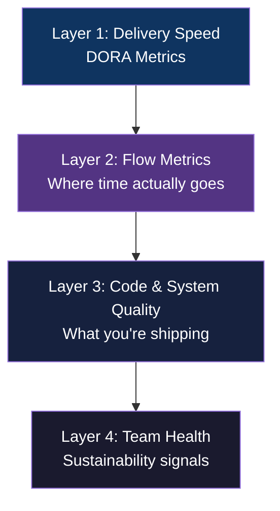

---

## Layer 1: DORA Metrics — Industry Standard Benchmarks

The four metrics from Google's DevOps Research that predict both team performance and business outcomes.

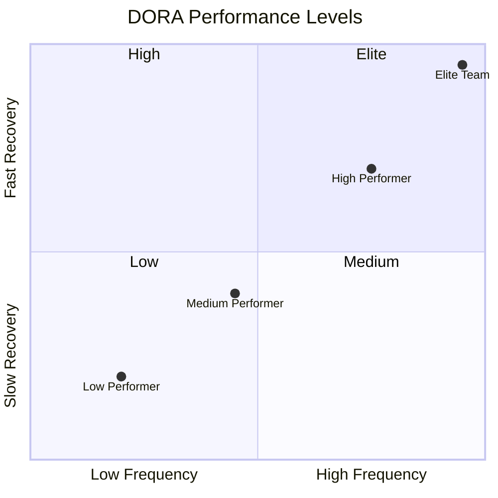

| Metric | What It Measures | Elite Benchmark | Red Flag |
|---|---|---|---|
| **Deployment Frequency** | How often you ship to production | Multiple times/day | < once/month |
| **Lead Time for Changes** | Commit → production time | < 1 hour | > 1 month |
| **Change Failure Rate** | % of deploys causing incidents/rollbacks | < 5% | > 15% |
| **Mean Time to Recovery (MTTR)** | Time to restore service after failure | < 1 hour | > 1 week |

> Start here before any custom metrics. These four are externally benchmarkable and have 7+ years of research behind them.

---

## Layer 2: Flow Metrics — Where Work Gets Stuck

### PR Lifecycle Breakdown

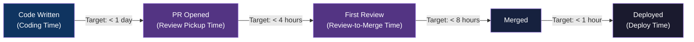

### Flow Metrics Reference

| Metric | What It Signals | Target |
|---|---|---|
| **Cycle Time** | PR open → deployed | < 1 day |
| **PR Size** | Lines changed per PR | < 400 lines |
| **PR Review Pickup Time** | Time to first review after opening | < 4 hours |
| **Work In Progress (WIP)** | Active items per engineer | ≤ 2 per engineer |
| **Throughput** | Stories closed per sprint per engineer | Trend, not absolute |
| **Sprint Goal Attainment** | % of committed scope delivered | > 80% consistently |

### WIP vs. Throughput Trade-off

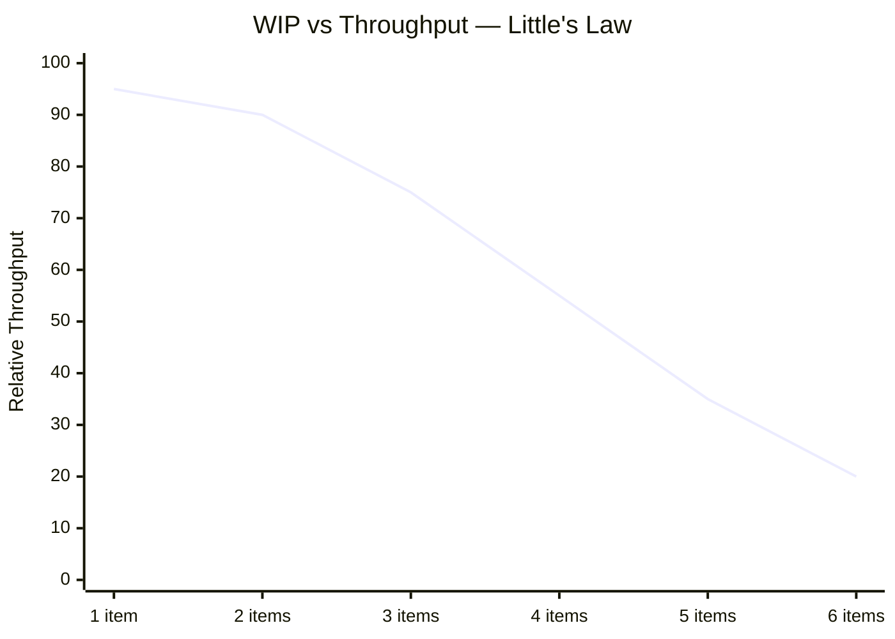

> High WIP = context switching = slower delivery. Throughput peaks when engineers carry 1–2 items at a time.

---

## Layer 3: Code & System Quality

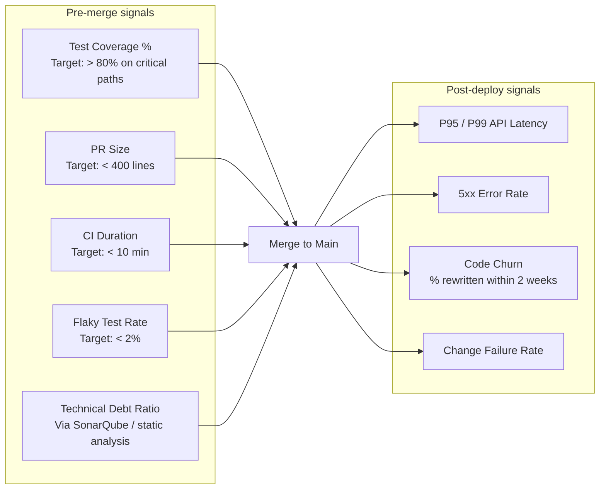

| Metric | Why It Matters |
|---|---|
| **Test Coverage %** | Confidence floor for changes in critical paths |
| **Flaky Test Rate** | Unreliable tests erode CI trust — engineers start ignoring failures |
| **CI Build Duration** | Slow CI breaks flow state; > 10 min causes context switching |
| **P95/P99 API Latency** | Direct quality signal tied to backend work |
| **5xx Error Rate** | Measures production stability post-deploy |
| **Technical Debt Ratio** | Remediation cost vs. development cost — flags long-term drag |
| **Code Churn** | High churn = rework = unclear requirements or poor design |

---

## Layer 4: Team Health & Sustainability

These are **leading indicators** — they predict delivery degradation before it shows up in DORA metrics.

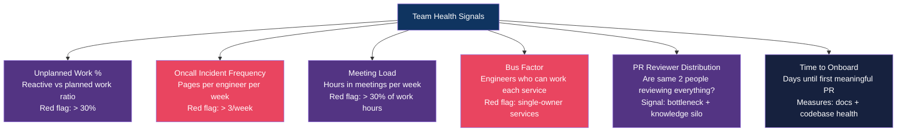

### Oncall Load as a Burnout Predictor

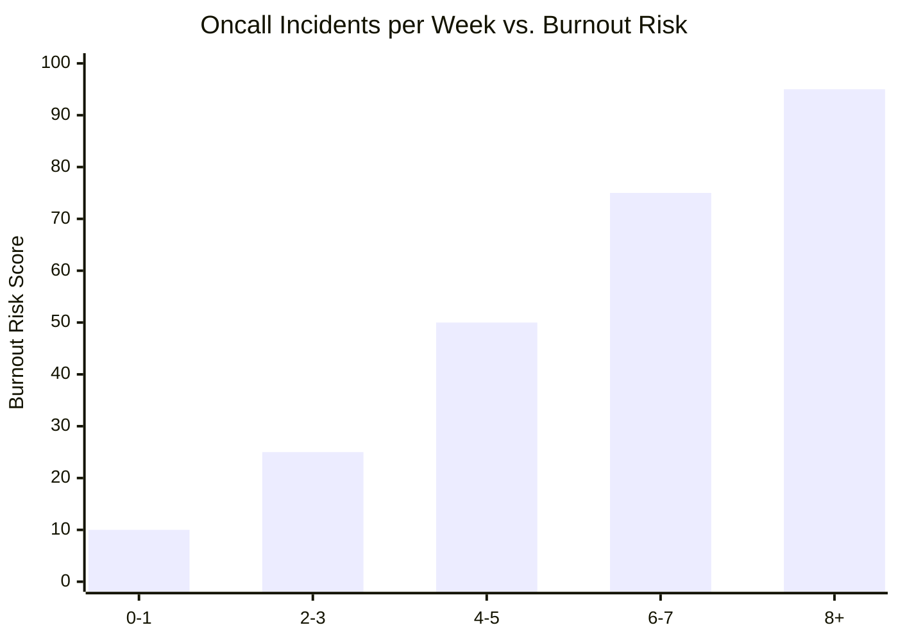

---

## What NOT to Measure

These are commonly tracked but actively harmful to team culture and output quality:

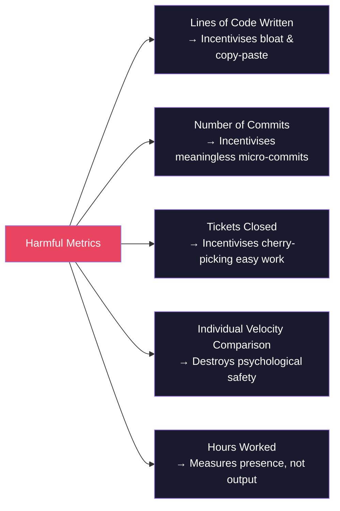

---

## The SPACE Framework

Developed by GitHub & Microsoft researchers as a multi-dimensional alternative to single-metric productivity.

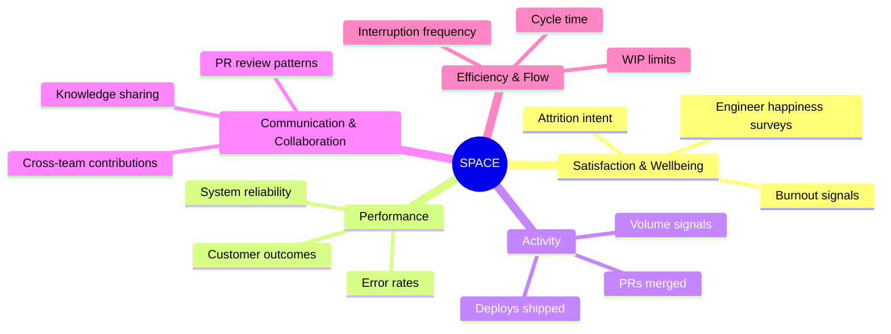

> **Key insight:** No single metric captures productivity. You need signals from at least 3–4 SPACE dimensions to get an honest picture.

---

## Priority Order — Where to Start

If instrumenting from scratch, roll out in this sequence:

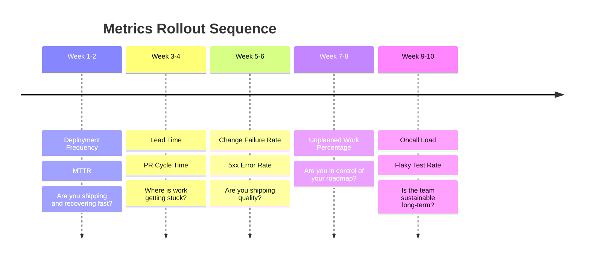

---

## Metric → Action Decision Tree

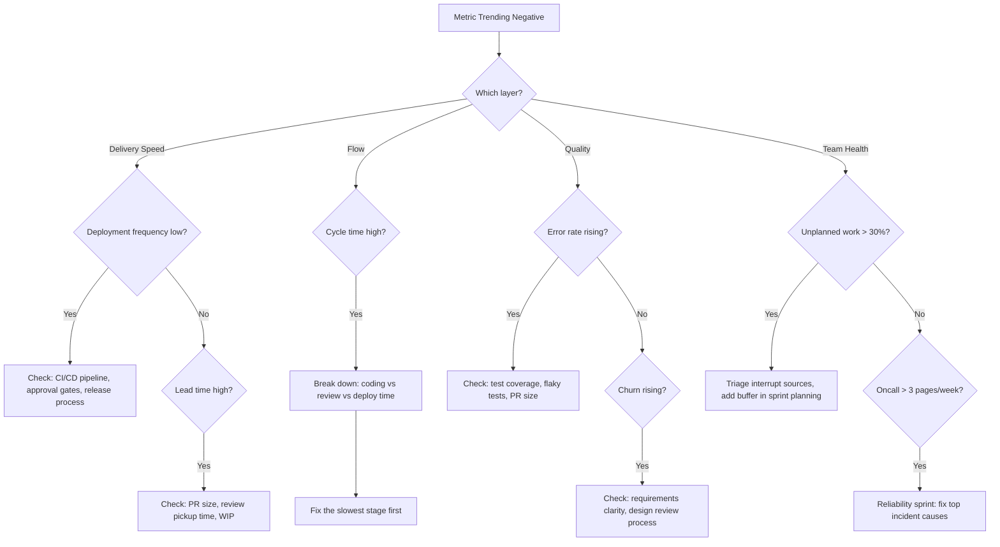

---

## Quick Reference Card

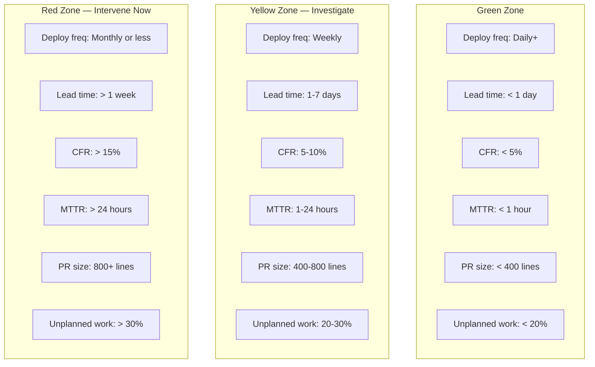

---

*Reference: DORA State of DevOps Report · SPACE Framework (Forsgren et al.) · Flow Engineering (Value Stream Mapping)*
